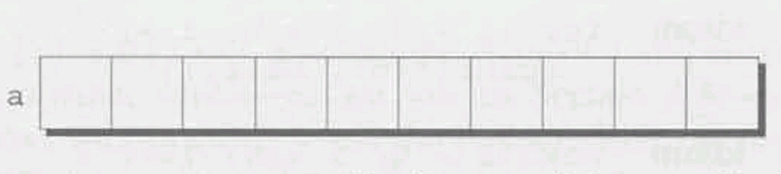
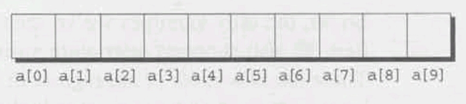
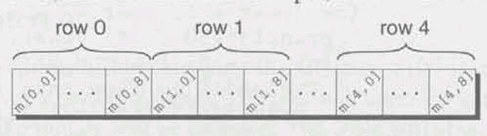
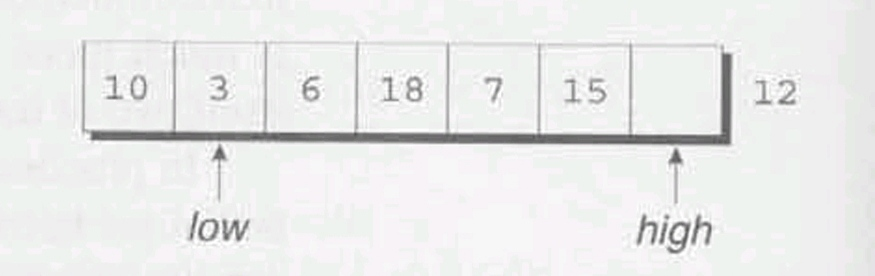
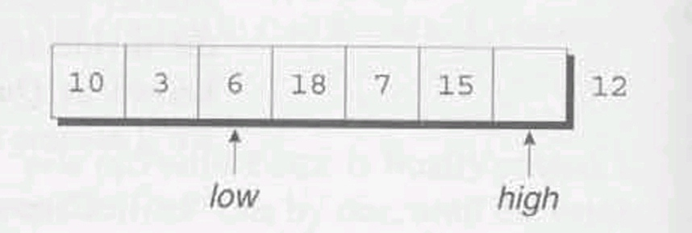

<html>
<head>
    <title>C Programming</title>
    <meta charset="utf-8">
    <link rel="stylesheet" href="./myStyle.css">
</head>

<body>
# Title of the Book: C Programming A Modern Approach
## Edition: Second Edition (2008)
### Author: K.N.King

<i>A clear, complete, and engaging presentation of the C programming language -- now with coverage of both C89 and C99.</i>

<div class="theQuote">In computing, turning the obvious into the useful is a living definition of the word "frustration."</div>

<hr class="chapterDivider"/>

# 1 Introducing C

<div class="theQuote">When someone says "I want a programming language in which I need only say what I wish done," give him a lollipop.</div>

**Few points on C:**  
- Developed in the early 1970s at Bell Laboratories by **Ken Thompson**, **Dennis Ritchie**, and others.  
- *The C Programming Language*, written by **Brian Kernighan** and **Dennis Ritchie** published in 1978.  
- In December 1989, standardisation of C under *ANSI (American National Standards Institute)* was approved as *ANSI standard X3.159-1989*.  
- In 1990, it was approved by the *International Organization for Standardization (ISO)* as *internation standard ISO/IEC 9899:1990*.  

<hr class="chapterDivider"/>

# 2 C Fundamentals

<div class="theQuote">One man's constant is another man's variable</div>

This chapter introduces several basic concepts, including preprocessing directives, functions, variables, and statements, that we'll need in order to write even the simplest programs. Later chapters will cover these topics in much greater detail.

To start off, Section  2.1 presents a small C program and describes how to compile and link it. Section 2.2 then discusses how to generalize the program, and Section 2.3 shows how to add explantory remarks, known as comments. Section 2.4 introduces variables, which store data that may change during the execution of a program, and Section 2.5 shows how to use the `scanf` function to read data into variables. Constants -- data that won't change during program execution -- can be given names, as Section 2.6 shows. Finally, Section 2.7 explains C's rules for creating names (identifiers) and Section 2.8 gives the rules for laying out a program.

## 2.1 Writing a Simple Program

In contrast to programs written in some languages, C programs require little "boilerplate" -- a complete program can be as short as a few lines.

### 2.1.1 (PROGRAM) Printing a Pun

The first program which we will name `pun.c`, is expected to display the following message each time it is run.

```bash
To C, or not to C: that is the question.
```

```C
/* file: pun.c */
#include <stdio.h>

int main(void)
{
    printf("To C, or not to C: that is the question.\n");
    return 0;
}
```

Section 2.2 explains the form of this program in some detail. For now, I'll just make a few brief observations. The line

```C
#include <stdio.h>
```

is necessary to "include" information about C's standard I/O (input/output) library. The program's executable code goes inside `main`, which represents the "main" program. The only line inside `main` is a command to display the desired message. `printf` is a function from the standard I/O library that can produce nicely formatted output. The `\n` code tells `printf` to advance to the next line after printing the message. The line

```C
return 0;
```

indicates that the program "returns" the value 0 to the operating system when it terminates.

### 2.1.2 Compiling and Linking

Despite its brevity, getting `pun.c` to run is more involved than you might expect. First, we need to create a file named `pun.c` containing the program (any text editor will do). The name of the file doesn't matter, but the `.c` extension is often required by compilers.

Next, we've got to convert the program to a form that the machine can execute. For a C program, that usually involves three steps:

- **Preprocessing.** The program is first given to a **preprocessor**, which obeys commands that begin with `#` (known as ***directives***). A preprocessor is a bit like an editor; it can add things to the program and make modifications.  
- **Compiling.** The modified program now goes to a **Compiler**. which translates it into machine instructions (***object code***). The program isn't quite ready to run yet, however.  
- **Linking.** In the final step, a **linker** combines the object code produced by the compiler with any additional code needed to yield a complete executable program. This additional code includes library functions (like `printf`) that are used in the program.

Fortunately, this process is often automated, so you won't find it too onerous. In fact, the preprocessor is usually integrated with the compiler, so you probably won't even notice it at work.

The commands necessary to compile and link vary, depending on the compiler and operating system. Under UNIX, the C compiler is usually named `cc`. To compile and link the `pun.c` program, enter the following command in a terminal or command-line window:

```bash
% cc pun.c
```

(The `%` character is the UNIX prompt, not something that you need to enter.) Linking is automatic when using `cc`; no separate link command is necessary.

After compiling and linking the program, `cc` leaves the executable program in a file named `a.out` by default. `cc` has many options; one of them (the `-o` option) allows us to choose the name of the file containing the executable program. For example, if we want the executable version of `pun.c` to be named `pun`, we would enter the following command:

```bash
% cc -o pun pun.c
```

<div class="infoBox">
### The GCC Compiler

One of the most popular C compilers is the GCC compiler, which is supplied with Linux but is available for many other platforms as well. Using this compiler is similar to using the traditional UNIX `cc` compiler. For example, to compile the `pun.c` program, we would use the following command:

```bash
% gcc -o pun pun.c
```

The Q&A section at the end of the chapter provides more information about GCC.
</div>

### 2.1.3 Integrated development environments

so far, we've assumed the use of a "command-line" compiler that's invoked by entering a command in a special window provided by the operating system. The alternative is to use an ***integrated development environment (IDE)***, a software package that allows us to `edit, compile, link, execute, and even debug a program` without leaving the environment. The components of an IDE are designed to work together. For example, when the compiler detects an error in a program, it can arrange for the editor to highlight the line that contains the error. There's a great deal of variation among IDEs, so I won't discuss them further in this book. However, I would recommend checking to see which IDEs are available for your platform.

## 2.2 The General Form of a Simple Program

Let's take a closer look at `pun.c` and see how we can generalize it a bit. Simple C programs have the form

```C
directives

int main(void)
{
    statements
}
```

Notice how the braces show where `main` begins and ends. C uses `{` and `}` in much the same way that some other languages use words like `begin` and `end`. This illustrates a general point about C: it relies heavily on abbreviations and special symbols, one reason that C programs are concise (or -- less charitably -- cryptic).

Even the simplest C programs rely on three key language features: directives (editing commands that modify the program prior to compilation), functions (named blocks of executable code, of which `main` is an example), and statements (commands to be performed when the program is run). We'll take a closer look at these features now.

### 2.2.1 Directives

Before a C program is compiled, it is first edited by a preprocessor. Commands intended for the preprocessor are called directives. Chapter 14 and Chapter 15 discuss directives in detail. For now, we're interested only in the `#include` directive.

The `pun.c` program begins with the line

```C
#include <stdio.h>
```

This directive states that the information is `<stdio.h>` is to be "included" into the program before it is compiled. `<stdio.h>` contains information about C's standard I/O library. C has a number of *headers* like `<stdio.h>`; each contains information about some part of the standard library. The reason we're including `<stdio.h>` is that C, unlike some programming languages, has no built-in "read" and "write" commands. The ability to perform input and output is provided instead by functions in the standard library.

Directives always begin with `#` character, which distinguishes them from other items in a C program. By default, directives are one line long; there's no semicolon or other special marker at the end of a directive.

### 2.2.2 Functions

**Functions** are like "procedures" or "subroutines" in other programming languages -- they're the building blocks from which programs are constructed. In fact, a C program is little more than a collection of functions. Functions fall into two categories: those written by the programmer and those provided as part of the c implementation. I'll refer to the latter as *library functions*, since they belong to a "library" of functions that are supplied with the compiler.

The term "function" comes from mathematics, where a function is a rule for computing a value when given one or more arguments:

$$f(x) = x + 1$$

$$g(y, z) = y^2 - z^2$$

C uses the term "function" more loosely. In C, a function is simply a series of statements that have been grouped together and given a name. Some functions compute a value; some don't. A function that computes a value uses the `return` statement to specify what value it "returns." For example, a function that adds 1 to its argument might execute the statement `return x + 1;` while a function that computes the difference of the squares of its arguments might execute the statement `return y * y - z * z;`

Although a C program may consist of many functions, only the `main` function is mandatory. `main` is special: it gets called automatically when the program is executed. Until Chapter 9, where we'll learn how to write other functions, `main` will be the only function in our programs.

<div class="infoBox">

<span class="warningEmoji"></span>

The name `main` is critical; it can't be `begin` or `start` or even `MAIN`.

</div>

If `main` is a function, does it return a value? Yes: it returns a status code that is given to the operating system when the program terminates. Let's take another look at the `pun.c` program:

```C
#include <stdio.h>

int main(void)
{
    printf("To C, or not to C: that is the question.\n");
    return 0;
}
```

The word `int` just before `main` indicates that the `main` function returns an integer value. The word `void` in parenthesis indicates that `mian` has no arguments.

The statement `return 0;` has two effects: it causes the main function to terminate (thus ending the program) and it indicates that the `main` function returns a value of 0. We will have more to say about `main`'s return value in a later chapter. For now, we'll always have `main` return the value 0, which indicates normal program termination.

If there's no `return` statement at the end of the `main` function, the program will still terminate. However, many compilers will produce a warning message (because the function was supposed to return an integer but failed to).

### 2.2.3 Statements

A **Statement** is a command to be executed when the program runs. We'll explore statements later in the book, primarily in Chpater 5 and 6. The `pun.c` program uses only two kinds of statements. One is the `return` statement; the other is the *function call*. Asking a function to perform its assigned task is known as *calling* the function. The `pun.c` program, for example, calls the `printf` function to display a string on the screen:

```C
printf("To C, or not to C: that is the question. \n);
```

C requires that each statement end with a semicolon. (As with any good rule, there's one exception: the compound statement, which we'll encounter later.) The semicolon shows the compiler where the statement ends; since statements can continue over several lines, it's not always obvious where they end. Directives, on the other hand, are normally one line long, and they don't end with a semicolon.

### 2.2.4 Printing Strings

`printf` is a powerful function that we'll examine in Chapter 3. So far, we've only used `printf` to display a **string literal** -- a series of characters enclosed in double quotation marks. When `printf` displays a string literal, it doesn't show the quotation marks.

`printf` doesn't automatically advance to the next output line when it finishes printing. To instruct `printf` to advance one line, we must include `\n` (the *new-line character*) in the string to be printed. Writing a new-line character terminates the current output line; subsequent output goes on to the next line. to illustrate this point, consider the effect of replacing the statement

```C
printf("To C, or not to C: that is the question.\n");
```

by two calls of `printf`:

```C
printf("To C, or not to C: ");
printf("that is the question.\n");
```

The first call of `printf` writes `To C, or not to C: `. The second call writes `that is the question.` and advances to the next line. The net effect is the same as the original `printf` -- the user can't tell the difference.

The new-line character can appear more than once in a string literal. To display the message

```
Brevity is the soul of wit.
  --Shakespeare
```

we could write

```C
printf("Brevity is the soul of wit.\n  --Shakespeare\n");
```

## 2.3 Comments

Our `pun.c` program still lacks something important: documentation. Every program should contain identifying information: the program name, the date written, the author, the purpose of the program, and so forth. In C, this information is placed in ***Comments***. The symbol `/*` marks the beginning of a comment and the symbol `*/` marks the end:

```C
/* This is a comment */
```

Comments may appear almost anywhere in a program, either on separate lines or on the same lines as other program text. Here's what `pun.c` might look like with comments added at the beginning:

```C
/* Name: pun.c */
/* Purpose: Prints a bad pun. */
/* Author: K. N. King */

#include <stdio.h>

int main(void)
{
    printf("To C, or not to C: that is the question.\n");
    return 0;
}
```

Comments may extend over more than one line; once it has seen the `/*` symbol, the compiler reads (and ignores) whatever follows until it encounters the `*/` symbol. If we like, we can combine a series of short comments into one long comment:

```C
/* Name: pun.c
   Purpose: Prints a bad pun.
   Author: K. N. King */
```

A comment like this can be hard to read, though, because it's not easy to see where the comment ends. Putting `*/` on a line by itself helps:

```C
/* Name: pun.c
   Purpose: Prints a bad pun.
   Author: K. N. King 
*/
```

Even better, we can form a "box" around the comment to make it stand out:

```C
/************************************************************ 
* Name: pun.c                                               *
* Purpose: Prints a bad pun.                                *
* Author: K. N. King                                        *
************************************************************/
```

Programmers often simplify boxed comments by omitting three of the sides:

```C
/* 
 * Name: pun.c
 * Purpose: Prints a bad pun.
 * Author: K. N. King
 */
```

A short comment can go on the same line with other program code:

```C
int main(void)    /* Beginning of main program */
```

A comment like this is sometimes called a "winged comment".

<div class="infoBox">

<span class="warningEmoji"></span>  

Forgetting to terminate a comment may cause the compiler to ignore part of your program. Consider the following example:
    
```C
printf("My ");    /* forgot to close this comment...
printf("cat ");
printf("has ");    /* so it ends here */
printf("fleas");
```

Because we have neglected to terminate the first comment, the compiler ignores the middle two statements, and the example prints `My fleas`. 
</div>

<span class="C99Symbol"></span>

C99 provides a second kind of comment, which begins with `//` (two adjacent slashes):

```C
// This is a comment
```

This style of comment ends automatically at the end of a line. To create a commet that's more than one line long, we can either use the older comment style (`/* ... */`) or else put `//` at the beginning of each comment line:

```C
// Name: pun.c
// Purpose: Prints a bad pun.
// Author: K. N. King
```

The newer comment style has a couple of important advantages. First, because a comment automatically ends at the end of a line, there's no chance that an unterminated comment will accidentally consume part of a program. Second, multiline comments stand out better, thanks to the `//` that's required at the beginning of each line.

## 2.4 Variables and Assignment

Few programs are as simple as the one in Section 2.1. Most programs need to perform a series of calculations before producing output, and thus need a way to store data temporarily during program execution. In C, as in most programming languages, these storage locations are called **variables**.

### 2.4.1 Types

Every variable must have a ***type***, which specifies what kind of data it will hold. C has a wide variety of types. For now, we'll limit ourselves to just two: `int` and `float`. Choosing the proper type is critical, since the type affects how the variable is stored and what operations can be performed on the variable. The type of a numeric variable determines the largest and smallest numbers that the variable can store; it also determines whether or not digits are allowed after the decimal point.

A variable of type `int` (short for *integer*) can store a whole number such as 0, 1, 392, or -2553. The range of possible values is limited, though. The largest `int` value is typically 2,147,483,647 but can be as small as 32,767.

<span class="QandA"></span>

A variable of type `float` (short for *floating-point*) can store much larger numbers than an `int` variable. Furthermore, a `float` variable can store numbers with digits after the decimal point, like 379.125. `float` variables have drawbacks, however. Arithmetic on `float` numbers may be slower than arithmetic on `int` numbers. Most significantly, the value of a `float` variable is often just an approximation of the number that was stored in it. If we store 0.1 in a `float` variable, we may later find that the variable has a value such as 0.09999999999999987, thanks to rounding error.

### 2.4.2 Declarations

Variables must be **declared**--described for the benefit of the compiler--before they can be used. To declare a variable, we first specify the *type* of the variable, then its *name*. (Variable names are chosen by the programmer, subject to the rules described in Section 2.7.) For example, we might declare variables `height` and `profit` as follows:

```C
int height;
float profit;
```

The first declaration states that `height` is a variable of type `int`, meaning that `height` can store an integer value. The second declaration says that `profit` is a variable of type `float`.

If several variables have the same type, their declarations can be combined:

```C
int height, length, width, volume;
float profit, loss;
```

Notice that each complete declaration ends with a semicolon.
Ou
Our first template for `main` didn't include declarations. When `main` contains declarations, these must precede statements:

```C
int main(void)
{
    declarations
    statements
}
```

As we'll see in Chapter 9, this is true of functions in general, as well as blocks (statements that contain embedded declarations). As a matter of style, it's a good idea to leave a blank line between the declarations and the statements.

<span class="C99Symbol"></span>

In C99, declarations don't have to come before statements. For, example, `main` might contain a declaration, then a statement, and then another declaration. For compatibility with older compilers, the programs in this book don't take advantage of this rule. However, it's common in C++ and Java programs not to declare variables until they're first needed, so this practice can be expected to become popular in C99 programs as well.

### 2.4.3 Assignment

A variable can be given a value by means of ***assignment***. For example, the statements

```C
height = 8;
length = 12;
width = 10;
```

assign values to `height`, `length`, and `width`. The numbers 8, 12, and 10 are said to be ***constants***.

Before a variable can be assigned a value--or used in any other way, for that matter--it must first be declared. Thus, we could write

```C
int height;
height = 8;
```

but not

```C
height = 8;    /*** WRONG ***/
int height;
```

A constant assigned to a `float` variable usually contains a decimal point. For example, if `profit` is a `float` variable, we might write

```C
profit = 2150.48;
```

<span class="QandA"></span>

It's best to append the letter `f` (for "float") to a constant that contains a decimal point if the number is assigned to a `float` variable:

```C
profit = 2150.48f;
```

Failing to include the `f` may cause a warning from the compiler.

An `int` variable is normally assigned a value of type `int`, and a `float` variable is normally assigned a value of type `float`. Mixing types (such as assigning an `int` value to a `float` variable or assigning a `float` value to an `int` variable) is possible but not always safe, as we'll see in Section 4.2.

Once a variable has been assigned a value, it can be used to help compute the value of another variable:

```C
height = 8;
length = 12;
width = 10;
volume = height * length * width;    /* volume is now 960 */
```

In C, `*` represents the multiplication operator, so this statement multiplies the values stored in `height`, `length`, and `width`, then assigns the result to the variable `volume`. In general, the right side of an assignment can be a formula (or ***expression***, in C terminology) involving constants, variables, and operators.

### 2.4.4 Printing the Value of a Variable

We can use `printf` to display the current value of a variable. For example, to write the message

```shell
Height: h
```

where `h` is the current value of the `height` variable, we'd use the following call of `printf`:

```C
printf("Height: %d\n", height);
```

`%d` is a placeholder indicating where the value of `height` is to be filled in during printing. Note the placement of `\n` just after `%d`, so that `printf` will advance to the next line after printing the value of `height`.

`%d` works only for `int` variables; to print a `float` variable, we'd use `%f` instead. By default, `%f` displays a number with six digits after the decimal point. To force `%f` to display `p` digits after the decimal point, we can put `.p` between `%` and `f`. For example, to print the line

```shell
Profit: $2150.48
```

we'd call `printf` as follows:

```C
printf("Profit: $%.2f\n", profit);
```

There's no limit to the number of variables that can be printed a single call of `printf`. To display the values of both the `height` and `length` variables, we could use the following call of `printf`:

```C
printf("Height: %d  Length: %d\n", height, length);
```

### 2.4.5 (PROGRAM) Computing the Dimensional Weight of a Box

Shipping companies don'e especially like boxes that are larger but very light, since they take up valuable space in a truck or airplane. In fact, companies often charge extra for such a box, basing the fee on its volume instead of its weight. In the United States, the usual method is to divide the volume by 166 (the allowable number of cubic inches per pound). If this number--the box's "dimensional" or "volumetric" weight--exceeds its actual weight, the shipping fee is based on the dimensional weight. (The 166 divisor is for international shipments; the dimensional weight of a domestic shipment is typically calculated using 194 instead).

Let's say that you've been hired by a shipping company to write a program that computes the dimensional weight of a box. Since you're new to C, you decide to start off by writing a program that calculates the dimensional weight of a particular box that's `12" x 10" x 8"`. Division is represented by `/` in C, so the obvious way to compute the dimensional weight would be 

```C
weight = volume / 166
```

where `weight` and `volume` are integer variables representing the box's weight and volume. Unfortunately, this formula isn't quite what we need. In C, when one integer is divided by another, the answer is "truncated": all digits after the decimal point are lost. The volume of a `12" x 10" x 8"` box will be 960 cubic inches. Dividing by 166 gives the answer 5 instead of 5.783, so we have in effect rounded *down* to the next lowest pound; the shipping company expects us to round *up*. One solution is to add 165 to the volume before dividing by 166:

```C
weight = (volume + 165) / 166;
```

A volume of 166 would give a weight of 331/166, or 1, while a volume of 167 would yield 332/166, or 2. Calculating the weight in this fashion gives us the following program.

```C
/* file: dweight.c */
/* Computes the dimensional weight of a 12" x 10" x 8" box */

#include <stdio.h>

int main(void)
{
    int height, length, width, volume, weight;

    height = 8;
    length = 12;
    width = 10;
    volume = height * length * width;
    weight = (volume + 165) / 166;

    printf("Dimensions: %dx%dx%d\n", length, width, height);
    printf("Volume (cubic inches): %d\n", volume);
    printd("Dimensional weight (pounds): %d\n", weight);

    return 0;
}
```

The output of the program is

```shell
Dimensions: 12x10x8
Volume (cubic inches): 960
Dimensional weight (pounds): 6
```

### 2.4.6 Initialization

Some variables are automatically set to zero when a program begins to execute, but most are not. A variable that doesn't have a default value and hasn't yet been assigned a value by the program is said to be ***uninitialized***.

<div class="infoBox">

<span class="warningEmoji"></span>

Attempting to access the value of an uninitialized variable (for example, by displaying the variable using `printf` or using it in an expression) may yield an unpredictable result such as 2568, -30891, or some equally strange number. With some compilers, worse behavior--even a program crash--may occur.

</div>

We can always give a variable an initial value by using assignment, of course. But there's an easier way: put the initial value of the variable in its declaration. For example, we can declare the `height` variable and initialize it in one step:

```C
int height = 8;
```

In C jargon, the value `8` is said to be an ***initializer***.

Any number o variables can be initialized in the same declaration:

```C
int height = 8, length = 12, width = 10;
```

Notice that each variable requires its own initializer. In the ollowing example, the initializer `10` is good only or the variable `width`, not for `height` or `length` (which remain uninitialized):

```C
int height, length, width = 10;
```

### 2.4.7 Printing Expressions

`printf` isn't limited to displaying numbers stored in variables; it can display the value of *any* numeric expression. Taking advantage of this property can simplify a program and reduce the number of variables. For instance, the statements

```C
volume = height * length * width;
printf("%d\n", volume);
```

could be replaced by

```C
printf("%d\n", height * length * width);
```

`printf`'s ability to print expressions illustrates one of C's general principles: *Wherever a value is needed, any expression of the same type will do*.

## 2.5 Reading Input

Because the `dweight.c` program calculates the dimensional weight of just one box, it isn't especially useful. To improve the program, we'll need to allow the user to enter the dimensions.

To obtain input, we'll use the `scanf` function, the C library's counterpart to `printf`. The `f` in `scanf`, like the `f` in `printf`, stands for "formatted"; both `scanf` and `printf` require the use of a ***format string*** to specify the appearance of the input or output data. `scanf` needs to know what form the input data will take, just as `printf` needs to know how to display output data.

To read an `int` value, we'd use `scanf` as follows:

```C
scanf("%d", &i);    /* reads an integer; stores into i */
```

The `"%d"` string tells `scanf` to read input that represents an integer; `i` is an `int` variable into which we want `scanf` to store the input. The `&` symbol is hard to explain at this point; for now, I'll just note that it is usually (but not always) required when using `scanf`.

Reading a `float` value requires a slightly different call of `scanf`:

```C
scanf("%f", &x);    /* reads a float value; stores into x */
```

`%f` works only with variables of type `float`, so I'm assuming that `x` is a `float` variable. The `"%f"` string tells `scanf` to look for an input value in `float` format (the number may contain a decimal point, but doesn't have to).

### 2.5.1 (PROGRAM) Computing the Dimensional Weight of a Box (Revisited)

Here's an improved version of the dimensional weight program in which the user enters the dimensions. Note that each call of `scanf` is immediately preceeded by a call of `printf`. That way, the user will know when to enter input and what input to enter.


```C
/* file: dweight2.c
   purpose: Computes the dimensional weight of a 
   box from input provided by the user */

#include <stdio.h>

int main(void)
{
    int height, length, width, volume, weight;

    printf("Enter height of box: ");
    scanf("%d", &height);
    printf("Enter length of box: ");
    scanf("%d", &length);
    printf("Enter width of box: ");
    scanf("%d", &width);
    volume = height * length * width;
    weight = (volume + 165) / 166;

    printf("Volume (cubic inches): %d\n", volume);
    printf("Dimensional weight (pounds): %d\n", weight);

    return 0;
}
```

The output of the program has the following appearance

```shell
Enter height of box: 8
Enter length of box: 12
Enter width of box: 10
Volume (cubic inches): 960
Dimensional weight (pounds): 6
```

A message that asks the user to enter input (a ***prompt***) normally shouldn't end with a new-line character, because we want the user to enter input on the same line as the prompt itself. When the user presses the Enter key, the cursor automatically moves to the next line--the program doesn't need to display a new-line character to terminate the current line.

The `dweight2.c` program suffers from one problem: it doesn't work correctly if the user enters nonnumeric input. Section 3.2 discusses this issue in more detail.

## 2.6 Defining Names for Constants

When a program contains constants, it's often a good idea to give them names. The `dweight.c` and `dweight2.c` programs rely on constant 166, whose meaning may not be at all clear to someone reading the program later. Using feature know as ***macro definition***, we can name this constant:

```C
#define INCHES_PER_POUND 166
```

`#define` is a preprocessing directive, just as `#include` is, so there's no semicolon at the end of the line.

When a program is compiled, the preprocessor replaces each macro by the value that it represents. For example, the statement

```C
weight = (volume + INCHES_PER_POUND -1) / INCHES_PER_POUND;
```

will become

```C
weight = (volume + 166 -1) / 166;
```

giving the same effect as if we'd written the latter statement in the first place.

The value of a macro can be an expression:

```C
#define RECIPROCAL_OF_PI (1.0f / 3.14159f)
```

If it contains operators; the expression should be enclosed ina prantheses.

Notice that we've used only upper-case letters in macros names. This a convention that most C programmers follow, not a requirement of the language. (Still, C programmers have been doing this for decades; you wouldn't want to be the first to deviate.)

### 2.6.1 (PROGRAM) Converting from Fahrenheit to Celsius

The following program prompts the user to enter a Fahrenheit temperature; it then prints the equivalent Celsius temperature. The output of the program will have the following appearance:

```shell
Enter Fahrenheit temperature: 212
Celsius equivalent: 100.0
```

The program will allow temperatures that aren't integers; that's why the Celsius temperature is displayed as 100.0 instead of 100. Let's look first at the entire program, then see how it's put together.

```C
/**
 * File: celsius.c
 * Author: K. N. King
 * Purpose: Converts a Fahrenheit temperature to Celsius
 */

#include <stdio.h>

#define FREEZING_PT 32.0f
#define SCALE_FACTOR (5.0f /9.0f)

int main(void)
{
    float fahrenheit, celsius;

    printf("Enter Fahrenheit temperature: ");
    scanf("%f", &fahrenheit);

    celsius = (fahrenheit - FREEZING_PT) * SCALE_FACTOR;

    printf("Celsius equivalent: %.1f\n", celsius);

    return 0;
}
```

The statement

```C
celsius = (fahrenheit - FREEZING_PT) * SCALE_FACTOR;
```

converts the Fahrenheit temperature to Celsius. Since `FREEZING_PT` stands for `32.0f` and `SCALE_FACTOR` stands for `(5.0f /9.0f)`, the compiler sees this statement as

```C
celsius = (fahrenheit - 32.0f) * (5.0f / 9.0f);
```

Defining `SCALE_FACTOR` to be `(5.0f / 9.0f)` instead of `(5 / 9)` is important, becasuse C truncates the result when two integers are divided. The value of `(5 / 9)` would be `0`, which definitely isn't what we want.

The call of `printf` writes the Celsius temperature:

```C
printf("Celsius equivalent: %.1f\n", celsius);
```

Notice the use of `%.1f` to display `celsius` with just one digit after the decimal point.

## Identifiers

As we're writing a program, we'll have to choose names for variables, functions, macros, and other entities. These names are called ***identifiers***. In C, an identifier may contain letters, digits, and underscores, but must begin with a letter or underscore. 

<span class="C99Symbol"></span>

(In C99, identifiers may contain certain "universal character names" as well.)

Here are some examples of legal identifers:

```
times10
get_next_char
_done
```

The following are *not* legal identifiers:

```
10times
get-next-char
```

The symbol `10times` begins with a digit, not a letter or underscore. `get-next-char` contains minus signs, not underscores.

C is ***case-sensitive***: it distinguishes between upper-case and lower-case letters in identifiers. For example, the following identifiers are all different:

```
job
joB
jOb
jOB
Job
JoB
JOb
JOB
```

These eight identifiers could all be used simultaneously, each for a completely different purpose. (Talk about obfuscation!) Sensible programmers try to make identifiers look different unless they're somehow related.

Since case matters in C, many programmers follow the convention of using only lower-case letters in identifiers (other than macros), with underscores inserted when necessary for legibility:

```
symbol_table
current_page
name_and_address
```

Other programmers avoid underscores, instead using an upper-case letter to begin each word within an identifier:

```
symbolTable
currentPage
nameAndAddress
```

(The first letter is sometimes capitalized as well.) Although the former style is common in traditional C, the latter style is becoming more popular thanks to its widespread use in Java and C# (and, to a lesser extent, C++). Other reasonable conventions exist; just be sure to capitalize an identifier the same way each time it appears in a program.

<span class="QandA"></span>

C places no limit on the maximum length of an identifier, so don't be afraid to use long, descriptive names. A name such as `current_page` is a lot easier to understand than a name like `cp`.

### 2.7.1 Keywords

<span class="C99Symbol"></span>

The ***keywords*** in Table 2.1 have special significance to C compilers and therefore can't be used as identifiers. Note that five keywords were added in C99.

**Table 2.1**<br>Keywords

|||||
|---|---|---|---|
|`auto`|`enum`|`restrict`<span class="staffOfHermis"></span>|`unsigned`|
|`break`|`extern`|`return`|`void`|
|`case`|`float`|`short`|`volatile`|
|`char`|`for`|`signed`|`while`|
|`const`|`goto`|`sizeof`|`_Bool`<span class="staffOfHermis"></span>|
|`continue`|`if`|`static`|`_Complex`<span class="staffOfHermis"></span>|
|`default`|`inline`<span class="staffOfHermis"></span>|`struct`|`_Imaginary`<span class="staffOfHermis"></span>|
|`do`|`int`|`switch`|
|`double`|`long`|`typedef`|
|`else`|`register`|`union`|

<span class="staffOfHermis"></span>C99 only

Because of C's case-sensitivity, keywords must appear in programs exactly as shown in Table 2.1, with all letters in lower case. Names of functions in the standard library (such as `printf`) contain only lower-case letters also. Avoid the plight of the unfortunate programmer who enters an entire program in upper case, only to find that the compiler can't recognize keywords and calls of library functions.

<div class="infoBox">

<span class="warningEmoji"></span>

Watch out for other restrictions on identifiers. Some compilers treat certain identifiers (`asm`, for example) as additional keywords. Identifiers that belong to the standard library are restricted as well. Accidentally using one of these names can cause an error during compilation or linking. Identifiers that begin with an underscore are also restricted.

</div>

## 2.8 Layout of a C Program

We think of a C program as a series of ***tokens***: groups of characters that can't be split up without changing their meaning. Identifiers and keywords are tokens. So are operators like `+` and `-`, punctuation marks such as the comma and semicolon, and string literals. For example, the statement

```C
printf("Height: %d\n", height);
```

consists of seven tokens:

|||
|---|---|
|`printf`|<span class="circled1"></span>|
|`(`|<span class="circled2"></span>|
|`"Height: %d\n"`|<span class="circled3"></span>|
|`,`|<span class="circled4"></span>|
|`height`|<span class="circled5"></span>|
|`)`|<span class="circled6"></span>|
|`;`|<span class="circled7"></span>|

Tokens <span class="circled1"></span> and <span class="circled5"></span> are identifiers, token <span class="circled3"></span> is a string literal, and tokens <span class="circled2"></span>, <span class="circled4"></span>, <span class="circled6"></span>, and <span class="circled7"></span> are punctuation.

The amount of space between tokens in a program isn't critical in most cases. At one extreme, tokens can be crammed together with no space between them at all, except where this would cause two tokens to merge into a third token. For example, we could delete most of the space in the `celsius.c` program of Section 2.6, provided that we leave space between tokens such as `int` and `main` and between `float` and `fahrenheit`:

```C
/* Converts a Fahrenheit temperature to Celsius */
#include <stdio.h>
#define FREEZING_PT 32.0f
#define SCALE_FACTOR (5.0f/9.0f)
int main(void){float fahrenheit,celsius;printf("Enter Fahrenheit temperature: ");scanf("%f",&fahrenheit);celsius=(fahrenheit-FREEZING_PT)*SCALE_FACTOR;printf("Celsius equivalent: %.1f\n",celsius);return 0;}
```

In fact, if the page were wider, we could put the entire `main` function on a single line. We can't put the whole *program* on one line, though, because each preprocessing directive requires a separate line.

Compressing programs in this fashion isn't good idea. In fact, adding spaces and blank lines to a program can make it easier to read and understand. Fortunately, C allows us to insert any amouont of space--blanks, tabs, and new-line characters--between tokens. This rule has several important consequences for program layout:

<!-- Ordered list Start here -->
<ul>
<li>

*Statements can be divided* over any number of lines. The following statement, for example, is so long that it would be hard to sqeeze it onto a single line:

```C
printf("Dimensional weight (pounds): %d\n", (volume + INCHES_PER_POUND - 1) / INCHES_PER_POUND);
```

</li>

<li> 

*Space between tokens* makes it easier for the eye to separate them. For this reason, I usually put a space before and after each operator:

```C
volume = height * length * width;
```

I also put a space after each comma. Some programmers go even further, putting spaces around parentheses and other punctuation.

</li>

<span class="QandA"></span>

<li>

*Indentation* can make nesting easier to spot. For example, we should indent declarations and statements to make it clear that they're nested inside `main`.

</li>
<li>

*Blank lines* can divide a program into logical units, making it easier for the reader to discern the program's structure. A program with no blank lines is as hard to read as a book with no chapters.

</li>

</ul> 
<!-- Un ordered list end here -->

The `celsius.c` program of Section 2.6 illustrates several of these guidelines. Let's take a closer look at the `main` function in that program:

```C
int main(void)
{
    float fahrenheit, celsius;

    printf("Enter Fahrenheit temperature: ");
    scanf("%f", &fahrenheit);

    celsius = (fahrenheit - FREEZING_PT) * SCALE_FACTOR;

    printf("Celsius equivalent: %.1f\n", celsius);

    return 0;
}
```

First, observe how the space around `=`, `-`, and `*` makes these operators stand out. Second, notice how the indentation of declarations and statements makes it obvious that they all belong to `main`. Finally, note how blank lines divide `main` into five parts: (1) declaring the `fahrenheit` and `celsius` variables; (2) obtaining the Fahrenheit temperature; (3) calculating the value of `celsius`; (4) printing the Celsius temperature; and (5) returning to the operating system.

While we're on the subject of program layout, notice how I've placed the `{` token underneath `main()` and put the matching `}` on a separate line, aligned with `{`. Putting `}` on a separate line lets us insert or delete statements at the end of the function; aligning it with `{` makes it easy to spot the end of `main`.

A final note: Although extra spaces can be added *between* tokens, it's not possible to add space *within* a token without changing the meaning of the program or causing an error. Writing

```C
fl oat fahrenheit, celsius;    /*** WRONG ***/
```

or

```C
fl
oat fahrenheit, celsius;    /*** WRONG ***/
```

produces an error when the program is compiled. Putting a space inside a string literal is allowed, although it changes the meaning of the string. However, putting a new-line character in a string (in other words, splitting the string over two lines) is illegal:

```C
printf("To C, or not to C:
that is the question.\n");    /*** WRONG ***/
```

Continuing a string from one line to the next requires a special technique that we'll learn in a later chapter.

---

## Q & A

<div class="QandA_question">

Q: What does GCC stand for?

</div>
<div class="QandA_answer">

A: GCC originally stood for "<u>G</u>NU <u>C</u> <u>C</u>ompiler." It now stands for "<u>G</u>NU <u>C</u>ompiler <u>C</u>ollection," because the current version of GCC compiles programs written in a variety of languages, including Ada, C, C++, Fortran, Java, and Objective-C.

</div>
<div class="QandA_question">

Q: OK, so what does GNU stand for?

</div>
<div class="QandA_answer">

A: GNU stands for "<u>G</u>NU's <u>N</u>ot <u>U</u>nix!" (and is pronounced *guh-NEW*, by the way). GNU is a project of the Free Software Foundation, an organization set up by **Ritchard M. Stallman** as a protest against the restrictions of licensed UNIX software. According to its web site, the Free Software Foundation believes that the users should be free to "run, copy, distribute, study, change and improve" software. The GNU Project has rewritten much traditional UNIX software from scratch and made it publicly available at no charge.

GCC and other GNU software are crucial to Linux. Linux itself is only the "kernel" of an operating system (the part that handles program scheduling and basic I/O services); the GNU software is necessary to have a fully functional operating system.

For more information on the GNU Project, visit [www.gnu.org](https://www.gnu.org/).


</div>
<div class="QandA_question">

Q: What's the big deal about the GCC anyway?

</div>
<div class="QandA_answer">

A: GCC is significant for many reasons, not least the fact that it's free and capable of compiling a number of languages. It runs under many operating systems and generates code for many different CPUs, including all the widely used ones. GCC is the primary compiler for many UNIX-based operating systems, including Linux, BSD, and Mac OS X, and it's used extensively for commercial software development. For more information about GCC, visit [gcc.gnu.org](https://gcc.gnu.org)

</div>
<div class="QandA_question">

Q: How good is GCC at finding errors in programs?

</div>
<div class="QandA_answer">

A: GCC has various command-line options that control how thoroughly it checks programs. When these options are used, GCC is quite good at finding potential trouble spots in a program. Here are some of the more popular options:

<ul>

<li>

`-Wall`

Causes the compiler to produce warning messages when it detects possible errors. (`-W` can be followed by codes for specific warnings; `-Wall` means "all `-W` options.") Should be used in conjunction with `-O` for maximum effect.

</li>
<li>

`-W`

Issues additional warning messages beyond those produced by `-Wall`.

</li>
<li>

`-pedantic`

Issues all warnings required by the C standard. Causes programs that use non-standard features to be rejected.

</li>
<li>

`-ansi`

Turns off features of GCC that aren't standard C and enables a few standard features that are normally disabled.

</li>
<li>

```
-std=c89
-std=c99
```

Specifies which version of C the compiler should use to check the program.

</li>

</ul>

These options are often used in combination:

```shell
gcc -O -Wall -W -pedantic -ansi -std=c99 -o pun pun.c
```

</div>
<div class="QandA_question">

Q: Why is C so terse? It seems as though programs would be more readable if C used `begin` and `end` instead of `{` and `}`, `integer` instead of `int`, and so forth.

</div>
<div class="QandA_answer">

A: Legend has it that the brevity of C programs is due to the environment that existed in Bell Labs at the time the language was developed. The first C compiler ran on a DEC PDP-11 (an early minicomputer); programmers used a teletype--essentially a typewriter connected to a computer--to enter programs and print listings. Because teletypes were very slow (they could print only 10 characters per second), minimizing the number of characters in a program was clearly advantageous.

</div>
<div class="QandA_question">

Q: In some C books, the `main` function ends with `exit(0)` instead of `return 0`. Are these the same?

</div>
<div class="QandA_answer">

A: When they appear inside `main`, these statements are indeed equivalent: both terminate the program, returning the value `0` to the operating system. Which one to use is mostly a matter of taste.

</div>
<div class="QandA_question">

Q: What happens if a program reaches the end of the `main` function without executing a `return` statement?

</div>
<div class="QandA_answer">

<span class="C99Symbol"></span>

A: The `return` statement isn't mandatory; if it's missing, the program will still terminate. In C89, the value returned to the operating system is undefined. In C99, if `main` is declared to return an `int` (as in our examples), the program returns `0` to the operating system; otherwise, the program returns an unspecified value.

</div>
<div class="QandA_question">

Q: Does the compiler remove a comment entirely or replace it with blank space?

</div>
<div class="QandA_answer">

A: Some old C compilers deleted all the characters in each comment, making it possible to write

```C
a/**/b = 0;
```

and have the compiler interpret it as

```C
ab = 0;
```

According to the C standard, however, the compiler must replace each comment by a single space character, so this trick doesn't work. Instead, we'd end up with the following (illegal) statement:

```C
a b = 0;
```

</div>
<div class="QandA_question">

Q: How can I tell if my program has an unterminated comment?

</div>
<div class="QandA_answer">

A: If you're lucky, the program won't compile because the comment has rendered the program illegal. If the program does compile, there are several techniques that you can use. Stepping through the program line by line with a debugger will reveal if any lines are being skipped. Some IDEs display comments in a distinctive color to distinuish them from sorrounding code. If you're using such an environment, you can easily spot unterminated comments, since program text will have different color of it's accidentally included in a comment. A program such as `lint` can also help.

</div>
<div class="QandA_question">

Q: Is it legal to nest one comment inside another?

</div>
<div class="QandA_answer">

A: Old-style comments (`/* ... */`) can't be nested. For instance, the following code is illegal:

```C
/*
    /*** WRONG ***/
*/
```

The `*/` symbol on the second line matches the `/*` symbol on the first line, so the compiler will flag the `*/` symbol on the third line as an error.

<span class="C99Symbol"></span>

C's prohibition against nested comments can sometimes be a problem. Suppose we've written a long program containing many short comments. To disable a portion of the program temporarily (during testing, say), our first impulse is to "comment out" the offending lines with `/*` and `*/`. Unfortunately, this method won't work if the lines contain old-style comments. C99 comments (those beginning with `//`) can be nested inside old-style comments, however--another advantage to using this kind of comment.

In any event, there's a better way to disable portions of a program, as we'll see later.

</div>
<div class="QandA_question">

Q: Where does the `float` type get its name?

</div>
<div class="QandA_answer">

A: `float` is short for "floating-point", a technique for storing numbers in which the decimal point "floats". A float value is usually stored in two parts: the fraction (or mantissa) and the exponent. The number 12.0 might be stored as <span class="displayInlineMath">$$ 1.5 \times 2^{3} $$</span>, for example, where 1.5 is the fraction and 3 is the exponent. Some programming languages call this type `real` instead of `float`.

</div>
<div class="QandA_question">

Q: Why do floating-point constants need to end with letter `f`?

</div>
<div class="QandA_answer">

A: For the full explanation, see Chapter 7. Here's the short answer: a constant that contains a decimal point but doesn't end with `f` has type `double` (short for "double-precision"). `double` values are stored more accurately than `float` values. Moreover, `double` values can be larger than `float` values, which is why we need to add the letter `f` when assigning to a `float` variable. Without the `f`, a warning may be generated about the possibility of a number being stored into a `float` variable that exceeds the capacity of the variable.

</div>
<div class="QandA_question">

*Q: Is it really true that there's no limit on the length of an identifier?

</div>
<div class="QandA_answer">

A: 

<span class="C99Symbol"></span>

Yes and no. The C89 standard says that identifiers may be arbitrarily long. However, compilers are only required to remember the first 31 characters (63 characters in C99). Thus, if two names begin with the same 31 characters, a compiler might be unable to distinguish between them.

<span class="C99Symbol"></span>

To make matters even more complicated, there are special rules for identifiers with external linkage; most function names fall into this category. Since these names must be made available to the linker, and since some older linkers can handle only short names, only the first six characters are significant in C89. Moreover, the case of letters may not matter. As a result, `ABCDEFG` and `abcdefg` might be treated as the same name. (In C99, the first 31 characters are significant, and the case of letters is taken into account.)

Most compilers and linkers are more generous than the standard, so these rules aren't a problem in practice. Don't worry about making identifiers too long--worry about making them too short.

</div>
<div class="QandA_question">

Q: How many spaces should I use for indentation?

</div>
<div class="QandA_answer">

A: That's a tough question. Leave too little space, and the eye has trouble detecting indentation. Leave too much, and the lines run off the screen (or page). Many C programmers indent nested statements eight spaces (one tab stop), which is probably too much. Studies have shown that the optimum amount of indentation is three spaces, but many programmers feel uncomfortable with numbers that aren't a power of two. Although I normally prefer to indent three or four spaces. I'll use two spaces in this book so that my programs will fit within the margins.

</div>

## Examples

- Programs: [./cknkCh02/cknkCh02Exmp/](./cknkCh02/cknkCh02Exmp/)

## Exercises

- Readme: [./cknkCh02/cknkCh02Exrc/README.md](./cknkCh02/cknkCh02Exrc/README.md)  
- Readme (html): [./cknkCh02/cknkCh02Exrc/cknkCh02ExrcReadme.html](./cknkCh02/cknkCh02Exrc/cknkCh02ExrcReadme.html)  
- Programs: [./cknkCh02/cknkCh02Exrc/](./cknkCh02/cknkCh02Exrc/)  

## Programming Projects

- Readme: [./cknkCh02/cknkCh02Prj/README.md](./cknkCh02/cknkCh02Prj/README.md)  
- Readme: [./cknkCh02/cknkCh02Prj/cknkCh02PrjReadme.html](./cknkCh02/cknkCh02Prj/cknkCh02PrjReadme.html)  
- Programs: [./cknkCh02/cknkCh02Prj/](./cknkCh02/cknkCh02Prj/)  

<hr class="chapterDivider"/>

# 3 Formatted Input/Output

<div class="theQuote">In seeking the unattainable, simplicity only gets in the way.</div>

`scanf` and `printf`, which support formatted reading and writing, are two of the most frequently used functions in C. As this chapter shows, both are powerful but tricky to use properly. Section 3.1 describes `printf`, and Sectioon 3.2 covers `scanf`. Neither section gives complete details, which will have to wait until Chapter 22.

## 3.1 The `printf` Function

The `printf` function is designed to display the contents of a string, known as the ***format string***, with values possibly inserted at specified points in the string. When it's called, `printf` must be supplied with the format string, followed by any values that are to be inserted into the string during printing:

```C
printf(string, expr1, expr2, ...);
```

The values displayed can be constants, variables, or more complicated expressions. There's no limit on the number of values that can be printed by a single call of `printf`.

The format string may contain both ordinary characters and ***conversion specifications***, which begin with the `%` character. A conversion specification is a place holder representing a value to be filled in during printing. The information that follows the % character *specifies* how the value is *converted* from its internal form (binary) to printed form (characters)--that's where the term "conversion specification" comes from. For example, the conversion specification `%d` specifies that `printf` is to convert an `int` value from binary to a string of decimal digits, while `%f` does the same for a `float` value.

Ordinary characters in a format string are printed exactly as they appear in the string; conversion specifications are replaced by the values to be printed. Consider the following example:

```c
int i, j;
float x, y;

i = 0;
j = 20;
x = 43.2892f;
y = 5527.0f;

printf("i = %d, j = %d, x = %f, y = %f\n", i, j, x, y);
```

This call of `printf` produces the following output:

```shell
i = 10, j = 20, x = 43.289200, y = 5527.000000
```

The ordinary characters in the format string are simply copied to the output line. The four conversion specifications are replaced by the values of the variables `i`, `j`, `x`, and `y`, in that order.

<div class="infoBox">

<span class="warningEmoji"><span>

C compilers aren't required to check that the number of conversion specifications in a format string matches the number of output items. The following call of `printf` has more conversion specifications than values to be printed:

```C
printf("%d %d\n", i);    /*** WRONG ***/
````

`printf` will print the value of `i` correctly, then print a second (meaningless) integer value. A call with too few conversion specifications has similar problems:

```C
printf("%d\n", i, j);    /*** WRONG ***/
```

In this case, `printf` prints the value of `i` but doesn't show the value of `j`.

Furthermore, compilers aren't required to check that a conversion specification is appropriate for the type of item being printed. If the programmer uses an incorrect specification, the program will simply produce meaningless output. Consider the following call of `printf`, in which the `int` variable `i` and the `float` variable `x` are in the wrong order:

```C
printf("%f %d\n", i, x);    /*** WRONG ***/
```

Since `printf` must obey the format string, it will dutifully display a `float` value, followed by an `int` value. Unfortunately, both will be meaningless.

</div>

### 3.1.1 Conversion Specifications

Conversion specifications give the programmer a great deal of control over the appearance of output. On the other hand, they can be complicated and hard to read. In fact, describing conversion specifications in complete detail is too arduous a task to tackle this early in the book. Instead, we'll just take a brief look at some of their more important capabilities.

In chapter 2 , we saw that a conversion specification can include formatting information. In particular, we used `%.1f` to display a `float` value with one digit after the decimal point. More generally, a conversion specification can have the form `%m.pX` or `%-m.pX`, where `m` and `p` are integer constants and `X` is a letter. Both `m` and `p` are optional; if `p` is omitted, the period that separates `m` and `p` is also dropped.  In the conversion specification `%10.2f`, `m` is `10`, `p` is `2`, and `X` is `f`. In the specification `%.2f`, `p` is `2` and `m` is missing.

The ***minimum field width***, `m`, specifies the minimum number of characters to print. If the value to be printed requires fewer than `m` characters, the values is right justified within the field. (in other words, extra spaces precede the value.) For example, the specification `%4d` would display the number 123 as ` 123`. (Please notice the preceeding space). If the value to be porinted requires more than `m` characters, the field width automatically expands to the necessary size. Thus, the specification `%4d` would display the number 12345 as `12345`--no digits are lost. Putting a minus sign in front of `m` causes left justification; the specification `%-4d` would display 123 as `123 `.

The meaning of the ***precision***, `p` isn't as easily described, since it depends on the choice of `X`, the ***conversion specifier***. `X` indicates which conversion should be applied to the value before it's printed. The most common conversion specifiers for numbers are:

<ul>

<li>

<span class="QandA"></span>

`d` -- Displays an integer in decimal (base 10) form. `p` indicates the minimum number of digits to display (extra zeros are added to the beginning of the number if necessary); if `p` is omitted, it is assumed to have the value 1. (In other words, `%d` is the same as `%.1d`.)

</li>
<li>

`e` -- Displays a floating-point number in exponential format (scientific notation). `p` indicates how many digits should appear after the decimal point (the default is 6). If `p` is 0, the decimal point is not displayed.

</li>
<li>

`f` -- Displays a floating-point number in "fixed decimal" format, without an exponent. `p` has the same meaning as for the `e` specifier.

</li>
<li>

`g` -- Displays a floating-point number in either exponential format or fixed decimal format, depending on the number's size. `p` indicates the maximum number of significant digits (*not* digits after the decimal point) to be displayed. Unlike the `f` conversion, the `g` conversion won't show trailing zeros. Furthermore, if the value to be printed has no digits after the decimal point, `g` doesn't display the decimal point.

</li>

</ul>

The `g` specifier is especially useful for displaying numbers whose size can't be predicted when the program is written or that tend to vary widely in size. When used to print a moderately large or moderately small number, the `g` specifier uses fixed decimal format. But when used to print a very large or very small number, the `g` specifier switches to exponential format so that the number will require fewer characters.

There are many other specifiers besides `%d`, `%e`, `%f`, and `%g`. I'll gradually introduce many of them in subsequent chapters. For the full list, and for a complete explanation of the other capabilities of conversion specifications, consult Section 22.3.

### 3.1.2 Using `printf` to Format Numbers

The following program illustrates the use of `printf` to print integers and floating-point numbers in various formats.

```C
/** 
  * file: tprintf.c
  * Purpose: Prints int and float values in various formats
  * Author: K. N. King
  */

#include <stdio.h>

int main(void)
{
    int i;
    float x;

    i = 40;
    x = 839.21f;

    printf("|%d|%5d|%-5d|%5.3d|\n", i, i, i, i);
    printf("|%10.3f|%10.3e|%-10g|\n", x, x, x);

    return 0;
}
```
The character `|` in the `printf` format strings are there merely to help show how much space each number occupies when printed; unlike `%` or `\`, the `|` character has no special significance to `printf`. The output of this program is:

```shell
|40|   40|40   |  040|
|   839.210| 8.392e+02|839.21    |
```

Let's take a closer look at the conversion specifications used in this program:

<ul>
<li>

`%d` -- Displays `i` in decimal form, using a minimum amount of space.

</li>
<li>

`%5d` -- Displays `i` in decimal form, using a minimum of five characters. Since `i` requires only two characters,three spaces were added.

</li>
<li>

`%-5d` -- Displays `i` in decimal form, using a minimum of five characters; since the value of `i` doesn't require five characters, the spaces are added afterward (that is, `i` is left-justified in a field of length five).

</li>
<li>

`%5.3d` -- Displays `i` in decimal form, using a minimum of five characters overall and a minimum of three digits. Since `i` is only two digits long, an extra zero was added to guarantee three digits. The resulting number is only three characters long, so two spaces were added, for a total of five characters (`i` is right-justified).

</li>
<li>

`%10.3f` -- Display `x` in fixed decimal form, using 10 characters overall with three digits after the decimal point. Since `x` requires only seven charcaters (three before the decimal point, three after the decimal point, and one for the decimal point itself), three spaces precede `x`.

</li>
<li>

`%10.3e` -- Displays `x` in exponential form, using 10 characters overall, with three digits after the decimal point. `x` requires nine characters altogether (including the exponent), so one space precedes `x`.

</li>
<li>

`%-10g` -- Display `x` in either fixed decimal form or exponential form, using 10 characters overall. In this case, `printf` chose to display `x` in fixed decimal form. The presence of the minus sign forces left justification, so `x` is followed by spaces.

</li>
</ul>

### 3.1.3 Escape Sequences

The `\n` code that we often use in format strings is called an ***escape sequence***. Escape sequences enable strings to contain characters that would otherwise cause problems for the compiler, including nonprinting (control) characters and characters that have special meaning to the compiler (such as `"`). We'll provide a complete list of escape sequences later; for now, here's a sample:

|||
|---|---|
|Alert (bell)|`\a`|
|Backspace|`\b`|
|New line|`\n`|
|Horizontal tab|`\t`|


<span class="QandA"><span>

When they appear in `printf` format strings, these escape sequences represent actions to perform upon printing. printing `\a` causes an audible beep on most machines. Printing `\b` moves the cursor back one position. Printing `\n` advances the cursor to the beginning of the next line. printing `\t` moves the cursor to the next tab stop.

A string may contain any number of escape sequences. consider the following `printf` example, in which the format string contains six escape sequences:

```C
printf("Item\tUnit\tPurchase\n\tPrice\tDate\n");
```

Executing this statement prints a two-line heading:

```shell
Item    Unit    Purchase
        Price   Date
```

Another common escape sequence is `\"`, which represents the `"` character. Since the `"` charcater marks the beginning of this sequence. here's and example:

```C
printf("\"Hello!\"");
```

This statement produces the following output:

```shell
"Hello!"
```

Incidentally, you can't just put a single `\` character in a string; the compiler will assume that it's the beginning of an escape sequence. To print a single `\` character, put two `\` characters in the string:

```C
printf("\\");    /* prints one \ character */
```

## 3.2 The `scanf` Function

Just as `printf` prints output in a specified format, `scanf` reads input according to a particular format. A `scanf` format string, like a `printf` format string, may contain both ordinary characers and conversion specifications. The conversions allowed with `scanf` are essentially the same as those used with `printf`.

In many cases, a `scanf` format string will contain only conversion specifications, as in the following example:

```C
int i, j;
float x, y;

scanf("%d%d%f%f, &i, &j, &x, &y);
```

Suppose that the user enters the following input line:

```shell
1 -20 .3 -4.0e3
```

`scanf` will read the line, converting its characters to the numbers they represent, and then assign 1, -20, 0.3, and -4000.0 to `i`, `j`, `x`, and `y`, respectively. "tightly packed" format strings like `"%d%d%f%f` are common in `scanf` calls. `printf` format strings are less likely to have adjacent conversion specifications.

`scanf`, like `printf`, contains several traps for the unwary. When using `scanf`, the programmer must check that the number of conversion specifications matches the number of input variables and that each conversion is appropriate for the corresponding variable--as with `printf`, the compiler isn't required to check for a possible mismatch. Another trap involves the `&` symbol, which normally precedes each variable in a `scanf` call. The `&` is usually (but not always) required, and it's the programmer's responsibility to remember to use it.

<div class="infoBox">

<span class="warningEmoji"></span>

Forgetting to put the `&` symbol in front of variable in a call of `scanf` will have unpredictable--and possibly disastrous--results. A program crash is a common outcome. At the very least, the value that is read from the input won't be stored in the variable; instead, the variable will retain its old value (which may be meaningles if the variable wasn't given an initial value). Omitting the `&` is an extremely common error--be careful! Some compilers can spot this error and produce a warning message such as *"format argument is not a pointer"*. (The term *pointer* is defined in Chapter 11; the `&` symbol is used to create a pointer to a variable.) If you get a warning, check for a missing `&`.

</div>

Calling `scanf` is a powerful but unforgiving way to read data. Many professional C programmers avoid `scanf`, instead reading all data in character form and converting it to numeric form later. We'll use `scanf` quite a bit, especially in the early chapters of this book, because it provides a simple way to read numbers. Be aware, however, that many of our programs won't behave properly if the user enters unexpected input. As we'll see later, it's possible to have a program test whether `scanf` successfully read the requested data (and attempt to recover if it didn't). Such tests are impractical for the programs in this book--they would add too many statements and obscure the point of the examples.

### 3.2.1 How `scanf` Works

`scanf` can actually do much more than I've indicated so far. It is essentially a "pattern-matching" function that tries to match up groups of input characters with conversion specifications.

Like the `printf` function, `scanf` is controlled by the format string. When it is called, `scanf` begins processing the information in the string, starting at the left. For each conversion specification in the format string, `scanf` tries to locate an item of the appropriate type in the input data, skipping blank space if necessary. `scanf` then reads the item, stopping when it encounters a character that can't possibly belong to the item. If the item was read sucessfully, `scanf` continues processing the rest of the format string. If any item is not read successfully, `scanf` returns immediately without looking at the rest of the format string (or the remaining input data).

As it searches for the beginning of a number, `scanf` ignores ***white-space characters*** (the space, horizontal and vertical tab, form-feed, and new-line characters). As a result, numbers can be put on a single line or spread out over several lines. Consider the following call of `scanf`:

```C
scanf("%d%d%f%f", &i, &j, &x, &y);
```

Suppose the user enters three lines of input:

```shell
  1
-20   .3
   -4.0e3
```

`scanf` sees one continuous stream of characters:

```
<space><space>1<newLine>-20<space><space><space>.3<newLine><space><space><space>-4.0e3<newLine>
```

(I'm using `<space>` to represent the space character and `<newLine>` to represent the new-line character.) Since it skips over white-space characters as it looks for the beginning of each number, `scanf` will be able to read the numbers successfully.

`scanf` "peeks" at the final new-line character without actually reading it. This new-line will be the first character read by the next call of `scanf`.

What rules does `scanf` follow to recognize an integer or a floating-point number? When asked to read an integer, `scanf` first searches for a digit, a plus sign, or a minus sign; it then reads digits until it reaches a nondigit. when asked to read a floating-point number, `scanf` looks for  
- a plus or minus sign (optional), followed by  
- a series of digits (possibly containing a decimal point), followed by  
- an exponent (optional). An exponent consists of the letter `e` (or `E`), an optional sign, and one or more digits.

The `%e`, `%f`, and `%g` conversions are interchangeable when used with `scanf`; all three follow the same rules for recognizing a floating-point number.

<span class="QandA"><span>

When `scanf` encounters a character that can't be part of the current item, the character is "put back" to be read again during the scanning of the next input item or during the next call of `scanf`. Consider the following (admittedly pathological) arrangement of our four numbers:

```shell
1-20.3-4.0e3

```

Let's use the same call of `scanf` as before:

```C
scanf("%d%d%f%f", &i, &j, &x, &y);
```

Here's how `scanf` would process the new input:

- Conversion specification: `%d`. The first nonblank input character is `1`; since integers can begin with 1, `scanf` then reads the next character, `-`. Recognizing that `-` can't appear inside an integer, `scanf` stores `1` into `i` and puts the `-` character back.  
- Conversion specification: `%d`. `scanf` then reads the characters `-`, `2`, `0`, and `.` (period). Since an integer can't contain a decimal point, `scanf` stores `-20` into `j` and puts the `.` character back.  
- Conversion specification: `%f`. `scanf` reads the characters `.`, `3`, and `-`. Since a floating-point number can't contain a minus sign after a digit, `scanf` stores `0.3` into `x` and puts the `-` character back.  
- conversion specification `%f`. Lastly, `scanf` reads the characters `-`, `4`, `.`, `0`, `e`, `3`, and a new line. Since a floating-point number can't contain a new-line character, `scanf` stores <span class="displayInlineMath">$$ {-4.0} \times {10}^{3} $$</span> into `y` and puts the new-line character back.

In this example, `scanf` was able to match every conversion specification in the format string with an input item. Since the new-line character wasn't read, it will be left for the next call of `scanf`.

### 3.2.2 Ordinary Characters in Format Strings

The concept of pattern-matching can be taken one  step further by writing format strings that contain ordinary characters in addition to conversion specifications. The action that `scanf` takes when it processes an ordinary character in a format string depends on whether or not it's a white-space character.

<ul>
<li>

***White-space characters.*** When it encounters one or more consecutive white-space characters in a format string, `scanf` repeatedly reads white-space characters from the input until it reaches a non-white-space character (which is "put back"). The number of white-space characters in the format string is irrelevant; one white-space character in the format string will match any number of white-space characters in the input. (Incidentally, putting a white-space character in a format string doesn't force the input to contain white-space characters. A white-space character in a format string matches *any* number of white-space characters in the input, including none.)

</li>
<li>

***Other characters.*** When it encounters a non-white-space character in a format string, `scanf` compares it with the next input character. if the two characters match, `scanf` discards the input character and continues processing the format string. If the characters don't match, `scanf` puts the offencing character back into the input, then aborts without further processing the format string or reading characters from the input.

For example, suppose that the format string is `"%d/%d"`. If the input is `<space>5/<space>96`, `scanf` skips the first space while looking for an integer, matches `%d` with `5`, matches `/` with `/`, skips a space while looking for another integer, and matches `%d` with `96`. On the other hand, if the input is `<space>5<space>/<space>96`, `scanf` skips one space, matches `%d` with `5`, then attempts to match the `/` in the format string with a space in the input. There's no match, so `scanf` puts the space back; the `<space>/<space>96` characters remain to be read by the next call of `scanf`. To allow spaces after the first number, we should use the format string `"%d /%d"` instead.

</li>
</ul>

### 3.2.3 Confusing `printf` with `scanf`

Although calls of `scanf` and `printf` may appear similar, there are significant differences between the two functions; ignoring these differences can be hazardous to the health of your program.

One common mistake is to put `&` in front of variables in a call of `printf`:

```C
printf("%d %d\n", &i, &j);    /*** WRONG ***/
```

Fortunately, this mistake is fairly easy to spot: `printf` will display a couple of odd-looking numbers instead of the values of `i` and `j`.

Since `scanf` normally skips white-space characters when looking for data items, there's often no need for a format string to include characters other than conversion specifications. Incorrectly assuming that `scanf` format strings should resemble `printf` format strings--another common error--may cause `scanf` to behave in unexpected ways. Let's see what happens when the following call of `scanf` is executed:

```C
scanf("%d, %d", &i, &j);
```

`scanf` will first look for an integer in the input, which it stores in the variables `i`. `scanf` will then try to match a comma with the next input character. If the next input character is a space, not a comma, `scanf` will terminate without reading a value for `j`.

<div class="infoBox">

<span class="warningEmoji"></span>

Although `printf` format strings often end with `\n`, putting a new-line character at the end of a `scanf` format string is usually a bad idea. To `scanf`, a new-line character in a format string is equivalent to a space; both cause `scanf` to advance to the next non-white-space character. For example, if the format string is `" %d\n"`, `scanf` will skip white space, read an integer, then skip to the next non-white-space character. A format string like this can cause an interactive program to "hang" until user enters a nonblank character.

</div>

### 3.2.4 (PROGRAM) Adding Fractions

To illustrate `scanf`'s ability to match patterns, consider the problem of reading a fraction entered by the user. Fractions are customarily written in the form *numerator/denominator*. Instead of having the user enter the numerator and denominator of a fraction as separate integers, `scanf` makes it possible to read the entire fraction. The following program, which adds two fractions, illustartes this technique.

```C
/**
 * file: addfrac.c
 * Purpose: Adds two fractions
 * Author: K. N. King
 */

#include <stdio.h>

int main(void)
{
    int num1, denom1, num2, denom2, result_num, result_denom;

    printf("Enter first fraction: ");
    scanf("%d/%d", &num1, &denom1);

    printf("Enter second fraction: ");
    scanf("%d/%d", &num2, &denom2);

    result_num = num1 * denom2 + num2 * denom1;
    result_denom = denom1 * denom2;
    printf("The sum is %d/%d\n", result_num, result_denom);

    return 0;
}
```

A session with this program might have the following appearance:

```shell
Enter first fraction: 5/6
Enter second fraction: 3/4
The sum is 38/24
```

Note that the resulting fraction isn't reduced to lowest terms.

---

## Q & A

<div class="QandA_question">

*Q: I've seen the `%i` conversion used to read and write integers. What's the difference between `%i` and `%d`?

</div>
<div class="QandA_answer">

A: In a `printf` format string, there's no difference between the two. In a `scanf` format string, however, `%d` can only match an integer written in decimal (base 10) form, while `%i` can match an integer expressed in octal (base 8), decimal, or hexadecimal (base 16). If an input number has a `0` prefix (as in `056`), `%i` treats it as an octal number, if it has a `0x` or `0X` prefix (as in `0x56`), `%i` treats it as a hex number. Using `%i` instead of `%d` to read a number can have surprising results if the user should accidentally put `0` at the beginning of the number. Because of this trap, I recommend sticking with `%d`.

</div>
<div class="QandA_question">

Q: If `printf` treats `%` as the beginning of a conversion specification, how can I print the `%` character?

</div>
<div class="QandA_answer">

A: If `printf` encounters two consecutive `%` characters in a format strring, it prints a single `%` character. For example, the statement

```C
printf("Net profit: %d%%\n", profit);
```

might print

```shell
Net profit: 10%
```

</div>
<div class="QandA_question">

Q: The `\t` escape is supposed to cause `printf` to advance to the next tab stop. How do I know how far apart tab stops are?

</div>
<div class="QandA_answer">

A: You don't. The effect of printing `\t` isn't defined in C; it depends on what your operating system does when asked to print a tab character. Tab stops are typically eight characters apart, but C makes no guarantee.

</div>
<div class="QandA_question">

Q: What does `scanf` do if it's asked to read a number but the user enters nonnumeric input?

</div>
<div class="QandA_answer">

A: Let's look at the following example:

```C
printf("Enter a number: ");
scanf("%d", &i);
```

Suppose that the user enters a valid number, followed by nonnumeric characters:

```shell
Enter a number: 23foo
```

In this case, `scanf` reads the `2` and the `3`, storing `23` in `i`. The remaining characters (`foo`) are left to be read by the next call of `scanf` (or some other input function). On the other hand, suppose that the input is invalid from the beginning:

```shell
Enter a number: foo
```

In this case, the value of `i` is undefined and `foo` is left for the next `scanf`.

What can we do about this sad state of affairs? Later, we'll see how to test whether a call of `scanf` has succeeded. If the call fails, we can have the program either terminate or try to recover, perhaps by discarding the offending input and asking the user to try again. (Ways to discard bad input are discussed in the Q&A section at the end of chapter 22.)

</div>
<div class="QandA_question">

Q: I don't understand how `scanf` can "put back" characters and read them again later.

</div>
<div class="QandA_answer">

A: As it turns out, programs don't read user input as it is typed. Instead input is stored in a hidden buffer, to which `scanf` has access. It's easy for `scanf` to put characters back into the buffer for subsequent reading. Chapter 22 discusses input buffering in more detail.

</div>
<div class="QandA_question">

Q: What does `scanf` do if the user puts punctuation marks (commas, for example) between numbers?

</div>
<div class="QandA_answer">

A: Let's look at a simple example. Suppose that we try to read a pair of integers using `scanf`:

```C
printf("Enter two numbers: ");
scanf("%d%d", &i, &j);
```

If the user enters

```shell
4,28
```

`scanf` will read `4` and store it in `i`, As it searches for the beginning of the second number, `scanf` encounters the comma. Since numbers can't begin with a comma, `scanf` returns immediately. The comma and the second number are left for the next call of `scanf`.

Of course, we can easily solve the problem by adding a comma to the format string if we're sure that the numbers will *always* be separated by a comma:

```C
printf("Enter two numbers, separated by a comma: ");
scanf("%d,%d", &i, &j);
```

</div>

## Examples

- Programs: [./cknkCh03/cknkCh03Exmp/](./cknkCh03/cknkCh03Exmp/)  

## Exercises

- Readme: [./cknkCh03/cknkCh03Exrc/README.md](./cknkCh03/cknkCh03Exrc/README.md)  
- Readme (html): [./cknkCh03/cknkCh03Exrc/cknkCh03ExrcReadme.html](./cknkCh03/cknkCh03Exrc/cknkCh03ExrcReadme.html)  
- Programs: [./cknkCh03/cknkCh03Exrc/](./cknkCh03/cknkCh03Exrc/)  

## Programming Projects

- Readme: [./cknkCh03/cknkCh03Prj/README.md](./cknkCh03/cknkCh03Prj/README.md)  
- Readme (html): [./cknkCh03/cknkCh03Prj/cknkCh03PrjReadme.html](./cknkCh03/cknkCh03Prj/cknkCh03PrjReadme.html)  
- Programs: [./cknkCh03/cknkCh03Prj/](./cknkCh03/cknkCh03Prj/)  


<hr class="chapterDivider"/>

# 4 Expressions

<div class="theQuote">

One does not learn computing by using a hand calculator, but one can forget arithmetic.

</div>

One of C's distinguishing characteristics is its emphasis on expressions--formulas that show how to compute a value--rather than statements. The simplest expressions are variables and constants. A variable represents a value to be computed as the program runs; a constant represents a value that doesn't change. More complicated expressions apply operators to operands (which are themselves expressions). In the expression `a + (b * c)`, the `+` operator is applied to the operands `a` and `(b * c)`, both of which are expressions in their own right.

Operators are the basic tools for building expressions, and C has an unusually rich collection of them. To start off, C provides the rudimentary operators that are found in most programming languages:  
- Arithmetic operators, including addition, subtraction, multiplication, and division.  
- Relational operators to perform comparisons such as "`i` is *greater than* 0."  
- Logical operators to build conditions such as "`i` is greater than 0 *and* `i` is less than 10."  

But C doesn't stop here; it goes on to provide dozens of other operators. There are so many operators, in fact, that we'll need to introduce them gradually over the first twenty chapters of this book. Mastering so many operators can be a chore, but it's essential to becoming proficient at C.

In this chapter, we'll cover some of C's most fundamental operators: the arithmetic operators (Section 4.1), the assignment operators (Section 4.2), and the increment and decrement operators (Section 4.3). Section 4.1 also explains operator precedence and associativity, which are important for expressions that contain more than one operator. Section 4.4 describes how C expressions are evaluated. Finally, Section 4.5 introduces the expression statement, an unusual feature that allows any expression to serve as a statement.

## 4.1 Arithmetic Operators

The ***arithmetic operators***--operators that perform addition, subtraction, multiplication, and division--are the workhorses of many programming languages, including C. Table 4.1 shows C's arithmetic operators.

**Table 4.1:** Arithmetic Operators

<table>
<thead>

<tr>
<th rowspan="2" style="text-align: center">

***Unary***

</th>
<th colspan="2"  style="text-align: center">

***Binary***

</th>
</tr>
<tr>
<th  style="text-align: center">

***Additive***

</th>
<th  style="text-align: center">

***Multiplicative***

</th>
</tr>

</thead>
<tbody>

<tr>
<td>

`+` unary plus

</td>
<td>

`+` addition

</td>
<td>

`*` multiplication

</td>
</tr>

<tr>
<td>

`-` unary minus

</td>
<td>

`-` subtraction

</td>
<td>

`/` division

</td>
</tr>

<tr>
<td>


</td>
<td>


</td>
<td>

`%` remainder

</td>
</tr>
</tbody>
</table>

The additive and multiplicative operators are said to be ***binary*** because they require *two* operands. The ***unary*** operators require *one* operand:

```C
i = +1;    /* + used as a unary operator */
j = -1;    /* - used as a unary operator */
```

The unary `+` operator does nothing; in fact, it didn't even exist in K & R C. It's used primarily to emphasize that a numeric constant is positive.

The binary operators probably look familiar. The only one that might not is `%`, the remainder operator. The value of `i % j` is the remainder when `i` is divided by `j`. For example, the value of `10 % 3` is 1, and the value of `12 % 4` is 0.

<span class="QandA"></span>

The binary operators in Table 4.1--with the exception of `%`--allow either integer or floating-point operands, with mixing allowed. When `int` and `float` operands are mixed, the result has type `float`. Thus, `9 + 2.5f` has the value `11.5`, and `6.7f / 2` has the value `3.35`.

The `/` and `%` operators require special care:  

<ul>
<li>

The `/` operator can produce surprising results. When both of its operands are integers, the `/` operator "truncates" the result by dropping the fractional part. Thus, the value of `1 / 2` is 0, not `0.5`.

</li>
<li>

The `%` operator requires integer operands; if either operand is not an integer, the program won't compile.

</li>
<li>

Using zero as the right operand of either `/` or `%` causes undefined behavior.

</li>
<li>

<span class="QandA"></span>

<span class="C99Symbol"></span>

Describing the result when `/` and `%` are used with negative operands is tricky. The C89 standard states that if either operand is negative, the result of a division can be rounded either up or down. (For example, the value of `-9 / 7` could be either -1 or -2). If `i` or `j` is negative, the sign of `i % j` in C89 depends on the implementation. (For example, the value of `-9 % 7` could be either -2 or 5). In C99, on the other hand, the result of a division is always truncated toward zero (so `-9 / 7` has the value -1) and the value of `i % j` has the same sign as `i` (hence the value of `-9 % 7` is -2).

</li>
</ul>

<div class="infoBox">

### Implementation-Defined Behaviour

The term ***Implementation-defined*** will arise often enough that it's worth taking a moment to discuss it. The C standard deliberately leaves parts of the language unspecified, with the understanding that an "implementation"--the software needed to compile, link, and execute programs on a particular platform--will fill in the details. As a result, the behavior of the program may vary somewhat from one implementation to another. The behavior of the `/` and `%` operators for negative operands in C89 is an example of implementation-defined behavior.

Leaving parts of the language unspecified may seem odd or even dangerous, but it reflects C's philosophy. One of the language's goals is efficiency, which often means matching the way that hardware behaves. Some CPUs yield -1 when -9 is divided by 7, while others produce -2; the C89 standard simply reflects this fact of life.

It's best to avoid writing programs that depend on implementation-defined behavior. If that's not possible, at least check the manual carefully--the C standard requires that implementation-defined behaior be documented.

</div>

### 4.1.1 Operator Precedence and Associativity

When an expression contains more than one operator, its interpretation may not be immediately clear. For example, does `i + j * k` mean "add `i` and `j`, then multiply the result by `k`," or does it mean "multiply `j` and `k`, then add `i`"? One solution to this problem is to add parentheses, writing either `(i + j) * k` or `i + (j * K)`. As a general rule, C allows the use of parentheses for grouping in all expressions.

What if we don't use parentheses, though? Will the compiler interpret `i + j * k` as `(i + j) * k` or `i + (j * k)`? Like many other languages, C user ***operator precedence*** rules to resolve this potential ambiguity. The arithmetic operators have the following relative precedence:

|||||
|---|---|---|---|
|Highest:|`+`|`-`|(unary)|
||`*`|`/`|`%`|
|Lowest:|`+`|`-`|(binary)|

Operators listed on the same line (such as `+` and `-`) have equal precedence.

When two or more operators appear in the same expression, we can determine how the compiler will interpret the expression by repeatedly putting parentheses around subexpressions, starting with high-precedence operators and working down to low-precedence operators. The following examples illustrate the result:

||||
|---|---|---|
|`i + j * k`|is equivalent to|`i + (j * k)`|
|`-i * -j`|is equivalent to|`(-i) * (-j)`|
|`+i + j / k`|is equivalent to|`(+i) + (j / k)`|

Operator precedence rules alone aren't enough when an expression contains two or more operators at the same level of precedence. In this situation, the ***associativity*** of the operators comes into play. An operator is said to be ***left associative*** if it groups from left to right. The binary arithmetic operators (`*`, `/`, `%`, `+`, and `-`) are all left associative, so

||||
|---|---|---|
|`i - j - k`|is equivalent to|`(i - j) - k`|
|`i * j / k`|is equivalent to|`(i * j) / k`|

An operator is ***right associative*** if it groups from right to left. The unary arithmetic operators (`+` and `-`) are both right associative, so

||||
|---|---|---|
|`- + i`|is equivalent to|`-(+i)`|

Precedence and associativity rules are important in many laguages, but especially so in C. However, C has so many operators (almost fifty!) that few programmers bother to memorize the precedence and associativity rules. Instead, they consult a table of operators when in doubt or just use plenty of parentheses.

### 4.1.2 (PROGRAM) Computing a UPC Check Digit

For a number of years, manufacturers of goods sold in U.S. and Canadian stores have put a bar code on each product. This code, known as a Universal Product Code (UPC), identifies both the manufacturer and the product. Each bar code represents a twelve-digit number, which is usually printed underneath the bars. For example, the following bar code comes from a package of Stouffer's French Bread Pepperoni Pizza:


The digits `0  13800 15173  5` appear underneath the bar code. The first digit identifies the type of item (0 or 7 for most items, 2 for items that must  be weighed, 3 for drugs and health-related merchandise, and 5 for coupons). The first group of five digits identifies the manufacturer (13800 is the code for Nestl USA's Frozen Food Division). The second group of five digits identifies the product (including package size). The final digit is a "check digit," whose only purpose is to help identify an error in the preceding digits. If the UPC is scanned incorrectly, the first 11 digits probably won't be consistent with the last digit, and the store's scanner will reject the entire code.

Here's one method of computing the check digit:

> Add the first, third, fifth, seventh, ninth, and eleventh digits.  
> Add the second, fourth, sixth, eighth, and tenth digits.  
> Multiply the first sum by 3 and add it to the second sum.  
> Subtract 1 from the total.  
> Compute the remainder when the adjusted total is divided by 10.  
> Subtract the remainder fom 9.

Using the Stouffer's example, we get <span class="displayInlineMath">$$ 0 + 3 + 0 + 1 + 1 + 3 = 8 $$</span> for the first sum and <span class="displayInlineMath">$$ 1 + 8 + 0 + 5 + 7 = 21 $$</span> for the second sum. Multiplying the first sum by 3 and adding the second yields 45. Subtracting 1 gives 44. The remainder upon dividing by 10 is 4. When the remainder is subtracted from 9, the result is 5. Here are a couple of other UPCs, in case you want to try your hand at computing the check digit (raiding the kitchen cabinet for the answer is *not* allowed):

Jif Creamy Peanut Butter (18 oz.): `0   51500 24128   ?`  
Ocean Spray Jellied Cranberry Sauce (8 oz.): `0   31200 01005   ?`

The answers: 8 for Jif and 6 for Ocean Spray.

Let's write a program that calculates the check digit for an arbitrary UPC. We'll ask the user to enter the first 11 digits of the UPC, then we'll display the corresponding check digit. To avoid confusion, we'll ask the user to enter the number in three parts: the single digit at the left, the first group of five digits, and the second group of five digits. Here's what a session with the program will look like:

```shell
Enter the first (single) digit: 0
Enter first group of five digits: 138000
Enter second group of five digits: 15173
Check digit: 5
```

Instead of reading each digit group as a *five*-digit number, we'll read it as five *one*-digit numbers. Reading the numbers as single digits is more convenient; also, we won't have to worry that one of the five-digit numbers is too large to store in an `int` variable. (Some older compilers limit the maximum value of an `int` variable to 32,767.) To read single digits, we'll use `scanf` with the `%1d` conversion specification, which matches a one-digit integer.


```C
/*
 * file: upc.c
 * Purpose: Computes a Universal Product Code check digit
 * Author: K. N. King
 */

#include <stdio.h>

int main(void)
{
    int d, i1, i2, i3, i4, i5, j1, j2, j3, j4, j5, first_sum, second_sum, total;

    printf("Enter the first (single) digit: ");
    scanf("%1d", &d);
    printf("Enter first group of five digits: ");
    scanf("%1d%1d%1d%1d%1d", &i1, &i2, &i3, &i4, &i5);
    printf("Enter second group of five digits: ");
    scanf("%1d%1d%1d%1d%1d", &j1, &j2, &j3, &j4, &j5);

    first_sum = d + i2 + i4 + j1 + j3 + j5;
    second_sum = i1 + i3 + i5 + j2 + j4;
    total = 3 * first_sum + second_sum;

    printf("Check digit: %d\n", 9 - ((total - 1) % 10));

    return 0;
}
```

Note that the expression `9 - ((total - 1) % 10)` could have been written as `9 - (total - 1) % 10`, but the extra set of parentheses makes it easier to understand.

## 4.2 Assignment Operators

Once the value of an expression has been computed, we'll often need to store it in a variable for later use. C's `=` (***simple assignment***) operator is used for that purpose. For updating a value already stored in a variable, C provides an assortment of compound assignment operators.

### 4.2.1 Simple Assignment

The effect of the assignment <span class="displayInlineMath">$$ v = e $$</span> is to evaluate the expression `e` and copy its value into `v`. As the following examples show, `e` can be a constant, a variable, or a more complicated expression:

```C
i = 5;    /* i is now 5 */
j = i;    /* j is now 5 */
k = 10 * i + j;    /* k is now 55 */
```

If `v` and `e` don't have the same type, then the value of `e` is converted to the type of `v` as the assignment takes place:

```C
int i;
float f;

i = 72.99f;    /* i is now 72 */
f = 136;    /* f is now 136.0 */
```

We'll return to the topic of type conversion later.

In many programming languages, assignment is a *statement*; in C, however, assignment is an *operator*, just like `+`. In other words, the act of assignment produces a result, just as adding two numbers produces a result. The value of an assignment <span class="displayInlineMath">$$ v = e $$</span> is the value of `v` after the assignment. Thus, the value of `i = 72.99f` is 72 (not 72.99).

<div class="infoBox">

### Side effects

We don't normally expect operators to modify their operands, since operators in mathematics don't. Writing `i + j` doesn't modify either `i` or `j`; it simply computes the result of adding `i` and `j`.

Most C operators don't modify their operands, but some do. We say that these operators have ***side effects***, since they do more than just compute a value. The simple assignment operator is the first operator we've seen that has side effects; it modifies its left operand. Evaluating the expression `i = 0` produces the result 0 and--as a side effect--assigns 0 to `i`.

</div>

Since assignment is an operator, several assignments can be chained together:

```C
i = j = k = 0;
```

The `=` operator is right associative, so this assignment is equivalent to 

```C
i = (j = (k = 0));
```

The effect is to assign 0 first to `k`, then to `j`, and finally to `i`.

<div class="infoBox">

<span class="warningEmoji"></span>

Watch out for unexpected results in chained assignments as a result of type conversion:

```C
int i;
float f;

f = i = 33.3f;
```

`i` is assigned the value 33, then `f` is assigned 33.0 (not 33.3, as you might think).

</div>

In general, an assignment of the form `v = e` is allowed wherever a value of type `v` would be permitted. In the following example, the expression `j = i` copies `i` to `j`; the new value of `j` is then added to 1, producing the new value of `k`:

```C
i = 1;
k = 1 + (j = i);
printf("%d %d %d\n", i, j, k);    /*prints "1 1 2" */
```

Using the assignment operator in this fashion usually isn't a good idea. For one thing, "embedded assignments" can make programs hard to read. They can also be a source of subtle bugs, as we'll see in Section 4.4.

### 4.2.2 Lvalues

Most C operators allow their operands to be variables, constants, or expressions containing other operators. The assignment operator, however, requires an ***lvalue*** as its left operand. An lvalue (pronounced "L-value") represents an object stored in computer memory, not a constant or the result of a computation. Variables are lvalues; expressions such as `10` or `2 * i` are not. At this point, variables are the only lvalues that we know about; other kinds of lvalues will appear in later chapters.

Since the assignment operator requires an lvalue as its left operand, it's illegal to put any other kind of expression on the left side of an assignment expression:

```C
12 = i;    /*** WRONG ***/
i + j = 0;    /*** WRONG ***/
-i = j;    /*** WRONG ***/
```

The compiler will detect errors of this nature, and you'll get an error message such as "*invalid lvalue in assignment*."

### 3.2.3 Compound Assignment

Assignments that use the old value of a variable to compute its new value are common in C programs. The following statement, for example, adds 2 to the value stored in `i`:

```C
i = i + 2;
```

C's ***compound assignment*** operators allow us to shorten this statement and others like it. Using the `+=` operator, we simply write:

```C
i += 2;    /* same as i = i + 2; */
```

The `+=` operator adds the value of the right operand to the variable on the left.

There are nine other compound assignment operators, including the following:

`-=   *=   /=   %=`

(We'll cover the remaining compound assignment operators in a later chapter.) All compound assignment operators work in much the same way:

> `v += e` adds `v` to `e`, storing the result in `v`  
> `v -= e` subtracts `e` from `v`, storing the result in `v`  
> `v *= e` multiplies `v` by `e`, storing the result in `v`  
> `v /= e` divides `v` by `e`, storing the result in `v`  
> `v %= e` computes the remainder when `v` is divided by `e`, storing the result in `v`.  

<span class="QandA"></span>

Note that I've been careful not to say that `v += e` is "equivalent" to `v = v + e`. One problem is operator precedence: `i *= j + k` isn't the same as `i = i * j + k`. There are also rare cases in which `v += e` differs from `v = v + e` because `v` itself has a side effect. Similar remarks apply to the other compound assignment operators.

<div class="infoBox">

<span class="warningEmoji"></span>

When using the compound assignment operators, be carefull not to switch the two characters that make up the operator. Switching the characters may yield an expression that is acceptable to the compiler but that doesn't have the intended meaning. For example, if you meant to write `i += j` but you typed `i =+ j` instead, the program will still compile. Unfortunately, the latter expression is equivalent to `i = (+j)`, which merely copies the value of `j` into `i`.

</div>

The compound assignment operators have the same properties as the `=` operator. In particular, they're right associative, so the statement

```C
i += j += k;
```

means

```C
i += (j += k);
```

## 4.3 Incremet and Decrement Operators

Two of the most common operations on a variable are "incrementing" (adding 1) and "decrementing" (subtracting 1). We can, of course, accomplish these tasks by writing

```C
i = i + 1;
j = j -1;
```

The compound assignment operators allow us to condense these statements a bit:

```C
i += 1;
j -= 1;
```

<span class="QandA"></span>

But C allows increments and decrements to be shortened even further, using the `++` (***increment***) and `--` (***decrement***) operators.

At first glance, the increment and decrement operators are simplicity itself: `++` adds 1 to its operand, whereas `--` subtracts 1. Unfortunately, this simplicity is misleading--the increment and decrement operators can be tricky to use. One complication is that `++` and `--` can be used as ***prefix*** operators (`++i` and `--i`, for example) or ***postfix*** operators (`i++` and `i--`). The correctness of a program may hinge on picking the proper version.

Another complication is that, like the assignment operators, `++` and `--` have side effects: they modify the values of their operands. Evaluating the expression `++i` (a "pre-increment") yields `i + 1` and--as a side effect--increments `i`:

```C
i = 1;
printf("i is %d\n", ++i);    /* prints "i is 2" */
printf("i is %d\n", i);    /* prints "i is 2" */
```

Evaluating th expression `i++` (a "post-increment") produces the result `i`, but causes `i` to be incremented afterwards:

```C
i = 1;
printf("i is %d\n", i++);    /* prints "i is 1" */
printf("i is %d\n", i);    /* prints "i is 2" */
```

<span class="QandA"></span>

The first `printf` shows the original value of `i`, before it is incremented. The second `printf` shows the new value. As these examples illustrate, `++i` means "increment `i` immediately," while `i++` means "use the old value of `i` for now, but increment `i` later." How much later? The C standard doesn't specify a precise time, but it's safe to assume that `i` will be incremented before the next statement is executed.

The `--` operator has similar properties:

```C
i = 1;
printf("i is %d\n", --i);    /* prints "i is 0" */
printf("i is %d\n", i);    /* prints "i is 0" */
```

```C
i = 1;
printf("i is %d\n", i--);    /* prints "i is 1" */
printf("i is %d\n", i);    /* prints "i is 0" */
```

When `++` or `--` is used more than once in the same expression, the result can often be hard to understand. Consider the following statements:

```C
i = 1;
j = 2;
k = ++i + j++;
```

What are the values of `i`, `j` and `k` after these statements are executed? Since `i` is incremented *before* its value is used, but `j` is incremented *after* it is used, the last statement is equivalent to

```C
i = i + 1;
k = i + j;
j = j + 1;
```

so the final values of `i`, `j`, and `k` are 2, 3, and 4, respectively. In contrast, executing the statements

```C
i = 1;
j = 2;
k = i++ + j++;
```

will give `i`, `j`, and `k` the values 2, 3, and 3, respectively.

For the record, the postfix versions of `++` and `--` have higher precedence than unary plus and minus and are left associative. The prefix versions have the same precedence as unary plus and minus and are right associative.

## 4.4 Expression Evaluation

Table 4.2 summarizes the operators weve seen so far. (Appendix A has a similar table that shows *all* operators.) The first column shows the precedence of each operator relative to the other operators in the table (the highest precedence is 1: the lowest is 5). The last column shows the associativity of each operator.

**Table 4.2:** A Partial list of C Operators

|Precedence|Name|Symbol(s)|Associativity|
|---|---|---|---|
|1|increment (postfix)|`++`|left|
|1|decrement (postfix)|`--`|left|
|2|increment (prefix)|`++`|right|
|2|decrement (prefix)|`--`|right|
|2|unary plus|`+`|right|
|2|unary minus|`-`|right|
|3|multiplicative|`*` `/` `%`|left|
|4|additive|`+` `-`|left|
|5|assignment|`=` `*=` `/=` `%=` `+=` `-=`|right|

Table 4.2 (or its larger cousin in Appendix A) has a variety of uses. Lets look at one of these. Suppose that we run across a complicated expression such as

```C
a = b += c++ - d + --e / -f
```

as we're reading someones program. This expression would be easier to understand if there were parentheses to show how the expression is constructed from subexpressions. With the help of Table 4.2, adding parentheses to an expression is easy: after examining the expression to find the operator with highest precedence, we put parentheses around the operator and its operands, indicating that it should be treated as a single operand from that point onwards. We then repeat the process until the expression is fully parenthesized.

In our example, the operator with highest precedence is `++`, used here as a postfix operator, so we put parentheses around `++` and its operand:

```C
a = b += (c++) - d + --e / -f
```

We now spot a prefix `--` operator and a unary minus operator (both precedence 2) in the expression:

```C
a = b += (c++) - d + (--e) / (-f)
```

Note that the other minus sign has an operand to its immediate left, so it must be a subtraction operator, not a unary minus operator.

Next, we notice the `/` operator (precedence 3):

```C
a = b += (c++) - d + ((--e) / (-f))
```

The expression contains two operators with precedence 4, subtraction and addition. Whenever two operators with the same precedence are adjacent to an operand, weve got to be careful about associativity. In our example, `-` and `+` are both adjacent to `d`, so associativity rules apply. The `-` and `+` operators group from left to right, so parentheses go around the subtraction first, then the addition:

```C
a = b += ((c++) - d) + ((--e) / (-f))
```

The only remaining operators are `=` and `+=`. Both operators are adjacent to b, so we must take associativity into account. Assignment operators group from right to left, so parentheses go around the `+=` expression first, then the `=` expression:

```C
(a = (b += (((c++) - d) + ((--e) / (-f)))))
```

The expression is now fully parenthesized.

### 4.4.1 Order of Subexpression Evaluation

The rules of operator precedence and associativity allow us to break any C expression into subexpressionsto determine uniquely where the parentheses would go if the expression were fully parenthesized. Paradoxically, these rules dont always allow us to determine the value of the expression, which may depend on the order in which its subexpressions are evaluated.

C doesnt define the order in which subexpressions are evaluated (with the exception of subexpressions involving the logical *and*, logical *or*, conditional, and comma operators). Thus, in the expression `(a + b) * (c - d)` we don't know whether (a + b) will be evaluated before `(c - d)`.

Most expressions have the same value regardless of the order in which their subexpressions are evaluated. However, this may not be true when a subexpression modifies one of its operands. Consider the following example:

```C
a = 5;
c = (b = a + 2) - (a = 1);
```

The effect of executing the second statement is undefined: the C standard doesnt say what will happen. With most compilers, the value of `c` will be either 6 or 2. If the subexpression `(b = a + 2)` is evaluated first, `b` is assigned the value 7 and `c` is assigned 6. But if `(a = 1)` is evaluated first, `b` is assigned 3 and `c` is assigned 2.

<!-- START: div -->
<div class="infoBox">

<span class="warningEmoji"></span>

Avoid writing expressions that access the value of a variable and also modify the variable elsewhere in the expression. The expression `(b =a + 2) - (a = 1)` accesses the value of `a` (in order to compute `a + 2`) and also modifies the value of `a` (by assigning it 1). Some compilers may produce a warning message such as *operation on a may be undefined* when they encounter such an expression.

</div>
<!-- END: div -->

To prevent problems, it's a good idea to avoid using the assignment operators in subexpressions; instead, use a series of separate assignments. For example, the statements above could be rewritten as

```C
a = 5;
b = a + 2;
a = 1;
c = b - a;
```

The value of `c` will always be 6 after these statements are executed.

Besides the assignment operators, the only operators that modify their operands are increment and decrement. When using these operators, be careful that your expressions dont depend on a particular order of evaluation. In the following example, `j` may be assigned one of two values:

```C
i = 2;
j = i * i++;
```

It's natural to assume that `j` is assigned the value 4. However, the effect of executing the statement is undefined, and `j` could just as well be assigned 6 instead. Here's the scenario: (1) The second operand (the original value of 1) is fetched, then 1 is incremented. (2) The first operand (the new value of 1) is fetched. (3) The new and old values of `i` are multiplied, yielding 6. Fetching a variable means to retrieve the value of the variable from memory. A later change to the variable wont affect the fetched value, which is typically stored in a special location (known as a register) inside the CPU.

<!-- START: div -->
<div class="infoBox">

Undefined Behavior

According to the C standard, statements such as `c = (b = a + 2) - (a = 1);` and `j = i * i++;` cause undefined behavior, which is different from implementation-defined behavior (see Section 4.1). When a program ventures into the realm of undefined behavior, all bets are off. The program may behave differently when compiled with different compilers. But that's not the only thing that can happen. The program may not compile in the first place, if it compiles it may not run, and if it does run, it may crash, behave erratically, or produce meaningless results. In other words, undefined behavior should be avoided like the plague.

</div>
<!-- END: div -->

## 4.5 Expression Statements

C has the unusual rule that any expression can be used as a statement. That is, any expressionregardless of its type or what it computescan be turned into a statement by appending a semicolon. For example, we could turn the expression `++i` into a statement:

```C
++i;
```

When this statement is executed, `i` is first incremented, then the new value of `i` is fetched (as though it were to be used in an enclosing expression). However, since `++i` isnt part of a larger expression, its value is discarded and the next statement executed. (The change to 1 is permanent, of course.)

Since its value is discarded, theres little point in using an expression as a statement unless the expression has a side effect. Let's look at three examples. In the first example, 1 is stored into `i`, then the new value of `i` is fetched but not used:

```C
i = 1;
```

In the second example, the value of `i` is fetched but not used; however, `i` is decremented afterwards:

```C
i--;
```

In the third example, the value of the expression `i * j - 1` is computed and then discarded:

```C
i * j - 1;
```

Since `i` and `j` arent changed, this statement has no effect and therefore serves no purpose.

<!-- START: div -->
<div class="infoBox">

<span class="warningEmoji"></span>

A slip of the finger can easily create a do-nothing" expression statement. For example, instead of entering

```C
i = j;
```

we might accidentally type

```C
i + j;
```

(This kind of error is more common than you might expect, since the `=` and `+` characters usually occupy the same key.) Some compilers can detect meaningless expression statements; youll get a warning such as *statement with no effect*.

</div>
<!-- END: div -->

---

## Q & A

<!-- START: div -->
<div class="QandA_question">

Q: I notice that C has no exponentiation operator. How can I raise a number to a power?

</div>
<!-- END: div -->
<!-- START: div -->
<div class="QandA_answer">

A:  Raising an integer to a small positive integer power is best done by repeated multiplication (`i * i * i` is `i` cubed). To raise a number to a noninteger power, call the `pow` function.

</div>
<!-- END: div -->

<!-- START: div -->
<div class="QandA_question">

Q: I want to apply the `%` operator to a floating-point operand, but my program wont compile. What can I do?

</div>
<!-- END: div -->
<!-- START: div -->
<div class="QandA_answer">

A: The `%` operator requires integer operands. Try the `fmod` function instead.

</div>
<!-- END: div -->

<!-- START: div -->
<div class="QandA_question">

Q: Why are the rules for using the `/` and `%` operators with negative operands so complicated?

</div>
<!-- END: div -->
<!-- START: div -->
<div class="QandA_answer">

<span class="C99Symbol"></span>

A:  The rules arent as complicated as they may first appear. In both C89 and C99, the goal is to ensure that the value of `(a / b) * b + a % b` will always be equal to `a` (and indeed, both standards guarantee that this is the case, provided that the value of `a / b` is representable). The problem is that there are two ways for `a / b` and `a % b` to satisfy this equality if either `a` or `b` is negative, as seen in C89, where either `-9 / 7` is -1 and `-9 % 7` is -2, or `-9 / 7` is -2 and `-9 % 7` is 5. In the first case, `(-9 / 7) * 7 + -9 % 7` has the value `-1 x 7 + -2 = -9`, and in the second case, `(-9 / 7) * 7 + -9 % 7` has the value `-2 x 7 + 5 = -9`. By the time C99 rolled around, most CPUs were designed to truncate the result of division toward zero, so this was written into the standard as the only allowable outcome.

</div>
<!-- END: div -->

<!-- START: div -->
<div class="QandA_question">

If C has lvalues, does it also have rvalues?

</div>
<!-- END: div -->
<!-- START: div -->
<div class="QandA_answer">

Yes, indeed. An *l*value is an expression that can appear on the *left* side of an assignment; an *r*value is an expression that can appear on the *right* side. Thus, an rvalue could be a variable, constant, or more complex expression. In this book, as in the C standard, well use the term expression" instead of rvalue.

</div>
<!-- END: div -->

<!-- START: div -->
<div class="QandA_question">

You said that `v += e` isnt equivalent to `v = v + e` if `v` has a side effect. Can you explain?

</div>
<!-- END: div -->
<!-- START: div -->
<div class="QandA_answer">

Evaluating `v += e` causes `v` to be evaluated only once; evaluating `v = v + e` causes `v` to be evaluated twice. Any side effect caused by evaluating `v` will occur twice in the latter case. In the following example, `i` is incremented once:

```C
A[i++] += 2;
```

If we use `=` instead of `+=`, heres what the statement will look like:

```C
a[i++] = a[i++] + 2;
```

The value of `i` is modified as well as used elsewhere in the statement, so the effect of executing the statement is undefined. Its likely that `i` will be incremented twice, but we cant say with certainty what will happen.

</div>
<!-- END: div -->
<!-- START: div -->
<div class="QandA_question">

Why does C provide the `++` and `--` operators? Are they faster than other ways of incrementing and decrementing, or they are just more convenient?

</div>
<!-- END: div -->
<!-- START: div -->
<div class="QandA_answer">

C inherited `++` and `--` from **Ken Thompson**s earlier B language. Thompson apparently created these operators because his B compiler could generate a more compact translation for `++i` than for `i = i + 1`. These operators have become a deeply ingrained part of C (in fact, many of Cs most famous idioms rely on them). With modern compilers, using `++` and wont make a compiled program any smaller or faster; the continued popularity of these operators stems mostly from their brevity and convenience.

</div>
<!-- END: div -->

<!-- START: div -->
<div class="QandA_question">

Do `++` and `--` work with `float` variables?

</div>
<!-- END: div -->
<!-- START: div -->
<div class="QandA_answer">

Yes; the increment and decrement operations can be applied to floating-point numbers as well as integers. In practice, however, its fairly rare to increment or decrement a `float` variable.

</div>
<!-- END: div -->

<!-- START: div -->
<div class="QandA_question">

When I use the postfix version of `++` or `--`, just when is the increment or decrement performed?

</div>
<!-- END: div -->
<!-- START: div -->
<div class="QandA_answer">

That's an excellent question. Unfortunately, it's also a difficult one to answer. The C standard introduces the concept of sequence point and says that updating the stored value of the operand shall occur between the previous and the next sequence point. There are various kinds of sequence points in C: the end of an expression statement is one example. By the end of an expression statement, all increments and decrements within the statement must have been performed; the next statement cant begin to execute until this condition has been met.

Certain operators that well encounter in later chapters (logical and. logical or, conditional, and comma) also impose sequence points. So do function calls: the arguments in a function call must be fully evaluated before the call can be performed. If an argument happens to be an expression containing a `++` or `--` operator, the increment or decrement must occur before the call can take place.

</div>
<!-- END: div -->

<!-- START: div -->
<div class="QandA_question">

Q: What do you mean when you say that the value of an expression statement is discarded?

</div>
<!-- END: div -->
<!-- START: div -->
<div class="QandA_answer">

By definition, an expression represents a value. If `i` has the value 5, for example, then evaluating `i + 1` produces the value 6. Let's turn `i + 1` into a statement by putting a semicolon after it:

```C
i + 1;
```

When this statement is executed, the value of `i + 1` is computed. Since we have failed to save this valueor at least use it in some wayit is lost.

</div>
<!-- END: div -->

<!-- START: div -->
<div class="QandA_question">

Q: But what about statements like `i = 1;`? I dont see what is being discarded.

</div>
<!-- END: div -->
<!-- START: div -->
<div class="QandA_answer">

Dont forget that `=` is an operator in C and produces a value just like any other operator. The assignment

```C
i = 1;
```

assigns 1 to `i`. The value of the entire expression is 1, which is discarded. Discarding the expressions value is no great loss, since the reason for writing the statement in the first place was to modify `i`.

</div>
<!-- END: div -->

---

## Examples

- Programs: [./cknkCh04/cknkCh04Exmp/](./cknkCh04/cknkCh04Exmp/)

## Exercises

- Readme: [./cknkCh04/cknkCh04Exrc/README.md](./cknkCh04/cknkCh04Exrc/README.md)  
- Readme (html): [./cknkCh04/cknkCh04Exrc/cknkCh04ExrcReadme.html](./cknkCh04/cknkCh04Exrc/cknkCh04ExrcReadme.html)  
- Programs: [./cknkCh04/cknkCh04Exrc/](./cknkCh04/cknkCh04Exrc/)  

## Programming Projects

- Readme: [./cknkCh04/cknkCh04Prj/README.md](./cknkCh04/cknkCh04Prj/README.md)  
- Readme: [./cknkCh04/cknkCh04Prj/cknkCh04PrjReadme.html](./cknkCh04/cknkCh04Prj/cknkCh04PrjReadme.html)  
- Programs: [./cknkCh04/cknkCh04Prj/](./cknkCh04/cknkCh04Prj/)  

<hr class="chapterDivider"/>

# 5 Selection Statements

<!-- START: div -->
<div class="theQuote">

Programmers are not to be measured by their ingenuity and
their logic but by the completeness of their case analysis.

</div>
<!-- END: div -->

Although C has many operators, it has relatively few statements. We've encountered just two so far: the `return` statement and the expression statement. Most of C's remaining statements fall into three categories, depending on how they affect the order in which statements are executed:

- ***Selection statements***, The `if` and `switch` statements allow a program to select a particular execution path from a set of alternatives.  
- ***Iteration statements***. The `while`, `do`, and `for` statements support iteration (looping).  
- ***Jump statements**. The `break`, `continue`, and `goto` statements cause an unconditional jump to some other place in the program. (The return statement belongs in this category, as well.)

The only other statements in C are the compound statement, which groups several statements into a single statement, and the null statement, which performs no action.

This chapter discusses the selection statements and the compound statement. (Chapter 6 covers the iteration statements, the jump statements, and the null statement.) Before we can write `if` statements, well need logical expressions: conditions that `if` statements can test. Section 5.1 explains how logical expressions are built from the relational operators (`<`, `<=`, `>`, and `>=`), the equality operators (`==` and `!=`), and the logical operators (`&&`, `||`, and `!`). Section 5.2 covers the `if` statement and compound statement, as well as introducing the conditional operator (`?:`), which can test a condition within an expression. Section 5.3 describes the `switch` statement.

## 5.1 Logical Expressions

Several of C's statements, including the `if` statement, must test the value of an expression to see if it is true" or false. For example, an `if` statement might need to test the expression `i < j;` a true value would indicate that `i` is less than `j`. In many programming languages, an expression such as `i < j` would have a special Boolean or logical type. Such a type would have only two values, `false` and `frue`. In C, however, a comparison such as `i < j` yields an integer: either 0 (false) or 1 (true). With this in mind, lets look at the operators that are used to build logical expressions.

### 5.1.1 Relational Operators

C's ***relational operators*** (Table 5.1) correspond to the `<`, `>`, ``, and `` operators of
mathematics, except that they produce 0 (false) or 1 (true) when used in expressions. For example, the value of `10 < 11` is 1; the value of `11 < 10` is 0.

**Table 5.1**: Relational Operators

|Symbol| Meaning|
|---|---|
|`<`|less than|
|`>`|greater than|
|``|less than or equal to|
|``|greater than or equal to|

The relational operators can be used to compare integers and floating-point numbers, with operands of mixed types allowed. Thus, `1 < 2.5` has the value 1, while `5.6 < 4` has the value 0.

The precedence of the relational operators is lower than that of the arithmetic operators; for example, `i + j < k - 1` means `(i + j) < (k - 1)`. The relational operators are left associative.

<!-- START: div -->
<div class="infoBox">


The expression `i < j < k` is legal in C, but doesnt have the meaning that you might expect. Since the `<` operator is left associative, this expression is equivalent to `(i < j) < k`.

In other words, the expression first tests whether `i` is less than `j`; the 1 or 0 produced by this comparison is then compared to `k`. The expression does not test whether `j` lies between `i` and `k`. (We'll see later in this section that the correct expression would be `i < j && j < k`.)

</div>
<!-- END: div -->

### 5.1.2 Equality Operators

Although the relational operators are denoted by the same symbols as in many other programming languages, the ***equality operators*** have a unique appearance (Table 5.2). The equal to operator is two adjacent `=` characters, not one, since a single `=` character represents the assignment operator. The not equal to operator is also two characters: `!` and `=`.

**Table 5.2**: Equality Operators

|Symbol|Meaning|
|---|---|
|`==`|equal to|
|`!=`|not equal to|

Like the relational operators, the equality operators are left associative and produce either O (false) or 1 (true) as their result. However, the equality operators have *lower* precedence than the relational operators. For example, the expression `i < j == j < k` is equivalent to `(i < j) == (j < k)` which is true if `i < j` and `j < k` are both true or both false.

Clever programmers sometimes exploit the fact that the relational and equality operators return integer values. For example, the value of the expression `(i >= j) + (i == j)` is either 0, 1, or 2, depending on whether `i` is less than, greater than, or equal to `j`, respectively. Tricky coding like this generally isnt a good idea, however; it makes programs hard to understand.

### 5.1.3 Logical Operators

More complicated logical expressions can be built from simpler ones by using the ***logical operators***: *and*, *or*, and *not* (Table 5.3). The `!` operator is unary, while `&&` and `||` are binary.

**Table 5.3**: Logical Operators

|Symbol|Meaning|
|---|---|
|`!`|logical negation|
|`&&`|logical *and*|
|`||`|logical *or*|

The logical operators produce either 0 or 1 as their result. Often, the operands will have values of 0 or 1, but this isnt a requirement; the logical operators treat any nonzero operand as a true value and any zero operand as a false value.

The logical operators behave as follows:

- `!expr` has the value 1 if `expr` has the value 0.  
- `exprl && expr2` has the value 1 if the values of `expr1` and `expr2` are both non Zero.  
- `exprl || expr2` has the value 1 if either `expr1` or `expr2` (or both) has a nonzero
value.  

In all other cases, these operators produce the value 0.

Both `&&` and `||` perform short-circuit evaluation of their operands. That is, these operators first evaluate the left operand, then the right operand. If the value of the expression can be deduced from the value of the left operand alone, then the right operand isnt evaluated. Consider the following expression:

```C
(i != 0) && (j / i > 0)
```

To find the value of this expression, we must first evaluate `(i != 0)`. If `i` isn't equal to 0, then we'll need to evaluate `(j / 1 > 0)` to determine whether the entire expression is true or false. However, if `i` is equal to 0, then the entire expression must be false, so theres no need to evaluate `(j / i > 0)`. The advantage of short circuit evaluation is apparentwithout it, evaluating the expression would have caused a division by zero.

..md<!-- START: div -->
<div class="infoBox">

<span class="warningEmoji"></span>

Be wary of side effects in logical expressions. Thanks to the short-circuit nature of the `&&` and `||` operators, side effects in operands may not always occur. Consider the following expression:

```C
i > 0 && ++j > 0
```

Although `j` is apparently incremented as a side effect of evaluating the expression, that isn't always the case. If `i > 0` is false, then `++j > 0` is not evaluated, so `j` isn't incremented. The problem can be fixed by changing the condition to `++j > 0 && i > 0` or, even better, by incrementing `j` separately.

</div>
<!-- END: div -->

The `!` operator has the same precedence as the unary plus and minus operators. The precedence of `&&` and `||` is lower than that of the relational and equality operators; for example, `i < j && k == m` means `(i < j) && (k == m)`. The ! operator is right associative; `&&` and `||` are left associative.

## 5.2 The `if` Statement

The `if` statement allows a program to choose between two alternatives by testing the value of an expression. In its simplest form, the `if` statement has the form

```
if(expression) statement
```

Notice that the parentheses around the expression are mandatory; theyre part of the `if` statement, not part of the expression. Also note that the word then doesnt come after the parentheses, as it would in some programming languages.

When an `if` statement is executed. the expression in the parentheses is evaluated: if the value of the expression is nonzerowhich C interprets as truethe statement after the parentheses is executed. Heres an example:

```C
if (line_num == MAX_LINES)
line_num = 0;
```

The statement `line_num = 0;` is executed if the condition `line_num == MAX_LINES` is true (has a nonzero value).

<!-- START: div -->
<div class="infoBox">

<span class="warningEmoji"></span>

Dont confuse `==` (equality) with `=` (assignment). The statement `if(i == 0) ...` tests whether `i` is equal to 0. However, the statement `if (i = 0) ...` assigns 0 to `i`, then tests whether the *result* is nonzero. In this case, the test always fails.

<span class="QandA"></span>

Confusing `==` with `=` is perhaps the most common C programming error, probably because `=` means is equal to in mathematics (and in certain programming languages). Some compilers issue a warning if they notice `=` where `==` would normally appear.

</div>
<!-- END: div -->

Often the expression in an `if` statement will test whether a variable falls within a range of values. To test whether `0  i < n`, for example, wed write 

```C
if (0 <= i && i < n) ...
```

To test the opposite condition (`i` is outside the range), we'd write

```C
if (i < 0 || i >= n) ...
```

Note the use of the `||` operator instead of the `&&` operator.

### 5.2.1 Compound Statements

In our `if` statement template, notice that statement is singular, not plural:

```C
if ( expression ) statement
```

What if we want an `if` statement to control fwo or more statements? Thats where the ***compound statement*** comes in. A compound statement has the form

```C
{ statements }
```

By putting braces around a group of statements, we can force the compiler to treat it as a single statement.

Heres an example of a compound statement:

```C
{ line_num = 0; page num++; }
```

For clarity, I'll usually put a compound statement on several lines, with one statement per line:

```C
{
    line_num = 0;
    page_num++;
}
```

Notice that each inner statement still ends with a semicolon, but the compound statement itself does not.

Heres what a compound statement would look like when used inside an `if` statement:

```C
if (line_num == MAX LINES) {
    line_num = 0;
    page_num++;
}
```

Compound statements are also common in loops and other places where the syntax of C requires a single statement, but we want more than one.

### 5.2.2 The `else` Clause

An `if` statement may have an `else` clause:

```C
if ( expression ) statement else statement
```

The statement that follows the word `else` is executed if the expression in parentheses has the value 0.

Here's an example of an `if` statement with an `else` clause:

```C
if (i > j)
    max = i;
else
    max = j;
```

Notice that both inner statements end with a semicolon.

When an `if` statement contains an `else` clause, a layout issue arises: where should the else be placed? Many C programmers align it with the `if` at the beginning of the statement, as in the previous example. The inner statements are usually indented, but if they're short they can be put on the same line as the `if` and `else`:

```C
if (i > j) max = i;
else max = j;
```

There are no restrictions on what kind of statements can appear inside an `if` statement. In fact, its not unusual for `if` statements to be nested inside other `if` statements. Consider the following `if` statement, which finds the largest of the numbers stored in `i`, `j`, and `k` and stores that value in `max`:

```C
if(i > j)
    if(i > k)
        max = i;
    else
        max = k;
else
    if (j > k)
        max = j;
    else
        max = k;

`if` statements can be nested to any depth. Notice how aligning each `e1se` with the matching `if` makes the nesting easier to see. If you still find the nesting confusing, dont hesitate to add braces:

```C
if(i > j)
{
    if(i > K)
        max = i;
    else
        max = k;
}
else
{
    if (j > k)
        max = j;
    else
        max = k;
}
```

Adding braces to statementseven when theyre not necessaryis like using parentheses in expressions: both techniques help make a progrum more readable while at the same time avoiding the possibility that the compiler wont understand the program the way we thought it did.

Some programimers use as many braces as possible inside `if` statements (and iteration statements as well). A programmer who adopts this convention would include a pair of braces for every `if` clause and every `else` clause:

```C
if(i > j)
{
    if(i > K)
    {
        max = i;
    }
    else
    {
        max = k;
    }
}
else
{
    if (j > k)
    {
        max = j;
    }
    else
    {
        max = k;
    }
}
```

Using braces even when theyre not required has two advantages. First, the program becomes easier to modify, because more statements can easily be added to any `if` or `else` clause. Second, it helps avoid errors that can result from forgetting to use braces when adding statements to an `if` or `else` clause.

### 5.2.3 Cascaded i f Statements

We'll often need to test a series of conditions, stopping as soon as one of them is true. A cascaded `if` statement is often the best way to write such a series of tests. For example, the following cascaded `if` statement tests whether `n` is less than 0, equal to 0, or greater than 0:

```C
if (n < 0)
    printf("n is less than 0\n");
else
    if (n == 0)
        printf("n is equal to 0\n");
    else
        printf("n is greater than 0\n");
```

Although the second `if` statement is nested inside the first, C programmers dont usually indent it. Instead, they align each else with the original `if`:

```C
if (n < 0)
    printf ("n is less than 0\n");
else if (n == 0)
    printf("n is equal to 0\n");
else
    printf("n is greater than 0\n");
```

This arrangement gives the cascaded `if` a distinctive appearance:

```C
if ( expression )
    statement
else if ( expression )
    statement
...
else if ( expression )
    statement
else
    statement
```

The last two lines (`else` *statement*) arent always present, of course. This way of indenting the cascaded `if` statement avoids the problem of excessive indentation when the number of tests is large. Moreover, it assures the reader that the statement is nothing more than a series of tests.

Keep in mind that a cascaded `if` statement isnt some new kind of statement; its just an ordinary `if` statement that happens to have another `if` statement as its `else` clause (and *that* `if` statement has another `if` statement as its `else` clause, *ad infinitum*).

### 5.2.4 (PROGRAM) Calculating a Brokers Commission

When stocks are sold or purchased through a broker, the brokers commission is often computed using a sliding scale that depends upon the value of the stocks traded. Lets say that a broker charges the amounts shown in the following table:

|Transaction size|Commission rate|
|---|---|
|Under $2,500|$30 + 1.7%|
|$2,500-$6,250|$56 + 0.66%|
|$6,250-$20,000|$76 + 0.34%|
|$20,000-$50,000|$100 + 0.22%|
|$50,000-$500,000|$155 + 0.11%|
|Over $500,000|$255 + 0.09%|

The minimum charge is $39. Our next program asks the user to enter the amount of the trade, then displays the amount of the commission:

```shell
Enter value of trade: 30000
Commission: $166.00
```

The heart of the program is a cascaded `if` statement that determines which range
the trade falls into.

```C
/*
 * file: broker.c
 * Purpose: Calculates a broker's commission 
 * Author: K. N. King
 */

#include <stdio.h>

int main(void)
{
    float commission, value;

    printf("Enter value of trade: ");
    scanf("%f", &value);

    if (value < 2500.00f)
    {
        commission = 30.00f + (0.017f * value);
    }
    else if (value < 6250.00f)
    {
        commission = 56.00f + (0.0066f * value);
    }
    else if (value < 20000.00f)
    {
        commission = 76.00f + (0.0034f + value);
    }
    else if (value < 50000.00f)
    {
        commission = 100.00f + (0.0022f * value);
    }
    else if (value < 500000.00f)
    {
        commission = 155.00f + (0.0011f * value);
    }
    else
    {
        commission = 255.00f + (0.0009f * value);
    }

    if (commission < 39.00f)
    {
        commission = 39.00f;
    }

    printf("Commission: $%.2f\n", commission);

    return 0;
}
```

The cascaded `if` statement could have been written this way instead:

```C
if (value < 2500.00f)
    commission = 30.00f + .017f * value;
else if (value >= 2500.00f && value < 6250.00f)
    commission = 56.00f + .0066f * value;
else if (value >= 6250.00f && value < 20000.00f)
    commission = 76.00f + .0034f * value;
```

Although the program will still work, the added conditions arent necessary. For example, the first `if` clause tests whether value is less than 2500 and, if so, computes the commission. When we reach the second `if` test (`value >= 2500.00f && value < 6250.00f`), we know that value cant be less than 2500 and therefore must be greater than or equal to 2500. The condition `value >= 2500.00f` will always be true, so there's no point in checking it.

### 5.2.5 The Dangling e1se Problem

When `if` statements are nested, we've got to watch out for the notorious dangling `else` problem. Consider the following example:

```C
if (y != 0)
    if (x != 0)
        result = x / y;
else
    printf("Error: y ic equal to 0\n");
```

To which `if` statement does the `else` clause belong? The indentation suggests that it belongs to the outer `if` statement. However, C follows the rule that an `else` clause belongs to the nearest `if` statement that hasn't already been paired with an `else`. In this example, the `else` clause actually belongs to the inner `if` statement, so a correctly indented version would look like this:


```C
if (y != 0)
    if (x != 0)
        result = x / y;
    else
        printf("Error: y ic equal to 0\n");
```

To make the `else` clause part of the outer `if` statement, we can enclose the inner `if` statement in braces:

```C
if (y != 0)
{
    if (x != 0)
        result = x / y;
}
else
    printf("Error: y ic equal to 0\n");
```

This example illustrates the value of braces; `if` wed used them in the original `if` statement, we wouldnt have gotten into this situation in the first place.

### 5.2.6 Conditional Expressions

Cs `if` statement allows a program to perform one of two actions depending on the value of a condition, C also provides an *operator* that allows an expression to produce one of two *values* depending on the value of a condition.

The ***conditional operator*** consists of two symbols (`?` and `:`), which must be used together in the following way:

```C
exprl ? expr2 : expr3
```

`exprl`, `expr2`, and `expr3` can be expressions of any type. The resulting expression is said to be a ***conditional expression***. The conditional operator is unique among C operators in that it requires three operands instead of one or two. For this reason, it is often referred to as a ***ternary** operator.

The conditional expression `exprl` ? `expr2` : `expr3` should be read if `exprl` then `expr2` else `expr3`. The expression is evaluated in stages: `expr1` is evaluated first; if its value isnt zero, then `expr2` is evaluated, and its value is the value of the entire conditional expression. If the value of `expr1` is zero, then the value of `expr3` is the value of the conditional.

The following example illustrates the conditional operator:

```C
int i, j, k;

i = 1;
j = 2;
k = i > j ? i : j;    /* k is now 2 */
k = (i >= 0 ? i : 0) + j;    /* k is now 3 */
```

The conditional expression `i > j ? i : j` in the first assignment to `k` returns the value of either `i` or `j`, depending on which one is larger. Since `i` has the value 1 and `j` has the value 2, the `i > j` comparison fails, and the value of the conditional is 2, which is assigned to `k`. In the second assignment to `k`, the `i >= 0` comparison succeeds; the conditional expression (`i >= 0 ? i : 0`) has the value 1, which is then added to `j` to produce 3. The parentheses are necessary, by the way; the precedence of the conditional operator is less than that of the other operators we've discussed so far, with the exception of the assignment operators.

Conditional expressions tend to make programs shorter but harder to understand, so its probably best to avoid them. There are, however, a few places in which theyre tempting; one is the return statement. Instead of writing

```C
if(i > j)
    return i;
else
    return j;
```

many programmers would write

```C
return i > j ? i : j;
```

Calls of `printf` can sometimes benefit from condition expressions. Instead of

```C
if(i > j)
    printf("&d\n", i);
else
    printf("%d\n", j);
```

we could simply write

```C
printf("%d\n", i > j ? i : j);
```

Conditional expressions are also common in certain kinds of macro definitions,

### 5.2.7 Boolean Values in C89

For many years, the C language lacked a proper Boolean type, and there is none defined in the C89 standard. This omission is a minor annoyance, since many programs need variables that can store either `false` or `true`. One way to work around this limitation of C89 is to declare an `int` variable and then assign it either 0 or 1;

```C
int flag;

flag = 0;
...
flag = 1;
```

Although this scheme works, it doesn't contribute much to program readability, Its not obvious that `flag` is to be assigned only Boolean values and that 0 and 1 represent `false` and `true`.

To make programs more understandable, C89 programmers often define macros with names such as `TRUE` and `FALSE`:

```C
#define TRUE 1
#define FALSE 0
```

Assignments to `flag` now have a more natural appearance:

```C
flag = FALSE;
...
flag = TRUE;
```

To test whether `flag` is true, we can write

```C
if(flag == TRUE) ...
```

or just

```C
if (flag) ...
```

The latter form is better, not only because it's more concise, but also because it will still work correctly if `flag` has a value other than 0 or 1.

To test whether `flag` is false, we can write

```C
if (flag == FALSE) ...
```

or

```C
if (!flag) ...
```

Carrying this idea one step further, we might even define a macro that can be used as a type:

```C
#define BOOL int
```

`BOOL` can take the place of `int` when declaring Boolean variables:

```C
BOOL flag;
```

It's now clear that `flag` isnt an ordinary integer variable, but instead represents a Boolean condition, (The compiler still treats `flag` as an `int` variable, of course.) In later chapters, we'll discover better ways to set up a Boolean type in C89 by using type definitions and enumerations.

<span class="C99Symbol"></span>

### 5.2.8 Boolean Values in C99

<span class="QandA"></span>

The longstanding lack of a Boolean type has been remedied in C99, which provides the `_Bool` type. In this version of C, a Boolean variable can be declared by writing

```C
_Bool flag;
```

`_Bool` is an integer type (more precisely, an *unsigned* integer type), so a `_Bool` variable is really just an integer variable in disguise. Unlike an ordinary integer variable, however, a `_Bool` variable can only be assigned 0 or 1. In general, attempting to store a nonzero value into a `_Bool` variable will cause the variable to be assigned 1:

```C
flag = 5; /* flag ie assigned 1 */
```

iIs legal (although not advisable) to perform arithmetic on `_Bool` variables; it's also legal to print a `_Bool` variable (either 0 or 1 will be displayed). And, of course, a `_Bool` variable can be tested in an `if` statement:

```C
if (flag) /* tests whether flag is 1 */
...
```

In addition to defining the `_Bool` type, C99 also provides a new header, `<stdbool.h>`, that makes it easier to work with Boolean values. This header provides a macro, `bool`, that stands for `_Bool`. If `<stdbool.h>` is included, we can write

```C
bool flag; /* same as _Bool flag; */
```

The `<stdbool.h>` header also supplies macros named `true` and `false`, which stand for 1 and 0, respectively, making it possible to write

```C
flag = false;
...
flag = true;
```

Because the `<stdbool.h>` header is so handy, I'll use it in subsequent programs whenever Boolean variables are needed.

## 5.3 The switch Statement

In everyday programming, we'll often need to compare an expression against a series of values to see which one it currently matches. We saw in Section 5.2 that a cascaded `if` statement can be used for this purpose. For example, the following cascaded `if` statement prints the English word that corresponds to a numerical grade:

```C
if (grade == 4)
    printf ("Excellent") ;
else if (grade == 3)
    printf ("Good") ;
else if (grade == 2)
    printf ("Average");
else if (grade == 1)
    printf ("Poor") ;
else if (grade == 0)
    printf ("Failing");
else
    printf ("Illegal grade'");
```

As an alternative to this kind of cascaded `if` statement, C provides the switch statement. The following switch is equivalent to our cascaded `if`:

```C
switch (grade)
{
case 4: printf("Excellent") ;
    break;
case 3: printf("Good");
    break;
case 2: printf("Average");
    break;
case 1: printf("Poor");
    break;
case 0: printf("Failing");
    break;
default: printf("Illegal grade");
    break;
}
```

When this statement is executed, the value of the variable grade is tested against 4, 3, 2, 1, and 0. If it matches 4, for example, the message `Excellent` is printed, then the `break` statement transfers control to the statement following the `switch`. If the value of grade doesnt match any of the choices listed, the `default` case applies, and the message `Illegal grade` is printed.

A `switch` statement is often easier to read than a cascaded `if` statement. Moreover, `switch` statements are often faster than `if` statements, especially when there are more than a handful of cases.

<span class="QandA"></span>

In its most common form, the `switch` statement has the form

```C
switch ( expression ) {
    case constant-expression : statements
    ...
    case constant-expression : statements
    default : statements
}
```

The `switch` statement is fairly complex; lets look at its components one by one:

-  ***Controlling expression***. The word switch must be followed by an integer expression in parentheses. Characters are treated as integers in C and thus can be tested in `switch` statements. Floating-point numbers and strings dont qualify, however.  
- ***Case labels***. Each case begins with a label of the form `case constant-expression: ` A ***constant expression*** is much like an ordinary expression except that it cant contain variables or function calls. Thus, 5 is a constant expression, and `5 + 10` is a constant expression, but `n + 10` isnt a constant expression (unless `n` is a macro that represents a constant). The constant expression in a case label must evaluate to an integer (characters are also acceptable).  
- ***Statements***. After each case label comes any number of statements. No braces are required around the statements. (Enjoy itthis is one of the few places in C where braces arent required.) The last statement in each group is normally `break`.  

Duplicate case labels arent allowed. The order of the cases doesnt matter; in particular, the default case doesnt need to come last.

Only one constant expression may follow the word `case`; however, several `case` labels may precede the same group of statements:

```C
switch (grade)
{
    case 4:
    case 3:
    case 2:
    case 1: printf("Passing") ;
        break;
    case 0: printf("Failing");
        break;
    default: printf("Illegal grade");
        break;
}
```

To save space, programmers sometimes put several case labels on the same line:

```C
switch (grade)
{
    case 4: case 3: case 2: case 1: 
        printf("Passing") ;
        break;
    case 0: printf("Failing");
        break;
    default: printf("Illegal grade");
        break;
}
```

Unfortunately, theres no way to write a case label that specifies a range of values, as there is in some programming languages.

A `switch` statement isnt required to have a `default` case. If `default` is missing and the value of the controlling expression doesnt match any of the case labels, control simply passes to the next statement after the `switch`.

### 5.3.1 The Role of the break Statement

Now, lets take a closer look at the mysterious `break` statement. As we've seen, executing a `break` statement causes the program to break" out of the `switch` statement; execution continues at the next statement after the `switch`.

The reason that we need break has to do with the fact that the `switch` statement is really a form of computed jump. When the controlling expression is evaluated, control jumps to the case label matching the value of the `switch` expression. A case label is nothing more than a marker indicating a position within the `switch`, When the last statement in the case has been executed, control falls through to the first statement in the following case; the case label for the next case is ignored. Without `break` (or some other jump statement), control will flow from one case into the next. Consider the following switch statement:

```C
switch (grade)
{
    case 4: printf("Excellent");
    case 3: printf("Good");
    case 2: printf("Average");
    case 1: printf("Poor");
    case 0: printf("Failing");
    default: printf("Illegal grade");
}
```

If the value of grade is 3, the message printed is

```shell
GoodAveragePoorFailingIllegal grade
```

<!-- START: div -->
<div class="infoBox">

<span class="warningEmoji"></span>

Forgetting to use `break` is a common error. Although omitting `break` is sometimes done intentionally to allow several cases to share code, its usually just an oversight.

</div>
<!-- END: div -->

Since deliberately falling through from one case into the next is rare, it's a good idea to point out any deliberate omission of `break`:

```C
switch (grade)
(
    case 4: case 3: case 2: case 1:
        num_passings++;
        /* FALL THROUGH */
    case 0: total grades++;
        break;
}
```

Without the comment, someone might later fix the error by adding an unwanted `break` statement.

Although the last case in a `switch` statement never needs a `break` statement, its common practice to put one there anyway to guard against a missing `break` problem if cases should later be added.

### 5.3.2 (PROGRAM) Printing a Date in Legal Form
Contracts and other legal documents are often dated in the following way:

```
Dated this __________ day of __________ . 20 __ .
```

Lets write a program that displays dates in this form. We'll have the user enter the date in month/day/year form, then we'll display the date in "legal form:

```shell
Enter date (mm/dd/yy): 7/19/14
Dated this 19th day of July, 2014.
```

We can get `printf` to do most of the formatting. However. we're left with two problems: how to add th (or "st" or nd" ar rd") to the day. and how to print the month as a word instead of a number. Fortunately, the `switch` statement is ideal for both situations; well have one switch print the day suffix and another print the month name.

```C
/*
 * file: date.c
 * Purpose: Prints a date in legal form
 * Author: K. N. King
 */

#include <stdio.h>

int main(void)
{
    int month, day, year;

    printf("Enter date (mm/dd/yy): ");
    scanf("%d / %d /%d", &month, &day, &year);

    printf("Dated this %d", day);
    switch(day)
    {
        case 1: case 21: case 31:
            printf("st");
            break;
        case 2: case 22:
            printf("nd");
            break;
        case 3: case 23:
            printf("rd");
            break;
        default:
            printf("th");
            break;
    }
    printf(" day of ");

    switch (month)
    {
        case 1: printf("January");break;
        case 2: printf("February");break;
        case 3: printf("March");break;
        case 4: printf("April");break;
        case 5: printf("May");break;
        case 6: printf("June");break;
        case 7: printf("July");break;
        case 8: printf("August");break;
        case 9: printf("September");break;
        case 10: printf("October");break;
        case 11: printf("November");break;
        case 12: printf("December");break;
    }

    printf(", 20%.2d.\n", year);

    return 0;
}
```

Note the use of `%.2d` to display the last two digits of the year. If we had used `%d` instead, single-digit years would be displayed incorrectly (2005 would be printed as 205).

---

## Q & A

<!-- START: div -->
<div class="QandA_question">

Q: My compiler doesnt give a warning when I use `=` instead of `==`. Is there some way to force the compiler to notice the problem?

</div>
<!-- END: div -->
<!-- START: div -->
<div class="QandA_answer">

A:  Heres a trick that some programmers use: instead of writing

```C
if (i == 0) ...
```

they habitually write

```C
if (0 == i) ...
```

Now suppose that the `==` operator is accidentally written as `=`:

```C
if(0 = i) ...
```

The compiler will produce an error message, since it's not possible to assign a value to 0. I dont use this trick, because I think it makes programs look unnatural. Also, it can be used only when one of the operands in the test condition isn't an lvalue.

Fortunately, many compilers are capable of checking for suspect uses of the `=` operator in `if` conditions. The GCC compiler, for example, will perform this check if the `-Wparentheses` option is used or if `-Wall` (all warnings) is selected. GCC allows the programmer to suppress the warning in a particular case by enclosing the if condition in a second set of parentheses:

```C
if ((i = j)) ...
```

</div>
<!-- END: div -->

<!-- START: div -->
<div class="QandA_question">

Q: C books seem to use several different styles of indentation and brace placement for compound statements. Which style is best?

</div>
<!-- END: div -->
<!-- START: div -->
<div class="QandA_answer">

According to The *New Hacker's Dictionary* (Cambridge, Mass.: MIT Press, 1996), there are four common styles of indentation and brace placement:

<!-- START: unordered-list -->
<ul>
<li>

The *K&R* style, used in Kernighan and Ritchies *The C Programming Language*, is the one I've chosen for the programs in this book. In the K&R style, the left brace appears at the end of a line:

```C
if (line_num == MAX LINES) {
    line num = 0;
    page_num++;
}
```

The K&R style keeps programs compact by not putting the left brace on a line by itself. A disadvantage: the left brace can be hard to find. (I dont consider this a problem, since the indentation of the inner statements makes it clear where the left brace should be.) The K&R style is the one most often used in
Java, by the way.

</li>
<li>

The *Allman style*, named after **Eric Allman** (the author of `sendmail` and other UNIX utilities), puts the left brace on a separate line:

```C
if (line_num == MAX_ LINES)
{
    line_num = 0;
    page_num++;
}
```

This style makes it easy to check that braces come in matching pairs.

</li>
<li>

The *Whitesmiths style*, popularized by the Whitesmiths C compiler, dictates that braces be indented:

```C
if (line_num == MAX LINES)
    {
    line_num = 0;
    page_num++;
    }
```

</li>
<li>

m The GNU style, used in software developed by the GNU Project, indents the braces, then further indents the inner statements:

```C
if (line_num == MAX LINES)
    {
        line_num = 0;
        page_num++;
    }
```

</li>
</ul>
<!-- END: unordered-list -->

Which style you use is mainly a matter of taste; theres no proof that one style is clearly better than the others. In any event, choosing the right style is less important than applying it consistently.

</div>
<!-- END: div -->

<!-- START: div -->
<div class="QandA_question">

Q: If `i` is an `int` variable and `f` is a `float` variable, what is the type of the conditional expression `(i > 0 ? i : f)`?

</div>
<!-- END: div -->
<!-- START: div -->
<div class="QandA_answer">

A: When `int` and `float` values are mixed in a conditional expression, as they are here, the expression has type `float`. If `i > 0` is `true`, the value of the expression will be the value of `i` after conversion to `float` type.

</div>
<!-- END: div -->

<!-- START: div -->
<div class="QandA_question">

Q: Why doesnt C99 have a better name for its Boolean type?

</div>
<!-- END: div -->
<!-- START: div -->
<div class="QandA_answer">

<span class="C99Symbol"></span>

A: `_Bool` isn't a very elegant name, is it? More common names, such as `bool` or `boolean`, weren't chosen because existing C programs might already define these names, causing older code not to compile.

</div>
<!-- END: div -->

<!-- START: div -->
<div class="QandA_question">

Q: OK, so why wouldnt the name `_Bool` break older programs as well?

</div>
<!-- END: div -->
<!-- START: div -->
<div class="QandA_answer">

A: The C89 standard specifies that names beginning with an underscore followed by an uppercase letter are reserved for future use and should not be used by programmers.

</div>
<!-- END: div -->

<!-- START: div -->
<div class="QandA_question">

Q: The template given for the `switch` statement described it as the most common form. Are there other forms?

</div>
<!-- END: div -->
<!-- START: div -->
<div class="QandA_answer">

A: The `switch` statement is a bit more general than described in this chapter, although the description given here is general enough for virtually all programs. For example, a `switch` statement can contain labels that arent preceded by the word `case`, which leads to an amusing (?) trap. Suppose that we accidentally misspell the word `default`:

```C
switch (...) {
    ...
    defualt: ...
```

The compiler may not detect the error, since it assumes that `defualt` is an ordinary label.

</div>
<!-- END: div -->

<!-- START: div -->
<div class="QandA_question">

Q: Ive seen several methods of indenting the `switch` statement. Which way is best?

</div>
<!-- END: div -->
<!-- START: div -->
<div class="QandA_answer">

A: There are at least two common methods. One is to put the statements in each case *after* the `case` label:

```C
switch (coin) {
    case 1: printf("Cent");
            break;
    case 5: printf("Nickel");
            break;
    case 10: printf ("Dime");
            break;
    case 25: printf("Quarter");
            break;
}
```

If each case consists of a single action (a call of `printf`, in this example), the `break` statement could even go on the same line as the action:

```C
switch (coin) {
    case 1: printf("Cent"); break;
    case 5: printf("Nickel"); break;
    case 10: printf("Dime"); break;
    case 25: printf("Quarter"); break;
}
```

The other method is to put the statements *under* the case label, indenting the statements to make the case label stand out:

```C
switch (coin) {
    case 1:
        printf("Cent") ;
        break;
    case 5:
        printf("Nickel") ;
        break;
    case 10:
        printf("Dime") ;
        break;
    case 25:
        printf("Quarter") ;
        break;
}
```

In one variation of this scheme, each case label is aligned under the word `switch`.

The first method is fine when the statements in each case are short and there are relatively few of them. The second method is better for large switch statements in which the statements in each case are complex and/or numerous.

</div>
<!-- END: div -->

---

## Examples

- Programs: [./cknkCh05/cknkCh05Exmp/](./cknkCh05/cknkCh05Exmp/)

## Exercises

- Readme: [./cknkCh05/cknkCh05Exrc/README.md](./cknkCh05/cknkCh05Exrc/README.md)  
- Readme (html): [./cknkCh05/cknkCh05Exrc/cknkCh05ExrcReadme.html](./cknkCh05/cknkCh05Exrc/cknkCh05ExrcReadme.html)  
- Programs: [./cknkCh05/cknkCh05Exrc/](./cknkCh05/cknkCh05Exrc/)  

## Programming Projects

- Readme: [./cknkCh05/cknkCh05Prj/README.md](./cknkCh05/cknkCh05Prj/README.md)  
- Readme: [./cknkCh05/cknkCh05Prj/cknkCh05PrjReadme.html](./cknkCh05/cknkCh05Prj/cknkCh05PrjReadme.html)  
- Programs: [./cknkCh05/cknkCh05Prj/](./cknkCh05/cknkCh05Prj/)  

<hr class="chapterDivider"/>

# 6 Loops

<!-- START: div -->
<div class="theQuote">

A program without a loop and a structured variable isn't worth writing.

</div>
<!-- END: div -->

Chapter 5 covered Cs selection statements, `if` and `switch`. This chapter introduces Cs iteration statements, which allow us to set up loops.

A ***loop*** is a statement whose job is to repeatedly execute some other statement (the ***loop body***). In C, every loop has a ***controlling expression***. Each time the loop body is executed (an iteration of the loop), the controlling expression is evaluated; if the expression is truehas a value thats not zerothe loop continues to execute.

C provides three iteration statements: `while`, `do`, and `for`, which are covered in Sections 6.1, 6.2, and 6.3, respectively. The `while` statement is used for loops whose controlling expression is tested *before* the loop body is executed. The *do* statement is used if the expression is tested *after* the loop body is executed. The `for` statement is convenient for loops that increment or decrement a counting variable. Section 6.3 also introduces the comma operator, which is used primarily in `for` statements.

The last two sections of this chapter are devoted to C features that are used in conjunction with loops. Section 6.4 describes the `break`, `continue`, and `goto` statements. `break` jumps out of a loop and transfers control to the next statement after the loop, `continue` skips the rest of a loop iteration, and goto jumps to any statement within a function. Section 6.5 covers the null statement, which can be used to create loops with empty bodies.

## 6.1 The `while` Statement

Of all the ways to set up loops in C, the `while` statement is the simplest and most fundamental. The `while` statement has the form

```C
while ( expression ) statement
```

The expression inside the parentheses is the controlling expression; the statement after the parentheses is the loop body. Heres an example:

```C
while (i < n) /* controlling expression */
    i = i * 2; /* loop body */
```

Note that the parentheses are mandatory and that nothing goes between the right parenthesis and the loop body. (Some languages require the word `do`.)

When a `while` statement is executed, the controlling expression is evaluated first. If its value is nonzero (true), the loop body is executed and the expression is tested again. The process continues in this fashionfirst testing the controlling expression, then executing the loop bodyuntil the controlling expression eventually has the value zero.

The following example uses a `while` statement to compute the smallest power of 2 that is greater than or equal to a number `n`:

```C
i = 1;
while (i < n)
    i = i * 2;
```

Suppose that `n` has the value 10. The following trace shows what happens when the `while` statement is executed:

|||
|---|---|
|`i = 1;`|`i` is now 1.|
|Is `i < n`?|Yes; continue.|
|`i = i * 2;`|`i` is now 2.|
|Is `i < n`?|Yes; continue.|
|`i = i * 2;`|`i` is now 4.|
|Is `i < n`?|Yes: continue.|
|`i = i * 2;`|`i` is now 8.|
|Is `i < n`? Yes:; continue.|
|`i = i * 2;`|`i` is now l6.|
|Is `i < n`? No; exit from loop.|

Notice how the loop keeps going as long as the controlling expression `(i < n)` is true. When the expression is false, the loop terminates, and `i` is greater than or equal to `n`, as desired.

Although the loop body must be a single statement, thats merely a technicality. If we want more than one statement, we can just use braces to create a single compound statement:

```C
while(i > 0) {
    printf("T minus %d and counting\n", i);
    i--;
}
```

Some programmers always use braces, even when theyre not strictly necessary:

```C
while (i < n) { /* braces allowed, but not reguired */
    i = i * 2;
}
```

As a second example, lets trace the execution of the following statements, which display a series of countdown messages:

```C
i = 10;
while (i > 0) {
    printf("T minus %d and counting\n", i);
    i--;
)
```

Before the `while` statement is executed, the variable `i` is assigned the value 10. Since 10 is greater than 0, the loop body is executed, causing the message `T minus 10 and counting` to be printed and `i` to be decremented. The condition `i > 0` is then tested again. Since 9 is greater than 0, the loop body is executed once more. This process continues until the message `T minus 1 and counting` is printed and `i` becomes 0. The test `i > 0` then fails, causing the loop to terminate.

The countdown example leads us to make several observations about the `while` statement:

<!-- START: unordered-list -->
<ul>
<li>

The controlling expression is false when a `while` loop terminates. Thus, when a loop controlled by the expression `1 > 0` terminates. `i` must be less than or equal to 0. (Otherwise, we'd still be executing the loop!)

</li>
<li>

The body of a `while` loop may not be executed at all. Since the controlling expression is tested *before* the loop body is executed, it's possible that the body isnt executed even once. If `i` has a negative or zero value when the countdown loop is first entered, the loop will do nothing.

</li>
<li>

A `while` statement can often be written in a variety of ways. For example, we could make the countdown loop more concise by decrementing `i` inside the call of `printf`;

<span class="QandA"></span>

```C
while (i > 0)
    printf("T minus %d and counting\n", i--);
```

</li>
</ul>
<!-- END: unordered-list -->

### 6.1.1 Infinite Loops

A `while` satement won't terminate if the controlling expression always has a nonzero value. In fact, C programmers sometimes deliberately create an ***infinite loop*** by using a nonzero constant as the controlling expression:

```C
while (1) ...
```

A `while` statement of this form will execute forever unless its body contains a statement that transfers control out of the loop (`break`, `goto`, `return`) or calls a function that causes the program to terminate.

### 6.1.2 (PROGRAM) Printing a Table of Squares

Lets write a program that prints a table of squares. The program will first prompt the user to enter a number `n`. It will then print `n` lines of output, with each line containing a number between 1 and `n` together with its square:

```shell
This program prints a table of squares.
Enter number of entries in table: 5
         1         1
         2         4
         3         9
         4        16
         5        25
```

Lets have the program store the desired number of squares in a variable named `n`. We'll need a loop that repeatedly prints a number `i` and its square, starting with `i` equal to 1. The loop will repeat as long as `i` is less than or equal to `n`. We'll have to make sure to add 1 to `i` each time through the loop.

We'll write the loop as a `while` statement. (Frankly, we havent got much choice, since the `while` statement is the only kind of loop we've covered so far.) Here's the finished program:

```C
/*
 * file: square.c
 * Purpose: Prints a table of squares using a while statement
 * Author: K. N. King
 */

#include <stdio.h>

int main(void)
{
    int i, n;

    printf("This program prints a table of squares.\n");
    printf("Enter number of entries in table: ");
    scanf("%d", &n);

    i = 1;
    while(i <= n)
    {
        printf("%10d%10d\n", i, i * i);
        i++;
    }

    return 0;
}
```

Note how `square.c` displays numbers in neatly aligned columns. The trick is to use a conversion specification like `%10d` instead of just `%d`, taking advantage of the fact that printf right-justifies numbers when a field width is specified.

### 6.1.3 Summing a Series of Numbers

As a second example of the `while` statement, lets write a program that sums a series of integers entered by the user, Here's what the user will see:

```shell
This program sums a series of integers.
Enter integers (0 to terminate): 8 23 71 5 0
The sum is: 107
```

Clearly well need a loop that uses `scanf` to read a number and then adds the number to a running total.

Letting `n` represent the number just read and sum the total of all numbers previously read, we end up with the following program:

```C
/*
 * file: sum.c
 * Purpose: Sums a series of numbers
 * Author: K. N. King
 */

#include <stdio.h>

int main(void)
{
    int n, sum = 0;

    printf("This program sums a series of integers.\n");
    printf("Enter integers (0 to terminate): ");

    scanf("%d", &n);
    while(n != 0)
    {
        sum += n;
        scanf("%d", &n);
    }
    printf("The sum is: %d\n", sum);

    return 0;
}
```

Notice that the condition `n != 0` is tested just after a number is read, allowing the loop to terminate as soon as possible. Also note that there are two identical calls of `scanf`, which is often hard to avoid when using `while` loops.

## The do Statement

The `do` statement is closely related to the `while` statement, in fact, the do statement is essentially just a `while` statement whose controlling expression is tested *after* each execution of the loop body. The `do` statement has the form

```C
do statement while ( expression ) ;
```

As with the `while` statement, the body of a `do` statement must be one statement (possibly compound, of course) and the controlling expression must be enclosed within parentheses.

When a `do` statement is executed, the loop body is executed first, then the controlling expression is evaluated. If the value of the expression is nonzero, the loop body is executed again and then the expression is evaluated once more. Execution of the `do` statement terminates when the controlling expression has the value 0 after the loop body has been executed.

Lets rewrite the countdown example of Section 6.1, using a `do` statement this time:

```C
i = 10;
do{
    printf("T minus %d and counting\n", i);
    --i;
}while(i > 0);
```

When the `do` statement is executed, the loop body is first executed, causing the message `T minus 10 and counting` to be printed and `i` to be decremented. The condition `i > 0` is now tested. Since 9 is greater than 0, the loop body is executed a second time. This process continues until the message `T minus 1 and counting` is printed and `i` becomes 0. The test `i > 0` now fails, causing the loop to terminate. As this example shows, the `do` statement is often indistinguishable from the `while` statement. The difference between the two is that the body of a `do` statement is always executed at least once; the body of a `while` statement is skipped entirely if the controlling expression is 0 initially.

Incidentally, its a good idea to use braces in *all* do statements, whether or not theyre needed, because a `do` statement without braces can easily be mistaken fora `while` statement:

```C
do
    printf("T minus %d and counting\n", i--);
while (i > 0);
```

A careless reader might think that the word `while` was the beginning of a `while` statement.

### 6.2.1 Calculating the Number of Digits in an Integer

Although the `while` statement appears in C programs much more often than the `do` statement, the latter is handy for loops that must execute at least once. To illustrate this point, let's write a program that calculates the number of digits in an integer entered by the user:

```shell
Enter a nonnegative integer: 60
The number has 2 digit(s).
```

Our strategy will be to divide the users input by 10 repeatedly until it becomes 0; the number of divisions performed is the number of digits. Clearly well need some kind of loop, since we dont know how many divisions it will take to reach 0. But should we use a `while` statement or a `do` statement? The `do` statement turns out to be more attractive, because every integereven 0has at least one digit. Here's the program:

```C
/*
 * file: numdigits.c
 * Purpose: Calculates the number of digits in an integer
 * Author: K. N. King
 */

#include <stdio.h>

int main(void)
{
    int digits = 0, n;

    printf("Enter a nonnegative integer: ");
    scanf("%d", &n);

    do
    {
        n /= 10;
        digits++;
    }while(n > 0);

    printf("The number has %d digit(s).\n", digits);

    return 0;
}
```

To see why the `do` statement is the right choice, lets see what would happen if we were to replace the `do` loop by a similar while loop:

```C
while(n > 0) {
    n /= 10;
    digits++;
}
```

If `n` is 0 initially, this loop wont execute at all, and the program would print

```shell
The number has 0 digit(s).
```

## 6.3 The `for` Statement

We now come to the last of Cs loops: the `for` statement. Dont be discouraged by the `for` statements apparent complexity; its actually the best way to write many loops. The `for` statement is ideal for loops that have a counting variable, but its versatile enough to be used for other kinds of loops as well.

The `for` statement has the form

```C
for ( exprl ; expr2 ; expr3 ) statement
```

where `exprl`, `expr2`, and `expr3` are expressions. Here's an example:

```C
for(i = 10; i > 0; i--)
    printf("T minus %d and counting\n", i);
```

When this `for` statement is executed, the variable `i` is initialized to 10, then `i` is tested to see if its greater than 0. Since it is, the message `T minus 10 and counting` is printed, then `i` is decremented. The condition `i > 0` is then tested again. The loop body will be executed 10 times in all, with `i` varying from 10 down to 1.

<span class="QandA"></span>

The `for` statement is closely related to the `while` statement. In fact, except in a few rare cases, a `for` loop can always be replaced by an equivalent `while` loop:

```C
exprl;

while ( expr2 ) {
    Statement
    expr3;
}
```

As this pattern shows, `exprl` is an initialization step that's performed only once, before the loop begins to execute, `expr2` controls loop termination (the loop continues executing as long as the value of `expr2` is nonzero), and `expr3` is an operation to be performed at the end of each loop iteration. Applying this pattern to our previous `for` loop example, we arrive at the following:

```C
i=10;
while (i > 0) {
    printf ("T minus %d and counting\n", i);
    i--;
}
```

Studying the equivalent `while` statement can help us understand the fine points of a `for` statement. For example, suppose that we replace `i--` by `--i` in our `for` loop example:

```C
for(i = 10; i > 0; --i)
    printf ("T minus %d and counting\n", i);
```

How does this change affect the loop? Looking at the equivalent `while` loop, we see that it has no effect:

```C
i = 10;
while (i > 0) {
    printf("T minus %d and counting\n", i);
    --i;
}
```

Since the first and third expressions in a `for` statement are executed as statements, their values are irrelevanttheyre useful only for their side effects. Consequently, these two expressions are usually assignments or increment/decrement expressions.

### 6.3.1 `for` statement Idioms

The `for` statement is usually the best choice for loops that count up (increment a variable) or count down" (decrement a variable). A `for` statement that counts up or down a total of `n` times will usually have one of the following forms:

<!-- START: unordered-list -->
<ul>
<li>

Counting up from 0 to `n-1`:

```C
for (i = 0; i < n; i++) ...
```

</li>
<li>

Counting up from 1 to `n`:

```C
for (i = 1; i <= n; i++) ....
```

</li>
<li>

Counting down from `n-1` to `0`:

```C
for(i = n-1; i >= 0; i--) ...
```

</li>
<li>

Counting down from `n` to 1:

```C
for(i = n; i > 0; i--) ...
```

</li>
</ul>
<!-- END: unordered-list -->

Imitating these patterns will help you avoid some of the following errors, which beginning C programmers often make:

<!-- START: unordered-list -->
<ul>
<li>

Using `<` instead of `>` (or vice versa) in the controlling expression. Notice that counting up loops use the `<` or `<=` operator, while counting down" loops rely on `>` or `>=`.

</li>
<li>

Using `==` in the controlling expression instead of `<`, `<=`, `>`, or `>=`. A controlling expression needs to be true at the beginning of the loop, then later become false so that the loop can terminate. A test such as `i == n` doesnt make much sense, because it won't be true initially.

</li>
<li>

"Off-by-one" errors such as writing the controlling expression as `i <= n` instead of `i < n`.

</li>
</ul>
<!-- END: unordered-list -->

### 6.3.2 Omitting Expressions in a `for` statement

The `for` statement is even more flexible than we've seen so far. Some `for` loops may not need all three of the expressions that normally control the loop. so C allows us to omit any or all of the expressions.

If the first expression is omitted, no initialization is performed before the loop is exccuted:

```C
i = 10;
for(; i > 0; --i)
    printf ("T minus %d and counting\n", i);
```

In this example, `i` has been initialized by a separate assignment, so we've omitted the first expression in the `for` statement. (Notice that the semicolon between the first and second expressions remains. The two semicolons must always be present, even when weve omitted some of the expressions.)

If we omit the *third* expression in a `for` statement, the loop body is responsible for ensuring that the value of the second expression eventually becomes false. Our `for` statement example could be written like this:

```C
for (i = 10; i > 0;)
    printf("T minus %d and counting\n", i--);
```

To compensate for omitting the third expression, we've arranged for `i` to be decremented inside the loop body.

When the *first* and *third* expressions are both omitted, the resulting loop is nothing more than a `while` statement in disguise. For example, the loop

```C
for (; i > 0;)
    printf("T minus %d and counting\n", i--);
```

is the same as

```C
while (i > 0)
    printf("T minus %d and counting\n", i--);
```

The `while` version is clearer and therefore preferable.

<span class="QandA"></span>

If the second expression is missing, it defaults to a true value, so the for statement doesnt terminate (unless stopped in some other fashion). For example, some programmers use the following `for` statement to establish an infinite loop:

```C
for (;;) ...
```

### 6.3.3 `for` statements in C99

In C99, the first expression in a `for` statement can be replaced by a declaration. "This teature allows the programmer to declare a variable for use by the loop:

```C
for (int i = 0; i < n; i++)
    ...
```

The variable `i` need not have been declared prior to this statement. (In fact, if a declaration of `i` already exists, this statement creates a *new* version of `i` that will be used solely within the loop.)

A variable declared by a `for` statement cant be accessed outside the body of the loop (we say that its not ***visible*** outside the loop):

```C
for(int i =0; i < n; i++) {
    ...
    printf("%d", i); /* legal; i is visible inside loop */
    ...
}
printf ("%d", i); /*** WRONG ***/
```

Having a `for` statement declare its own control variable is usually a good idea: its convenient and it can make programs easier to understand. However, if the program needs to access the variable afler loop termination, its necessary to use the older form of the `for` statement.

Incidentally, a `for` statement may declare more than one variable, provided that all variables have the same type:

```C
for(int i = 0, j = 0; i < n; i++)
    ...
```

### 6.3.4 The Comma Operator

On occasion, we might like to write a `for` statement with two (or more) initialization expressions or one that increments several variables each time through the loop. We can do this by using a ***comma expression*** as the first or third expression in the `for` statement.

A comma expression has the form

```C
exprl , expr2
```

where `exprl` and `expr2` are any two expressions. A comma expression is evaluated in two steps: First, `expr1` is evaluated and its valve discarded. Second, `expr2` is evaluated: its value is the value of the entire expression. Evaluating `expr1` should always have a side effect; if it doesnt. then `exprl` serves no purpose.

For example, suppose that `i` and `j` have the values 1 and 5, respectively. When the comma expression `++i`, `i + j` is evaluated, `i` is first incremented, then `i + j` is evaluated, so the value of the expression is 7. (And, of course, 1 now has the value 2.) The precedence of the comma operator is less than that of all other operators, by the way, so theres no need to put parentheses around `++i` and `i + j`.

Occasionally, we'll need to chain together a series of comma expressions, just as we sometimes chain assignments together. The comma operator is left associative, so the compiler interprets

```C
i = 1, j = 2, k = i + j
```

as

```C
((i = 1), (j = 2)), (k = (i + j))
```

Since the left operand in a comma expression is evaluated before the right operand, the assignments `i = 1`, `j = 2` and `k = i + j` will be performed from left to right.

The comma operator is provided for situations where C requires a single expression, but we'd like to have two or more expressions. In other words, the comma operator allows us to glue two expressions together to form a single expression. (Note the similarity to the compound statement, which allows us to treat a group of statements us a single statement.)

The need to glue expressions together doesnt arise that often. Certain macro definitions can benefit from the comma operator, as well sce in a later chapter. The `for` statement is the only other place where the comma operator is likely to be found. For example, suppose that we want to initialize two variables when entering a `for` statement. Instead of writing

```C
sum = 0;
for(i = 1; i <= N; i++)
    sum += i;
```

we can write

```C
for(sum = 0, i = 1; i <= N; i++)
    sum += i;
```

The expression `sum = 0`, `i = 1` first assigns 0 to sum, then assigns 1 to `i`. With additional commas, the `for` statement could initialize more than two variables.

### 6.3.5 (PROGRAM) Printing a Table of Squares (Revisited)

The `square.c` program (Section 6.1) can be improved by converting its `while` loop to a `for` loop:

```C
/*
 * file: square2.c
 * Purpose: Prints a table of squares using a for statement
 * Author: K. N. King
 */

#include <stdio.h>

int main(void)
{
    int i, n;

    printf("This program prints a table of squares.\n");
    printf("Enter number of entries in table: ");
    scanf("%d", &n);

    for(i = 1; i <= n; i++)
    {
        printf("%10d%10d\n", i, i * i);
    }

    return 0;
}
```

We can use this program to illustrate an important point about the `for` statement: C places no restrictions on the three expressions that control its behavior. Although these expressions usually initialize. test, and update the same variable, theres no requirement that they be related in any way. Consider the following version of the same program:

```C
/*
 * file: square3.c
 * Purpose: Prints a table of squares using an odd method
 * Author: K. N. King
 */

#include <stdio.h>

int main(void)
{
    int i, n, odd, square;

    printf("This program prints a table of squares.\n");
    printf("Enter number of entries in table: ");
    scanf("%d", &n);

    i = 1;
    odd = 3;
    for(square = 1; i <= n; odd += 2)
    {
        printf("%10d%10d\n", i, square);
        ++i;
        square += odd;
    }

    return 0;
}
```

The `for` statement in this program initializes one variable (`square`), tests another (`i`), and increments a third (`odd`). `i` is the number to be squared, square is the square of `i`, and `odd` is the odd number that must be added to the current square to get the mext square (allowing the program to compute consecutive squares without performing any multiplications).

The tremendous flexibility of the `for` statement can sometimes be useful; well find it to be a great help when working with linked lists. The `for` statement can easily be misused, though, so dont go overboard. The `for` loop in `square3.c` would be a lot clearer if we rearranged its pieces so that the loop is clearly controlled by `i`.

## 6.4 Exiting from a Loop

We've seen how to write loops that have an exit point before the loop body (using `while` and `for` statements) or after it (using `do` statements). Occasionally, however, we'll need a loop with an exit point in the middle. We may even want a loop to have more than one exit point. The `break` statement makes it possible to write either kind of loop.

After weve examined the `break` statement, well look at a couple of related slatements: `continue` and `goto`. The `continue` statement makes it possible to skip part of a loop iteration without jumping out of the loop. The `goto` statement allows a program to jump from one statement to another. Thanks to the availability of statements such as `break` and `continue`, the `goto` statement is rarely used.

### 6.4.1 The break Statement

We've already discussed how a `break` statement can transfer control out of a `switch` statement. The `break` statement can also be used to jump out of a `while`, `do`, or `for` loop.

Suppose that we're writing a program that checks whether a number `n` is prime. Our plan is to write a `for` statement that divides `n` by the numbers between 2 and `n  1`. We should break out of the loop as soon as any divisor is found; theres no need to try the remaining possibilities. After the loop has terminated, we can use an `if` statement to determine whether termination was premature (hence `n` isn't prime) or normal (`n` is prime):

```C
for (d = 2; d < n; d++)
    if (n % d == 0)
        break;
if(d < n)
    printf("%d is divisible by %d\n", n, d);
else
    printf("%d is prime\n", n);
```

The `break` statement is particularly useful for writing loops in which the exit point is in the middle of the body rather than at the beginning or end. Loops that read user input, terminating when a particular value is entered, often fall into this category:

```C
for (;;) {
    printf("Enter a number (enter 0 to stop): ") ;
    scanf ("%d", &n);
    if (n == 0)
        break;
    printf("%d cubed is %d\n", n, n * n * n);
}
```

A `break` statement transfers control out of the *innermost* enclosing `while`, `do`, `for`, or `switch` statement. Thus, when these statements are nested, the `break` statement can escape only one level of nesting. Consider the case of a `switch` statement nested inside a `while` statement:

```C
while (...) {
    switch (...) {
        ...
        break;
        ...
    }
}
```

The `break` statement transfers control out of the `switch` statement, but not out of the `while` loop. I'll `return` to this point later.

### 6.4.2 The continue Statement

The `continue` statement doesnt really belong here, because it doesnt exit from a loop. Its similar to `break`, though, so its inclusion in this section isnt completely arbitrary. `break` transfers control just past the end of a loop, while continue transfers control to a point just before the end of the loop body. With `break`, control leaves the loop; with `continue`, control remains inside the loop. Theres another difference between `break` and `continue`: `break` can be used in `switch` statements and loops (`while`, `do`, and `for`), whereas `continue` is limited to loops.

The following example, which reads a series of numbers and computes their sum, illustrates a simple use of `continue`. The loop terminates when 10 nonzero numbers have been read. Whenever the number 0 is read, the `continue` statement is executed, skipping the rest of the loop body (the statements `sum += 1;` and `n++;`) but remaining inside the loop.

```C
n = 0;
sum = 0;
while (n < 10) {
    scanf ("%d", &i);
    if(i == 0)
        continue;
    sum += i;
    n++;
    /* continue jumps to here */
}
```

If `continue` were not available, we could have written the example as follows:

```C
n = 0;
sum = 0;
while (n < 10) {
    scanf ("%d", &i);
    if (i != 0) {
        sum += i;
        n++;
    }
}
```

### 6.4.3 The `goto` Statement

<span class="C99Symbol"></span>

`break` and `continue` are jump statements that transfer control from one point in the program to another. Both are restricted: the target of a `break` is a point just beyond the end of the enclosing loop, while the target of a `continue` is a point just before the end of the loop. The `goto` statement, on the other hand, is capable of jumping to any statement in a function, provided that the statement has a ***label***. (C99 places an additional restriction on the `goto` statement: it cant be used to bypass the declaration of a variable-length array.)

A label is just an identificr placed at the beginning of a statement:

```C
identifier : starement
```

A statement may have more than one label. The `goto` statement itself has the form

```C
goto identifier ;
```

Executing the statement `goto L;` transfers control to the statement that follows the label `L`, which must be in the same function as the `goto` statement itself.

If C didnt have a `break` statement, heres how we might use a goto statement 1o exit prematurely from a loop:

```C
for (d = 2; d < n; d++)
    if (n % d == 0)
        goto done;
    done:
    if (d < n)
        printf("%d is divisible by %d\n", n, d);
    else
        printf ("%d is prime\n", n);
```

<span class="QandA"></span>

The `goto` statement, a staple of older programming languages, is rarely needed in everyday C programming. The `break`, `continue`, and `return` statements  which are essentially restricted `goto` statementsand the `exit` function are sufficient to handle most situations that might require a `goto` in other languages.

Nonetheless, the `goto` statement can be helpful once in a while. Consider the problem of exiting a loop from within a switch statement. As we saw earlier, the `break` statement doesnt quite have the desired effect: it exits from the switch, but not from the loop. A `goto` statement solves the problem:

```C
while (...) {
    switch (...) {
        ...
        goto loop_done; /* break won't work here */
        ...
    }
}
loop_done: ...
```

The `goto` statement is also useful for exiting from nested loops.

### 6.4.4 Balancing a Checkbook

Many simple interactive programs are menu-based: they present the user with a list of commands to choose from. Once the user has selected a command, the program performs the desired action, then prompts the user for another command. This process continues until the user selects an exit or quit command.

The heart of such a program will obviously be a loop. Inside the loop will be statements that prompt the user for a command, read the command, then decide what action to take:

```C
for (;;) {
    prompt user to enter command ;
    read command ;
    execute command ;
}
```

Executing the command will require a `switch` statement (or cascaded `if` statement):

```C
for (;;) {
    prompt user to enter command ;
    read command ;
    switch (command) {
        case command: perform operation; break;
        case command: perform operation; break;
        .
        .
        .
        case command: perform operation; break;
        default: print error message; break;
    }
}
```

To illustrate this arrangement, lets develop a program that maintains a checkbook balance. The program will offer the user a menu of choices: clear the account balance, credit money to the account, debit money from the account, display the current balance, and exit the program. The choices are represented by the integers 0, 1, 2, 3, and 4, respectively. Here's what a session with the program will look like:

```shell
*** ACME checkbook-balancing program ***
Commands: O=clear, l=credit, 2=debit, 3=balance, 4=exit

Enter command: 1
Enter amount of credit: 1042.56
Enter command: 2
Enter amount of debit: 133.79
Enter command: 1
Enter amount of credit: 1754.32
Enter command: 2
Enter amount of debit: 1400
Enter command: 2
Enter amount of debit: 68
Enter comwand: 2
Enter amount of debit: 50
Enter command: 3
Current balance: $1145.09
Enter command: 4
```

When the user enters the command 4 (exit), the program needs to exit from the `switch` statement *and* the surrounding loop. The `break` statement won't help, and wed prefer not to use a `goto` statement. Instead, well have the program execute a `return` statement, which will cause the main function to return to the operating system.

```C
/**
 * file: checking.c
 * Purpose: Balances a checkbook
 * Author: K. N. King
 */

#include <stdio.h>

int main(void)
{
    int cmd;
    float balance = 0.0f, credit, debit;

    printf("*** ACME checkbook-balancing program ***\n");
    printf("Commands: 0=clear, 1=credit, 2=debit, ");
    printf("3=balance, 4=exit\n\n");

    for(;;)
    {
        printf("Enter command: ");
        scanf("%d", &cmd);
        switch(cmd)
        {
            case 0:
                balance = 0.0f;
                break;
            case 1:
                printf("Enter amount of credit: ");
                scanf("%f", &credit);
                balance += credit;
                break;
            case 2:
                printf("Enter amount of debit: ");
                scanf("%f", &debit);
                balance -= debit;
                break;
            case 3:
                printf("Current balance: $%.2f\n", balance);
                break;
            case 4:
                return 0;
            default:
                printf("Commands: 0=clear, 1=credit, 2=debit, ");
                printf("3=balance, 4=exit\n\n");
                break;

        }
    }
}
```

Note that the `return` statement is not followed by a `break` statement. A `break` immediately following a `return` can never be executed, and many compilers will issue a warning message.

## 6.5 The Null Statement

A statement can be ***null***devoid of symbols except for the semicolon at the end.

Heres an example:

```C
i = 0; ; j = 1;
```

This line contains three statements: an assignment to `i`, a null statement, and an assignment to 5.

<span class="QandA"></span>

The null statement is primarily good for one thing: writing loops whose bodies are empty. As an example, recall the prime-finding loop of Section 6.4:

```C
for (d = 2; d < n; d++)
    if (n % d == 0)
        break;
```

If we move the `n % d == 0` condition into the loops controlling expression, the body of the loop becomes empty:

```C
for (d = 2; d < n && n % d != 0; d++)
    /* empty loop body */ ;
```

Each time through the loop, the condition `d < n` is tested first: if it's false, the loop terminates. Otherwise, the condition `n % d ! = 0` is tested, and if thats false, the loop terminates. (In the latter case, `n % d == 0` must be true: in other words. we've found a divisor of `n`.)

Note how we've put the null statement on a line by itself, instead of writing

for (d - 2; d<n&&n %dl=0; dt+);

C programmers customarily put the null statement on a line by itself. Otherwise, someone reading the program might get confused about whether the statement after the `for` was actually its body:

```C
for (d = 2; d < n && n % d != 0; d++);
if (d < n)
    printf("%d is divisible by %d\n", n, d);
```

Converting an ordinary loop into one with an empty body doesnt buy much: the new loop is often more concise but usually no more efficient. In a few cases, though. a loop with an empty body is clearly superior to the alternatives. For example, well find these loops to be handy for reading character data.

<!-- START: div -->
<div class="infoBox">

Accidentally putting a semicolon after the parentheses in an `if`, `while`, or `for` statement creates a null statement, thus ending the `if`, `while`, or `for` prematurely.

<!-- START: unordered-list -->
<ul>
<li>

In an `if` statement, putting a semicolon after the parentheses creates an `if` statement that apparently performs the same action regardless of the value of its controlling expression:

```C
it (d == 0); /*** WRONG ***/
    printf("Error: Division by zero\n");
```

The call of `printf` isn't inside the `if` statement, so its performed regardless of whether `d` is equal to 0.

</li>
<li>

In a `while` statement, putting a semicolon after the parentheses may create an infinite loop:

```C
i = 10;
while (i > 0); /*** WRONG ***/
{
    printf("T minus %d and counting\n", i);
    --i;
}
```

Another possibility is that the loop terminates, but the statement that should be the loop body is executed only once, after the loop has terminated:

```C
i = 11;
while (--i > 0); /*** WRONG ***/
    printf ("T minus 3d and counting\n", i);
```

This example prints the message

```shell
T minus 0 and counting
```

</li>
<li>

In a `for` statement, putting a semicolon after the parentheses causes the statement that should be the loop body to be executed only once:

```C
for (i = 10; i > 0; i--)    /*** WRONG ***/
    printf ("T minus %d and counting\n", i);
```

This example also prints the message

```shell
T minus 0 and counting
```

</li>
</ul>
<!-- END: unordered-list -->

</div>
<!-- END: div -->

---

## Q&A

<!-- START: div -->
<div class="QandA_question">

Q: The following loop appears in Section 6.1

```C
while (i > 0)
    printf ("T minus %d and counting\n", i--);
```

Why not shorten the loop even more by removing the > 0 test?

```C
while (i)
    printf ("T minus %d and counting\n", i--);
```

This version will stop when `i` reaches 0, so it should be just as good as the original.

</div>
<!-- END: div -->
<!-- START: div -->
<div class="QandA_answer">

A: The new version is certainly more concise, and many C programmers would write the loop in just this way. It does have drawbacks, though.

First, the new loop is not as easy to read as the original. It's clear that the loop will terminate when `i` reaches 0, but its not obvious whether we're counting up or down. In the original loop, that information can be deduced from the controlling expression, `i > 0`.

Second, the new loop behaves differently than the original if `i` should happen to have a negative value when the loop begins to execute. The original loop terminates immediately, but the new loop doesnt.

</div>
<!-- END: div -->

---

<!-- START: div -->
<div class="QandA_question">

Q: Section 6.3 says that, except in rare cases, `for` loops can be converted to `while` loops using a standard pattern. Can you give an example of such a case?

</div>
<!-- END: div -->
<!-- START: div -->
<div class="QandA_answer">

A: When the body of a `for` loop contains a `continue` statement, the `while` pattern shown in Section 6.3 is no longer valid. Consider the following example from Section 6.4:

```C
n = 0;
sum = 0;
while (n < 10) {
    scanf ("%d", &i);
    if (i == 0)
        continue;
    sum += i;
    n++;
}
```

At first glance, it looks as though we could convert the `while` loop into a for loop:

```C
sum = 0;
for (n = 0; n < 10; n++) {
    scanf ("&d", &i);
    if (i == 0)
        continue;
    sum += i;
}
```

Unfortunately, this loop isnt equivalent to the original. When `i` is equal to 0, the original loop doesnt increment `n`, but the new loop does.

</div>
<!-- END: div -->

---

<!-- START: div -->
<div class="QandA_question">

Q: Which form of infinite loop is preferable, `while(1)` or `for(;;)`?

</div>
<!-- END: div -->
<!-- START: div -->
<div class="QandA_answer">

A: C programmers have traditionally preferred `for(;;)` for reasons of efficiency: older compilers would often force programs to test the 1 condition cach time through the `while` loop. With modern compilers, however, there should be no difference in performance.

</div>
<!-- END: div -->

---

<!-- START: div -->
<div class="QandA_question">

Q: Ive heard that programmers should never use the `continue` statement. Is this true?

</div>
<!-- END: div -->
<!-- START: div -->
<div class="QandA_answer">

A: Its true that `continue` statements are rare. Still, `continue` is handy once in a while. Suppose we're writing a loop that reads some input data, checks that its valid, and, if so, processes the input in some way. If there are a number of validity tests, or if theyre complex, `continue` can be helpful. The loop would look something like this:

```C
for (;;) {
    read data;
    if (data fails first test)
        continue;
    if (data fails second test)
        continue;
    .
    .
    .
    if (data fails last test)
        continue;
    process data ;
)
```

</div>
<!-- END: div -->

---

<!-- START: div -->
<div class="QandA_question">

Q: Whats so bad about the `goto` statement?

</div>
<!-- END: div -->
<!-- START: div -->
<div class="QandA_answer">

The `goto` statement isn't inherently evil; it's just that we usually have better alternatives. Programs that use more than a few `goto` statements can quickly degenerate into spaghetti code. with control blithely jumping from here to there. Spaghetti code is hard to understand and hard to modify.

`goto` statements make programs hard to read because they can jump either forward or backward. (In contrast, `break` and `continue` only jump forward.) A program that contains `goto` statements often requires the reader to jump back and forth in an attempt to follow the flow of control.

`goto` statements can make programs hard to modify, since they make it possible for a section of code to serve more than one purpose. For example, a statement that is preceded by a label might be reachable either by falling through" from the previous statement or by executing one of several `goto` statements.

</div>
<!-- END: div -->

---

<!-- START: div -->
<div class="QandA_question">

Q: Does the null statement have any uses besides indicating that the body of a loop is empty?

</div>
<!-- END: div -->
<!-- START: div -->
<div class="QandA_answer">

A: Very few. Since the null statement can appear wherever a statement is allowed, there are many potential uses for the null statement. In practice, however, theres only one other use of the null statement, and it's rare.

Suppose that we need to put a label at the end of a compound statement. A label cant stand alone: it must always be followed by a statement. Putting a null statement after the label solves the problem:

```C
{
    ...
    goto end_of_stmt;
    ...
    end_of_stmt: ;
}
```

</div>
<!-- END: div -->

---

<!-- START: div -->
<div class="QandA_question">

Q: Are there any other ways to make an empty loop body stand out besides putting the null statement on a line by itself?

</div>
<!-- END: div -->
<!-- START: div -->
<div class="QandA_answer">

A: Some programmers use a dummy `continue` statement:

```C
for(d = 2; d < n && n % d != 0; d++)
    continue;
```

Others use an empty compound statement:

```C
for(d = 2; d < n && n % d !=0; d++)
{}
```

</div>
<!-- END: div -->

---

## Examples

- Programs: [./cknkCh06/cknkCh06Exmp/](./cknkCh06/cknkCh06Exmp/)

## Exercises

- Readme: [./cknkCh06/cknkCh06Exrc/README.md](./cknkCh06/cknkCh06Exrc/README.md)  
- Readme (html): [./cknkCh06/cknkCh06Exrc/cknkCh06ExrcReadme.html](./cknkCh06/cknkCh06Exrc/cknkCh06ExrcReadme.html)  
- Programs: [./cknkCh06/cknkCh06Exrc/](./cknkCh06/cknkCh06Exrc/)  

## Programming Projects

- Readme: [./cknkCh06/cknkCh06Prj/README.md](./cknkCh06/cknkCh06Prj/README.md)  
- Readme: [./cknkCh06/cknkCh06Prj/cknkCh06PrjReadme.html](./cknkCh06/cknkCh06Prj/cknkCh06PrjReadme.html)  
- Programs: [./cknkCh06/cknkCh06Prj/](./cknkCh06/cknkCh06Prj/)  

<hr class="chapterDivider"/>

# 7 Basic Types

<!-- START: div -->
<div class="theQuote">

Make no mistake about it: Computers process numbersnot symbols. We measure our understanding (and control) by the extent to which we can arithmetize an activity.

</div>
<!-- END: div -->

So far, we've used only two of C's ***basic*** (built-in) ***types***: `int` and `float`. (We've also seen `_Bool`, which is a basic type in C99.) This chapter describes the rest of the basic types and dist s important issues about types in general. Section 7.1 reveals the full range of integer types. which include long integers, short integers, and unsigned integers. Section 7.2 introduces the `double` and `long double` types, which provide a larger range of values and greater precision than `float`. Section 7.3 covers the `char` type, which we'll need in order to work with character data. Section 7.4 tackles the thorny topic of converting a value of one type to an equivalent value of another. Section 7.5 shows how to use `typedef` to define new type names. Finally, Section 7.6 describes the `sizeof` operator, which measures the amount of storage required for a type.

## 7.1 Integer Types

C supports two fundamentally different kinds of numeric types: integer types and floating types. Values of an integer type are whole numbers, while values of a floating type can have a fractional part as well. The integer types, in turn, are divided into two categories: `signed` and `unsigned`.

<!-- START: div -->
<div class="infoBox">

## Signed and Unsigned Integers

The leftmost bit of a ***signed*** integer (known as the sign bit) is 0 if the number is positive or zero, 1 if it's negative. Thus, the largest 16-bit integer has the binary representation

0111111111111111

which has the value 32,767 (2<sup>15</sup>  1). The largest 32-bit integer is

01111111111111111111111111111111

which has the value 2,147,483,647 (2<sup>31</sup>  1). An integer with no sign bit (the leftmost bit is considered part of the number's magnitude) is said to be ***unsigned***. The largest 16-bit unsigned integer is 65,535 (2<sup>16</sup> - 1), and the largest 32-bit unsigned integer is 4,294,967,295 (2<sup>32</sup> - 1).

By default, integer variables are signed in Cthe leftmost bit is reserved for the sign. To tell the compiler that a variable has no sign bit, we declare it to be unsigned. Unsigned numbers are primarily useful for systems programming and low-level, machine-dependent applications. We'll discuss typical applications for unsigned numbers in Chapter 20; until then, we'll generally avoid them.

</div>
<!-- END: div -->

Cs integer types come in different sizes. The `int` type is usually 32 bits, but may be 16 bits on older CPUs. Since some programs require numbers that are too large to store in `int` form, C also provides `long` integers. At times, we may need to conserve memory by instructing the compiler to store a number in less space than normal; such a number is called a ***short*** integer.

To construct an integer type that exactly meets our needs, we can specify that a variable is `long` or `short`, `signed` or `unsigned`. We can even combine specifiers (e.g., `long unsigned int`). However, only the following six combinations actually produce different types:

```C
short int
unsigned short int

int
unsigned int

long int
unsigned long int
```

Other combinations are synonyms for one of these six types. (For example, `long signed int` is the same as `long int`, since integers are always signed unless otherwise specified.) Incidentally, the order of the specifiers doesnt matter; `unsigned short int` is the same as `short unsigned int`.

C allows us to abbreviate the names of integer types by dropping the word `int`. For example, `unsigned short int` may be abbreviated to `unsigned short`, and `long int` may be abbreviated to just `long`. Omitting `int` is a widespread practice among C programmers, and some newer C-based languages (including Java) actually require the programmer to write `short` or `long` rather than `short int` or `long int`. For these reasons, I'll often omit the word `int` when its not strictly necessary.

The range of values represented by each of the six integer types varies from one machine to another. However, there are a couple of rules that all compilers must obey. First, the C standard requires that `short int`, `int`, and `long int` each cover a certain minimum range of values (see Section 23.2 for details). Second, the standard requires that `int` not be shorter than `short int`, and `long int` not be shorter than `int`. However, it's possible that `short int` represents the same range of values as `int`; also, `int` may have the same range as `long int`.

Table 7.1 shows the usual range of values for the integer types on a 16-bit machine; note that `short int` and `int` have identical ranges.

**Table 7.1**: Integer Types on a 16-bit Machine

|Type|Smallest Value|Largest Value|
|---|---|---|
|`short int`|32,768|32,767|
|`unsigned short int`|0|65,535|
|`int`|-32,768|32,767|
|`unsigned int`|0|65,535|
|`long int`|-2,147,483,648|2,147 483,647|
|`unsigned long int`|0|4.294.967.295|

Table 7.2 shows the usual ranges on a 32-bit machine; here `int` and `long int` have identical ranges.

**Table 7.2**: Integer Types on a 32-bit Machine

|Type|Smallest Value|Largest Value|
|---|---|---|
|`short int`|32,768|32,767|
|`unsigned short int`|0|65,535|
|`int`|-2,147,483,648|2,147,483,647|
|`unsigned int`|0|4,294.967,295|
|`long int`|-2,147,483,648|2,147,483,647|
|`unsigned long int`|0|4,294,967,295|

In recent years, 64-bit CPUs have become more common. Table 7.3 shows typical ranges for the integer types on a 64-bit machine (especially under UNIX).

**Table 7.3**: Integer Types on a 64-bit Machine

|Type|Smallest Value|Largest Value|
|---|---|---|
|`short int`|32,768|32,767|
|`unsigned short int`|0|65,535|
|`int`|-2,147,483,648|2,147,483,647|
|`unsigned int`|0|4,294,967,295|
|`long int`|-9,223,372,036,854,775,808|9,223,372,036,854,775,807|
|`unsigned long int`|0|18,446,744,073,709,551,615|

Once more, let me emphasize that the ranges shown in Tables 7.1, 7.2, and 7.3 arent mandated by the C standard and may vary from one compiler to another. One way to determine the ranges of the integer types for a particular implementation is to check the `<1imits.h>` header, which is part of the standard library. This header defines macros that represent the smallest and largest values of each integer type.

<span class="C99Symbol"></span>

### 7.1.1 Integer Types in C99

C99 provides two additional standard integer types, `long long int` and `unsigned long long int`. These types were added because of the growing need for very large integers and the ability of newer processors to support 64-bit arithmetic. Both `long long` types are required to be at least 64 bits wide, so the range of `long long int` values is typically -2<sup>63</sup> (-9,223,372,036,854,775,808) to 2<sup>63</sup> - 1 (9,223,372,036,854,775,807), and range of `unsigned long long int` values is usually 0 to 2<sup>64</sup>  1 (18,446,744,073,709,551,615).

The `short int`, `int`, `long int`, and `long long int` types (along with the `signed char` type) are called ***standard signed integer types*** in C99. The `unsigned short int`, `unsigned int`, `unsigned long int`, and `unsigned long long int` types (along with the `unsigned char` type and the `_Bool` type) are called ***standard unsigned integer types***.

In addition to the standard integer types, the C99 standard allows implementation-defined ***extended integer types***, both signed and unsigned. For example, a compiler might provide signed and unsigned 128-bit integer types.

### 7.1.2 Integer Constants

Lets turn our attention to ***constants***numbers that appear in the text of a program, not numbers that are read, written, or computed. C allows integer constants to be written in decimal (base 10), octal (base 8), or hexadecimal (base 16).

<!-- START: div -->
<div class="infoBox">

## Octal and Hexadecimal Numbers

An octal number is written using only the digits 0 through 7. Each position in an octal number represents a power of 8 (just as each position in a decimal number represents a power of 10). Thus, the octal number 237 represents the decimal number <span class="displayInlineMath">$$ 2 \times 8^2 + 3 \times 8^1 + 7 \times 8^0 = 128 + 24 + 7 = 159 $$</span>.

A hexadecimal (or hex) number is written using the digits 0 through 9 plus the letters A through F, which stand for 10 through 15, respectively. Each pasition in a hex number represents a power of 16; the hex number `1AF` has the decimal value <span class="displayInlineMath">$$ 1 \times 16^2 + 10 \times 16^1 + 15 \times 16^0 = 256 + 160 + 15 = 431 $$</span>.

</div>
<!-- END: div -->

<!-- START: unordered-list -->
<ul>
<li>

***Decimal*** constants contain digits between 0 and 9, but must not begin with a Zero:

```C
15 255 32767
```

</li>
<li>

***Octal*** constants contain only digits between 0 and 7, and *must* begin with a zero:

```C
017 0377 077777
```

</li>
<li>

**Hexadecimal** constants contain digits between 0 and 9 and letters between `a` and `f`, and always begin with `0x`:

```C
0xf Oxff Ox7fff
```

The letters in a hexadecimal constant may be either upper or lower case:

```C
Oxff OxfF OxFf OxFF OXff OXEF OXFf OXFF
```

</li>
</ul>
<!-- END: unordered-list -->

Keep in mind that octal and hexadecimal are nothing more than an alternative way of writing numbers; they have no effect on how the numbers are actually stored. (Integers are always stored in binary, regardless of what notation we've used to express them.) We can switch from one notation to another at any time, and even mix them: `10 + 015 + 0x20` has the value 55 (decimal). Octal and hex are most convenient for writing low-level programs; we wont use these notations much until Chapter 20.

The type of a decimal integer constant is normally `int`. However, if the value of the constant is too large to store as an `int`, the constant has type `long int` instead. In the unlikely case that the constant is too large to store as a `long int`, the compiler will try `unsigned long int` as a last resort. The rules for determining the type of an *octal* or *hexadecimal* constant are slightly different: the compiler will go through the types `int`, `unsigned int`, `long int`, and `unsigned long int` until it finds one capable of representing the constant.

To force the compiler to treat a constant as a long integer, just follow it with the letter `L` (or `l`):

```C
15L 0377L Ox7fffL
```

To indicate that a constant is unsigned, put the letter `U` (or `u`) after it:

```C
15U 03770 Ox7fffU
```

`L` and `U` may be used in combination to show that a constant is both long *and* unsigned: `OxffffffffUL`. (The order of the `L` and `U` doesnt matter, nor does their case.)

<span class="C99Symbol"></span>

### Integer Constants in C99

In C99, integer constants that end with either `LL` or `ll` (the case of the two letters must match) have type `long long int`. Adding the letter `U` (or `u`) before or after the `LL` or `ll` denotes a constant of type `unsigned long long int`.

C99's general rules for determining the type of an integer constant are a bit different from those in C89, The type of a decimal constant with no suffix (`U`, `u`, `L`, `l`, `LL`, or `ll`) is the smallest of the types `int`, `long int`, or `long long int` that can represent the value of that constant. For an octal or hexadecimal constant, however, the list of possible types is `int`, `unsigned int`, `long int`, `unsigned long int`, `long long int`, and `unsigned long long int`, in that order. Any suffix at the end of a constant changes the list of possible types. For example, a constant that ends with `U` (or `u`) must have one of the types `unsigned int`, `unsigned long int`, or `unsigned long long int`. A decimal constant that ends with `L` (or `l`) must have one of the types `long int` or `long long int`. There's also a provision for a constant to have an extended integer type if its too large to represent using one of the standard integer types.

### 7.1.4 Integer Overflow

When arithmetic operations are performed on integers, it's possible that the result will be too large to represent. For example, when an arithmetic operation is performed on two `int` values, the result must be able to be represented as an `int`. If the result cant be represented as an `int` (because it requires too many bits), we say that ***overflow*** has occurred.

The behavior when integer overflow occurs depends on whether the operands were *signed* or *unsigned*. When overflow occurs during an operation on signed integers, the programs behavior is undefined. Recall from Section 4.4 that the consequences of undefined behavior may vary. Most likely the result of the operation will simply be wrong, but the program could crash or exhibit other undesirable behavior.

When overflow occurs during an operation on unsigned integers, though, the result is defined: we get the correct answer modulo 2<sup>n</sup>, where `n` is the number of bits used to store the result. For example, if we add 1 to the unsigned 16-bit number 65,533, the result is guaranteed to be 0.

### 7.1.5 Reading and Writing Integers

Suppose that a program isnt working because one of its `int` variables is overflowing. Our first thought is to change the type of the variable from `int` to `long int`. But we're not done yet; we need to see how the change will affect the rest of the program. In particular, we must check whether the variable is used in a call of `printf` or `scanf`. If so, the format string in the call will need to be changed, since the %d conversion works only for the `int` type.

Reading and writing unsigned, short, and long integers requires several new conversion specifiers:

<!-- START: unordered-list -->
<ul>
<li>

<span class="QandA"></span>

When reading or writing an *unsigned* integer, use the letter `u`, `o`, or `x` instead of `d` in the conversion specification. If the `u` specifier is present, the number is read (or written) in decimal notation; `o` indicates octal notation, and `x` indicates hexadecimal notation.

```C
unsigned int u;

scanf ("%u", &u); /* reads u in base 10 */
printf ("%u", u); /* writes u in base 10 */
scanf ("%o", &u); /* reads u in base 8 */
printf ("%o", u); /* writes u in base 8 */
scanf ("%x", &u); /* reads u in base 16 */
printf("%x", u); /* writes u in base 16 */
```

</li>
<li>

When reading or writing a *short* integer. put the letter `h` in front of `d`, `o`, `u`, or `x`

```C
short s;

scanf ("%hd", &s);
printf ("%hd", s);
```

</li>
<li>

When reading or writing a *long* integer, put the letter `l` (ell, not one) in front of `d`, `o`, `u`, or `x`:

```C
long l;

scanf ("%ld", &l);
printf("%ld", l);
```

</li>
<li>

<span class="C99Symbol"></span>

When reading or writing a *long long* integer (C99 only), put the letters `ll` in front of `d`, `o`, `u`, or `x`:

```C
long long ll;
scanf ("%lld", &ll);
printf ("%lld", ll);
```

</li>
</ul>
<!-- END: unordered-list -->

### 7.1.6 (PROGRAM) Summing a Series of Numbers (Revisited)

In Section 6.1, we wrote a program that sums a series of integers entered by the user. One problem with this program is that the sum (or one of the input numbers) might exceed the largest value allowed for an `int` variable. Here's what might happen if the program is run on a machine whose integers are 16 bits long:

```shell
This program sums a series of integers.
Enter integers (0 to terminate): 10000 20000 30000 0
The sum is: -5536
```

The sum was 60,000, which wouldnt fit in an `int` variable, so overflow occurred. When overflow occurs with signed numbers, the outcome is undefined. In this case, we got an apparently meaningless number. To improve the program, lets switch to `Long` variables.

```C
/*
 * file: sum2.c
 * Purpose: Sums a series of numbers (using long variables)
 * Author: K. N. King
 */

#include <stdio.h>

int main(void)
{
    long n, sum = 0;

    printf("This program sums a series of integers.\n");
    printf("Enter integers (0 to terminate): ");

    scanf("%ld", &n);
    while(n != 0)
    {
        sum += n;
        scanf("%ld", &n);
    }
    printf("The sum is: %ld\n", sum);

    return 0;
}
```

The change was fairly simple: we declared `n` and `sum` to be `long` variables instead of `int` variables, then we changed the conversion specifications in `scanf` and `printf` to `%l1d` instead of `%d`.

## 7.2 Floating Types

The integer types arent suitable for all applications. Sometimes well need variables that can store numbers with digits after the decimal point, or numbers that are exceedingly large or small. Numbers like these are stored in floating-point format (so called because the decimal point floats"). C provides three floating types, corresponding to different floating-point formats:

- `float` Single-precision floating-point  
- `double` Double-precision floating-point  
- `long double` Extended-precision floating-point  

`float` is suitable when the amount of precision isnt critical (calculating temperatures to one decimal point, for example). `double` provides greater precision enough for most programs. `long double`, which supplies the ultimate in precision, is rarely used.

The C standard doesnt state how much precision the `float`, `double`, and `long double` types provide, since different computers may store floating-point numbers in different ways. Most modern computers follow the specifications in IEEE Standard 754 (also known as IEC 60559), so we'll use it as an example.

<!-- START: div -->
<div class="infoBox">

## The IEEE Floating-Point Standard

IEEE Standard 754, developed by the Institute of Electrical and Electronics Engineers, provides two primary formats for floating-point numbers: single precision (32 bits) and double precision (64 bits). Numbers are stored in a form of scientific notation, with each number having three parts: a ***sign***, an ***exponent***, and a ***fraction***. The number of bits reserved for the exponent determines how large (or small) numbers can be, while the number of bits in the fraction determines the precision. In single-precision format, the exponent is 8 bits long, while the fraction occupies 23 bits. As a result, a single-precision number has a maximum value of approximately 3.40 x 10<sup>38</sup>, with a precision of about 6 decimal digits.

The IEEE standard also describes two other formats, single extended precision and double extended precision. The standard doesn't specify the number of bits in these formats, although it requires that the single extended type occupy at least 43 bits and the double extended type at least 79 bits. For more information about the IEEE standard and floating-point arithmetic in general, see What every computer scientist should know about floating-point arithmetic by David Goldberg (*ACM Computing Surveys*, vol. 23, no. 1 (March 1991): 5-48).

</div>
<!-- END: div -->

Table 7.4 shows the characteristics of the floating types when implemented according to the IEEE standard. (The table shows the smallest positive *normalized* values. Subnormal numbers can be smaller.) The `long double` type isnt shown in the table, since its length varies from one machine to another, with 80 bits and 128 bits being the most common sizes.

**Table 7.4**: Floating Type Characteristics (IEEE Standard)

|Type|Smallest Positive Value|Largest Value|Precision|
|---|---|---|---|
|float|1.17549 x 10<sup>-38</sup>|3.40282 x 10<sup>38</sup>|6 digits|
|double|2.22507 x 10<sup>-308</sup>|1.79769 x 10<sup>308</sup>|15 digits|

On computers that dont follow the IEEE standard, Table 7.4 wont be valid. In fact, on some machines, `float` may have the same set of values as `double`, or `double` may have the same values as `long double`. Macros that define the characteristics of the floating types can be found in the `<float.h>` header.

In C99, the floating types are divided into two categories. The `float`, `double`, and `long double` types fall into one category, called the ***real floating types***. Floating types also include the complex types (`float _Complex`, `double _Complex`, and `long double _Complex`), which are new in C99.

### 7.2.1 Floating Constants

Floating constants can be written in a variety of ways. The following constants, for example, are all valid ways of writing the number 57.0:

```C
57.0 57. 57.0e0 57E0 5.7e1 5.7e+1 .57e2 570.e-1
```

A floating constant must contain a decimal point and/or an exponent; the exponent indicates the power of 10 by which the number is to be scaled. If an exponent is present, it must be preceded by the letter `E` (or `e`). An optional `+` or `-` sign may appear after the `E` (or `e`).

By default, floating constants are stored as double-precision numbers. In other words, when a C compiler finds the constant 57.0 in a program, it arranges for the number to be stored in memory in the same format as a `double` variable. This rule generally causes no problems, since `double` values are converted automatically to `float` when necessary.

On occasion, it may be necessary to force the compiler to store a floating constant in `float` or `long double` format. To indicate that only single precision is desired, put the letter `F` (or `f`) at the end of the constant (for example, `57.0F`). To indicate that a constant should be stored in `long double` format, put the letter `L` (or `l`) at the end (`57.OL`).

<span class="C99Symbol"></span>
<span class="QandA"></span>

C99 has a provision for writing floating constants in hexadecimal. Such a constant begins with `0x` or `0X` (like a hexadecimal integer constant). This feature is rarely used.

### 7.2.2 Reading and Writing Floating-Point Numbers

As we've discussed, the conversion specifications `%e`, `%f`, and `%g` are used for reading and writing single-precision floating-point numbers. Values of types `double` and `long double` require slightly different conversions:

<!-- START: unordered-list -->
<ul>
<li>

When *reading* a value of type `double`, put the letter `l` in front of `e`, `f`, or `g`:

```C
double d;
scanf("%lf", &d);
```

<span class="QandA"></span>
<span class="C99Symbol"></span>

*Note*: Use `l` only in a `scanf` format string, not a `printf` string. In a `printf` format string, the `e`, `f`, and `g` conversions can be used to write either `float` or `double` values. (C99 legalizes the use of `%le`, `%lf`, and `%lg` in calls of `printf`, although the `l` has no effect.)

</li>
<li>

When reading or writing a value of type `long double`, put the letter `L` in front of `e`, ``, or `g`:

```C
long double ld;

scanf ("%Lf", &ld);
printf ("%Lf", ld);
```

</li>
</ul>
<!-- END: unordered-list -->

## 7.3 Character Types

<span class="QandA"></span>

The only remaining basic type is `char`, the character type. The values of type `char` can vary from one computer to another, because different machines may have different underlying character sets.

<!-- START: div -->
<div class="infoBox">

## Character Sets

Today's most popular character set is ASCII (American Standard Code for Information Interchange), a 7-bit code capable of representing 128 characters. In ASCII, the digits 0 to 9 are represented by the codes 0110000-0111001, and the uppercase letters A to Z are represented by 1000001-1011010. ASCII is often extended to a 256-character code known as **Latin-1** that provides the characters necessary for Western European and many African languages.

</div>
<!-- END: div -->

A variable of type `char` can be assigned any single character:

```C
char ch;
ch = 'a'; /* lower-case a */
ch = 'A'; /* upper-case A */
ch = '0'; /* zero */
ch = ' '; /* space */
```

Notice that character constants are enclosed in single quotes, not double quotes.

### 7.3.1 Operations on Characters

Working with characters in C is simple, because of one fact: *C treats characters as small integers*. After all, characters are encoded in binary, and it doesnt take much imagination to view these binary codes as integers. In ASCII, for example, character codes range from 0000000 to 1111111, which we can think of as the integers from 0 to 127. The character `'a'` has the value 97. `'A'` has the value 65. `'0'` has the value 48, and `' '` has the value 32. The connection between characters and integers in C is so strong that character constants actually have `int` type rather than `char` type (an interesting fact, but not one that will often matter to us).

When a character appears in a computation, C simply uses its integer value. Consider the following examples, which assume the ASCII character set:

```C
char ch;
int i;

i='a'; /* i is now 97 */
ch = 65; /* ch is mow 'A' */
ch = ch + 1; /* ch is now 'B' */
ch++; /* ch is now 'c' */
```

Characters can be compared, just as numbers can. The following `if` statement checks whether `ch` contains a lower-case letter; if so, it converts `ch` to upper case.

```C
if('a' <= ch && ch <= 'z')
    ch = ch - 'a' + 'A';
```

Comparisons such as `'a' <= ch` are done using the integer values of the characters involved. These values depend on the character set in use, so programs that use `<`, `<=`, `>`, and `>=` to compare characters may not be portable.

The fact that characters have the same properties as numbers has some advantages. For example, we can easily write a `for` statement whose control variable steps through all the upper-case letters:

```C
for(ch = 'A'; ch <= 'Z'; ch++) ...
```

On the other hand, treating characters as numbers can lead to various programming errors that wont be caught by the compiler, and lets us write meaningless expressions such as 'a' * 'b' / 'c'. It can also hamper portability, since our programs may be based on assumptions about the underlying character set. (Our `for` loop, for example, assumes that the letters from A to Z have consecutive codes.)

### 7.3.2 Signed and Unsigned Characters

Since C allows characters to be used as integers, it shouldnt be surprising that the `char` typelike the integer typesexists in both `signed` and `unsigned` versions. Signed characters normally have values between 128 and 127, while unsigned characters have values between 0 and 255.

The C standard doesnt specify whether ordinary `char` is a signed or an unsigned type: some compilers treat it as a signed type. while others treat it as an unsigned type. (Some even allow the programmer to select, via a compiler option, whether `char` should be signed or unsigned.)

<span class="QandA"></span>

Most of the time, we dont really care whether `char` is signed or unsigned. Once in a while, though, we do, especially if we're using a character variable to store a small integer. For this reason, C allows the use of the words `signed` and `unsigned` to modify `char`:

```C
signed char sch;
unsigned char uch;
```

*Dont assume that `char` is either signed or unsigned by defauli. If it marters, use `signed char` or `unsigned char` instead of `char`.*

In light of the close relationship between characters and integers, C89 uses the term integral types to refer to both the integer types and the character types. Enumerated types are also integral types.

<span class="C99Symbol"></span>

C99 doesnt use the term integral types. Instead, it expands the meaning of integer types to include the character types and the enumerated types. C99s `_Bool` type is considered to be an unsigned integer type.

### 7.3.3 Arithmetic Types

The integer types and floating types are collectively known as ***arithmetic types***. Here's a summary of the arithmetic types in C89, divided into categories and subcategories:

<!-- START: unordered-list -->
<ul>
<li>

Integral types

- `char`  
- Signed integer types (`signed char`, `short int`, `int`, `long int`)  
- Unsigned integer types (`unsigned char`, `unsigned short int`,
`unsigned int`, `unsigned long int`)  
- Enumerated types  

</li>
<li>

Floating types (`float`, `double`, `long double`)

</li>
</ul>
<!-- END: unordered-list -->

<span class="C99Symbol"></span>

C99 has a more complicated hierarchy for its arithmetic types:

<!-- START: unordered-list -->
<ul>
<li>

Integer types

- `char`  
- Signed integer types, both standard (`signed char`, `short int`, `int`, `long int`, `long long int`) and extended  
- Unsigned integer types, both standard (`unsigned char`, `unsigned short int`, `unsigned int`, `unsigned long int`, `unsigned long long int`, `_Bool`) and extended  
- Enumerated types  

</li>
<li>

Floating types

- Real floating types (`float`, `double`, `long double`)  
- Complex types (`float _Complex`, `double _Complex`, `long double _Complex`)

</li>
</ul>
<!-- END: unordered-list -->

### 7.3.4 Escape Sequences

A character constant is usually one character enclosed in single quotes, as we've seen in previous examples. However, certain special charactersincluding the new-line charactercan't be written in this way, because theyre invisible (non-printing) or because they can't be entered from the keyboard. So that programs can deal with every character in the underlying character set, C provides a special notation, the escape sequence.

There are two kinds of escape sequences: ***character escapes*** and ***numeric escapes***. We saw a partial list of character escapes in Section 3.1; Table 7.5 gives the complete set.

**Table 7.5**: Character Escapes

|Name|Escape Sequence|
|---|---|
|Alert (bell)|`\a`|
|Backspace|`\b`|
|Form feed|`\f`|
|New line|`\n`|
|Carriage return|`\r`|
|Horizontal tab|`\t`|
|Vertical tab|`\v`|
|Backslash|`\\`|
|Question mark|`\?`|
|Single quote|`\'`|
|Double quote|`\"`|

<span class="QandA"></span>

The `\a`, `\b`, `\f`, `\r`, `\t`, and `\v` escapes represent common ASCII control characters. The `\n` escape represents the ASCII line-feed character. The `\\` escape allows a character constant or string to contain the `\` character. The `\'` escape allows a character constant to contain the `'` character, while the `\"` escape allows a string to contain the `"` character. The `\?` escape is rarely used.

Character escapes are handy, but they have a problem: the list of character escapes doesnt include all the nonprinting ASCII characters, just the most common. Character escapes are also useless for representing characters beyond the basic 128 ASCII characters. Numeric escapes, which can represent any character, are the solution to this problem.

To write a numeric escape for a particular character, first look up the characters octal or hexadecimal value in a table like the one in Appendix E. For example, the ASCII escape character (decimal value: 27) has the value 33 in octal and 1B in hex. Either of these codes can be used to write an escape sequence:

- An ***octal escape sequence*** consists of the `\` character followed by an octal number with at most three digits. (This number must be representable as an unsigned character, so its maximum value is normally 377 octal.) For example, the escape character could be written `\33` or `\033`, Octal numbers in escape sequencesunlike octal constantsdont have to begin with 0.  
- A hexadecimal escape sequence consists of `\x` followed by a hexadecimal number. Although C places no limit on the number of digits in the hexadecimal number, it must be representable as an unsigned character (hence it cant exceed FF if characters are eight bits long). Using this notation, the escape character would be written `\x1b` or `\x1B`. The `x` must be in lower case, but the hex digits (such as `b`) can be upper or lower case.  

When used as a character constant, an escape sequence must be enclosed in single quotes. For example, a constant representing the escape character would be written `'\33'` (or `'\x1b'`). Escape sequences tend to get a bit cryptic, so it's often a good idea to give them names using `#define`:

```C
#define ESC '\33' /* ASCII escape character */
```

Escape sequences can be embedded in strings as well, as we saw in Section 3.1.

<span class="C99Symbol"></span>

Escape sequences aren't the only special notations for representing characters. Trigraph sequences provide a way to represent the characters `#`, `[`, `\`, `]`, `^`, `{`, `|`. `}`, and `~`, which may not be available on keyboards in some countries. C99 adds universal character names, which resemble escape sequences. Unlike escape sequences, however, universal character names are allowed in identifiers.

### 7.3.5 Character-Handling Functions

Earlier in this section, we saw how to write an `if` statement that converts a lowercase letter to upper-case:

```C
if('a' <= ch && ch <= 'z')
    ch = ch - 'a' + 'A';
```

This isnt the best method, though. A fasterand more portableway to convert case is to call C's `toupper` library function:

```C
ch = toupper (ch); /* converts ch to upper case */
```

When its called, `toupper` checks whether its argument (`ch` in this case) is a lower-case letter. If so, it returns the corresponding upper-case letter. Otherwise, `toupper` returns the value of the argument. In our example, we've used the assignment operator to store the return value of `toupper` back into the `ch` variable, although we could just as easily have done something else with itstored it in another variable, say, or tested it in an `if` statement:

```C
if (toupper(ch) == 'A') ...
```

Programs that call `toupper` need to have the following `#include` directive at the top:

```C
#include <ctype.h>
```

`toupper` isnt the only useful character-handling function in the C library. Section 23.5 describes them all and gives examples of their use.

### 7.3.6 Reading and Writing Characters using `scanf` and `printf`

The `%c` conversion specification allows `scanf` and `printf` to read and write single characters:

```C
char ch;

scanf ("%c", &ch); /* reads a single character */
printf ("%c", ch); /* writes a single character */
```

`scanf` doesnt skip white-space characters before reading a character. If the next unread character is a space. then the variable `ch` in the previous example will contain a space after `scanf` returns. To force `scanf` to skip white space before reading a character, put a space in its format string just before `%c`:

```C
scanf (" %c", &ch); /* skips white space, then reads ch */
```

Recall from Section 3.2 that a blank in a `scanf` format string means skip zero or more white-space characters.

Since `scanf` doesnt normally skip white space, its easy to detect the end of an input line: check to see if the character just read is the new-line character. For example, the following loop will read and ignore all remaining characters in the current input line:

```C
do {    
    scanf ("%c", &ch);
} while (ch != '\n');
```

When `scanf` is called the next time, it will read the first character on the next input line.

### Reading and Writing Characters using `getchar` and `putchar`

<span class="QandA"></span>

C provides other ways to read and write single characters. In particular, we can use the `getchar` and `putchar` functions instead of calling `scanf` and `printf`. `putchar` writes a single character:

```C
putchar(ch) ;
```

Each time `getchar` is called, it reads one character, which it returns. In order to save this character, we must use assignment to store it in a variable:

```C
ch = getchar(); /* reads a character and stores it in ch */
```

`getchar` actually returns an `int` value rather than a `char` value (the reason will be discussed in later chapters). As a result, its not unusual for a variable to have type `int` rather than `char` if it will be used to store a character read by `getchar`. Like `scanf`, `getchar` doesn't skip white-space characters as it reads.

Using `getchar` and `putchar` (rather than `scanf` and `printf`) saves time when the program is executed. `getchar` and `putchar` are fast for two reasons. First, theyre much simpler than `scanf` and `printf`, which are designed to read and write many kinds of data in a variety of formats. Second, `getchar` and `putchar` are usually implemented as macros for additional speed.

`getchar` has another advantage over `scanf`: because it returns the character that it reads, `getchar` lends itself to various C idioms, including loops that search for a character or skip over all occurrences of a character. Consider the `scanf` loop that we used to skip the rest of an input line:

```C
do {
    scanf ("%c", &ch);
} while (ch != '\n');
```

Rewriting this loop using `getchar` gives us the following:

```C
do {
    ch = getchar();
} while (ch != '\n');
```

Moving the call of `getchar` into the controlling expression allows us to condense the loop:

```C
while ((ch = getchar()) != '\n')
```

This loop reads a character, stores it into the variable `ch`, then tests if `ch` is not equal to the new-line character. If the test succeeds, the loop body (which is empty) is executed, then the loop test is performed once more, causing a new character to be read. Actually, we dont even need the `ch` variable; we can just compare the return value of `getchar` with the new-line character:

```C
while (getchar() != '\n') /* skips rest of line */
```

The resulting loop is a well-known C idiom that's cryptic but worth learning.

`getchar` is useful in loops that skip characters as well as loops that search for characters. Consider the following statement, which uses `getchar` to skip an indefinite number of blank characters:

```C
while ((ch = getchar()) == ' ') /* skips blanks */
```

When the loop terminates, `ch` will contain the first nonblank character that `getchar` encountered.

<!-- START: div -->
<div class="infoBox">

<span class="warningEmoji"></span>

Be careful if you mix `getchar` and `scanf` in the same program. `scanf` has a tendency to leave behind characters that it has peeked" at but not read, including the new-line character. Consider what happens if we try to read a number first, then a character:

```C
printf ("Enter an integer: ");
scanf ("%d", &i);
printf ("Enter a command: ");
command = getchar();
```

The call of `scanf` will leave behind any characters that weren't consumed during the reading of `i`, including (but not limited to) the new-line character. `getchar` will fetch the first leftover character, which wasnt what we had in mind.

</div>
<!-- END: div -->

### 7.3.8 (PROGRAM) Determining the Length of a Message

To illustrate how characters are read, lets write a program that calculates the length of a message. After the user enters the message, the program displays the length:

```shell
Enter a message: Brevity is the soul of wit.
Your message was 27 character(s) long.
```

The length includes spaces and punctuation, but not the new-line character at the end of the message.

We'll need a loop whose body reads a character and increments a counter. The loop will terminate as soon as a new-line character turns up. We could use either `scanf` or `getchar` to read characters; most C programmers would choose `getchar`. Using a straightforward `while` loop, we might end up with the following program.

```C
/**
 * file: length.c
 * Author: K. N. King
 * Purpose: Determines the length of a message 
 */

#include <stdio.h>

int main(void)
{
    char ch;
    int len = 0;

    printf("Enter a message: ");
    ch = getchar();
    while(ch != '\n')
    {
        len++;
        ch = getchar();
    }
    printf("Your message was %d character(s) long. \n", len);

    return 0;
}
```

Recalling our discussion of idioms involving `while` loops and `getchar`, we realize that the program can be shortened:

```C
/**
 * file: length2.c
 * Author: K. N. King
 * Purpose: Determines the length of a message 
 */

#include <stdio.h>

int main(void)
{
    char ch;
    int len = 0;

    printf("Enter a message: ");
    while(getchar() != '\n')
    {
        len++;
    }
    printf("Your message was %d character(s) long. \n", len);

    return 0;
}
```

## 7.4 Type Conversion

Computers tend to be more restrictive than C when it comes to arithmetic. For a computer to perform an arithmetic operation, the operands must usually be of the same size (the same number of bits) and be stored in the same way. A computer may be able to add two 16-bit integers directly, but not a 16-bit integer and a 32-bit integer or a 32-bit integer and a 32-bit floating-point number.

C, on the other hand, allows the basic types to be mixed in expressions. We can combine integers, floating-point numbers, and even characters in a single expression. The C compiler may then have to generate instructions that convert some operands to different types so that the hardware will be able to evaluate the expression. If we add a 16-bit `short` and a 32-bit `int`, for example, the compiler will arrange for the `short` value to be converted to 32 bits. If we add an `int` and a `float`, the compiler will arrange for the `int` to be converted to `float` format. This conversion is a little more complicated, since `int` and `float` values are stored in different ways.

Because the compiler handles these conversions automatically, without the programmers involvement, theyre known as ***implicit conversions***. C also allows the programmer to perform ***explicit conversions***, using the cast operator. I'll discuss implicit conversions first, postponing explicit conversions until later in the section. Unfortunately, the rules for performing implicit conversions are somewhat complex, primarily because C has so many different arithmetic types.

Implicit conversions are performed in the following situations:

- When the operands in an arithmetic or logical expression dont have the same type. (C performs what are known as the ***usual arithmetic*** conversions.)  
When the type of the expression on the right side of an assignment doesnt match the type of the variable on the left side.  
- When the type of an argument in a function call doesn't match the type of the corresponding parameter.  
- When the type of the expression in a `return` statement doesnt match the functions return type.

Well discuss the first two cases now and save the others for Chapter 9.

### 7.4.1 The Usual Arithmetic Conversions

The usual arithmetic conversions are applied to the operands of most binary operators, including the arithmetic, relational, and equality operators. For example, lets say that `f` has type `float` and `i` has type `int`. The usual arithmetic conversions will be applied to the operands in the expression `f + i`, because their types aren't the same. Clearly its safer to convert `i` to type `float` (matching `f`s type) rather than convert `f` to type `int` (matching `i`s type). An integer can always be converted to `float`: the worst that can happen is a minor loss of precision. Converting a floating-point number to `int`, on the other hand, would cost us the fractional part of the number. Worse still, we'd get a completely meaningless result if the original number were larger than the largest possible integer or smaller than the smallest integer.

<span class="QandA"></span>

The strategy behind the usual arithmetic conversions is to convert operands to the narrowest type that will safely accommodate both values. (Roughly speaking, one type is narrower than another if it requires fewer bytes to store.) The types of the operands can often be made to match by converting the operand of the narrower type to the type of the other operand (this act is known as promotion). Among the most common promotions are the integral promotions, which convert a character or short integer to type `int` (or to `unsigned int` in some cases).

We can divide the rules for performing the usual arithmetic conversions into two cases:

<!-- START: unordered-list -->
<ul>
<li>

***The type of either operand is a floating type***. Use the following diagram to promote the operand whose type is narrower:

||
|:---:|
|`long double`|
|<span class="unicode_UPWARDS_ARROW"></span>|
|`double`|
|<span class="unicode_UPWARDS_ARROW"></span>|
|`float`|

That is, if one operand has type `long double`, then convert the other operand to type `long double`. Otherwise, if one operand has type `double`, convert the other operand to type `double`. Otherwise, if one operand has type `float`, convert the other operand to type `float`. Note that these rules cover mixtures of integer and floating types: if one operand has type `long int`, for example, and the other has type `double`, the `long int` operand is converted to `double`.

</li>
<li>

***Neither operand type is a floating type***. First perform integral promotion on both operands (guaranteeing that neither operand will be a character or `short` integer). Then use the following diagram to promote the operand whose type is narrower:

||
|:---:|
|`unsigned long int`|
|<span class="unicode_UPWARDS_ARROW"></span>|
|`long int`|
|<span class="unicode_UPWARDS_ARROW"></span>|
|`unsigned int`|
|<span class="unicode_UPWARDS_ARROW"></span>|
|`int`|

There's one special case, but it occurs only when `long int` and `unsigned int` have the same length (32 bits, say). Under these circumstances, if one operand has type `long int` and the other has type `unsigned int`, both are converted to `unsigned long int`.

</li>
</ul>
<!-- END: unordered-list -->

<!-- START: div -->
<div class="infoBox">

<span class="warningEmoji"></span>

When a signed operand is combined with an unsigned operand, the signed operand is converted to an unsigned value. The conversion involves adding or subtracting a multiple of `n + 1`, where `n` is the largest representable value of the unsigned type. This rule can cause obscure programming errors.

Suppose that the `int` variable `i` has the value -10 and the `unsigned int` variable `u` has the value 10. If we compare `i` and `u` using the `<` operator, we might expect to get the result 1 (true). Before the comparison, however, 1 is converted to `unsigned int`. Since a negative number can't be represented as an unsigned integer, the converted value won't be -10. Instead, the value 4,294,967,296 is added (assuming that 4,294,967,295 is the largest `unsigned int` value), giving a converted value of 4,294,967,286. The comparison `i < u` will therefore produce 0. Some compilers produce a warning message such as comparison between signed and unsigned when a program attempts to compare a signed number with an unsigned number.

Because of traps like this one, its best to use unsigned integers as little as possible and, especially, never mix them with signed integers.

</div>
<!-- END: div -->

The following example shows the usual arithmetic conversions in action:

```C
char c;
short int s;
int i;
unsigned int u;
long int l;
unsigned long int ul;
float f;
double d;
long double ld;

i = i + c; /* c is converted to int */
i = i + s; /* s is converted to int */
u = u + i; /* i is converted to unsigned int */
l = l + u; /* u is converted to long int */
ul = ul + l; /* l is converted to unsigned long int */
f = f + ul; /* ul is converted to float */
d = d + f; /* f is converted to double */
ld = ld + d; /* d is converted to long double */
```

### 7.4.2 Conversion During Assignment

The usual arithmetic conversions dont apply to assignment. Instead, C follows the simple rule that the expression on the right side of the assignment is converted to the type of the variable on the left side. If the variable's type is at least as wide as the expressions, this will work without a snag. For example:

```C
char c;
int i;
float f;
double d;

i = c; /* c is converted to int */
f = i; /* i is converted to float */
d = f; /* f is converted to double */

Other cases are problematic. Assigning a floating-point number to an integer variable drops the fractional part of the number:

```C
int

i = 842.97; /* i is now 842 */
i = -842.97; /* i is now -842 */
```

<span class="QandA"></span>

Moreover, assigning a value to a variable of a narrower type will give a meaningless result (or worse) if the value is outside the range of the variable's type:

```C
c = 10000; /*** WRONG ***/
i = 1.0e20; /*** WRONG ***/
f = 1.0e100; /*** WRONG ***/
```

A narrowing assignment may elicit a warning from the compiler or from tools such as ***lint***.

It's a good idea to append the `f` suffix to a floating-point constant if it will be assigned to a `float` variable, as we've been doing since Chapter 2:

```C
f = 3.14159f;
```

Without the suffix, the constant 3.14159 would have type `double`, possibly causing a warning message.

<span class="C99Symbol"></span>

### 7.4.3 Implicit Conversions in C99

The rules for implicit conversions in C99 are somewhat different from the rules in C89, primarily because C99 has additional types (`_Bool`, `long long` types. extended integer types, and complex types).

For the purpose of defining conversion rules, C99 gives each integer type an integer conversion rank. Here are the ranks from highest to lowest:

1. `long long int`, `unsigned long long int`
2. `long int`, `unsigned long int`
3. `int`, `unsigned int`
4. `short int`, `unsigned short int`
5. `char`, `signed char`, `unsigned char`
6. `_Bool`

For simplicity. I'm ignoring extended integer types and enumerated types.

In place of C89s integral promotions, C99 has integer promotions, which involve converting any type whose rank is less than `int` and `unsigned int` to `int` (provided that all values of the type can be represented using `int`) or else to `unsigned int`.

As in C89, the C99 rules for performing the usual arithmetic conversions can be divided into two cases:

- ***The type of either operand is a floating type***. As long as neither operand has a complex type, the rules are the same as before. (The conversion rules for complex types will be discussed in Section 27.3.)  
- ***Neither operand type is a floating type***. First perform integer promotion on both operands. If the types of the two operands are now the same, the process ends. Otherwise, use the following rules, stopping at the first one that applies:  
    - If both operands have signed types or both have unsigned types, convert the operand whose type has lesser integer conversion rank to the type of the operand with greater rank.  
    - If the unsigned operand has rank greater or equal to the rank of the type of the signed operand, convert the signed operand to the type of the unsigned operand.  
    - If the type of the signed operand can represent all of the values of the type of the unsigned operand, convert the unsigned operand to the type of the signed operand.  
    - Otherwise, convert both operands to the unsigned type corresponding to the type of the signed operand.

Incidentally, all arithmetic types can be converted to `_Bool` type. The result of the conversion is 0 if the original value is 0: otherwise, the result is 1.

### 7.4.4 Casting

Although Cs implicit conversions are convenient, we sometimes need a greater degree of control over type conversion. For this reason, C provides ***casts***. A cast expression has the form

```C
( type-name ) expression
```

*type-name* specifies the type to which the expression should be converted.

The following example shows how to use a cast expression to compute the fractional part of a `float` value:

```C
float f, frac_part;
frac_part = f - (int) f;
```

The cast expression `(int) f` represents the result of converting the value of `f` to type `int`. C's usual arithmetic conversions then require that `(int) f` be converted back to type `float` before the subtraction can be performed. The difference hetween `f` and `(int) f` is the fractional part of `f`, which was dropped during the cast.

Cast expressions enable us to document type conversions that would take place anyway:

```C
i = (int) f; /* f is converted to int */
```

They also enable us to overrule the compiler and force it to do conversions that we want. Consider the following example:

```C
float quotient;
int dividend, divisor;

quotient = dividend / divisor;
```

As it's now written, the result of the divisionan integerwill be converted to `float` form before being stored in quotient. We probably want dividend and divisor converted to `float before the division, though, so that we get a more exact answer. A cast expression will do the trick:

```C
quotient = (float) dividend / divisor;
```

`divisor` doesnt need a cast, since casting `dividend` to `float` forces the compiler to convert `divisor` to `float` also.

Incidentally, C regards ( *type-name* ) as a unary operator. Unary operators have higher precedence than binary operators, so the compiler interprets

```C
(float) dividend / divisor
```

as

```C
((float) dividend) / divisor
```

If you find this confusing, note that there are other ways to accomplish the same effect:

```C
quotient = dividend / (float) divisor;
```

or

```C
quotient = (float) dividend / (float) divisor;
```

Casts are sometimes necessary to avoid overflow. Consider the following example:

```C
long i;
int j = 1000;

i = j * j; /* overflow may occur */
```

At first glance, this statement looks fine. The value of `j * j` is 1,000,000, and `i` is a `long`, so it can easily store values of this size. right? The problem is that when two `int` values are multiplied, the result will have `int` type. But `j * j` is too large to represent as an `int` on some machines, causing an overflow. Fortunately, using a cast avoids the problem:

```C
i = (long) j * j;
```

Since the cast operator takes precedence over `*`, the first `j` is converted to `long` type, forcing the second `j` to be converted as well. Note that the statement

```C
i = (long) (j * j); /*** WRONG ***/
```

wouldn't work, since the overflow would already have occurred by the time of the cast.

## 7.5 Type Definitions

In Section 5.2, we used the `#define` directive to create a macro that could be used as a Boolean type:

```C
#define BOOL int
```

<span class="QandA"></span>

Theres a better way to set up a Boolean type, though, using a feature known as a ***type definition***:

```C
typedef int Bool;
```

Notice that the name of the type being defined comes *last*. Note also that I've capitalized the word `Bool`. Capitalizing the first letter of a type name isnt required; its just a convention that some C programmers employ.

Using `typedef` to define `Bool` causes the compiler to add `Bool` to the list of type names that it recognizes. `Bool` can now be used in the same way as the built-in type namesin variable declarations, cast expressions, and elsewhere. For example, we might use `Bool` to declare variables:

```C
Bool flag; /* same as int flag; */
```

The compiler treats `Bool` as a synonym for `int`; thus, `flag` is really nothing more than an ordinary `int` variable.

### 7.5.1 Advantages of Type Definitions

Type definitions can make a program more understandable (assuming that the programmer has been careful to choose meaningful type names). For example, suppose that the variables `cash_in` and `cash_out` will be used to store dollar amounts. Declaring `Dollars` as

```C
typedef float Dollars;
```

and then writing

```C
Dollars cash_in, cash out;
```

is more informative than just writing

```C
float cash_in, cash out;
```

Type definitions can also make a program easier to modify. If we later decide that Dollars should really be defined as `double`, all we need do is change the type definition:

```C
typedef double Dollars;
```

The declarations of `Dollars` variables need not be changed. Without the type definition, we would need to locate all `float` variables that store dollar amounts (not necessarily an easy task) and change their declarations.

### 7.5.2 Type Definitions and Portability

Type definitions are an important tool for writing portable programs. One of the problems with moving a program from one computer to another is that types may have different ranges on different machines, If `i` is an `int` variable, an assignment like

```C
i = 100000;
```

is fine on a machine with 32-bit integers, but will fail on a machine with 16-bit integers.

*For greater portability, consider using `typedef` to define new names for integer types.*

Suppose that we're writing a program that needs variables capable of storing product quantities in the range 0-50,000. We could use `long` variables for this purpose (since they're guaranteed to be able to hold numbers up to at least 2,147,483,647), but we'd rather use `int` variables, since arithmetic on `int` values may be faster than operations on `long` values; also, `int` variables may take up less space.

Instead of using the `int` type to declare quantity variables, we can define our own quantity type:

```C
typedef int Quantity;
```

and use this type to declare variables:

```C
Quantity q;
```

When we transport the program to a machine with shorter integers, well change the definition of Quantity:

```C
typedef long Quantity;
```

This technique doesnt solve all our problems, unfortunately, since changing the definition of `Quantity` may affect the way `Quantity` variables are used. At the very least, calls of `printf` and `scanf` that use `Quantity` variables will need to be changed, with `%d` conversion specifications replaced by `%ld`.

The C library itself uses `typedef` to create names for types that can vary from one C implementation to another; these types often have names that end with `_t`, such as `ptrdiff_t`, `size_t`, and `wchar_t`.The exact definitions of these types will vary, but here are some typical examples:

```C
typedef long int ptrdiff_t;
typedef unsigned long int size_t;
typedef int wchar_t;
```

<span class="C99Symbol"></span>

In C99, the `<stdint.h>` header uses `typedef` to define names for integer types with a particular number of bits. For example, `int32_t` is a signed integer type with exactly 32 bits. Using these types is an effective way to make programs more portable.

## 7.6 The sizeof Operator

The sizeof operator allows a program to determine how much memory is required to store values of a particular type. The value of the expression

```C
sizeof ( type-name )
```

<span class="QandA"></span>

is an unsigned integer representing the number of bytes required to store a value belonging to type-name. `sizeof (char)` is always 1, but the sizes of the other types may vary. On a 32-bit machine, `sizeof (int)` is normally 4. Note that `sizeof` is a rather unusual operator, since the compiler itself can usually determine the value of a `sizeof` expression.

The `sizeof` operator can also be applied to constants, variables, and expressions in general. If `i` and `j` are `int` variables, then `sizeof (i)` is 4 on a 32-bit machine, as is `sizeof (i + j)`. When applied to an expressionas opposed to a type`sizeof` doesnt require parentheses; we could write `sizeof i` instead of `sizeof (i)`. However, parentheses may be needed anyway because of operator precedence. The compiler would interpret `sizeof i + j` as `(sizeof i) + j`, because sizeofa unary operatortakes precedence over the binary `+` operator. To avoid problems, I always use parentheses in `sizeof` expressions.

Printing a `sizeof` value requires care, because the type of a `sizeof` expression is an implementation-defined type named `size_t`. In C89, it's best to convert the value of the expression to a known type before printing it. `size_t` is guaranteed to be an unsigned integer type, so its safest to cast a `sizeof` expression to unsigned `long` (the largest of C89's unsigned types) and then print it using the `%lu` conversion:

```C
printf ("Size of int: %lu\n", (unsigned long) sizeof (int));
```

<span class="C99Symbol"></span>

In C99, the `size_t` type can be larger than `unsigned long`. However, the `printf` function in C99 is capable of displaying `size_t` values directly, without needing a cast. The trick is to use the letter `z` in the conversion specification, followed by one of the usual integer codes (typically `u`):

```C
printf ("Size of int: %zu\n", sizeof (int)); /* C99 only */
```

---

## Q&A

<!-- START: div -->
<div class="QandA_question">

Q: Section 7.1 says that `%o` and `%x` are used to write unsigned integers in octal and hex notation. How do I write ordinary (signed) integers in octal or hex? [p- 130]

</div>
<!-- END: div -->
<!-- START: div -->
<div class="QandA_answer">

A: You can use `%o` and `%x` to print a signed integer as long as its value isn't negative. These conversions cause `printf` to treat a signed integer as though it were unsigned: in other words, `printf` will assume that the sign bit is part of the numbers magnitude. As long as the sign bit is 0, theres no problem. If the sign bit is 1, `printf` will print an unexpectedly large number.

</div>
<!-- END: div -->

---

<!-- START: div -->
<div class="QandA_question">

Q: But what if the number *is* negative? How can I write it in octal or hex?

</div>
<!-- END: div -->
<!-- START: div -->
<div class="QandA_answer">

A: Theres no direct way to print a negative number in octal or hex. Fortunately, the need to do so is pretty rare. You can, of course, test whether the number is negative and print a minus sign yourself:

```C
if (i < 0)
    printf("-%x", -i);
else
    printf("%x", i);
```

</div>
<!-- END: div -->

---

<!-- START: div -->
<div class="QandA_question">

Q: Why are floating constants stored in `double` form rather than `float` form? [p- 133]

</div>
<!-- END: div -->
<!-- START: div -->
<div class="QandA_answer">

A: For historical reasons, C gives preference to the `double` type; `float` is treated as a second-class citizen. Consider, for instance, the discussion of `float` in Kernighan and Ritchie's *The C Programming Language*: The main reason for using `float` is to save storage in large arrays, or, less often, to save time on machines where double-precision arithmetic is particularly expensive. C originally mandated that all floating-point arithmetic be done in double precision. (C89 and C99 have no such requirement.)

</div>
<!-- END: div -->

---

<!-- START: div -->
<div class="QandA_question">

Q: What do hexadecimal floating constants look like, and what are they good for?

</div>
<!-- END: div -->
<!-- START: div -->
<div class="QandA_answer">

A: A hexadecimal floating constant begins with `0x` or `0X` and must contain an exponent, which is preceded by the letter `P` (or `p`). The exponent may have a sign, and the constant may end with `f`, `F`, `l`, or `L`. The exponent is expressed in decimal, but represents a power of 2, not a power of 10. For example, `0x1.Bp3` represents the number 1.6875 x 2<sup>3</sup> = 13.5. The hex digit `B` corresponds to the bit pattern 1011, The `B` occurs to the right of the period, so each 1 bit represents a negative power of 2. Summing these powers of 2 (2<sup>-1</sup> + 2<sup>-3</sup> + 2<sup>-4</sup>) yields .6875.

Hexadecimal floating constants are primarily useful for specifying constants that require great precision (including mathematical constants such as `e` and &pi;). Hex numbers have a precise binary representation, whereas a constant written in decimal may be subject to a tiny rounding error when converted to binary, Hexadecimal numbers are also useful for defining constants with extreme values, such as the values of the macros in the `<float.h>` header. These constants are easy to write in hex but difficult to write in decimal.

</div>
<!-- END: div -->

---

<!-- START: div -->
<div class="QandA_question">

Q: Why do we use `%lf` to read a `double` value but `%f` to print it?

</div>
<!-- END: div -->
<!-- START: div -->
<div class="QandA_answer">

A: This is a tough question to answer. First, notice that `scanf` and `printf` are unusual functions in that they aren't restricted to a fixed number of arguments. We say that `scanf` and `printf` have variable-length argument lists. When functions with variable-length argument lists are called, the compiler arranges for `float` arguments to be converted automatically to type `double`. As a result, `printf` cant distinguish between `float` and `double` arguments. This explains why `%f` works for both `float` and `double` arguments in calls of `printf`.

`scanf`, on the other hand, is passed a *pointer* to a variable. `%f` tells `scanf` to store a `float` value at the address passed to it, while `%lf` tells `scanf` to store a double value at that address. The distinction between `float` and `double` is crucial here. If given the wrong conversion specification, `scanf` will likely store the wrong number of bytes (not to mention the fact that the bit pattern for a `float` isn't the same as that for a `double`).

</div>
<!-- END: div -->

---

<!-- START: div -->
<div class="QandA_question">

Q: Whats the proper way to pronounce `char`?

</div>
<!-- END: div -->
<!-- START: div -->
<div class="QandA_answer">

A: Theres no universally accepted pronunciation. Some people pronounce `char` in the same way as the first syllable of character. Others say char. as in

```C
char broiled;
```

</div>
<!-- END: div -->

---

<!-- START: div -->
<div class="QandA_question">

Q: When does it matter whether a character variable is signed or unsigned?

</div>
<!-- END: div -->
<!-- START: div -->
<div class="QandA_answer">

A: If we store only 7-bit characters in the variable, it doesnt matter, since the sign bit will be zero. If we plan to store 8-bit characters, however, we'll probably want the variable to have `unsigned char` type. Consider the following example:

```C
ch = '\xdb';
```

If `ch` has been declared to have type `char`, the compiler may choose to treat it as a signed character (many compilers do). As long as `ch` is used only as a character, there wont be any problem. But if `ch` is ever used in a context that requires the compiler to convert its value to an integer, we're likely to have trouble: the resulting integer will be negative, since `ch`'s sign bit is 1.

Heres another situation: In some kinds of programs, its customary to use `char` variables to store one-byte integers. If we're writing such a program, we'll have to decide whether each variable should be `signed char` or `unsigned char`, just as we must decide whether ordinary integer variables should have type `int` or `unsigned int`.

</div>
<!-- END: div -->

---

<!-- START: div -->
<div class="QandA_question">

Q: I dont understand how the new-line character can be the ASCII line-feed character. When a user enters input and presses the Enter key, doesnt the program read this as a carriage-return character or a carriage return plus a line feed?

</div>
<!-- END: div -->
<!-- START: div -->
<div class="QandA_answer">

A: Nope. As part of Cs UNIX heritage. it always regards the end of a line as being marked by a single line-feed character. (In UNIX text files, a single line-feed characterbut no carriage returnappears at the end of each line.) The C library takes care of translating the users keypress into a line-feed character. When a program reads from a file, the I/O library translates the files end-of-line marker (whatever it may be) into a single line-feed character. The same transformations occurin reversewhen output is written to the screen or to a file. (See Section 22.1 for details.)

Although these translations may seem confusing, they serve an important purpose: insulating programs from details that may vary from one operating system to another.

</div>
<!-- END: div -->

---

<!-- START: div -->
<div class="QandA_question">

Q: Whats the purpose of the `\?` escape sequence?

</div>
<!-- END: div -->
<!-- START: div -->
<div class="QandA_answer">

A: The `\?` escape is related to trigraph sequences, which begin with `??`. If you should put `??` in a string, there's a possibility that the compiler will mistake it for the beginning of a trigraph. Replacing the second `?` by `\?` fixes the problem.

</div>
<!-- END: div -->

---

<!-- START: div -->
<div class="QandA_question">

Q: If `getchar` is faster, why would we ever want to use `scanf` to read individual characters?

</div>
<!-- END: div -->
<!-- START: div -->
<div class="QandA_answer">

A: Although its not as fast as `getchar`, the `scanf` function is more flexible. As we saw previously, the `"%c"` format string causes `scanf` to read the next input character; `" %c"` causes it to read the next non-white-space character. Also, `scanf` is good at reading characters that are mixed in with other kinds of data. Lets say that our input data consists of an integer, then a single nonnumeric character, then another integer. By using the format string `"%d%c%d"`, we can get `scanf` to read all three items.

</div>
<!-- END: div -->

---

<!-- START: div -->
<div class="QandA_question">

Q: Under what circumstances do the integral promotions convert a character or short integer to `unsigned int`?

</div>
<!-- END: div -->
<!-- START: div -->
<div class="QandA_answer">

A: The integral promotions yield an `unsigned int` if the `int` type isn't large enough to include all possible values of the original type. Since characters are usually eight bits long, they are almost always converted to `int`, which is guaranteed to be at least 16 bits long. Signed short integers can always be converted to `int` as well. Unsigned short integers are problematic, If short integers have the same length as ordinary integers (as they do on a 16-bit machine), then `unsigned short` integers will have to be converted to `unsigned int`, since the largest unsigned short integer (65,535 on a 16-bit machine) is larger than the largest `int` (32.767).

</div>
<!-- END: div -->

---

<!-- START: div -->
<div class="QandA_question">

Q: Exactly what happens if I assign a value to a variable thats not large enough to hold it?

</div>
<!-- END: div -->
<!-- START: div -->
<div class="QandA_answer">

A: Roughly speaking, if the value is of an integral type and the variable is of an `unsigned` type, the extra bits are thrown aways if the variable has a `signed` type, the result is implementation-defined. Assigning a floating-point number to a variableinteger or floatingthats too small to hold it produces undefined behavior: anything can happen, including program termination.

</div>
<!-- END: div -->

---

<!-- START: div -->
<div class="QandA_question">

Q: Why does C bother to provide type definitions? Isnt defining a `BOOL` macro just as good as defining a `Bool` type using `typedef`?

</div>
<!-- END: div -->
<!-- START: div -->
<div class="QandA_answer">

A: There are two important differences between type definitions and macro definitions. First, type definitions are more powerful than macro definitions. In particular, array and pointer types cant be defined as macros. Suppose that we try to use a macro to define a pointer to integer type:

```C
#define PTR_TO_INT int *
```

The declaration

```C
PTR_TO_INT p, q, r;
```

will become

```C
int * p, g, r;
```

after preprocessing. Unfortunately, only `p` is a pointer: `g` and `r` are ordinary integer variables. Type definitions dont have this problem.

Second, `typedef` names are subject to the same scope rules as variables; a `typedef` name defined inside a function body wouldnt be recognized outside the function. Macro names, on the other hand, are replaced by the preprocessor wherever they appear.

</div>
<!-- END: div -->

---

<!-- START: div -->
<div class="QandA_question">

Q: You said that compilers can usually determine the value of a `sizeof` expression. Cant a compiler always determine the value of a `sizeof` expression? [p- 151]

</div>
<!-- END: div -->
<!-- START: div -->
<div class="QandA_answer">

A: In C89, yes. In C99, however, there's one exception. The compiler cant determine the size of a variable-length array, because the number of elements in the array may change during the execution of the program.

</div>
<!-- END: div -->

---

## Examples

- Programs: [./cknkCh07/cknkCh07Exmp/](./cknkCh07/cknkCh07Exmp/)

## Exercises

- Readme: [./cknkCh07/cknkCh07Exrc/README.md](./cknkCh07/cknkCh07Exrc/README.md)  
- Readme (html): [./cknkCh07/cknkCh07Exrc/cknkCh07ExrcReadme.html](./cknkCh07/cknkCh07Exrc/cknkCh07ExrcReadme.html)  
- Programs: [./cknkCh07/cknkCh07Exrc/](./cknkCh07/cknkCh07Exrc/)  

## Programming Projects

- Readme: [./cknkCh07/cknkCh07Prj/README.md](./cknkCh07/cknkCh07Prj/README.md)  
- Readme: [./cknkCh07/cknkCh07Prj/cknkCh07PrjReadme.html](./cknkCh07/cknkCh07Prj/cknkCh07PrjReadme.html)  
- Programs: [./cknkCh07/cknkCh07Prj/](./cknkCh07/cknkCh07Prj/)  

<hr class="chapterDivider"/>

# 8 Arrays

<!-- START: div -->
<div class="theQuote">

If a program manipulates a large amount of data, it does so in a small number of ways.

</div>
<!-- END: div -->

So far, the only variables we've seen are ***scalar***: capable of holding a single data item, C also supports ***aggregate*** variables, which can store collections of values. There are two kinds of aggregates in C: arrays and structures. This chapter shows how to declare and use arrays, both one-dimensional (Section 8.1) and multidimensional (Section 8.2). Section 8.3 covers C99's variable-length arrays. The focus of the chapter is on one-dimensional arrays, which play a much bigger role in C than do multidimensional arrays. Later chapters (Chapter 12 in particular) provide additional information about arrays; Chapter 16 covers structures.

## 8.1 One-Dimensional Arrays

An ***array*** is a data structure containing a number of data values, all of which have the same type. These values, known as ***elements***, can be individually selected by their position within the array.

The simplest kind of array has just one dimension. The elements of a one dimensional array are conceptually arranged one after another in a single row (or column, if you prefer). Here's how we might visualize a one-dimensional array named `a`:



To declare an array, we must specify the type of the arrays elements and the number of elements. For example, to declare that the array a has 10 elements of type `int`, we would write

```C
int a[10];
```

The elements of an array may be of any type; the length of the array can be specified by any (integer) constant expression. Since array lengths may need to be adjusted when the program is later changed, using a macro to define the length of an array is an excellent practice:

```C
#define N 10
...
int a[N];
```

### 8.1.1 Array Subscripting

<span class="QandA"></span>

To access a particular element of an array, we write the array name followed by an integer value in square brackets (this is referred to as subscripting or indexing the array). Array elements are always numbered starting from 0, so the elements of an array of length `n` are indexed from 0 to `n - 1`. For example, if `a` is an array with 10 elements, they're designated by `a[0]`, `a[1]`, ..., `a[9]`, as the following figure shows:



Expressions of the form `a[i]` are lvalues, so they can be used in the same way as ordinary variables:

```C
a[0] = 1;
printf ("%d\n", a[5]);
++a[i];
```

In general, if an array contains elements of type `T`; then each element of the array is treated as if it were a variable of type `T`. In this example, the elements `a[0]`, `a[5]`, and `a[i]` behave like `int` variables.

Arrays and `for` loops go hand-in-hand. Many programs contain `for` loops whose job is to perform some operation on every element in an array. Here are a few examples of typical operations on an array a of length `N`:

```C
for (i = 0; i < N; i++)
    a[i] = 0; /* clears a */
```

```C
for (i = 0; i < N; i++)
    scanf ("%d", &a[i]); /* reads data into a */
```

```C
for (i = 0; i < N; i++)
    sum += a[i]; /* sums the elements of a */
```

Notice that we must use the `&` symbol when calling `scanf` to read an array element, just as we would with an ordinary variable.

<!-- START: div -->
<div class="infoBox">

<span class="warningEmoji"></span>

C doesnt require that subscript bounds be checked; if a subscript goes out of range, the programs behavior is undefined. One cause of a subscript going out of bounds: forgetting that an array with `n` elements is indexed from O to `n - 1`, not 1 to `n`. (As one of my professors liked to say, "In this business, you're always off by one. He was right, of course.) The following example illustrates a bizarre effect
that can be caused by this common blunder:

```C
int a[10], i;

for (i = 1; i <= 10; i++)
    a[i] = 0;
```

With some compilers, this innocent-looking `for` statement causes an infinite loop! When `i` reaches 10, the program stores 0 into `a[10]`. But `a[10]` doesnt exist, so 0 goes into memory immediately after `a[9]`. If the variable `i` happens to follow `a[9]` in memoryas might be the casethen `i` will be reset to 0, causing the loop to start over.

</div>
<!-- END: div -->

An array subscript may be any integer expression:

```C
a[i + j * 10] = 0;
```

The expression can even have side effects:

```C
i = 0;
while (i < N)
    a[i++] = 0;
```

Lets trace this code. After `i` is set to 0, the `while` statement checks whether `i` is less than `N`. If it is, `O` is assigned to `a[0]`, `i` is incremented, and the loop repeats. Note that `a[++i]` wouldnt be right, because 0 would be assigned to `a[1]` during the first loop iteration.

<!-- START: div -->
<div class="infoBox">

<span class="warningEmoji"></span>

Be careful when an array subscript has a side effect. For example, the following loopwhich is supposed to copy the elements of the array `b` into the array `a` may not work properly:

```C
i = 0;
while (i < N)
    a[i] = b[i++];
```

The expression `a[i] = b[i++]` accesses the value of `i` and also modifies `i` elsewhere in the expression, whichas we saw in Section 4.4causes undefined behavior. Of course, we can easily avoid the problem by removing the increment from the subscript:

```C
for (i = 0; i < N; i++)
    a[i] = b[i];
```

</div>
<!-- END: div -->

### 8.1.2 (PROGRAM) Reversing a Series of Numbers

Our first array program prompts the user to enter a series of numbers, then writes the numbers in reverse order:

```shell
Enter 10 numbers: 34 82 49 102 7 94 23 11 50 31
In reverse order: 31 50 11 23 94 7 102 49 82 34
```

Our strategy will be to store the numbers in an array as theyre read, then go through the array backwards, printing the elements one by one. In other words, we wont actually reverse the elements in the array, but well make the user think we did.

```C
/**
 * file: reverse.c
 * Author: K. N. King
 * Purpose: Reverses a series of numbers */

#include <stdio.h>

#define N 10

int main(void)
{
    int a[N], i;

    printf("Enter %d numbers: ", N);
    for(i = 0; i < N; i++)
    {
        scanf("%d", &a[i]);
    }

    printf("In reverse order:");
    for(i = N - 1; i >= 0; i--)
    {
        printf(" %d", a[i]);
    }
    printf("\n");
    
    return 0;
}
```

This program shows just how useful macros can be in conjunction with arrays. The macro `N` is used four times in the program: in the declaration of `a`, in the `printf` that displays a prompt, and in both `for` loops. Should we later decide to change the size of the array, we need only edit the definition of `N` and recompile the program. Nothing else will need to be altered; even the prompt will still be correct.

### 8.1.3 Array Initialization

An array, like any other variable, can be given an initial value at the time it's declared. The rules are somewhat tricky, though, so well cover some of them now and save others until later.

The most common form of array initializer is a list of constant expressions enclosed in braces and separated by commas:

```C
int a[10] = {1, 2, 3, 4, 5; 6, 7, 8, 9, 10};
```

If the initializer is shorter than the array, the remaining elements of the array are
given the value 0:

```C
int a[10] ={1, 2, 3, 4, 5, 6} ;
    /* initial value of a is {1, 2, 3, 4, 5, 6, 0, 0, 0, 0} */
```

Using this feature, we can easily initialize an array to all zeros:

```C
int a[10] = {0}:
    /* initdal value of a is {0, 0, 0, 0, 0, 0, 0, O, 0, 0} */
```

1ts illegal for an initializer to be completely empty, so weve put a single 0 inside the braces. It's also illegal for an initializer to be longer than the array it initializes.

If an initializer is present, the length of the array may be omitted:

```C
int a[] = {1, 2, 3, 4, 5, 6, 7, 8, 9, 10};
```

The compiler uses the length of the initializer to determine how long the array is. The array still has a fixed number of elements (10, in this example), just as if we had specified the length explicitly.

<span class="C99Symbol"></span>

### 8.1.4 Designated Initializers

It's often the case that relatively few elements of an array need to be initialized explicitly: the other elements can be given default values. Consider the following example:

```C
int a[15] = {0, 0, 29, 0, 0, 0, 0, 0, 0, 7, 0, 0, 0, 0, 48}:
```

We want element 2 of the array to be 29, element 9 to be 7, and element 14 to be 48, but the other values are just zero. For a large array, writing an initializer in this fashion is tedious and error-prone (what if there were 200 zeros between two of the nonzero values?).

C99's ***designated initializers*** can be used to solve this problem. Here's how we could redo the previous example using a designated initializer:

```C
int a[15] = {[2] = 29, [9] = 7, [14] = 48};
```

Each number in brackets is said to be a ***designator***.

Besides being shorter and easier to read (at least for some arrays), designated initializers have another advantage: the order in which the elements are listed no longer matters. Thus, our previous example could also be written in the following way:

```C
int a[15] = {[14] = 48, [9] = 7, [2] = 29};
```

Designators must be integer constant expressions. If the array being initialized has length `n`, each designator must be between 0 and `n  1`. However, if the length of the array is omitted, a designator can be any nonnegative integer. In the latter case, the compiler will deduce the length of the array from the largest designator.

In the following example, the fact that 23 appears as a designator will force the array to have length 24:

```C
int b[] = {[5] = 10, [23] = 13, [11] = 36, [15] = 29};
```

An initializer may use both the older (element-by-element) technique and the newer (designated) technique:

```C
int c[10] = {5, 1, 9, [4] = 3, 7, 2, [8] = 6);
```

<span class="QandA"></span>

This initializer specifies that the arrays first three elements will be 5, 1, and 9. Element 4 will have the value 3. The two elements after element 4 will be 7 and 2. Finally, element 8 will have the value 6. All elements for which no value is specified will default to zero.

### 8.1.5 (PROGRAM) Checking a Number for Repeated Digits

Our next program checks whether any of the digits in a number appear more than once. After the user enters a number, the program prints either `Repeated digit` or `No repeated digit`:

```shell
Enter a number: 28212
Repeated digit
```

The number 28212 has a repeated digit (2); a number like 9357 doesnt.

The program uses an array of Boolean values to keep track of which digits appear in a number. The array, named `digit_seen`, is indexed from 0 to 9 to correspond to the 10 possible digits. Initially, every element of the array is false. (The initializer for `digit_seen` is {`false`}, which only initializes the first element of the array. However, the compiler will automatically make the remaining elements zero, which is equivalent to false.)

When given a number `n`, the program examines `n`'s digits one at a time, storing each into the `digit` variable and then using it as an index into `digit_seen`. If `digit_seen[digit]` is true, then digit appears at least twice in `n`. On the other hand, if `digit_seen[digit]` is false, then digit has not been seen before, so the program sets `digit_seen[digit]` to `true` and keeps going.

```C
/**
 * file:repdigit.c
 * Author: K. N. King
 * Purpose: Checks numbers for repeated digits */

#include <stdio.h>
#include <stdbool.h>

int main(void)
{
    bool digit_seen[10] = {false};
    int digit;
    long n;

    printf("Enter a number: ");
    scanf("%ld", &n);

    while(n > 0)
    {
        digit = n % 10;
        if(digit_seen[digit])
            break;
        digit_seen[digit] = true;
        n /= 10;
    }

    if(n > 0)
        printf("Repeated digit\n");
    else
        printf("No repeated digit\n");

    return 0;
}
```

<span class="C99Symbol"></span>

This program uses the names `bool`, `true`, and `false`, which are defined in C99's `<stdbool.h>` header. If your compiler doesnt support this header, you'll need to define these names yourself. One way to do so is to put the following lines above the `main` function:

```C
#define true 1
#define false 0
typedef int bool;
```

Notice that `n` has type `long`, allowing the user fo enter numbers up to 2,147,483,647 (or more, on some machines).

### 8.1.6 Using the sizeof Operator with Arrays

The `sizeof` operator can determine the size of an array (in bytes). If `a` is an array of 10 integers, then `sizeof (a)` is typically 40 (assuming that each integer requires four bytes).

We can also use `sizeof` to measure the size of an array element, such as `a[0]`. Dividing the array size by the element size gives the length of the array:

```C
sizeof(a) / sizeof(a[l0])
```

Some programmers use this expression when the length of the array is needed. To clear the array `a`, for example, we could write

```C
for (i = 0; i < sizeof(a) / sizeof(a[0]); i++)
    a[i] = 0;
```

With this technique, the loop doesnt have to be modified if the array length should change at a later date. Using a macro to represent the array length has the same advantage, of course, but the `sizeof` technique is slightly better, since theres no macro name to remember (and possibly get wrong).

One minor annoyance is that some compilers produce a warning message for the expression `i < sizeof (a) / sizeof (a[0])`. The variable `i` probably has type `int` (a signed type), whereas `sizeof` produces a value of type `size_t` (an unsigned type). We know from Section 7.4 that comparing a signed integer with an unsigned integer is a dangerous practice, although in this case it's safe because both `i` and `sizeof (a) / sizeof (a[0])` have nonnegative values. To avoid a warning, we can add a cast that converts `sizeof (a) / sizeof (a[0])` to a signed integer:

```C
for(i = 0; i < (int) (sizeof(a) / sizeof(a[0])); i++)
    a[i] = 0;
```

Writing `(int) (sizeof (a) / sizeof (a[0]))` is a bit unwieldy; defining a macro that represents it is often helpful:

```C
#define SIZE ((int) (sizeof(a) / sizeof(a[0])))

for (i = 0; i < SIZE; i++)
a[i] = 0;
```

If we're back to using a macro, though, what's the advantage of sizeof`? We'll answer that question in a later chapter (the trick is to add a parameter to the macro).

### 8.1.7 (PROGRAM) Computing Interest

Our next program prints a table showing the value of $100 invested at different rates of interest over a period of years. The user will enter an interest rate and the number of years the money will be invested. The table will show the value of the money at one-year intervalsat that interest rate and the next four higher ratesassuming that interest is compounded once a year. Heres what a session with the program will look like:

```shell
Enter interest rate: 6
Enter number of years: 5

Years     6%     7%     8%     9%    10%
  1     106.00 107.00 108.00 108.00 110.00
  2     112.36 114.49 116.64 118.81 121.00
  3     119.10 122.50 125.97 129.50 133.10
  4     126.25 131.08 136.05 141.16 146.41
  5     133.82 140.26 146.93 153.86 161.05
```

Clearly, we can use a `for` statement to print the first row. The second row is a little trickier, since its values depend on the numbers in the first row. Our solution is to store the first row in an array as it's computed, then use the values in the array to compute the second row. Of course, this process can be repeated for the third and later rows. We'll end up with two `for` statements, one nested inside the other. The outer loop will count from 1 to the number of years requested by the user. The inner loop will increment the interest rate from its lowest value to its highest value.

```C
/**
 * file: interest.c
 * Author: K. N. King
 * Purpose: Prints a tablet of compound interest */

#include <stdio.h>

#define NUM_RATES ((int) (sizeof(value) / sizeof(value[0])))
#define INITIAL_BALANCE 100.00

int main(void)
{
    int i, low_rate, num_years, year;
    double value[5];

    printf("Enter interest rate: ");
    scanf("%d", &low_rate);
    printf("Enter number of years: ");
    scanf("%d", &num_years);

    printf("\nYears");
    for(i = 0; i < NUM_RATES; i++)
    {
        printf("%6d%%", low_rate + i);
        value[i] = INITIAL_BALANCE;
    }
    printf("\n");

    for(year = 1; year <= num_years; year++)
    {
        printf("%3d    ", year);
        for(i = 0; i < NUM_RATES; i++)
        {
            value[i] += (low_rate + i) / 100.0 * value[i];
            printf("%7.2f", value[i]);
        }
        printf("\n");
    }

    return 0;
}
```

Note the use of `NUM_RATES` to control two of the `for` loops. If we later change the size of the value array. the loops will adjust automatically.

## 8.2 Multidimensional Arrays

An array may have any number of dimensions. For example, the following declaration creates a two-dimensional array (a *matrix*, in mathematical terminology):

```C
int m[5][9];
```

The array `m` has 5 rows and 9 columns. Both rows and columns are indexed from 0, as the following figure shows:


To access the element of `m` in row `i`, column `j`, we must write `m[1][j]`. The expression `m[i]` designates row `i` of `m`, and `m[i][j]` then selects element `j` in this row.

<!-- START: div -->
<div class="infoBox">

<span class="warningEmoji"></span>

Resist the temptation to write `m[i, j]` instead of `m[i][j]`. C treats the comma as an operator in this context, so `m[i, j]` is the same as m[j].

</div>
<!-- END: div -->

Although we visualize two-dimensional arrays as tables, thats not the way theyre actually stored in computer memory. C stores arrays in ***row-major order***, with row 0 first, then row 1, and so forth. For example, heres how the `m` array is stored:



We'll usually ignore this detail, but sometimes it will affect our code.

Just as `for` loops go hand-in-hand with one-dimensional arrays, nested for loops are ideal for processing multidimensional arrays. Consider, for example, the problem of initializing an array for use as an identity matrix. (In mathematics, an *identity matrix* has 1s on the main diagonal, where the row and column index are the same, and 0's everywhere else.) We'll need to visit each element in the array in some systematic fashion. A pair of nested `for` loopsone that steps through every row index and one that steps through each column indexis perfect for the job:

```C
#define N 10

double ident[N][N];
int row, col;

for (row = 0; row < N; row++)
    for (col = 0; col < N; col++)
        if (row == col)
            ident[row][col] = 1.0;
        else
            ident[row][col] = 0.0;
```

Multidimensional arrays play a lesser role in C than in many other programming languages, primarily because C provides a more flexible way to store multidimensional data: arrays of pointers.

### 8.2.1 Initializing a Multidimensional Array

We can create an initializer for a two-dimensional array by nesting one-dimensional initializers:

```C
int m[5][9] = {{1, 1, 1, 1, 1, 0, 1, 1, 1},
               {0, 1, 0, 1, 0, 1, 0, 1, 0},
               {0, 1, 0, 1, 1, 0, 0, 1, 0},
               {1, 1, 0, 1, 0, 0, 0, 1, 0},
               {1, 1, 0, 1, 0, 0, 1, 1, 1}};
```

Each inner initializer provides values for one row of the matrix. Initializers for higher-dimensional arrays are constructed in a similar fashion.

C provides a variety of ways to abbreviate initializers for multidimensional arrays:

<!-- START: unordered-list -->
<ul>
<li>

If an initializer isnt large enongh to fill a multidimensional array, the remaining elements are given the value 0. For example, the following initializer fills only the first three rows of `m`: the last two rows will contain zeros:

```C
int m[5][9] = {{1, 1, 1, 1, 1, 0, 1, 1, 1},
               {0, 1, 0, 1, 0, 1, 0, 1, 0},
               {0, 1, 0, 1, 1, 0, 0, 1, 0}};
```

</li>
<li>

If an inner list isnt long enough to fill a row, the remaining elements in the row are initialized to 0:

```C
int m[5][9] = {{1, 1, 1, 1, 1, 0, 1, 1, 1},
               {0, 1, 0, 1, 0, 1, 0, 1},
               {0, 1, 0, 1, 1, 0, 0, 1},
               {1, 1, 0, 1, 0, 0, 0, 1},
               {1, 1, 0, 1, 0, 0, 1, 1, 1}};
```

</li>
<li>

We can even omit the inner braces:

```C
int m[5][9] = {1, 1, 1, 1, 1, 0, 1, 1, 1,
               0, 1, 0, 1, 0, 1, 0, 1, 0,
               0, 1, 0, 1, 1, 0, 0, 1, 0,
               1, 1, 0, 1, 0, 0, 0, 1, 0,
               1, 1, 0, 1, 0, 0, 1, 1, 1};
```

Once the compiler has seen enough values to fill one row, it begins filling the next.

</li>
</ul>
<!-- END: unordered-list -->

<!-- START: div -->
<div class="infoBox">

<span class="warningEmoji"></span>

Omitting the inner braces in a multidimensional array initializer can be risky, since an extra element (or even worse, a missing element) will affect the rest of the initializer, Leaving out the braces causes some compilers to produce a warning message such as missing braces around initializer.

</div>
<!-- END: div -->

<span class="C99"></span>

C99s designated initializers work with multidimensional arrays. For example, we could create a 2 x 2 identity matrix as follows:

```C
double ident[2][2] = {[0][0] = 1.0, [1][1] = 1.0};
```

As usual, all elements for which no value is specified will default to zero.

### 8.2.2 Constant Arrays

Any array, whether one-dimensional or multidimensional, can be made constant by starting its declaration with the word `const`:

```C
const char hex chars[] =
    {'0', '1', '2', '3', '4', '5', '6', '7', '8', '9', 'A', 'B', 'C', 'D', 'E', 'F'};
```

An array thats been declared `const` should not be modified by the program: the compiler will detect direct attempts to modify an element.

Declaring an array to be `const` has a couple of primary advantages. It documents that the program wont change the array, which can be valuable information for someone reading the code later. It also helps the compiler catch errors, by informing it that we dont intend to modify the array.

`const` isnt limited to arrays; it works with any variable, as well see later. However, `const` is particularly useful in array declarations, because arrays may contain reference information that wont change during program execution.

### 8.2.3 (PROGRAM) Dealing a Hand of Cards

Our next program illustrates both two-dimensional arrays and constant arrays. The program deals a random hand from a standard deck of playing cards. (In case you havent had time to play games recently, each card in a standard deck has a *suit*--clubs, diamonds, hearts, or spadesand a *rank*two, three, four, five, six, seven, eight, nine, ten, jack. queen, king, or ace.) We'll have the user specify how many cards should be in the hand:

```C
Enter number of cards in hand: 5
Your hand: 7c 2s 5d as 2h
```

Its not immediately obvious how wed write such a program. How do we pick cards randomly from the deck? And how do we avoid picking the same card twice? Lets tackle these problems separately.

To pick cards randomly, we'll use several C library functions. The `time` function (from `<time.h>`) returns the current time, encoded in a single number. The `srand` function (from `<stdlib.h>`) initializes Cs random number generator. Passing the return value of time to `srand` prevents the program from dealing the same cards every time we run it. The `rand` function (also from `<stdlib.h>`) produces an apparently random number each time its called. By using the `%` operator, we can scale the return value from rand so that it falls between 0 and 3 (for suits) or between 0 and 12 (for ranks).

To avoid picking the same card twice, well need to keep track of which cards have already been chosen. For that purpose, we'll use an array named `in_hand` that has four rows (one for each suit) and 13 columns (one for each rank). In other words, each element in the array corresponds to one of the 52 cards in the deck. All elements of the array will be false to start with. Each time we pick a card at random, well check whether the element of `in_hand` corresponding to that card is true or false. If its true, well have to pick another card. If its false, well store true in that cards array element to remind us later that this card has already been picked.

Once we've verified that a card is newnot already selectedwell need to translate its numerical rank and suit into characters and then display the card. To translate the rank and suit to character form, we'll set up two arrays of charactersone for the rank and one for the suitand then use the numbers to subscript the arrays. These arrays won't change during program execution, so we may as well declare them to be `const`.

```C
/**
 * file: deal.c
 * Author: K. N. King
 * Purpose: Deals a random hand of cards */

#include <stdio.h>
#include <stdbool.h>
#include <stdlib.h>
#include <time.h>

#define NUM_SUITS 4
#define NUM_RANKS 13

int main(void)
{
    bool in_hand[NUM_SUITS][NUM_RANKS] = {false};
    int num_cards, rank, suit;
    const char rank_code[] = {'2', '3', '4', '5', '6', '7', '8', '9', 't', 'j', 'q', 'k', 'a'};
    const char suit_code[] = {'c', 'd', 'h', 's'};

    srand((unsigned) time(NULL));

    printf("Enter number of cards in hand: ");
    scanf("%d", &num_cards);

    printf("Your hand: ");
    while(num_cards > 0)
    {
        suit = rand() % NUM_SUITS;    /* picks a random suit */
        rank = rand() % NUM_RANKS;    /* picks a random rank */
        if(!in_hand[suit][rank])
        {
            in_hand[suit][rank] = true;
            num_cards--;
            printf(" %c%c", rank_code[rank], suit_code[suit]);
        }
    }
    printf("\n");

    return 0;
}
```

Notice the initializer for the `in_hand` array:

```C
bool in_hand[NUM_SUITS][NUM_RANKS] = {false};
```

Even though `in_hand` is a two-dimensional array, we can use a single pair of braces (at the risk of possibly incurring a warning from the compiler). Also, we've supplied only one value in the initializer, knowing that the compiler will fill in 0 (false) for the other elements.

## 8.3 Variable-Length Arrays (C99)

Section 8.1 stated that the length of an array variable must be specified by a constant expression. In C99, however. it's sometimes possible to use an expression thats *not* constant. The following modification of the `reverse.c` program (Section 8.1) illustrates this ability:

```C
/**
 * file: reverse2.c
 * Author: K. N. King
 * Purpose: Reverses a series of numbers using variable-length array - C99 only */

#include <stdio.h>

int main(void)
{
    int i, n;

    printf("How many numbers do you want to reverse?: ");
    scanf("%d", &n);

    int a[n];    /* C99 only - length of array depends on n */

    printf("Enter %d numbers: ", n);
    for(i = 0; i < n; i++)
    {
        scanf("%d", &a[i]);
    }

    printf("In reverse order:");
    for(i = n - 1; i >= 0; i--)
    {
        printf(" %d", a[i]);
    }
    printf("\n");
    
    return 0;
}
```

The array `a` in this program is an example of a variable-length array (or ***VLA*** for short). The length of a VLA is computed when the program is executed, not when the program is compiled. The chief advantage of a VLA is that the programmer doesnt have to pick an arbitrary length when declaring an array: instead, the program itself can calculate exactly how many elements are needed. If the programmer makes the choice, it's likely that the array will be too long (wasting memory) or too short (causing the program to fail). In the `reverse2.c` program, the number entered by the user determines the length of `a`: the programmer doesnt have to choose a fixed length, unlike in the original version of the program.

The length of a VLA doesnt have to be specified by a single variable. Arbitrary expressions, possibly containing operators, are also legal. For example:

```C
int a[3 * i + 5];
int b[j + k];
```

Like other arrays, VLAs can be multidimensional:

```C
int c[m][n];
```

The primary restriction on VLAs is that they cant have static storage duration. (We havent yet seen any arrays with this property.) Another restriction is that a VLA may not have an initializer.

Variable-length arrays are most often seen in functions other than `main`. One big advantage of a VLA that belongs to a function `f` is that it can have a different length each time `f` is called. We'll explore this feature in Section 9.3.

---

## Q&A

<!-- START: div -->
<div class="QandA_question">

Q: Why do array subscripts start at 0 instead of 1?

</div>
<!-- END: div -->
<!-- START: div -->
<div class="QandA_answer">

A: Having subscripts begin at 0 simplifies the compiler a bit. Also, it can make array
subscripting marginally faster.

</div>
<!-- END: div -->

---

<!-- START: div -->
<div class="QandA_question">

Q: What if I want an array with subscripts that go from 1 to 10 instead of 0 to 9?

</div>
<!-- END: div -->
<!-- START: div -->
<div class="QandA_answer">

A: Heres a common trick: declare the array to have 11 elements instead of 10. The subscripts will go from 0 to 10, but you can just ignore element 0.

</div>
<!-- END: div -->

---

<!-- START: div -->
<div class="QandA_question">

Q: Is it possible to use a character as an array subscript?

</div>
<!-- END: div -->
<!-- START: div -->
<div class="QandA_answer">

A: Yes, because C treats characters as integers. You'll probably need to scale the character before you use it as a subscript, though. Lets say that we want the letter count array to keep track of a count for each letter in the alphabet. The array will need 26 elements, so we'd declare it in the following way:

```C
int letter_count[26];
```

However, we cant use letters to subsctipt `letter_count` directly, because their integer values don't fall between 0 and 25. To scale a lower-case letter to the proper range, we can simply subtract `'a'`; to scale an upper-case letter, well subtract `'A'`. For example, if `ch` contains a lower-case letter, we'd write

```C
letter_count[ch-'a'] = 0;
```

to clear the count that corresponds to `ch`. A minor caveat: this technique isnt completely portable, because it assumes that letters have consecutive codes. However, it works with most character sets. including ASCIL.

</div>
<!-- END: div -->

---

<!-- START: div -->
<div class="QandA_question">

Q: It seems like a designated initializer could end up initializing an array element more than once. Consider the following array declaration:

```C
int a[] = {4, 9, 1. 8, [0] = 5, 7};
```

Is this declaration legal, and if so, what is the length of the array?

</div>
<!-- END: div -->
<!-- START: div -->
<div class="QandA_answer">

A: Yes, the declaration is legal. Here's how it works: as it processes an initializer list, the compiler keeps track of which array element is to be initialized next. Normally, the next element is the one following the element that was last initialized. However, when a designator appears in the list, it forces the next element be the one represented by the designator, even if that element has already been initialized.

Here's a step-by-step look at how the compiler will process the initializer for the array `a`:

> The 4 initializes element 0; the next element to be initialized is element 1.  
> The 9 initializes element 1; the next element to be initialized is element 2.  
> The 1 initializes element 2; the next element to be initialized is element 3.  
> The 8 initializes element 3; the next element to be initialized is element 4.  
> The [0] designator causes the next element to become 0, so the 5 initializes element 0 (replacing the 4 previously stored there). The next element to be initialized is element 1.  
> The 7 initializes element 1 (replacing the 9 previously stored there). The next element to be initialized is element 2 (which is irrelevant since we're at the end of the list).  

The net effect is the same as if we had written

```C
int a[] = {5, 7, 1, 8};
```

Thus, the length of this array is four.

</div>
<!-- END: div -->

---

<!-- START: div -->
<div class="QandA_question">

Q: The compiler gives me an error message if I try to copy one array into another by using the assignment operator. Whats wrong?

</div>
<!-- END: div -->
<!-- START: div -->
<div class="QandA_answer">

A: Although it looks quite plausible, the assignment

```C
a = b; /* a and b are arrays */
```

is indeed illegal. The reason for its illegality isnt obvious; it has to do with the peculiar relationship between arrays and pointers in C, a topic we'll explore in Chapter 12.

The simplest way to copy one array into another is to use a loop that copies the elements, one by one:

```C
for (i = 0; i < N; i++)
    a[i] = b[i];
```

Another possibility is to use the `memcpy` (memory copy) function from the `<string.h>` header. `memcpy` is a low-level function that simply copies bytes from one place to another. To copy the array `b` into the array `a`, use `memcpy` as follows:

```C
memcpy(a, b, sizeof(a));
```

Many programmers prefer `memcpy`, especially for large arrays, because its potentially faster than an ordinary loop.

</div>
<!-- END: div -->

---

<!-- START: div -->
<div class="QandA_question">

Q: Section 6.4 mentioned that C99 doesnt allow a `goto` statement to bypass the declaration of a variable-length array. Whats the reason for this restriction?

</div>
<!-- END: div -->
<!-- START: div -->
<div class="QandA_answer">

A: The memory used to store a variable-length array is usually allocated when the declaration of the array is reached during program execution. Bypassing the declaration using a `goto` statement could result in a program accessing the elements of an array that was never allocated.

</div>
<!-- END: div -->

---

## Examples

- Programs: [./cknkCh08/cknkCh08Exmp/](./cknkCh08/cknkCh08Exmp/)

## Exercises

- Readme: [./cknkCh08/cknkCh08Exrc/README.md](./cknkCh08/cknkCh08Exrc/README.md)  
- Readme (html): [./cknkCh08/cknkCh08Exrc/cknkCh08ExrcReadme.html](./cknkCh08/cknkCh08Exrc/cknkCh08ExrcReadme.html)  
- Programs: [./cknkCh08/cknkCh08Exrc/](./cknkCh08/cknkCh08Exrc/)  

## Programming Projects

- Readme: [./cknkCh08/cknkCh08Prj/README.md](./cknkCh08/cknkCh08Prj/README.md)  
- Readme: [./cknkCh08/cknkCh08Prj/cknkCh08PrjReadme.html](./cknkCh08/cknkCh08Prj/cknkCh08PrjReadme.html)  
- Programs: [./cknkCh08/cknkCh08Prj/](./cknkCh08/cknkCh08Prj/)  

<hr class="chapterDivider"/>

# 9 Functions

<!-- START: div -->
<div class="theQuote">

If you have a procedure with ten parameters, you probably missed some.

</div>
<!-- END: div -->

We saw in Chapter 2 that a function is simply a series of statements that have been grouped together and given a name. Although the term function comes from mathematics, C functions don't always resemble math functions. In C, a function doesnt necessarily have arguments, nor does it necessarily compute a value. (In some programming languages, a function returns a value, whereas a procedure" doesnt. C lacks this distinction.)

Functions are the building blocks of C programs. Each function is essentially a small program, with its own declarations and statements. Using functions, we can divide a program into small pieces that are easier for usand othersto understand and modify. Functions can take some of the tedium out of programming by allowing us to avoid duplicating code thats used more than once. Moreover, functions are reusable: we can take a function that was originally part of one program and use it in others.

Our programs so far have consisted of just the `main` function. In this chapter, we'll see how to write functions other than `main`, and we'll learn more about `main` itself. Section 9.1 shows how to define and call functions. Section 9.2 then discusses function declarations and how they differ from function definitions. Next, Section 9.3 examines how arguments are passed to functions. The remainder of the chapter covers the `return` statement (Section 9.4), the related issue of program termination (Section 9.5), and recursion (Section 9.6).

## 9.1 Defining and Calling Functions

Before we go over the formal rules for defining a function. let's look at three simple programs that define functions.

### 9.1.1 (PROGRAM) Computing Averages

Suppose we often need to compute the average of two `double` values. The C library doesnt have an average function, but we can easily define our own. Heres what it would look like:

```C
double average(double a, double b)
{
    return (a + b) / 2;
}
```

<span class="QandA"></span>

The word `double` at the beginning is averages ***refurn type***: the type of data that the function returns each time it's called. The identifiers `a` and `b` (the function's ***parameters***) represent the two numbers that will be supplied when `average` is called. Each parameter must have a type (just like every variable has a type): in this example, both `a` and `b` have type `double`. (It may look odd, but the word `double` must appear twice, once for `a` and once for `b`.) A function parameter is essentially a variable whose initial value will be supplied later, when the function is called.

Every function has an executable part, called the ***body***, which is enclosed in braces. The body of `average` consists of a single `return` statement. Executing this statement causes the function to return to the place from which it was called: the value of `(a + b) / 2` will be the value returned by the function.

To call a function, we write the function name, followed by a list of arguments. For example, `average (x, y)` is a call of the average function. Arguments are used to supply information to a function; in this case, average needs to know which two numbers to average. The effect of the call `average (x, y)` is to copy the values of `x` and `y` into the parameters `a` and `b`, and then execute the body of `average`. An argument doesnt have to be a variable; any expression of a compatible type will do, allowing us to write `average (5.1, 8.9)` or `average (x/2, y/3)`.

We'll put the call of `average` in the place where we need to use the return value. For example, we could write

```C
printf("Average: %g\n", average(x, y));
```

to compute the average of `x` and `y` and then print it. This statement has the following effect:

1. The `average` function is called with `x` and `y` as arguments.  
2. `x` and `y` are copied into `a` and `b`.  
3. `average` executes its `return` statement, returning the average of `a` and `b`.  
4. `printf` prints the value that average returns. (The `return` value of average becomes one of `printf`'s arguments.)  

Note that the return value of `average` isnt saved anywhere; the program prints it and then discards it. If we had needed the return value later in the program, we could have captured it in a variable:

avg = average(x, y);

This statement calls `average`, then saves its return value in the variable `avg`.

Now, lets use the `average` function in a complete program. The following program reads three numbers and computes their averages, one pair at a time:

```shell
Enter three numbers: 3.5 9.6 10.2
Average of 3.5 and 9.6: 6.55
Average of 9.6 and 10.2: 9.9
Average of 3.5 and 10.2: 6.85
```

Among other things, this program shows that a function can be called as often as we need.

```C
/**
 * file: average.c
 * Author: K. N. King
 * Purpose: Computes pairwise averages of three numbers
 */

#include <stdio.h>
double average(double a, double b)
{
    return (a + b) / 2;
}

int main(void)
{
    double x, y, z;

    printf ("Enter three numbers: ");
    scanf ("%lf%lf%lf", &x, &y, &z);
    printf("Average of %g and %g: %g\n", x, y, average(x, y));
    printf("Average of %g and %g: %g\n", y, z, average(y, z));
    printf("Average of %g and %g: %g\n", x, z, average(x, z));

    return 0;
}
```

Notice that I've put the definition of `average` before `main`. We'll see in Section 9.2 that putting `average` after `main` causes problems.

### 9.1.2 (PROGRAM) Printing a Countdown

Not every function returns a value. For example, a function whose job is to produce output may not need to return anything. To indicate that a function has no return value, we specify that its return type is `void`. (`void` is a type with no values.) Consider the following function, which prints the message `T minus n and counting`, where `n` is supplied when the function is called:

```C
void print_count (int n)
{
    printf ("T minus %d and counting\n", n);
}
```

`print_count` has one parameter, `n`, of type `int`. It returns nothing, so I've specified `void` as the return type and omitted the `return` statement. Since `print_count` doesnt return a value, we cant call it in the same way we call `average`. Instead, a call of `print_count` must appear in a statement by itself:

```C
print_count (i) ;
```

Heres a program that calls `print_count` 10 times inside a loop:

```C
/**
 * file: countdown.c
 * Author: K. N. King
 * Purpose: Prints a countdown
 */

#include <stdio.h>

void print_count(int n)
{
    printf("T minus %d and counting\n", n);
}

int main(void)
{

    int i;

    for(i = 10; i > 0; --i)
        print_count(i) ;

    return 0;
}
```

Initially, `i` has the value 10. When `print_count` is called for the first time, `i` is copied into `n`, so that `n` takes on the value 10 as well, As a result, the first call of `print_count` will print

```shell
T minus 10 and counting
```

`print_count` then returns to the point at which it was called, which happens to be the body of a `for` statement. The `for` statement resumes where it left off, decrementing 1 to 9 and testing whether it's greater than 0. It is, so `print_count` is called again, this time printing

```C
T minus 9 and counting
```

Each time `print_count` is called, `i` is different, so `print_count` will print 10 different messages.

### 0.1.3 (PROGRAM) Printing a Pun (Revisited)

Some functions have no parameters at all. Consider `print_pun`, which prints a bad pun each time its called:

```C
void print_pun(void)
{
    printf ("To C, or not to C: that is the question.\n");
}
```

The word `void` in parentheses indicates that `print_pun` has no arguments. (This time, we're using `void` as a placeholder that means nothing goes here.")

To call a function with no arguments, we write the functions name, followed by parentheses:

```C
print_pun();
```

The parentheses must be present, even though there are no arguments. Here's a tiny program that tests the print_pun function;

```C
/**
 * file: pun2.c
 * Author: K. N. King
 * Purpose: Prints a bad pun
 */

#include <stdio.h>

void print_pun(void)
{
    printf("To C, or not to C: that is the question.\n");
}

int main(void)
{
    print_pun();
    return 0;
}
```

The execution of this program begins with the first statement in `main`, which happens to be a call of `print_pun`. When `print_pun` begins to execute, it in turn calls `printf` to display a string. When `printf` returns, `print_pun` returns to `main`.

### 9.1.4 Function Definitions

Now that we've seen several examples, let's look at the general form of a ***function definition***:

```C
return-type function-name ( parameters )
{
    declarations
    statements
}
```

The return type of a function is the type of value that the function returns. The following rules govern the return type:

<!-- START: unordered-list -->
<ul>
<li>

Functions may not return arrays, but there are no other restrictions on the return type.

</li>
<li>

Specifying that the return type is `void` indicates that the function doesnt return a value.

</li>
<li>

<span class="C99Symbol"></span>

If the return type is omitted in C89. the function is presumed to return a value of type `int`. In C99, its illegal to omit the return type of a function.

</li>
</ul>
<!-- END: unordered-list -->

As a matter of style, some programmers put the return type above the function name;

```C
double
average (double a, double b)
{
    return (a + b) / 2;
}
```

Putting the return type on a separate line is especially useful if the return type is
lengthy, like `unsigned long int`.

<span class="QandA"></span>

After the function name comes a list of parameters. Each parameter is preceded by a specification of its type; parameters are separated by commas. If the function has no parameters, the word `void` should appear between the parentheses. *Note*: A separate type must be specified for each parameter, even when several parameters have the same type:

```C
double average(double a, b)    /*** WRONG ***/
{
    return (a + b) / 2;
}
```

The body of a function may include both declarations and statements. For example, the `average` function could be written

```C
double average(double a, double b)
{
    double sum; /* declaration */

    sum = a + b; /* statement */
    return sum / 2; /* statement */
}
```

<span class="C99Symbol"></span>

Variables declared in the body of a function belong exclusively to that function; they cant be examined or modified by other functions. In C89, variable declarations must come first, before all statements in the body of a function. In C99, variable declarations and statements can be mixed, as long as each variable is declared prior to the first statement that uses the variable. (Some pre-C99 compilers also allow mixing of declarations and statements.)

The body of a function whose return type is `void` (which I'll call a void function") can be empty:

```C
void print_pun(void)
{
}
```

Leaving the body empty may make sense during program development; we can leave room for the function without taking the time to complete it, then come back later and write the body.

### 9.1.5 Function Calls

A function call consists of a function name followed by a list of arguments, enclosed in parentheses:

```C
average (x, y)
print_count (i)
print_pun()
```

<!-- START: div -->
<div class="infoBox">

<span class="warningEmoji"></span>

If the parentheses are missing, the function won't get called:

```C
print_pun; /*** WRONG ***/
```

<span class="QandA"></span>

The result is a legal (albeit meaningless) expression statement that looks correct, but has no effect. Some compilers issue a warning such as "*statement with no effect*."

</div>
<!-- END: div -->

A call of a `void` function is always followed by a semicolon to turn it into a statement:

```C
print_count (i) ;
print_pun() ;
```

A call of a non-`void` function, on the other hand, produces a value that can be stored in a variable, tested, printed, or used in some other way:

```C
avg = average(x, y);
if (average(x, y) > 0)
    printf ("Average is positive\n");
printt("The average is %g\n", average(x, y));
```

The value returned by a non-`void` function can always be discarded if its not needed:

```C
average (x, y); /* discards return value */
```

This call of `average` is an example of an expression statement: a statement that evaluates an expression but then discards the result.

Ignoring the return value of `average` is an odd thing to do, but for some functions it makes sense. The `printf` function, for example, returns the number of characters that it prints. After the following call, `num_chars` will have the value 9:

```C
num_chars = printf("Hi, Mom!\n");
```

Since we're probably not interested in the number of characters printed, we'll normally discard `printf`'s return value:

```C
printf ("Hi, Mom!\n"); /* discards return value */
```

To make it clear that we're deliberately discarding the return value of a function, C allows us to put (`void`) before the call:

```C
(void) printf("Hi, Mom!\n");
```

What we're doing is casting (converting) the return value of `printf` to type void. (In C, casting to void" is a polite way of saying throwing away.") Using (`void`) makes it clear to others that you deliberately discarded the return value, not just forgot that there was one. Unfortunately, there are a great many functions in the C library whose values are routinely ignored; using (`void`) when calling them all can get tiresome, so I havent done so in this book.

### 9.1.6 Testing Whether a Number Is Prime

To see how functions can make programs easier to understand, lets write a program that tests whether a number is prime. The program will prompt the user to enter a number. then respond with a message indicating whether or not the number is prime:

```shell
Enter a number: 34
Not prime
```

Instead of putting the prime-testing details in main, we'll define a separate function that returns true if its parameter is a prime number and false if it isnt. When given a number `n`, the `is_prime` function will divide `n` by each of the numbers between 2 and the square root of `n`; if the remainder is ever 0, we know that `n` isnt prime.

```C
/**
 * file: prime.c
 * Author: K. N. King
 * Purpose: Tests whether a number is prime
 */

#include <stdbool.h> /* C99 only */
#include <stdio.h>

bool is_prime(int n)
{
    int divisor;

    if(n <= 1)
        return false;
    for(divisor = 2; divisor * divisor <= n; divisor++)
        if(n % divisor == 0)
            return false;
    return true;
}

int main(void)

{
    int n;

    printf("Enter a nuwber: ");
    scanf ("%d", &n);
    if(is_prime(n))
        printf("Prime\n") ;
    else
        printf("Not prime\n");

    return 0;
}
```

Notice that `main` contains a variable named `n` even though `is_prime`'s parameter is also named `n`. In general, a function may declare a variable with the same name as a variable in another function. The two variables represent different locations in memory, so assigning a new value to one variable doesnt change the other. (This property extends to parameters as well.) Section 10.1 discusses this point in more detail.

As `is_prime` demonstrates, a function may have more than one return statement. However, we can execute just one of these statements during a given call of the function, because reaching a `return` statement causes the function to return to where it was called. Well learn more about the `return` statement in Section 9.4.

## 9.2 Function Declarations

In the programs in Section 9.1, the definition of each function was always placed above the point at which it was called. In fact, C doesnt require that the definition of a function precede its calls. Suppose that we rearrange the `average.c` program by putting the definition of average after the definition of main:

```C
#include <stdio.h>
int main(void)
{
    double x, y, z;
    printf("Enter three numbers: ");
    scanf("%lf%lf%lf", &x, &y, &z);
    printf("Average of %g and %g: %g\n", x, y, average(x, y));
    printf("Average of %g and %g: %g\n", y, z, average(y, z));
    printf("Average of %g and %g: %g\n", x, z, average(x, z));

    return 0;
}

double average (double a, double b)
{
    return (a + b) / 2;
}
```

When the compiler encounters the first call of `average` in `main`, it has no information about `average`: it doesnt know how many parameters `average` has, what the types of these parameters are, or what kind of value `average` returns. Instead of producing an error message, though. the compiler assumes that `average` returns an `int` value (recall from Section 9.1 that the return type of a function is `int` by default). We say that the compiler has created an implicit declaration of the function. The compiler is unable to check that we're passing `average` the right number of arguments and that the arguments have the proper type. Instead. it performs the default argument promotions and hopes for the best. When it encounters the definition of `average` later in the program, the compiler notices that the functions return type is actually `double`, not `int`, and so we get an error message.

One way to avoid the problem of call-before-definition is to arrange the program so that the definition of each function precedes all its calls. Unfortunately, such an arrangement doesnt always exist, and even when it does, it may make the program harder to understand by putting its function definitions in an unnatural order.

Fortunately, C offers a better solution; declare each function before calling it. A function declaration provides the compiler with a brief glimpse at a function whose full definition will appear later. A function declaration resembles the first line of a function definition with a semicolon added at the end:

```C
return-type function-name ( parameters ) ;
```

<span class="QandA"></span>

Needless to say, the declaration of a function must be consistent with the functions definition.
Heres how our program would look with a declaration of `average` added:

```C
#include <stdio.h>

double average (double a, double b); /* DECLARATION */

int main(void)
{
    double x, y, z;

    printf ("Enter three numbers: ");
    scanf ("%lf%lf%lf", &x, &y, &z);
    printf ("Average of %g and %g: %g\n", x, y, average(x, y));
    printf ("Average of %g and %g: %g\n", y, z, average(y, z));
    printf ("Average of %g and %g: g\n", x, z, average(x, z)):

    return 0;
}

double average (double a, dcuble b) /* DEFINITION */
{
    return (a + b) / 2;
}
```

<span class="QandA"></span>

Function declarations of the kind we've been discussing are known as ***function prototypes*** to distinguish them from an older style of function declaration in which the parentheses are left empty. A prototype provides a complete description of how to call a function: how many arguments to supply. what their types should be, and what type of result will be returned.

Incidentally, a function prototype doesnt have to specify the names of the functions parameters, as long as their *types* are present:

```C
double average (double, double);
```

<span class="QandA"></span>

It's usually best not to omit parameter names, since they help document the purpose of each parameter and remind the programmer of the order in which arguments must appear when the function is called. However, there are legitimate reasons for omitting parameter names, and some programmers prefer to do so.

<span class="C99Symbol"></span>

C99 has adopted the rule that either a declaration or a definition of a function must be present prior to any call of the function. Calling a function for which the compiler has not yet seen a declaration or definition is an error.

## 6.3 Arguments

Lets review the difference between a parameter and an argument. *Parameters* appear in function definitions; they're dummy names that represent values to be supplied when the function is called. *Arguments* are expressions that appear in function calls. When the distinction between *argument* and 8 isnt important, I'll sometimes use *argument to mean either.

In C, arguments are ***passed by value***: when a function is called, each argument is evaluated and its value assigned to the corresponding parameter. Since the parameter contains a copy of the arguments value, any changes made to the parameter during the execution of the function dont affect the argument. In effect, each parameter behaves like a variable thats been initialized to the value of the matching argument.

The fact that arguments are passed by value has both advantages and disadvantages. Since a parameter can be modified without affecting the corresponding argument, we can use paramelers as variables within the function, thereby reducing the number of genuine variables needed. Consider the following function, which raises a number x` to a power `n`:

```C
int power (int x, int n)
{
    int i, result = 1;

    for (i = 1; i <= n; i++)
        result = result * x;

    return result;
}
```

Since `n` is a *copy* of the original exponent, we can modify it inside the function, thus removing the need for `i`:

```C
int power (int x, int n)
{
    int result = 1;

    while (n-- > 0)
    result = result * x;

    return result;
}
```

Unfortunately, Cs requirement that arguments be passed by value makes it difficult to write certain kinds of functions. For example, suppose that we need a function that will decompose a double value into an integer part and a fractional part. Since a function cant rerurn two numbers, we might try passing a pair of variables to the function and having it modify them:

```C
void decompose (double x, long int_part, double frac_part)
{
    int part = (long) x; /* drops the fractional part of x */
    frac_part = x - int_part;
}
```

Suppose that we call the function in the following way:

```C
decompose(3.14158, i, d);
```

At the beginning of the call, 3.14159 is copied into `x`, `i`'s value is copied into `int_part`, and `d`s value is copied into `frac_part`. The statements inside decompose then assign 3 to `int_part` and `.14159` to frac_part, and the function returns. Unfortunately, `i` and `d` weren't affected by the assignments to `int_part` and `frac_part`, so they haye the same values after the call as they did before the call. With a little extra effort, decompose can be made to work, as we'll see in Section 11.4. However, we'll need to cover more of C's features first.

### 9.3.1 Argument Conversions

C allows function calls in which the types of the arguments dont match the types of the parameters. The rules governing how the arguments are converted depend on whether or not the compiler has seen a prototype for the function (or the functions full definition) prior to the call:

<!-- START: unordered-list -->
<ul>
<li>

***The compiler has encountered a prototype prior to the call***. The value of each argument is implicitly converted to the type of the corresponding parameter as if by assignment. For example, if an `int` argument is passed to a function that was expecting a `double`, the argument is converted to `double` automatically.

</li>
<li>

<span class="C99Symbol"></span>

***The compiler has not encountered a prototype prior to the call***. The compiler performs the ***default argument promotions***: (1) `float` arguments are converted to `double`. (2) The integral promotions are performed, causing `char` and `short` arguments to be converted to `int`. (In C99, the integer promotions are performed.)

</li>
</ul>
<!-- END: unordered-list -->

<!-- START: div -->
<div class="infoBox">

<span class="warningEmoji"></span>

Relying on the default argument promotions is dangerous. Consider the following program:

```C
#include <stdio.h>

int main(void)
{
    double x = 3.0;
    printf ("Square: %d\n", square(x));

    return 0;
}

int square (int n)
{
    return n * n;
}
```

At the time `square` is called, the compiler hasnt seen a prototype yet, so it doesnt know that `square` expects an argument of type `int`. Instead, the compiler performs the default argument promotions on `x`, with no effect. Since it's expecting an argument of type `int` but has been given a `double` value instead, the effect of calling `square` is undefined. The problem can be fixed by casting `square`s argument to the proper type:

```C
printf ("Square: %d\n", square((int) x));
```

<span class="C99Symbol"></span>

Of course, a much better solution is to provide a prototype for `square` before calling it. In C99, calling `square` without first providing a declaration or definition of the function is an error.

</div>
<!-- END: div -->

### 9.3.2 Array Arguments

<span class="QandA"></span>

Arrays are often used as arguments. When a function parameter is a one-dimensional array, the length of the array can be (and is normally) left unspecified:

```C
int f(int a[]) /* no length specified */
{
    ...
}
```

The argument can be any one-dimensional array whose elements are of the proper type. Theres just one problem: how will `f` know how long the array is? Unfortunately, C doesnt provide any easy way for a function to determine the length of an array passed to it. Instead, we'll have to supply the lengthif the function needs itas an additional argument.

<!-- START: div -->
<div class="infoBox">

<span class="warningEmoji"></span>

Although we can use the `sizeof` operator to help determine the length of an array variable, it doesnt give the correct answer for an array parameter:

```C
int f(int a[])
{
    int len = sizeof(a) / sizeof(a[0]);
    /*** WRONG: not the number of elements in a ***/
    ...
}
```

Section 12.3 explains why.

</div>
<!-- END: div -->

The following function illustrates the use of one-dimensional array arguments. When given an array `a` of `int` values, `sum_array` returns the sum of the elements in `a`. Since `sum_array` needs to know the length of `a`, we must supply it as a second argument.

```C
int sum_array(int a[], int n)
{
    int i, sum = 0;

    for (i = 0; i < n; i++)
        sum += a[i];

    return sum;
}
```

The prototype for `sum_array` has the following appearance:

```C
int sum_array(int a[], int n);
```

As usual, we can omit the parameter names if we wish:

```C
int sum_array(int [], int);
```

When `sum_array` is called, the first argument will be the name of an array, and the second will be its length. For example:

```C
#define LEN 100

int main(void)
{
    int b[LEN], total;
    ...
    total = sum_array(b, LEN);
    ...
}
```

Notice that we dont put brackets after an array name when passing it to a function:

```C
total = sum_array(b[], LEN); /*** WRONG ***/
```

An important point about array arguments: A function has no way to check that we've passed it the correct array length. We can exploit this fact by telling the function that the array is smaller than it really is. Suppose that weve only stored 50 numbers in the `b` array, even though it can hold 100. We can sum just the first 50 elements by writing

```C
total = sum_array(b, 50); /* sums first 50 elements */
```

`sum_array` will ignore the other 50 elements. (Indeed, it wont know that they even exist!)

<!-- START: div -->
<div class="infoBox">

<span class="warningEmoji"></span>

Be careful not to tell a function that an array argument is larger than it really is:

```C
total = sum_array(b, 150); /*** WRONG ***/
```

In this example, `sum_array` will go past the end of the array, causing undefined behavior.

</div>
<!-- END: div -->

Another important thing to know is that a function is allowed to change the elements of an array parameter, and the change is reflected in the corresponding argument. For example, the following function modifies an array by storing zero into each of its elements:

```C
void store_zeros(int a[], int n)
{
    int i;

    for (i = 0; i < n; i++)
        a[i] = 0;
}
```

The call

```C
store_zeros (b, 100);
```

will store zero into the first 100 elements of the array `b`. This ability to modify the elements of an array argument may seem to contradict the fact that C passes arguments by value. In fact, there's no contradiction, but I wont be able to explain why until Section 12.3.

<span class="QandA"></span>

If a parameter is a multidimensional array. only the length of the first dimen-
sion may be omitted when the parameter is declared. For example, if we revise the
sum_array function so that a is a two-dimensional array, we must specify the
number of columns in a, although we dont have to indicate the number of rows:

```C
#define LEN 10

int sum_two_dimensional_array(int a[] [LEN], int n)
{
    int i, j, sum = 0;
    for (i = 0; i < m; i++)
        for (j = 0; j < LEN; j++)
            sum += a[i][j];

    return sum;
}
```

Not being able to pass multidimensional arrays with an arbitrary number of columns can be a nuisance. Fortunately, we can often work around this difficulty by using arrays of pointers. C99s variable-length array parameters provide an even better solution to the problem,

<span class="C99Symbol"></span>

### 9.3.3 Variable-Length Array Parameters

C99 adds several new twists to array arguments. The first has to do with variable length arrays (VLAs), a feature of C99 that allows the length of an array to be specified using a non-constant expression. Variable-length arrays can also be parameters, as it turns out.

Consider the `sum_array` function discussed earlier in this section. Heres the definition of `sum_array`, with the body omitted:

```C
int sum_array(int a[], int n)
{
    ...
}
```

As it stands now, there's no direct link between `n` and the length of the array `a`. Although the function body treats `n` as `a`s length, the actual length of the array could in fact be larger than `n` (or smaller, in which case the function won't work correctly).

Using a variable-length array parameter, we can explicitly state that `a`s length is `n`:

```C
int sum_array(int n, int a[n])
{
    ...
}
```

The value of the first parameter (`n`) specifies the length of the second parameter (`a`). Note that the order of the parameters has been switched; order is important when variable length array parameters are used.

<!-- START: div -->
<div class="infoBox">

<span class="warningEmoji"></span>

The following version of `sum_array` is illegal:

```C
int sum_array(int a[n], int n)  /*** WRONG ***/
{
    ...
}
```

The compiler will issue an error message at `int a[n]`, because it hasn't yet seen `n`.

</div>
<!-- END: div -->

There are several ways to write the prototype for our new version of `sum_array`. One possibility is to make it look exactly like the function definition:

```C
int sum_array(int n, int a[n]); /* Version 1 */
```

Another possibility is to replace the array length by an asterisk (`*`):

```C
int sum_array(int n, int a[*]); /* Version 2a */
```

The reason for using the `*` notation is that parameter names are optional in function declarations. If the name of the first parameter is omitted, it wouldnt be possible to specify that the length of the array is `n`, but the `*` provides a clue that the length of the array is related to parameters that come earlier in the list:

```C
int sum_array(int, int [*]); /* Version 2b */
```

Its also legal to leave the brackets empty, as we normally do when declaring an array parameter:

```C
int sum_array(int n, int a[]); /* Version 3a */
int sum_array(int, int[]); /* Version 3b */
```

Leaving the brackets empty isn't a good choice, because it doesnt expose the relationship between `n` and `a`.

In general, the length of a variable-length array parameter can be any expression. For example, suppose that we were to write a tunction that concatenates two arrays `a` and `b` by copying the elements of `a`, followed by the elements of `b`, into `a` third array named `c`:

```C
int concatenate (int m, int n, int a[m], int b[n], int c[m+n])
{
    ...
}
```

The length of `c` is the sum of the lengths of `a` and `b`. The expression used to specify the length of `c` involves two other parameters, but in general it could refer to variables outside the function or even call other functions.

Variable length array parameters with a single dimensionas in all our examples so farhave limited usefulness. They make a function declaration or definition more descriptive by stating the desired length of an array argument. However, no additional error-checking is performed: it's still possible for an array argument to be too long or too short.

It turns out that variable-length array parameters are most useful for multidimensional arrays. Earlier in this section, we tried to write a function that sums the elements in a two-dimensional array. Our original function was limited to arrays with a fixed number of columns. If we use a variable-length array parameter, we can generalize the function to any number of columns:

```C
int sum_two_dimensional_array(int n, int m, int a[n][m])
{
    int i, j, sum = 0;

    for (i = 0; i < n; i++)
        for (j = 0; j < m; j++)
            sum += a[i][j];

    return sum;
}
```

Prototypes for this function include the following:

```C
int sum_two_dimensional_array(int n, int m, int a[n][m]);
int sum_two_dimensional_array(int n, int m, int a[*][*]);
int sum_two_dimensional_array(int n, int m, int a[][m]);
int sum_two_dimensional_array(int n, int m, int a[][*]);
```

<span class="C99Symbol"></span>

### 9.3.4 Using static in Array Parameter Declarations

C99 allows the use of the keyword `static` in the declaration of array parameters. (The keyword itself existed before C99. Section 18.2 discusses its traditional uses.)

In the following example, putting `static` in front of the number 3 indicates that the length of `a` is guaranteed to be at least 3:

```C
int sum_array(int a[static 3], int n)
{
    ...
}
```

Using `static` in this way has no effect on the behavior of the program. The presence of `static` is merely a hint that may allow a C compiler to generate faster instructions for accessing the array. (If the compiler knows that an array will always have a certain minimum length, it can arrange to prefetch these elements from memory when the function is called, before the elements are actually needed by statements within the function.)

One last note about `static`: If an array parameter has more than one dimension, `static` can be used only in the first dimension (for example, when specifying the number of rows in a two-dimensional array).

<span class="C99Symbol"></span>

### 9.3.5 Compound Literals

Lets return to the original `sum_array` function one last time. When `sum_array` is called, the first argument is usually the name of an array (the one whose elements are to be summed). For example, we might call `sum_array` in the following way:

```C
int b[] = {3, 0, 3, 4, 1};
total = sum_array(b, 5);
```

The only problem with this arrangement is that `b` must be declared as a variable and then initialized prior to the call. If `b` isnt needed for any other purpose, it can be mildly annoying to create it solely for the purpose of calling `sum_array`.

In C99, we can avoid this annoyance by using a ***compound literal***: an unnamed array that's created on the fly by simply specifying which elements it contains. The following call of `sum_array` has a compound literal (shown in bold) as its first argument:

```C
total = sum_array((int []){3, 0, 3, 4, 1}, 5);
```

In this example, the compound literal creates an array containing the five integers 3, 0, 3, 4, and 1. We didnt specify the length of the array, so its determined by the number of elements in the literal. We also have the option of specifying a length explicitly: `(int [4]) {1, 9, 2, 1}` is equivalent to `(int []) {1, 9, 2, 1}`.

In general, a compound literal consists of a type name within parentheses, followed by a set of values enclosed by braces. A compound literal resembles a cast applied to an initializer, In fact, compound literals and initializers obey the same rules. A compound literal may contain designators, just like a designated initializer, and it may fail to provide full initialization (in which case any uninitialized elements default to zero). For example, the literal `(int [10]) {8, 6}` has 10 elements; the first two have the values 8 and 6, and the remaining elements have the value 0.

Compound literals created inside a function may contain arbitrary expressions, not just constants, For example, we could write

```C
total = sum array((int []){2 * i, i + j, j * k}, 3);
```

where `i`, `j`, and `k` are variables. This aspect of compound literals greatly enhances their usefulness.

A compound literal is an lvalue, so the values of its elements can be changed. If desired, a compound literal can be made read-only" by adding the word `const` to its type, as in `(const int []) {5, 4}`.

## 9.4 The `return` statement

A non-`void` function must use the `return` statement to specify what value it will return. The `return` statement has the form

```C
return expression ;
```

The expression is often just a constant or variable:

```C
return 0;
return status;
```

More complex expressions are possible. For example, its not unusual to see the conditional operator used in a return expression:

```C
return n >= 0 ? n : 0;
```

When this statement is executed, the expression `n >= 0 ? n : 0` is evaluated first. The statement returns the value of `n` if its not negative; otherwise, it returns 0.

If the type of the expression in a `return` statement doesnt match the functions return type, the expression will be implicitly converted to the return type. For example, if a function is declared to return an `int`, but the `return` statement contains a `double` expression, the value of the expression is converted to `int`.

`return` statlements may appear in functions whose return type is `void`, provided that no expression is given:

```C
return; /* return in a void function */
```

<span class="QandA"></span>

Putting an expression in such a `return` statement will get you a compile-time error. In the following example, the `return` statement causes the function to return immediately when given a negative argument:

```C
void print_int(int i)
{
    if (i < 0)
        return;
    printf("%d", i);
}
```

If `i` is less than 0, `print_int` will return without calling `printf`. 

A `return` statement may appear at the end of a `void` function:

```C
void print_pun(void)
{
    printf("To c, or not to C: that is the guestion.\n");
    return; /* OK, but not needed */
}
```

Using `return` is unnecessary, though, since the function will return automatically after its last statement has been executed.

If a non-`void` function reaches the end of its bodythat is, it fails to execute a `return` statementthe behavior of the program is undefined if it attempts to use the value returned by the function. Some compilers will issue a warning such as *control reaches end of non-void function* if they detect the possibility of a non-void function falling off the end of its body.

## 9.5 Program Termination

Since `main` is a function, it must have a return type. Normally, the return type of `main` is `int`, which is why the programs weve seen so far have defined main in the following way:

```C
int main(void)
{
    ...
}
```

Older C programs often omit `main`s return type, taking advantage of the fact that it traditionally defaults to `int`:

```C
main ()
{
    ...
}
```

<span class="C99Symbol"></span>

Omitting the return type of a function isn't legal in C99, so its best to avoid this practice. Omitting the word `void` in mains parameter list remains legal, butas a matter of styleits best to be explicit about the fact that `main` has no parameters. (We'll see later that `main` sometimes does have two parameters, usually named `argc` and `argv`.)

<span class="QandA"></span>

The value returned by `main` is a status code thatin some operating systemscan be tested when the program terminates, `main` should return 0 if the program terminates normally; to indicate abnormal termination, `main` should return a value other than 0. (Actually, theres no rule to prevent us from using the return value for other purposes.) It's good practice to make sure that every C program returns a status code, even if there are no plans to use it, since someone running the program later may decide to test it.

### 9.5.1 The `exit` Function

Executing a `return` statement in `main` is one way to terminate a program. Another is calling the `exit` function, which belongs to `<stdlib.h>`, The argument passed to `exit` has the same meaning as `main`s return value: both indicate the programs status at termination. To indicate normal termination, we'd pass 0:

```C
exit(0); /* normal termination */
```

Since 0 is a bit cryptic, C allows us to pass `EXIT_SUCCESS` instead (the effect is the same):

```C
exit(EXIT_SUCCESS) ; /* normal termination */
```

Passing `EXIT_FATLURE` indicates abnormal termination:

```C
exit(EXIT_FAILURE) ; /* abnormal termination */
```

`EXIT_SUCCESS` and `EXIT_FAILURE` are macros defined in `<stdlib.h>`. The values of `EXIT_SUCCESS` and `EXIT_FAILURE` are implementation defined: typical values are 0 and 1, respectively.

As methods of terminating a program, `return` and `exit` are closely related. In fact, the statement

```C
return expression;
```

in `main` is equivalent to

```C
exit (expression) ;
```

The difference between `return` and `exit` is that `exit` causes program termination regardless of which function calls it. The `return` statement causes program termination only when it appears in the `main` function. Some programmers use `exit` exclusively to make it easier to locate all exit points in a program.

## 9.6 Recursion

A function is ***recursive*** if it calls itself. For example, the following function computes `n!` recursively, using the formula `n! = n x (n1)!`:

```C
int fact(int n)
{
    if(n <= 1)
        return 1;
    else
        return n * fact(n - 1);
}
```

Some programming languages rely heavily on recursion, while others dont even allow it. C falls somewhere in the middle: it allows recursion, but most C programmers dont use it that often.

To see how recursion works, lets trace the execution of the statement

```C
i = fact(3);
```

Heres what happens:

`fact (3)` finds that 3 is not less than or equal to 1, so it calls  
--> `fact (2)`, which finds that 2 is not less than or equal to 1, so it calls  
----> `fact (1)`, which finds that 1 is less than or equal to 1, so it returns 1, causing  
--> `fact (2)` to return `2 x 1 = 2`, causing  
`fact (3)` to return `3 x 2 = 6`.  

Notice how the unfinished calls of `fact` pile up" until `fact` is finally passed 1. At that point, the old calls of `fact` begin to unwind one by one, until the original call`fact (3)` finally returns with the answer, 6.

Heres another example of recursion: a function that computes <span class="displayInlineMath">$$ x^n $$</span>, using the formula <span class="displayInlineMath">$$ x^n = x \times x^{n-1} $$</span>.

```C
int power(int x, int n)
{
    if (n == 0)
        return 1;
    else
        return x * power(x, n - 1);
}
```

The call `power (5, 3)` would be executed as follows:

`power (5, 3)` finds that 3 is not equal to 0, so it calls  
--> `power (5, 2)`, which finds that 2 is not equal to 0, so it calls  
----> `power (5, 1)`, which finds that 1 is not equal to 0, so it calls  
------> `power (5, 0)`, which finds that 0 is equal to 0, so it returns 1, causing  
----> `power (5, 1)` to return 5 X 1 = 5, causing  
--> `power (5, 2)` to return 5 x 5 = 25, causing  
`power (5, 3)` to return 5 x 25 = 125.  

Incidentally, we can condense the `power` function a bit by putting a conditional expression in the `return` statement:

```C
int power (int x, int n)
{
    return n == 0 ? 1 : x * power(x, m - 1);
}
```

Both `fact` and `power` are careful to test a termination condition" as soon as theyre called. When `fact` is called, it immediately checks whether its parameter is less than or equal to 1. When `power` is called, it first checks whether its second parameter is equal to 0. All recursive functions need some kind of termination condition in order to prevent infinite recursion.

### 9.6.1 The Quicksort Algorithm

At this point, you may wonder why we're bothering with recursion; after all, neither `fact` nor `power` really needs it. Well, you've got a point. Neither function makes much of a case for recursion, because each calls itself just once. Recursion is much more helpful for sophisticated algorithms that require a function to call itself two or more times.

In practice, recursion often arises naturally as a result of an algorithm design technique known as ***divide-and-conquer***, in which a large problem is divided into smaller pieces that are then tackled by the same algorithm. A classic example of the divide-and-conquer strategy can be found in the popular sorting algorithm known as ***Quicksort***. The Quicksort algorithm goes as follows (for simplicity, well assume that the array being sorted is indexed from 1 to `n`):

1. Choose an array element `e` (the partitioning element"), then rearrange the array so that elements `1. ..., i  1` are less than or equal to `e`, element `i` contains `e`, and elements `i + 1, ..., n` are greater than or equal to `e`.  
2. Sort elements `1, ..., i  1` by using Quicksort recursively.  
3. Sort elements `i + 1, ..., n` by using Quicksort recursively.  

After step 1, the element `e` is in its proper location. Since the elements to the left of `e` are all less than or equal to it, theyll be in their proper places once theyve been sorted in step 2; similar reasoning applies to the elements to the right of `e`.

Step 1 of the Quicksort algorithm is obviously critical. There are various methods to partition an array, some much better than others. We'll use a technique thats easy to understand but not particularly efficient. I'll first describe the partitioning algorithm informally; later, well translate it into C code.

The algorithm relies on two markers" named *low* and *high*, which keep track of positions within the array. Initially, *low* points to the first element of the array and *high* points to the last element. We start by copying the first element (the partitioning element) into a temporary location elsewhere, leaving a hole in the array. Next, we move *high* across the array from right to left until it points to an element thats smaller than the partitioning element. We then copy the element into the hole that *low* points to, which creates a new hole (pointed to by *high*). We now move *low* from left to right, looking for an element thats larger than the partitioning element. When we find one. we copy it into the hole that *high* points to. The process repeats, with *low* and *high* taking turns, until they meet somewhere in the middle of the array. At that time, both will point to a hole; all we need do is copy the partitioning element into the hole. The following diagrams illustrate how Quicksort would sort an array of integers:

|||
|---|---|
|Lets start with an array containing seven elements. *low* points to the first element; *high* points to the last one.||
|The first element, 12, is the partitioning element. Copying it somewhere else leaves a hole at the beginning of the array.||
|We now compare the element pointed to by *high* with 12. Since 10 is smaller than 12, its on the wrong side of the array, so we move it to the hole and shift *low* to the right.||
|*low* points to the number 3, which is less than 12 and therefore doesnt need to be moved. We shift *low* to the right instead.||
|Since 6 is also less than 12, we shift *low* again.||
|*low* now points 1o 18, which is larger than 12 and therefore out of position. After moving 18 to the hole, we shift *high* to the left.||
|high points to 15, which is greater than 12 and thus doesn't need to be moved. We shift *high* to the left and continue.||
|*high* points to 7, which is out of position. After moving 7 to the hole, we shift *low* to the right.||
|*low* and *high* are now equal, so we move the partitioning element to the hole.||

At this point, we've accomplished our objective: all elements to the left of the partitioning element are less than or equal to 12, and all elements to the right are greater than or equal to 12. Now that the array has been partitioned. we can use Quicksort recursively to sort the first four elements of the array (10, 3, 6. and 7) and the last two (15 and 18).

### 9.6.2 (PROGRAM) Quicksort

Lets develop a recursive function named `quicksort` that uses the Quicksort algorithm to sort an array of integers. To test the function, we'll have `main` read 10 numbers into an array, call `guicksort` to sort the array, then print the elements in the array:

```shell
Enter 10 numbers to be sorted: 9 16 47 82 4 66 12 3 25 51
In sorted order: 3 4 9 12 16 25 47 51 66 82
```

Since the code for partitioning the array is a bit lengthy, I'll put it in a separate function named `split`.

```C
/**
 * file: prime.c
 * Author: K. N. King
 * Purpose: sorts an array of integers using Quicksort algorithm
 */

#include <stdio.h>
#define N 10

void quicksort(int a[], int low, int high);
int split(int a[], int low, int high);

int main(void)
{
    int a[N], i;
    printf("Enter %d numbers to be sorted: ", N);

    for (i = 0; i < N; i++)
        scanf("%d", &a[i]);

    quicksort(a, 0, N - 1);

    printf("In sorted order: ");
    for(i = 0; i < N; i++)
        printf("%d ", a[i]);
    printf("\n") ;

    return 0;
}    // FUNCTION END: main

void quicksort(int a[], int low, int high)
{
    int middle;
    if(low >= high) return;
    middle = split(a, low, high);
    quicksort(a, low, middle - 1);
    quicksort(a, middle + 1, high) ;
}    // FUNCTION END: quicksort

int split(int a[], int low, int high)
{
    int part_element = a[low];

    for(;;)
    {
        while(low < high && part_element <= a[high] )
        high--;
        if(low >= high) break;
        a[low++] = a[high];

        while(low < high && a[low] <= part_element)
            low++;

        if(low >= high) break;
        a[high--] = a[low];
    }

    a[high] = part_element;
    return high;
}
```

Although this version of Quicksort works, its not the best. There are numerous ways to improve the programs performance, including:

- ***Improving the partitioning algorithm***. Our method isn't the most efficient. Instead of choosing the first element in the array as the partitioning element, it's better to take the median of the first element, the middle element, and the last element. The partitioning process itself can also be sped up. In particular, its possible to avoid the `low < high` tests in the two `while` loops.  
- ***Using a different method to sort small arrays***. Instead of using Quicksort recursively all the way down to arrays with one element, its better to use a simpler method for small arrays (those with fewer than, say, 25 elements).  
- ***Making Quicksort nonrecursive***. Although Quicksort is a recursive algorithm by natureand is easiest to understand in recursive formit's actually more efficient if the recursion is removed.

For details about improving Quicksort, consult a book on algorithm design, such as **Robert Sedgewick**s *Algorithms in C, Parts 1-4: Fundamentals, Data Structures, Sorting, Searching*, Third Edition (Boston, Mass.: Addison-Wesley, 1998).  

---

## Q&A

<!-- START: div -->
<div class="QandA_question">

Q: Some C books appear to use terms other than *parameter* and *argument*. Is there any standard terminology?

</div>
<!-- END: div -->
<!-- START: div -->
<div class="QandA_answer">

A: As with many other aspects of C, theres no general agreement on terminology, although the C89 and C99 standards use *parameter* and *argument*. The following table should help you translate:

|This book:|Other books:|
|---|---|
|parameter|formal argument, formal parameter|
|argument|actual argument, actual parameter|

Keep in mind thatwhen no confusion would resultI sometimes deliberately blur the distinction between the two terms, using *argument* to mean either.

</div>
<!-- END: div -->

---

<!-- START: div -->
<div class="QandA_question">

Q: Ive seen programs in which parameter types are specified in separate declarations after the parameter list, as in the following example:

```C
double average(a, b)
double a, b;
{
    return (a + b) / 2;
}
```

Is this practice legal?

</div>
<!-- END: div -->
<!-- START: div -->
<div class="QandA_answer">

A: This method of defining functions comes from K&R C, so you may encounter it in older books and programs. C89 and C99 support this style so that older programs will still compile. I'd avoid using it in new programs, however. for a couple of reasons.

First, functions that are defined in the older way arent subject to the same degree of error-checking. When a function is defined in the older wayand no prototype is presentthe compiler won't check that the function is called with the right number of arguments, nor will it check that the arguments have the proper types. Instead, it will perform the default argument promotions.

Second, the C standard says that the older style is obsolescent, meaning that its use is discouraged and that it may be dropped from C eventually.

</div>
<!-- END: div -->

---

<!-- START: div -->
<div class="QandA_question">

Q: Some programming languages allow procedures and functions to be nested within each other. Does C allow function definitions to be nested?

</div>
<!-- END: div -->
<!-- START: div -->
<div class="QandA_answer">

A: No. C does not permit the definition of one function to appear in the body of another. Among other things, this restriction simplifics the compiler.

</div>
<!-- END: div -->

---

<!-- START: div -->
<div class="QandA_question">

Q: Why does the compiler allow the use of function names that arent followed by parentheses?

</div>
<!-- END: div -->
<!-- START: div -->
<div class="QandA_answer">

A: We'll see in a later chapter that the compiler treats a function name not followed by parentheses as a pointer to the function. Pointers to functions have legitimate uses, so the compiler can't automatically assume that a function name without parentheses is an error. The statement

```C
print_pun;
```

is legal because the compiler treats `print_pun` as a pointer and therefore an expression, making this a valid (although pointless) expression statement.


</div>
<!-- END: div -->

---

<!-- START: div -->
<div class="QandA_question">

Q: In the function call `f(a, b)`, how does the compiler know whether the comma is punctuation or whether its an operator?

</div>
<!-- END: div -->
<!-- START: div -->
<div class="QandA_answer">

A: It turns out that the arguments in a function call cant be arbitrary expressions. Instead, they must be assignment expressions, which cant contain commas used as operators unless they're enclosed in parentheses. In other words, in the call `f(a, b)` the comma is punctuation; in the call `f((a, b))` it's an operator.

</div>
<!-- END: div -->

---

<!-- START: div -->
<div class="QandA_question">

Q: Do the names of parameters in a function prototype have to match the names given later in the functions definition?

</div>
<!-- END: div -->
<!-- START: div -->
<div class="QandA_answer">

A: No. Some programmers take advantage of this fact by giving long names to parameters in the prototype, then using shorter names in the actual definition. Or a French-speaking programmer might use English names in prototypes, then switch to more familiar French names in function definitions.

</div>
<!-- END: div -->

---

<!-- START: div -->
<div class="QandA_question">

Q: I still dont understand why we bother with function prototypes. If we just put definitions of all the functions before `main`, we're covered, right?

</div>
<!-- END: div -->
<!-- START: div -->
<div class="QandA_answer">

A: Wrong. First, you're assuming that only main calls the other functions, which is unrealistic. In practice, some of the functions will call each other. If we put all function definitions above `main`, we'll have to watch their order carefully. Calling a function that hasnt been defined yet can lead to big problems.

But thats not all. Suppose that two functions call each other (which isnt as far-fetched as it may sound). No matter which function we define first, it will end up calling a function that hasn't been defined yet.

But theres still more! Once programs reach a certain size, it wont be feasible to put all the functions in one file anymore. When we reach that point, we'll need prototypes to tell the compiler about functions in other files.

</div>
<!-- END: div -->

---

<!-- START: div -->
<div class="QandA_question">

Q: Ive seen function declarations that omit all information about parameters:

```C
double average() ;
```

Is this practice legal?

</div>
<!-- END: div -->
<!-- START: div -->
<div class="QandA_answer">

A: Yes. This declaration informs the compiler that average returns a `double` value but provides no information about the number and types of its parameters. (Leaving the parentheses empty doesnt necessarily mean that average has no parameters.)

In K&R C, this form of function declaration is the only one allowed; the form that we've been usingthe function prototype, in which parameter information is includedwas introduced in C89. The older kind of function declaration is now obsolescent, although still allowed.

</div>
<!-- END: div -->

---

<!-- START: div -->
<div class="QandA_question">

Q: Why would a programmer deliberately omit parameter names in a function prototype? Isnt it easier to just leave the names?

</div>
<!-- END: div -->
<!-- START: div -->
<div class="QandA_answer">

A: Omitting parameter names in prototypes is typically done for defensive purposes. If a macro happens to have the same name as a parameter, the parameter name will be replaced during preprocessing, thereby damaging the prototype in which it appears. This isnt likely to be a problem in a small program written by one person but can occur in large applications written by many people.

</div>
<!-- END: div -->

---

<!-- START: div -->
<div class="QandA_question">

Q: Is it legal to put a function declaration inside the body of another function?

</div>
<!-- END: div -->
<!-- START: div -->
<div class="QandA_answer">

A: Yes. Heres an example:

```C
int main(void)
{
    double average (double a, double b);
    ...
}
```

This declaration of `average` is valid only for the body of `main`; if other functions need to call `average`, theyll each have to declare it.

The advantage of this practice is that its clearer to the reader which functions call which other functions. (In this example, we see that `main` will be calling `average`.) On the other hand, it can be a nuisance if several functions need to call the same function. Even worse, trying to add and remove declarations during program maintenance can be a real pain. For these reasons, I'll always put function declarations outside function bodies.

</div>
<!-- END: div -->

---

<!-- START: div -->
<div class="QandA_question">

Q: If several functions have the same return type, can their declarations be combined? For example, since both `print_pun` and `print_count` have `void` as their return type, is the following declaration legal?

```C
void print_pun(void), print_count (int n);
```

</div>
<!-- END: div -->
<!-- START: div -->
<div class="QandA_answer">

A: Yes. In fact, C even allows us to combine function declarations with variable declarations:

```C
double x, y, average(double a, double b);
```

Combining declarations in this way usually isnt a good idea, though: it can easily cause confusion.

</div>
<!-- END: div -->

---

<!-- START: div -->
<div class="QandA_question">

Q: What happens if I specify a length for a one-dimensional array parameter?

</div>
<!-- END: div -->
<!-- START: div -->
<div class="QandA_answer">

A: The compiler ignores it. Consider the following example:

```C
double inner_product(double v[3], double w[3]);
```

Other than documenting that inner products arguments are supposed to be arrays of length 3, specifying a length doesnt buy us much. The compiler wont check that the arguments actually have length 3, so theres no added security. In fact, the practice is misleading in that it suggests that inner product can only be passed arrays of length 3. when in fact we can pass arrays of arbitrary length.

</div>
<!-- END: div -->

---

<!-- START: div -->
<div class="QandA_question">

Q: Why can the first dimension in an array parameter be left unspecified, but not the other dimensions?

</div>
<!-- END: div -->
<!-- START: div -->
<div class="QandA_answer">

A: First, we need to discuss how arrays are passed in C. As Section 12.3 explains, when an array is passed to a function, the function is given a pointer to the first element in the array.

Next, we need to know how the subscripting operator works. Suppose that `a` is a one-dimensional array passed to a function. When we write

```C
a[i] = 0;
```

the compiler generates instructions that compute the address of `a[i]` by multiplying 1 by the size of an array element and adding the result to the address that represents (the pointer passed to the function). This calculation doesnt depend on the length of `a`, which explains why we can omit it when defining the function.

What about multidimensional arrays? Recall that C stores arrays in row-major order, with the elements in row 0 stored first, then the elements in row 1, and so forth. Suppose that `a` is a two-dimensional array parameter and we write

```C
a[i][j] = 0;
```

The compiler generates instructions to do the following: (1) multiply `i` by the size of a single row of `a`: (2) add this result to the address that `a` represents; (3) multiply `j` by the size of an array element; and (4) add this result to the address computed in step 2. To generate these instructions, the compiler must know the size of a row in the array, which is determined by the number of columns. The bottom line: the programmer must declare the number of columns in `a`.

</div>
<!-- END: div -->

---

<!-- START: div -->
<div class="QandA_question">

Q: Why do some programmers put parentheses around the expression in a `return` statement?

</div>
<!-- END: div -->
<!-- START: div -->
<div class="QandA_answer">

A: The examples in the first edition of Kernighan and Ritchies *The C Programming Language* always have parentheses in `return` statements, even though they arent required. Programmers (and authors of subsequent books) picked up the habit from K&R. I don't use these parentheses, since theyre unnecessary and contribute nothing to readability. (Kernighan and Ritchie apparently agree: the return statements in the second edition of *The C Programming Language* lack parentheses.)

</div>
<!-- END: div -->

---

<!-- START: div -->
<div class="QandA_question">

Q: What happens if a non-`void` function attempts to execute a return statement that has no expression?

</div>
<!-- END: div -->
<!-- START: div -->
<div class="QandA_answer">

A: <span class="C99Symbol"></span>

That depends on the version of C. In C89, executing a `return` statement without an expression in a non-`void` function causes undefined behavior (but only if the program attempts to use the value returned by the function). In C99, such a statement is illegal and should be detected as an error by the compiler.

</div>
<!-- END: div -->

---

<!-- START: div -->
<div class="QandA_question">

Q: How can I test `main`s return value to see if a program has terminated normally?

</div>
<!-- END: div -->
<!-- START: div -->
<div class="QandA_answer">

A: That depends on your operating system. Many operating systems allow this value to be tested within a batch file" or shell script that contains commands to run several programs. For example, the line

```C
if errorlevel 1 command
```

in a Windows batch file will execute *command* if the last program terminated with a status code greater than or equal to 1.

In UNIX, each shell has its own method for testing the status code. In the Bourne shell, the variable `$?` contains the status of the last program run. The C shell has a similar variable, but its name is `$status`.

</div>
<!-- END: div -->

---

<!-- START: div -->
<div class="QandA_question">

Q: Why does my compiler produce a *control reaches end of non-`void` function*
warning when it compiles `main`?

</div>
<!-- END: div -->
<!-- START: div -->
<div class="QandA_answer">

A: The compiler has noticed that `main`, despite having `int` as its return type, doesnt have a `return` statement. Putting the statement

```C
return 0;
```

at the end of `main` will keep the compiler happy. Incidentally, this is good practice even if your compiler doesnt object to the lack of a `return` statement.

<span class="C99Symbol"></span>

When a program is compiled using a C99 compiler, this warning shouldnt occur. In C99, its OK to fall off the end of `main` without returning a value: the standard states that `main` automatically returns 0 in this situation.

</div>
<!-- END: div -->

---

<!-- START: div -->
<div class="QandA_question">

Q: With regard to the previous question: Why not just define `main`s return type to be `void`?

</div>
<!-- END: div -->
<!-- START: div -->
<div class="QandA_answer">

A: Although this practice is fairly common, its illegal according to the C89 standard. Even if it weren't illegal, it wouldnt be a good idea, since it presumes that no one will ever test the programs status upon termination.

<span class="C99Symbol"></span>

C99 opens the door to legalizing this practice, by allowing `main` to be declared in some other implementation-defined manner (with a return type other than `int` or parameters other than those specified by the standard). However, any such usage isnt portable, so its best to declare `main`'s return type to be `int`.

</div>
<!-- END: div -->

---

<!-- START: div -->
<div class="QandA_question">

Q: Is it legal for a function `f1` to call a function `f2`, which then calls `f1`?

</div>
<!-- END: div -->
<!-- START: div -->
<div class="QandA_answer">

A: Yes. This is just an indirect form of recursion in which one call of `f1` leads to another. (But make sure that either `f1` or `f2` eventually terminates!)

</div>
<!-- END: div -->

---

## Examples

- Programs: [./cknkCh09/cknkCh09Exmp/](./cknkCh09/cknkCh09Exmp/)

## Exercises

- Readme: [./cknkCh09/cknkCh09Exrc/README.md](./cknkCh09/cknkCh09Exrc/README.md)  
- Readme (html): [./cknkCh09/cknkCh09Exrc/cknkCh09ExrcReadme.html](./cknkCh09/cknkCh09Exrc/cknkCh09ExrcReadme.html)  
- Programs: [./cknkCh09/cknkCh09Exrc/](./cknkCh09/cknkCh09Exrc/)  

## Programming Projects

- Readme: [./cknkCh09/cknkCh09Prj/README.md](./cknkCh09/cknkCh09Prj/README.md)  
- Readme: [./cknkCh09/cknkCh09Prj/cknkCh09PrjReadme.html](./cknkCh09/cknkCh09Prj/cknkCh09PrjReadme.html)  
- Programs: [./cknkCh09/cknkCh09Prj/](./cknkCh09/cknkCh09Prj/)  

<hr class="chapterDivider"/>


</body>
</html>