<html>
<head>
<meta charset="UTF-8">
<meta name="viewport" content="width=device-width, initial-scale=1.0">
<title>C Programming</title>
<link rel="stylesheet" href="./myStyle.css">
</head>
<body>

<hr class="chapterDivider">

# 12 Pointers and Arrays

<!-- START: div -->
<div class="theQuote">

Optimization hinders evolution.

</div>
<!-- END: div -->

Chapter 11 introduced pointers and showed how they're used as function arguments and as values returned by functions. This chapter covers another application for pointers. When pointers point to array elements, C allows us to perform arithmetic—addition and subtraction—on the pointers, which leads to an alternative way of processing arrays in which pointers take the place of array subscripts.

The relationship between pointers and arrays in C is a close one, as we'll soon see. We'll exploit this relationship in subsequent chapters, including Chapter 13 (Strings) and Chapter 17 (Advanced Uses of Pointers). Understanding the connection between pointers and arrays is critical for mastering C: it will give you insight into how C was designed and help you understand existing programs. Be aware, however, that one of the primary reasons for using pointers to process arrays—efficiency—is no longer as important as it once was, thanks to improved compilers.

Section 12.1 discusses pointer arithmetic and shows how pointers can be compared using the relational and equality operators. Section 12.2 then demonstrates how we can use pointer arithmetic for processing array elements. Section 12.3 reveals a key fact about arrays—an array name can serve as a pointer to the array's first element—and uses it to show how array arguments really work. Section 12.4 shows how the topics of the first three sections apply to multidimensional arrays. Section 12.5 wraps up the chapter by exploring the relationship between pointers and variable-length arrays, a C99 feature.

## 12.1 Pointer Arithmetic

We saw in Section 11.5 that pointers can point to array elements. For example, suppose that `a` and `p` have been declared as follows:

```C
int a[10], *p;
```

We can make `p` point to `a[0]` by writing

```C
p = &a[0];
```

Graphically, here's what we've just done:

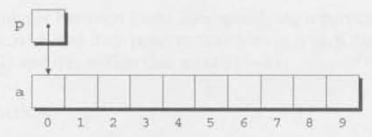

We can now access `a[0]` through `p`; for example, we can store the value 5 in `a[0]` by writing

```C
*p = 5;
```

Here's our picture now:

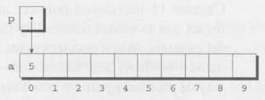

Making a pointer `p` point to an element of an array `a` isn't particularly exciting. However. by performing pointer arithmetic (or address arithmetic) on `p`, we can access the other elements of `a`. C supports three (and only three) forms of pointer arithmetic:

```
- Adding an integer to a pointer
- Subtracting an integer from a pointer
- Subtracting one pointer from another
```

Let's take a close look at each of these operations. Our examples assume that the following declarations are in effect:

```C
int a[0], *p, *q, i;
```

### 12.1.1 Adding an Integer to a Pointer

<span class="QandA"></span>

Adding an integer `j` to a pointer `p` yields a pointer to the element `j` places after the one that `p` points to. More precisely, if `p` points to the array element `a[i]`. then `p + j` points to `a[i + j]` (provided, of course, that `a[i + j]` exists).

The following example illustrates pointer addition; diagrams show the values of `p` and `q` at various points in the computation.

```C
p = &a[2];
```

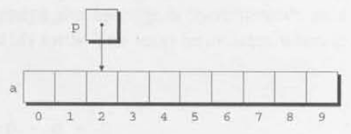

```C
q = p + 3;
```


```C
p += 6;
```

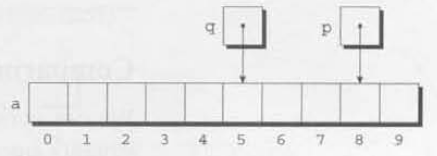

### 12.1.2 Subtracting an Integer from a Pointer

If `p` points to the array element `a[i]`, then `p - j` points to `a[i - j]`. For example:

```C
p = &a[8];
```

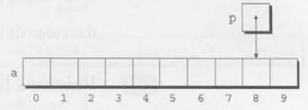

```C
q = p - 3;
```

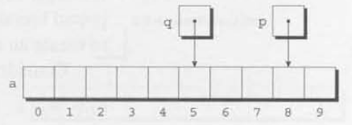

```C
p -= 6;
```

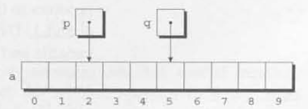

### 12.1.3 Subtracting One Pointer from Another

When one pointer is subtracted from another, the result is the distance (measured in array elements) between the pointers. Thus, if `p` points to `a[i]` and `q` points to `a[j]`.then `p - q` is equal to `i - j`. For example:

```C
p = &a[5];
q = &a[1];
```

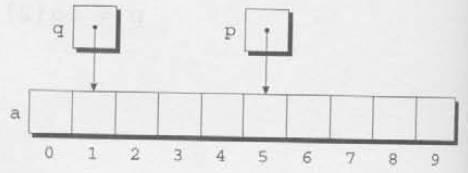

```C
i = p - q; /* i is 4 */
i = q - p; /* i is -4 */
```

<!-- START: div -->
<div class="infoBox">

<span class="warningEmoji"></span>

Performing arithmetic on a pointer that doesn't point to an array element causes undefined behavior. Furthermore, the effect of subtracting one pointer from another is undefined unless both point to elements of the same array.

</div>
<!-- END: div -->

### 12.1.4 Comparing Pointers

We can compare pointers using the relational operators (`<`, `<=`, `>`, `>=`) and the equality operators (`==` and `|=`). Using the relational operators to compare two pointers is meaningful only when both point to elements of the same array. The outcome of the comparison depends on the relative positions of the two elements in the array. For example, after the assignments

```C
p = &a[5];
q = &a[1];
```

the value of `p <= q` is 0 and the value of `p >= q` is 1.

<span class="C99Symbol"></span>

### 12.1.5 Pointers to Compound Literals

It's legal for a pointer to point to an element within an array created by a compound literal. A compound literal, you may recall, is a C99 feature that can be used to create an array with no name.

Consider the following example:

```C
int *p = (int [1]){3, 0, 3, 4, 1};
```

`p` points to the first element of a five-element array containing the integers 3, 0, 3, 4, and 1. Using a compound literal saves us the trouble of first declaring an array variable and then making `p` point to the first element of that array:

```C
int a[] = {3, 0, 3, 4, 1}:
int *p = &a[0];
```

## 12.2 Using Pointers for Array Processing

Pointer arithmetic allows us to visit the elements of an array by repeatedly incrementing a pointer variable. The following program fragment, which sums the elements of an array `a`, illustrates the technique. In this example, the pointer variable `p` initially points to `a[0]`. Each time through the loop, `p` is incremented; as a result, it points to `a[1]`, then `a[2]`, and so forth. The loop terminates when `p` steps past the last element of `a`.

```C
#define N 10
...
int a[N], sum, *p;
...
sum = 0;
for (p = &a[0]; p < &a[N]; p++)
    sum += *p;
```

The following figures show the contents of `a`, `sum`, and `p` at the end of the first three loop iterations (before `p` has been incremented).

At the end of the first iteration: I

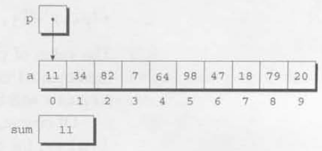

At the end of the second iteration:

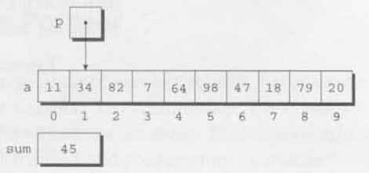

At the end of the third iteration

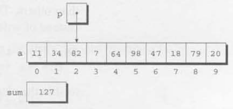

The condition `p < &a[N]` in the `for` statement deserves special mention. Strange as it may seem, it's legal to apply the address operator to `a[N]`, even though this element doesn't exist (`a` is indexed from 0 to `N — 1`). Using `a[N]` in this fashion is perfectly safe, since the loop doesn't attempt to examine its value. The body of the loop will be executed with `p` equal to `&a[0]`, `&a[1]`, `...`, `&a [N-1]`, but when `p` is equal to `&a[N]`, the loop terminates.

<span class="QandA"></span>

We could just as easily have written the loop without pointers, of course, using subscripting instead. The argument most often cited in support of pointer arithmetic is that it can save execution time. However, that depends on the implementation—some C compilers actually produce better code `for` loops that rely on subscripting.

### 12.2.1 Combining the * and ++ Operators

C programmers often combine the `*` (indirection) and `++` operators in statements that process array elements. Consider the simple case of storing a value into an array element and then advancing to the next element. Using array subscripting, we might write

```C
a[i++] = j;
```

If `p` is pointing to an array element, the corresponding statement would be

```C
*p++ = j;
```

Because the postfix version of `++` takes precedence over `*`, the compiler sees this as

```C
*(p++) = j;
```

The value of `p++` is `p`. (Since we're using the postfix version of `++`, p won't be incremented until after the expression has been evaluated.) Thus, the value of `*(p++)` will be `*p`—the object to which `p` is pointing.

Of course, `*p++` isn't the only legal combination of `*` and `++`. We could write `(*p)++`, for example, which returns the value of the object that `p` points to, and then increments that object (`p` itself is unchanged). If you find this confusing, the following table may help:

<!-- START: table -->
<table>
<tr>
<th>

*Expression*

</th>
<th>

*Meaning*

</th>
</tr>
<tr>
<td>

`*p++` or `*(p++)`

</td>
<td>

Value of expression is `*p` before increment; increment `p` later

</td>
</tr>
<tr>
<td>

`(*p)++`

</td>
<td>

Value of expression is `*p` before increment: increment `*p` later

</td>
</tr>
<tr>
<td>

`*++p` or `*(++p)`

</td>
<td>

Increment `p` first; value of expression is `*p` after increment

</td>
</tr>
<tr>
<td>

`++*p` or `++(*p)`

</td>
<td>

Increment *p first; value of expression is *p after increment

</td>
</tr>
</table>
<!-- END: table -->

All four combinations appear in programs, although some are far more common than others. The one we'll see most frequently is `*p++`, which is handy in loops. Instead of writing

```C
for (p = &a[0]; p < &a[N]; p++)
    sum += *p;
```

to sum the elements of the array `a`, we could write

```C
p = &a[0];
while (p < &a[N])
    sum += *p++;
```

The `*` and `--` operators mix in the same way as `*` and `++`. For an application that combines `*` and `--`, let's return to the stack example of Section 10.2. The original version of the stack relied on an integer variable named `top` to keep track of the "top-of-stack" position in the `contents` array. Let's replace `top` by a pointer variable that points initially to element 0 of the `contents` array:

```C
int *top_ptr = &contents[0];
```

Here are the new `push` and `pop` functions (updating the other stack functions is left as an exercise):

```C
void push(int i)
{
    if(is_full())
        stack_overflow() ;
    else
        *top_ptr++ = i;
}

int pop(void)
{
    if (is_empty())
        stack_underflow() ;
    else
        return *--top_ptr;
}
```

Note that I've written `*--top_ptr`, not `*top_ptr--`, since I want `pop` to decrement `top_ptr` *before* fetching the value to which it points.


## 12.3 Using an Array Name as a Pointer

Pointer arithmetic is one way in which arrays and pointers are related, but it's not the only connection between the two. Here's another key relationship: The name of an array can be used as a pointer to the first element in the array. This relationship simplifies pointer arithmetic and makes both arrays and pointers more versatile.

For example, suppose that `a` is declared as follows:

```C
int a[10];
```

Using `a` as a pointer to the first element in the array, we can modify `a[0]`:

```C
*a = 7; /* stores 7 in a[0] */
```

We can modify `a[1]` through the pointer `a + 1`:

```C
*(a+1) = 12; /* stores 12 in a[1] */
```

In general, `a + i` is the same as `&a[1]` (both represent a pointer to element `i` of `a`) and `*(a+i)` is equivalent to `a[i]` (both represent element `i` itself). In other words, array subscripting can be viewed as a form of pointer arithmetic.

The fact that an array name can serve as a pointer makes it easier to write loops that step through an array. Consider the following loop from Section 12.2:

```C
for (p = &a[0]; p < &a[N]; p++)
    sum += *p;
```

To simplify the loop, we can replace `&a[0]` by `a` and `&a[N]` by `a + N`:

**idiom**

```C
for (p = a; p < a + N; p++)
    sum += *p;
```

<!-- START: div -->
<div class="infoBox">

<span class="warningEmoji"></span>

Although an array name can be used as a pointer, it's not possible to assign it a new value. Attempting to make it point elsewhere is an error:

```C
while(*a != 0)
    a++; /*** WRONG ***/
```

This is no great loss; we can always copy a into a pointer variable, then change the pointer variable:

```C
p = a;
while (*p != 0)
    p++;
```

</div>
<!-- END: div -->

### 12.3.1 (PROGRAM) Reversing a Series of Numbers (Revisited)

The `reverse.c` program of Section 8.1 reads 10 numbers, then writes the numbers in reverse order. As the program reads the numbers, it stores them in an array. Once all the numbers are read, the program steps through the array backwards as it prints the numbers.

The original program used subscripting to access elements of the array, Here's a new version in which I've replaced subscripting with pointer arithmetic.

```C
/********************************************************************************
 * File: reverse3.c
 * Author: K. N. King
 * Purpose: Reverses a series of numbers (pointer version)
 ********************************************************************************/

/* START: Header inclusions*/
#include <stdio.h>
/* END: Header inclusions*/

/* START: MACRO definitions*/
#define N 10
/* END: MACRO definitions*/

/* START: type definitions*/

/* END: type definitions*/

/* START: Variable declarations*/

/* END: Variable declarations*/

/* START: Function prototypes*/

/* END: Function prototypes*/

/**
 * Function name: main
 * Return type: int
 * Return value description: 
 * Parameters: void
 * Param1 descr.: 
 * Param2 descr.: 
 * Param3 descr.: 
 * Function description: 
 */
int main(void)
{
    int a[N], *p;

    printf("Enter %d numbers: ", N);
    for(p = a; p < a + N; p++)
    {
        scanf("%d", p);
    }	// for statement: get the numbers

    printf("In reverse order: ");
    for(p = a + N - 1; p >= a; p--)
    {
        printf(" %d", *p);
    }	// for statement: print the numbers in reverse order
    
    printf("\n");
    return 0;
}	//FUNCTION END: main
```

In the original program, an integer variable `i` kept track of the current position within the array. The new version replaces `i` with `p`, a pointer variable. The numbers are still stored in an array: we're simply using a different technique to keep track of where we are in the array.

Note that the second argument to `scanf` is `p`, not `&p`. Since `p` points to an array element, it's a satisfactory argument for `scanf`; `&p`, on the other hand, would be a pointer to a pointer to an array element.

### 12.3.2 Array Arguments (Revisited)

When passed to a function, an array name is always treated as a pointer. Consider the following function, which returns the largest element in an array of integers:

```C
int find_largest(int a[], int n)
{
    int i, max;

    max = a[0];
    Eor (i = 1; i < n; i++)
        if (a[i] > max)
            max = a[i];
    return max;
}
```

Suppose that we call `find_largest` as follows:

```C
largest = find_largest(b, N);
```

This call causes a pointer to the first element of `b` to be assigned to `a`: the array itself isn't copied.

The fact that an array argument is treated as a pointer has some important consequences:

<!-- START: unordered-list -->
<ul>
<li>

When an ordinary variable is passed to a function, its value is copied; any changes to the corresponding parameter don't affect the variable. In contrast, an array used as an argument isn't protected against change, since no copy is made of the array itself. For example, the following function (which we first saw in Section 9.3) modifies an array by storing zero into each of its elements:

```C
void store_zeros(int a[], int n)
{
    int i;
    for(i = 0; i < n; i++)
    {
        a[i] = 0;
    }	// for statement: 
}
```

To indicate that an array parameter won't be changed, we can include the word `const` in its declaration:

```C
int find_largest(const int a[], int n)
{
    ...
}
```

If `const` is present, the compiler will check that no assignment to an element of `a` appears in the body of `find_largest`.

</li>
<li>

The time required to pass an array to a function doesn't depend on the size of the array. There's no penalty for passing a large array, since no copy of the array is made.

</li>
<li>

An array paramecter can be declared as a pointer if desired. For example, `find_largest` could be defined as follows:

```C
int find_largest (int *a, int n)
{
    ...
}
```

<span class="QandA"></span>

Declaring `a` to be a pointer is equivalent to declaring it to be an array; the compiler treats the declarations as though they were identical.

<!-- START: div -->
<div class="infoBox">

<span class="warningEmoji"></span>

Although declaring a parameter to be an array is the same as declaring it to be a pointer, the same isn't true for a variable. The declaration

```C
int a[10];
```

causes the compiler to set aside space for 10 integers. In contrast, the declaration

```C
int *a;
```

causes the compiler to allocate space for a pointer variable. In the latter case, `a` is not an array; attempting to use it as an array can have disastrous results. For example, the assignment

```C
*a = 0;  /*** WRONG ***/
```

will store 0 where `a` is pointing. Since we don't know where `a` is pointing, the effect on the program is undefined.

</div>
<!-- END: div -->

</li>
<li>

A function with an array parameter can be passed an array "slice"—a sequence of consecutive elements. Suppose that we want `find_largest` to locate the largest element in some portion of an array `b`, say elements `b[5]`, `...`, `b[14]`. When we call `find_largest`, we'll pass it the address of `b[5]` and the number 10, indicating that we want `find_largest` to examine 10 array elements, starting at `b[5]`:

```C
largest = find_largest (&b[5], 10);
```

</li>
</ul>
<!-- END: unordered-list -->

### 12.3.3 Using a Pointer as an Array Name

If we can use an array name as a pointer, will C allow us to subscript a pointer as though it were an array name? By now, you'd probably expect the answer to be yes, and you'd be right. Here's an example:

```C
#define N 10
...
int a[N], i, sum = 0, *p = a;
...
for (i = 0; 1 < N; i++)
    sum += p[i];
```

The compiler treats `p[1]` as `*(p+1)`, which is a perfectly legal use of pointer arithmetic. Although the ability to subscript a pointer may seem to be little more than a curiosity, we'll see in Section 17.3 that it's actually quite useful.

## 12.4 Pointers and Multidimensional Arrays

Just as pointers can point to elements of one-dimensional arrays, they can also point to elements of multidimensional arrays. In this section, we'll explore common techniques for using pointers to process the elements of multidimensional arrays. For simplicity, I'll stick to two-dimensional arrays, but everything we'll do applies equally to higher-dimensional arrays.

### 12.4.1 Processing the Elements of a Multidimensional Array

We saw in Section 8.2 that C stores two-dimensional arrays in row-major order; in other words, the elements of row 0 come first. followed by the elements of row 1, and so forth. An array with `r` rows would have the following appearance:

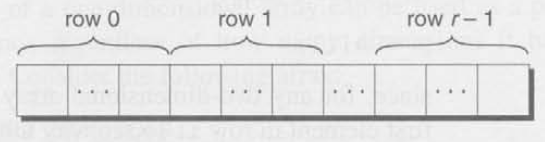

We can take advantage of this layout when working with pointers. If we make a pointer `p` point to the first element in a two-dimensional array (the element in row 0, column 0), we can visit every element in the array by incrementing `p` repeatedly.

As an example, let's look at the problem of initializing all elements of a two dimensional array to zero. Suppose that the array has been declared as follows:

```C
int a[NUM_ROWS][NUM_COLS];
```

The obvious technique would be to use nested `for` loops:

```C
int row, col;
...
for(row = 0; row < NUM_ROWS; row++)
    for(col = 0; col < NUM_COLS; col++)
        a[row][col] = 0;
```

But if we view `a` as a one-dimensional array of integers (which is how it's stored), we can replace the pair of loops by a single loop:

```C
int *p;
...
for(p = &a[0][0]; p <= &a[NUM_ROWS - 1][NUM_COLS - 1]; p++)
    *p = 0;
```

The loop begins with `p` pointing to `a[0][0]`. Successive increments of `p` make it point to `a[0][1]`, `a[0][2]`, `a[0][3]`, and so on. When `p` reaches `a[0][NUM_COLS-1]` (the last element in row 0), incrementing it again makes `p` point to `a[1][0]`, the first element in row 1. The process continues until `p` goes past `a[NUM_ROWS-1][NUM_COLS-1]`, the last element in the array.

<span class="QandA"></span>

Although treating a two-dimensional array as one-dimensional may seem like cheating, it works with most C compilers. Whether it's a good idea to do so is another matter. Techniques like this one definitely hurt program readability, but—at least with some older compilers—produce a compensating increase in efficiency. With many modern compilers, though, there's often little or no speed advantage.

### 12.4.2 Processing the Rows of a Multidimensional Array

What about processing the elements in just one row of a two-dimensional array? Again, we have the option of using a pointer variable `p`. To visit the elements of row `i`, we'd initialize `p` to point to element 0 in row `i` in the array `a`:

```C
p = &a[i][0];
```

Or we could simply write

```C
p = a[i];
```

since, for any two-dimensional array `a`, the expression `a[1]` is a pointer to the first element in row 1. To see why this works, recall the magic formula that relates array subscripting to pointer arithmetic: for any array `a`, the expression `a[1]` is equivalent to `*(a + 1)`. Thus, `&a[1][0]` is the same as `&(*(a[1] + 0))`, which is equivalent to `&*a[1]`, which is the same as `a[1]`, since the `&` and `*` operators cancel. We'll use this simplification in the following loop, which clears row `i` of the array `a`:

```C
int a[NUM_ROWS][NUM_COLS], *p, i;
...
for (p = a[i]; p < a[i] + NUM_COLS; p++)
    *p = 0;
```

Since `a[i]` is a pointer to row `i` of the array `a`, we can pass `a[i]` to a function that's expecting a one-dimensional array as its argument. In other words, a function that's designed to work with one-dimensional arrays will also work with a row belonging to a two-dimensional array. As a result, functions such as `find_largest` and `store_zeros` are more versatile than you might expect. Consider `find_largest`, which we originally designed to find the largest element of a one-dimensional array. We can just as easily use `find_largest` to determine the largest element in row `i` of the two-dimensional array `a`:

```C
largest = find_largest(a[i], NUM_COLS);
```

### 12.4.3 Processing the Columns of a Multidimensional Array

Processing the elements in a *column* of a two-dimensional array isn't as easy, because arrays are stored by row, not by column. Here's a loop that clears column 1 of the array a:

```C
int a[NUM_ROWS][NUM_COLS], (*p) [NUM_COLS], i;
...
for(p = &a[0]; p < &a[NUM_ROWS]; p++)
    (*p)[1] = 0;
```

I've declared `p` to be a pointer to an array of length `NUM_COLS` whose elements are integers. The parentheses around `*p` in `(*p)[NUM_COLS]` are required; without them, the compiler would treat `p` as an *array of pointers instead of a pointer to an array*. The expression `p++` advances `p` to the beginning of the next row. In the expression `(*p)[1]`, `*p` represents an entire row of `a`, so `(*p)[i]` selects the element in column `i` of that row. The parentheses in `(*p)[1]` are essential, because the compiler would interpret `*p[i]` as `*(p[i])`.

### 12.4.4 Using the Name of a Multidimensional Array as a Pointer

Just as the name of a one-dimensional array can be used as a pointer, so can the name of any array, regardless of how many dimensions it has. Some care is required, though. Consider the following array:

```C
int a[NUM_ROWS][NUM_COLS];
```

`a` is not a pointer to `a[0][0]`; instead, it's a pointer to `a[0]`. This makes more sense if we look at it from the standpoint of C. which regards `a` not as a two-dimensional array but as a one-dimensional array whose elements are one dimensional arrays. When used as a pointer, `a` has type `int(*)[NUM_COLS]` (pointer to an integer array of length `NUM_COLS`).

Knowing that `a` points to `a[0]` is useful for simplifying loops that process the elements of a two-dimensional array. For example, instead of writing

```C
for(p = &a[0]; p < &a[NUM_ROWS]; p++)
    (*p)[i] = 0;
```

to clear column 1 of the array `a`, we can write

```C
for(p = a; p < a + NUM_ROWS; p++)
    (*p)[i] = 0;
```

Another situation in which this knowledge comes in handy is when we want to "trick" a function into thinking that a multidimensional array is really one-dimensional. For example, consider how we might use `find_largest` to find the largest element in `a`. As the first argument to `find_largest`, let's try passing `a` (the address of the array); as the second, we'll pass `NUM_ROWS * NUM_COLS` (the total number of elements in `a`):

```C
largest = find_largest(a, NUM_ROWS * NUM_COLS); /* WRONG */
```

Unfortunately, the compiler will object to this statement, because the type of `a` is `int(*)[NUM_COLS]` but `find_largest` is expecting an argument of type `int *`. The correct call is

```C
largest = find_largest(a[0], NUM_ROWS * NUM_COLS);
```

<span class="QandA"></span>

`a[0]` points to element 0 in row 0, and it has type `int *` (after conversion by the compiler), so the latter call will work correctly.

## 12.5 Pointers and Variable-Length Arrays (C99)

Pointers are allowed to point to elements of variable-length arrays (VLAs), a feature of C99. An ordinary pointer variable would be used to point to an element of a one-dimensional VLA:

```C
void f(int n)
{
    int a[n], *p;
    p = a;
    ...
}
```

When the VLA has more than one dimension, the type of the pointer depends on the length of each dimension except for the first. Let's look at the two-dimensional case:

```C
void f(int m, int n)
{
    int a[m][n], (*p)[n];
    p = a;
    ...
}
```

Since the type of `p` depends on `n`, which isn't constant, `p` is said to have a variably modified type. Note that the validity of an assignment such as `p = a` can't always be determined by the compiler. For example, the following code will compile but is correct only if `m` and 1 are equal:

```C
int a[m][n], (*p)[m];
p = a;
```

If m<span class="unicode_NOT_EQUAL_TO"></span>n, any subsequent use of `p` will cause undefined behavior.

Variably modified types are subject to certain restrictions, just as variable-length arrays are. The most important restriction is that the declaration of a variably modified type must be inside the body of a function or in a function prototype.

Pointer arithmetic works with VLAs just as it does for ordinary arrays. Returning to the example of Section 12.4 that clears a single column of a two-dimensional array `a`, let's declare `a` as a VLA this time:

```C
int a[m][n];
```

A pointer capable of pointing to a row of `a` would be declared as follows:

```C
int (*p)[n];
```

The loop that clears column `i` is almost identical to the one we used in Section

```C
for(p = a; p < a + m; p++)
    (*p)[i] = 0;
```

## Q&A

<!-- START: div -->
<div class="QandA_question">

<span class="ques"></span>I don't understand pointer arithmetic. If a pointer is an address, does that mean that an expression like `p + j` adds `j` to the address stored in `p`?

</div>
<!-- END: div -->
<!-- START: div -->
<div class="QandA_answer">

<span class="ans"></span>No. Integers used in pointer arithmetic are scaled depending on the type of the pointer. If `p` is of type `int *`, for example, then `p + j` typically adds 4x`j` to `p`, assuming that `int` values are stored using 4 bytes. But if `p` has type `double *`, then `p + j` will probably add 8 x `j` to `p`, since `double` values are usually 8 bytes
long.

</div>
<!-- END: div -->

---

<!-- START: div -->
<div class="QandA_question">

<span class="ques"></span>When writing a loop to process an array, is it better to use array subscripting or pointer arithmetic?

</div>
<!-- END: div -->
<!-- START: div -->
<div class="QandA_answer">

<span class="ans"></span>There's no easy answer to this question, since it depends on the machine you're using and the compiler itself. In the early days of C on the PDP-11, pointer arithmetic yielded a faster program. On today's machines, using today's compilers, array subseripting is often just as good, and sometimes even better. The bottom line: Learn both ways and then use whichever is more natural for the kind of program you're writing.

</div>
<!-- END: div -->

---

<!-- START: div -->
<div class="QandA_question">

<span class="ques"></span>I read somewhere that `i[a]` is the same as `a[i]`. Is this true?

</div>
<!-- END: div -->
<!-- START: div -->
<div class="QandA_answer">

<span class="ans"></span>Yes, it is, oddly enough. The compiler treats `i[a]` as `*(i + a)`, which is the same as `*(a + 1)`. (Pointer addition, like ordinary addition, is commutative.) But `*(a + 1)` is equivalent to `a[i]`. Q.E.D. But please don't use `i[a]` in programs unless you're planning to enter the next Obfuscated C contest.

</div>
<!-- END: div -->

---

<!-- START: div -->
<div class="QandA_question">

<span class="ques"></span>Why is `*a` the same as `a[]` in a parameter declaration?

</div>
<!-- END: div -->
<!-- START: div -->
<div class="QandA_answer">

<span class="ans"></span>Both indicate that the argument is expected to be a pointer. The same operations on `a` are possible in both cases (pointer arithmetic and array subscripting, in particular). And, in both cases, `a` itself can be assigned a new value within the function. (Although C allows us to use the name of an array variable only as a "constant pointer," there's no such restriction on the name of an array parameter.)

</div>
<!-- END: div -->

---

<!-- START: div -->
<div class="QandA_question">

<span class="ques"></span>Is it better style to declare an array parameter as `*a` or `a[]`?

</div>
<!-- END: div -->
<!-- START: div -->
<div class="QandA_answer">

<span class="ans"></span>That's a tough one. From one standpoint, `a[]` is the obvious choice, since `*a` is ambiguous (does the function want an array of objects or a pointer to a single object?). On the other hand, many programmers argue that declaring the parameter as `*a` is more accurate, since it reminds us that only a pointer is passed, not a copy of the array. Others switch between `*a` and `a[]`, depending on whether the function uses pointer arithmetic or subscripting to access the elements of the array. (That's the approach I'll use.) In practice, `*a` is more common than `a[]`, so you'd better get used to it. For what it's worth, Dennis Ritchie now refers to the `a[]` notation as "a living fossil" that "serves as much to confuse the learner as to alert the reader."

</div>
<!-- END: div -->

---

<!-- START: div -->
<div class="QandA_question">

<span class="ques"></span>We've seen that arrays and pointers are closely related in C. Would it be accurate to say that they're interchangeable?

</div>
<!-- END: div -->
<!-- START: div -->
<div class="QandA_answer">

<span class="ans"></span>No. It's true that array *parameters* are interchangeable with pointer parameters, but array *variables* aren't the same as pointer variables. Technically, the name of an array isn't a pointer; rather, the C compiler converts it to a pointer when necessary. To see this difference more clearly, consider what happens when we apply the `sizeof` operator to an array `a`. The value of `sizeof(a)` is the total number of bytes in the array—the size of each element multiplied by the number of elements. But if `p` is a pointer variable, `sizeof(p)` is the number of bytes required to store a pointer value.

</div>
<!-- END: div -->

---

<!-- START: div -->
<div class="QandA_question">

<span class="ques"></span>You said that treating a two-dimensional array as one-dimensional works with "most" C compilers. Doesn't it work with all compilers?

</div>
<!-- END: div -->
<!-- START: div -->
<div class="QandA_answer">No. Some modern "bounds-checking" compilers track not only the type of a pointer, but—when it points to an array—also the length of the array. For example, suppose that `p` is assigned a pointer to `a[0][0]`. Technically, `p` points to the first element of `a[0]`, a one-dimensional array. If we increment `p` repeatedly in an effort to visit all the elements of `a`, we'll go out of bounds once `p` goes past the last element of  `a[0]`. A compiler that performs bounds-checking may insert code to check that `p` is used only to access elements in the array pointed to by `a[0]`; an attempt to increment `p` past the end of this array would be detected as an error.

<span class="ans"></span>

</div>
<!-- END: div -->

---

<!-- START: div -->
<div class="QandA_question">

<span class="ques"></span>If `a` is a two-dimensional array, why can we pass `a[0]`—but not `a` itself—to `find_largest`? Don't both `a` and `a[0]` point to the same place (the beginning of the array)?

</div>
<!-- END: div -->
<!-- START: div -->
<div class="QandA_answer">

<span class="ans"></span>They do, as a matter of fact—both point to element `a[0][0]`. The problem is that `a` has the wrong type. When used as an argument, it's a pointer to an array, but `find_largest` is expecting a pointer to an integer. However, `a[0]` has type `int *`, so it's an acceptable argument for `find_largest`. This concern about types is actually good: if C weren't so picky, we could make all kinds of horrible pointer mistakes without the compiler noticing.

</div>
<!-- END: div -->

---


## Examples

- Programs: <span class="unicode_LINK_SYMBOL"></span>[./cknkCh12/cknkCh12Exmp/](./cknkCh12/cknkCh12Exmp/)

## Exercises

- Readme: <span class="unicode_LINK_SYMBOL"></span>[./cknkCh12/cknkCh12Exrc/README.md](./cknkCh12/cknkCh12Exrc/README.md)  
- Readme (html): <span class="unicode_LINK_SYMBOL"></span>[./cknkCh12/cknkCh12Exrc/cknkCh12ExrcReadme.html](./cknkCh12/cknkCh12Exrc/cknkCh12ExrcReadme.html)  
- Programs: <span class="unicode_LINK_SYMBOL"></span>[./cknkCh12/cknkCh12Exrc/](./cknkCh12/cknkCh12Exrc/)  

## Programming Projects

- Readme: <span class="unicode_LINK_SYMBOL"></span>[./cknkCh12/cknkCh12Prj/README.md](./cknkCh12/cknkCh12Prj/README.md)  
- Readme: <span class="unicode_LINK_SYMBOL"></span>[./cknkCh12/cknkCh12Prj/cknkCh12PrjReadme.html](./cknkCh12/cknkCh12Prj/cknkCh12PrjReadme.html)  
- Programs: <span class="unicode_LINK_SYMBOL"></span>[./cknkCh12/cknkCh12Prj/](./cknkCh12/cknkCh12Prj/)  

<hr class="chapterDivider"/>

</body>
</html>