<html>
<head>
<meta charset="UTF-8">
<meta name="viewport" content="width=device-width, initial-scale=1.0">
<title>C (KNK) - Current Chapter</title>
<link rel="stylesheet" href="./myStyle.css">
</head>
<body>

# 13 Strings

<!-- START: div -->
<div class="theQuote">

It's difficult to extract sense from strings, but they're the only communication coin we can count on.

</div>
<!-- END: div -->

Although we've used `char` variables and arrays of `char` values in previous chapters, we still lack any convenient way to process a series of characters (a *string*, in C terminology). We'll remedy that defect in this chapter, which covers both string *constants* (or *literals*, as they're called in the C standard) and string *variables*, which can change during the execution of a program.

Section 13.1 explains the rules that govern string literals, including the rules for embedding escape sequences in string literals and for breaking long string literals. Section 13.2 then shows how to declare string variables, which are simply arrays of characters in which a special character---the null character---marks the end of a string. Section 13.3 describes ways to read and write strings. Section 13.4 shows how to write functions that process strings, and Section 13.5 covers some of the string-handling functions in the C library. Section 13.6 presents idioms that are often used when working with strings. Finally, Section 13.7 describes how to set up arrays whose elements are pointers to strings of different lengths. This section also explains how C uses such an array to supply command-line information to programs.

## 13.1 String Literals

A ***string literal*** is a sequence of characters enclosed within double quotes:

```C
"When you come to a fork in the road, take it."
```

We first encountered string literals in Chapter 2: they often appear as format strings in calls of `printf` and `scanf`.

### 13.1.1 Escape Sequences in String Literals

String literals may contain the same escape sequences as character constants. We've used character escapes in `printf` and `scanf` format strings for some time. For example, we've seen that each `\n` character in the string

```C
"Candy\nIs dandy\nBut liquor\nIs quicker.\n  --Ogden Nash\n"
```

causes the cursor to advance to the next line:

```
Candy
Is dandy
But liquor
Is quicker.
  --Ogden Nash
```

Although octal and hexadecimal escapes are also legal in string literals, they're not as common as character escapes.

<!-- START: div: infoBox -->
<div class="infoBox">

<span class="warningEmoji"></span>

<span class="QandA"></span>

Be careful when using octal and hexadecimal escape sequences in string literals. An octal escape ends after three digits or with the first non-octal character. For example, the string `"\1234"` contains two characters (`\123` and `4`), and the string `"\189"` contains three characters (`\1`, `8`, and `9`). A hexadecimal escape, on the other hand, isn't limited to three digits; it doesn't end until the first non-hex character. Consider what happens if a string contains the escape `\xfc`, which represents the character *ü* in the Latin character set, a common extension of ASCII. The string `"Z\xfcrich"` ("Zürich") has six characters (`Z`, `\xfe`, `r`, `i`, `c`, and `h`), but the string `"\xfcber"` (a failed attempt at "über") has only two (`\xfcbe` and `r`). Most compilers will object to the latter string, since hex escapes are usually limited to the range `\x0`-`\xff`.

</div>
<!-- END: div: infoBox -->

### 13.1.2 Continuing a String Literal

If we find that a string literal is too long to fit conveniently on a single line, C allows us to continue it on the next line, provided that we end the first line with a backslash character (`\`). No other characters may follow `\` on the same line, other than the (invisible) new-line character at the end:

```C
printf("When you come to a fork in the road, take it.  \
--Yogi Berra");
```

In general, the `\` character can be used to join two or more lines of a program into a single line (a process that the C standard refers to as "splicing"). We'll see more examples of splicing in Section 14.3.

The `\` technique has one drawback: the string must continue at the beginning of the next line, thereby wrecking the program's indented structure. There's a better way to deal with long string literals, thanks to the following rule: when two or more string literals are adjacent (separated only by white space), the compiler will join them into a single string. This rule allows us to split a string literal over two or more lines:

```C
printf ("when you come to a fork in the road, take it. "
        "--Yogi Berra");
```

### 13.1.3 How String Literals Are Stored

We've used string literals often in calls of `printf` and `scanf`. But when we call `printf` and supply a string literal as an argument, what are we actually passing? To answer this question, we need to know how string literals are stored.

In essence, C treats string literals as character arrays. When a C compiler encounters a string literal of length `n` in a program, it sets aside `n + 1` bytes of memory for the string. This area of memory will contain the characters in the string, plus one extra character---the null character---to mark the end of the string. The null character is a byte whose bits are all zero, so it's represented by the `\0` escape sequence.

<!-- START: div: infoBox -->
<div class="infoBox">

<span class="warningEmoji"></span>

Don't confuse the null character (`'\0'`) with the zero character (`'0'`). The null character has the code `0`; the zero character has a different code (`48` in ASCII).

</div>
<!-- END: div: infoBox -->

For example, the string literal `"abc"` is stored as an array of four characters (`a`, `b`, `c`, and `\0`):

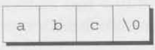

String literals may be empty; the string `""` is stored as a single null character:

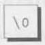

Since a string literal is stored as an array, the compiler treats it as a pointer of type `char *`. Both `printf` and `scanf`, for example, expect a value of type `char *` as their first argument. Consider the following example:

```C
printf("abc") ;
```

When `printf` is called, it's passed the address of `"abc"` (a pointer to where the letter `a` is stored in memory).

### 13.1.4 Operations on String Literals

In general, we can use a string literal wherever C allows a `char *` pointer. For example, a string literal can appear on the right side of an assignment:

```C
char *p;

p = "abc";
```

This assignment doesn't copy the characters in `"abc"`; it merely makes `p` point to the first character of the string. 

C allows pointers to he subscripted, so we can subscript string literals:

```C
char ch;

ch = "abc"[1];
```

The new value of `ch` will be the letter `b`. The other possible subscripts are 0 (which would select the letter `a`), 2 (the letter `c`), and 3 (the null character). This property of string literals isn't used that much, but occasionally it's handy. Consider the following function, which converts a number between 0 and 15 into a character that represents the equivalent hex digit:

```C
char digit_to_hex_char(int digit)
{
    return "0123456789ABCDEF"[digit];
}
```

<!-- START: div: infoBox -->
<div class="infoBox">

<span class="warningEmoji"></span>

Attempting to modify a string literal causes undefined behavior:

```C
char *p = "abc";

*p = 'd'; /*** WRONG ***/
```

<span class="QandA"></span>

A program that tries to change a string literal may crash or behave erratically.

</div>
<!-- END: div: infoBox -->

### 13.1.5 String Literals versus Character Constants

A string literal containing a single character isn't the same as a character constant. The string literal `"a"` is represented by a pointer to a memory location that contains the character `a` (followed by a null character). The character constant `'a'` is represented by an integer (the numerical code for the character).

<!-- START: div: infoBox -->
<div class="infoBox">

<span class="warningEmoji"></span>

Don't ever use a character when a string is required (or vice versa). The call

```C
printf("\n") ;
```

is legal, because `printf` expects a pointer as its first argument. The following call isn't legal, however:

```C
printf('\n'); /*** WRONG ***/
```

</div>
<!-- END: div: infoBox -->

## 13.2 String Variables

Some programming languages provide a special `string` type for declaring string variables. C takes a different tack: any one-dimensional array of characters can be used to store a string, with the understanding that the string is terminated by a null character. This approach is simple. but has significant difficulties. It's sometimes hard to tell whether an array of characters is being used as a string. If we write our own string-handling functions, we've got to be careful that they deal properly with the null character. Also, there's no faster way to determine the length of a string than a character-by-character search for the null character.

Let's say that we need a variable capable of storing a string of up to 80 characters. Since the string will need a null character at the end, we'll declare the variable to be an array of 81 characters:

**idiom**

```C
#define STR_LEN 80
...
char str[STR_LEN + 1] ;
```

We defined `STR_LEN` to be 80 rather than 81, thus emphasizing the fact that `str` can store strings of no more than 80 characters, and then added 1 to `STR_LEN` in the declaration of `str`. This is a common practice among C programmers.

<!-- START: div: infoBox -->
<div class="infoBox">

When declaring an array of characters that will be used to hold a string, always make the array one character longer than the string, because of the C convention that every string is terminated by a null character. Failing to leave room for the null character may cause unpredictable results when the program is executed, since functions in the C library assume that strings are null-terminated.

</div>
<!-- END: div: infoBox -->

Declaring a character array to have length `STR_LEN + 1` doesn't mean that it will always contain a string of `STR_LEN` characters. The length of a string depends on the position of the terminating null character, not on the length of the array in which the string is stored. An array of `STR_LEN + 1` characters can hold strings of various lengths, ranging from the empty string to strings of length `STR_LEN`.

### 13.2.1 Initializing a String Variable

A string variable can be initialized at the same time it's declared:

```C
char date1[8] = "June 14";
```

The compiler will put the characters from `"June 14"` in the `date1` array, then add a null character so that `date1` can be used as a string, Here's what `date1` will look like:

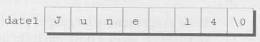

Although `"June 14"` appears to be a string literal, it's not. Instead, C views it as an abbreviation for an array initializer. In fact, we could have written

```C
char date1[8] = {'J', 'u', 'n', 'e', ' ', '1', '4', '\0'};
```

I think you'll agree that the original version is easier to read.

What if the initializer is too short to fill the string variable? In that case, the compiler adds extra null characters. Thus, after the declaration

```C
char date2[9] = "June 14";
```

`date2` will have the following appearance:

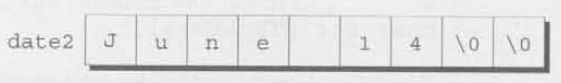

This behavior is consistent with C's treatment of array initializers in general. When an array initializer is shorter than the array itself, the remaining elements are initialized to zero. By initializing the leftover elements of a character array to `\0`, the compiler is following the same rule.

What if the initializer is longer than the string variable? That's illegal for strings, just as it's illegal for other arrays. However, C does allow the initializer (not counting the null character) to have exactly the same length as the variable;

```C
char date3[7] = "June 14";
```

There's no room for the null character, so the compiler makes no attempt to store one:

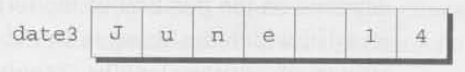

<!-- START: div: infoBox -->
<div class="infoBox">

<span class="warningEmoji"></span>

If you're planning to initialize a character array to contain a string, be sure that the length of the array is longer than the length of the initializer. Otherwise, the compiler will quietly omit the null character, making the array unusable as a string.

</div>
<!-- END: div: infoBox -->

The declaration of a string variable may omit its length, in which case the compiler computes it:

```C
char date4[] = "June 14";
```

The compiler sets aside eight characters for `date4`, enough to store the characters in `"June 14"` plus a null character. (The fact that the length of `date4` isn't specified doesn't mean that the array's length can be changed later. Once the program is compiled, the length of `date4` is fixed at eight.) Omitting the length of a string variable is especially useful if the initializer is long, since computing the length by hand is error-prone.

### 13.2.2 Character Arrays versus Character Pointers

Let's compare the declaration

```C
char date[] = "June 14";
```

which declares `date` to be an array, with the similar-looking

```C
char *date = "June 14";
```

which declares `date` to be a pointer. Thanks to the close relationship between arrays and pointers, we can use either version of `date` as a stiing. In particular, any function expecting to be passed a character array or character pointer will accept either version of `date` as an argument.

However, we must be careful not to make the mistake of thinking that the two versions of `date` are interchangeable. There are significant differences between the two:

- In the array version, the characters stored in `date` can be modified, like the elements of any array. In the pointer version, `date` points to a string literal, and we saw in Section 13.1 that string literals shouldn't be modified.  
- In the array version, `date` is an array name. In the pointer version, `date` is a variable that can be made to point to other strings during program execution.

If we need a string that can be modified, it's our responsibility to set up an array of characters in which to store the string: declaring a pointer variable isn't enough. The declaration

```C
char *p;
```

causes the compiler to set aside enough memory for a pointer variable; unfortunately. it doesn't allocate space for a string. (And how could it? We haven't indicated how long the string would be.) Before we can use `p` as a string, it must point to an array of characters. One possibility is to make `p` point to a string variable:

```C
char str[STR_LEN+1], *p;

p = str;
```

`p` now points to the first character of `str`, so we can use `p` as a string. Another possibility is to make `p` point to a dynamically allocated string.

<!-- START: div: infoBox -->
<div class="infoBox">

<span class="warningEmoji"></span>

Using an uninitialized pointer variable as a string is a serious error. Consider the following example, which attempts to build the string `"abc"`:

```C
char *p;

p[0] = 'a';    /*** WRONG ***/
p[1] = 'b';    /*** WRONG ***/
p[2] = 'c';    /*** WRONG ***/
p[3] = '\0';    /*** WRONG ***/
```

Since `p` hasn't heen initialized, we don't know where it's pointing. Using the pointer to write the characters `a`, `b`, `c`, and `\0` into memory causes undefined behavior.

</div>
<!-- END: div: infoBox -->

## 13.3 Reading and Writing Strings

Writing a string is easy using either the `printf` or `puts` functions. Reading a string is a bit harder, primarily because of the possibility that the input string may be longer than the string variable into which it's being stored. To read a string in a single step, we can use either `scanf` or `gets`. As an alternative, we can read strings one character at a time.

### 13.3.1 Writing Strings Using `printf` and `puts`

The `%s` conversion specification allows `printf` to write a string. Consider the following example:

```C
char str[] = "Are we having fun yet?";
printf("%s\n", str);
```

The output will be

```
Are we having fun yet?
```

`printf` writes the characters in a string one by one until it encounters a null character. (If the null character is missing, `printf` continues past the end of the string until --- eventually --- it finds a null character somewhere in memory.)

To print just part of a string, we can use the conversion specification `%.ps`, where `p` is the number of characters to be displayed. The statement

```C
printf("%.6s\n", str);
```

will print

```
Are we
```

A string, like a number, can be printed within a field. The `%ms` conversion will display a string in a field of size `m`. (A string with more than `m` characters will be printed in full, not truncated.) If the string has fewer than `m` characters, it will be right-justified within the field. To force left justification instead, we can put a minus sign in front of `m`. The `m` and `p` values can be used in combination: a conversion specification of the form `%.ps` causes the first `p` characters of a string to be displayed in a field of size `m`.

`printf` isn't the only function that can write strings. The C library also provides puts, which is used in the following way:

```C
puts(str) ;
```

`puts` has only one argument (the string to be printed). After writing the string, `puts` always writes an additional new-line character, thus advancing to the beginning of the next output line.

### 13.3.2 Reading Strings Using scanf and gets

The `%s` conversion specification allows `scanf` to read a string into a character array:

```C
scanf("%s", str);
```

There's no need to put the `&` operator in front of `str` in the call of `scanf`: like any array name, `str` is treated as a pointer when passed to a function.

When `scanf` is called, it skips white space, then reads characters and stores them in `str` until it encounters a white-space character. `scanf` always stores a null character at the end of the string.

A string read using `scanf` will never contain white space. Consequently, `scanf` won't usually read a full line of input; a new-line character will cause `scanf` to stop reading, but so will a space or tab character. To read an entire line of input at a time, we can use `gets`. Like `scanf`, the `gets` function reads input characters into an array, then stores a null character. In other respects, however, `gets` is somewhat different from `scanf`:

- `gets` doesn't skip white space before starting to read the string (`scanf` does).  
- `gets` reads until it finds a new-line character (`scanf` stops at any whitespace character). Incidentally, `gets` discards the new-line character instead of storing it in the array: the null character takes its place.

To see the difference between `scanf` and `gets`, consider the following program fragment:

```C
char sentence[SENT_LEN + 1];

printf("Enter a sentence:\n");
scanf("%s", sentence);
```

Suppose that after the prompt

```
Enter a sentence:
```

the user enters the line

```
To C, or not to C: that is the guestion.
```

`scanf` will store the string `"To"` in `sentence`. The next call of `scanf` will resume reading the line at the space after the word `To`.

Now suppose that we replace `scanf` by `gets`:

```C
gets(sentence);
```

When the user enters the same input as before, `gets` will store the string

```C
"To C, or not to C: that is the question."
```

in `sentence`.

<!-- START: div: infoBox -->
<div class="infoBox">

<span class="warningEmoji"></span>

As they read characters into an array, `scanf` and `gets` have no way to detect when it's full. Consequently, they may store characters past the end of the array, causing undefined behavior. `scanf` can be made safer by using the conversion specification `%ns` instead of `%s`, where `n` is an integer indicating the maximum number of characters to be stored. `gets`, unfortunately, is inherently unsafe: `fgets` is a much better alternative.

</div>
<!-- END: div: infoBox -->

### 13.3.3 Reading Strings Character by Character

Since both `scanf` and `gets` are risky and insufficiently flexible for many applications, C programmers often write their own input functions, By reading strings one character at a time, these functions provide a greater degree of control than the standard input functions.

If we decide to design our own input function, we'll need to consider the following issues:

- Should the function skip white space before beginning to store the string?  
- What character causes the function to stop reading: a new-line character, any white-space character, or some other character? Is this character stored in the string or discarded?  
- What should the function do if the input string is too long to store: discard the extra characters or leave them for the next input operation?

Suppose we need a function that doesn't skip white-space characters, stops reading at the first new-line character (which isn't stored in the string), and discards extra characters. The function might have the following prototype:

```C
int read_line(char str[], int n);
```

`str` represents the array into which we'll store the input, and `n` is the maximum number of characters to be read. If the input line contains more than `n` characters, `read_line` will discard the additional characters. We'll have `read_line` return the number of characters it actually stores in `str` (a number anywhere from 0 to `n`). We may not always need `read_line`'s return value, but it doesn't hurt to have it available.

<span class="QandA"></span>

`read_line` consists primarily of a loop that calls `getchar` to read a character and then stores the character in `str`, provided that there's room left. The loop terminates when the new-line character is read. (Strictly speaking, we should also have the loop terminate if `getchar` should fail to read a character, but we'll ignore that complication for now.) Here's the complete definition of `read_line`:

```C
int read_line(char str[], int n)
{
  int ch, i = 0;

  while((ch = getchar()) != '\n')
    if(i < n)
      str[i++] = ch;
  str[i] = '\0'; /* terminates string */
  return i; /* number of characters stored */
}
```

Note that `ch` has `int` type rather than `char` type, because `getchar` returns the character that it reads as an `int` value.

Before returning, `read_line` puts a null character at the end of the string. Standard functions such as `scanf` and `gets` automatically put a null character at the end of an input string; if we're writing our own input function, however, we must take on that responsibility.

## 13.4 Accessing the Characters in a String

Since strings are stored as arrays, we can use subscripting to access the characters in a string. To process every character in a string `s`, for example, we can set up a loop that increments a counter `i` and selects characters via the expression `s[i]`.

Suppose that we need a function that counts the number of spaces in a string. Using array subscripting, we might write the function in the following way:

```C
int count_spaces(const char s[])
{
  int count = 0, i;

  for (i = 0; s[i] != '\0'; i++)
    if(s[i] == ' ')
      count++;
  return count;
}
```

I've included `const` in the declaration of `s` to indicate that `count_spaces` doesn't change the array that `s` represents. If `s` were not a string, the function would need a second argument specifying the length of the array. Since `s` is a string, however, `count_spaces` can determine where it ends by testing for the null character.

Many C programmers wouldn't write `count_spaces` as we have. Instead, they'd use a pointer to keep track of the current position within the string. As we saw in Section 12.2, this technique is always available for processing arrays, but it proves to be especially convenient for working with strings.

Let's rewrite the `count_spaces` function using pointer arithmetic instead of array subscripting. We'll eliminate the variable `i` and use `s` itself to keep track of our position in the string. By incrementing `s` repeatedly, `count_spaces` can step through each character in the string. Here's our new version of the function:

```C
int count_spaces(const char *s)
{
  int count = 0;

  for (; *s != '\0'; s++)
    if(*s == ' ')
      count++;
  return count;
}
```

Note that `const` doesn't prevent `count_spaces` from modifying `s`; it's there to prevent the function from modifying what `s` points to. And since `s` is a copy of the pointer that's passed to `count_spaces`, incrementing `s` doesn't affect the original pointer.

The `count_spaces` example raises some questions about how to write
string functions:

- ***Is it better to use array operations or pointer operations to access the characters in a string?*** We're free to use whichever is more convenient; we can even mix the two. In the second version of `count_spaces`, treating `s` as a pointer simplifies the function slightly by removing the need for the variable `i`. Traditionally, C programmers lean toward using pointer operations for processing strings.  
- ***Should a string parameter be declared as an array or as a pointer?*** The two versions of `count_spaces` illustrate the options: the first version declares `s` to be an array; the second declares `s` to be a pointer. Actually, there's no difference between the two declarations --- recall from Section 12.3 that the compiler treats an array parameter as though it had been declared as a pointer.  
- ***Does the form of the parameter (`s[]` or `*s`) affect what can be supplied as an argument?*** No. When `count_spaces` is called, the argument could be an array name, a pointer variable, or a string literal --- `count_spaces` can't tell the difference.

## 13.5 Using the C String Library

Some programming languages provide operators that can copy strings, compare strings, concatenate strings, select substrings, and the like. C's operators, in contrast, are essentially useless for working with strings. Strings are treated as arrays in C. so they're restricted in the same ways as arrays --- in particular, they can't be copied or compared using operators.

<!-- START: div: infoBox -->
<div class="infoBox">

<span class="warningEmoji"></span>

Direct attempts to copy or compare strings will fail. For example, suppose that `str1` and `str2` have been declared as follows:

```C
char str1[10], str2[10];
```

Copying a string into a character array using the `=` operator is not possible:

```C
str1 = "abc";    /*** WRONG ***/
str2 = str1;    /*** WRONG ***/
```

We saw in Section 12.3 that using an array name as the left operand of `=` is illegal. *Initializing* a character array using `=` is legal, though:

```C
char str1[10] = "abc";
```

In the context of a declaration, `=` is not the assignment operator. Attempting to compare strings using a relational or equality operator is legal but won't produce the desired result:

```C
if(str1 == str2) ... /*** WRONG ***/
```

This statement compares `str1` and `str2` as pointers: it doesn't compare the contents of the two arrays. Since `str1` and `str2` have different addresses, the expression `str1 == str2` must have the value 0.

</div>
<!-- END: div: infoBox -->

Fortunately, all is not lost: the C library provides a rich set of functions for performing operations on strings. Prototypes for these functions reside in the `<string.h>` header, so programs that need string operations should contain the following line:

```C
#include <string.h>
```

Most of the functions declared in `<string.h>` require at least one string as an argument. String parameters are declared to have type `char *`, allowing the argument to be a character array, a variable of type `char *`, or a string literal --- all are suitable as strings. Watch out for string parameters that aren't declared `const`, however. Such a parameter may be modified when the function is called, so the corresponding argument shouldn't be a string literal.

There are many functions in `<string.h>`; I'll cover a few of the most basic. In subsequent examples, assume that `str1` and `str2` are character arrays used as strings.

### 13.5.1 The `strcpy` (String Copy) Function
The `strcpy` function has the following prototype in `<string.h>`:

```C
char *strcpy(char *s1, const char *s2);
```

`strcpy` copies the string `s2` into the string `s1`. (To be precise, we should say "`strcpy` copies the string pointed to by `s2` into the array pointed to by `s1`".) That is, `strcpy` copies characters from `s2` to `s1` up to (and including) the first null character in `s2`. `strcpy` returns `s1` (a pointer to the destination string). The string pointed to by `s2` isn't modified, so it's declared `const`.

The existence of `strcpy` compensates for the fact that we can't use the assignment operator to copy strings. For example, suppose that we want to store the string `"abcd"` in `str2`. We can't use the assignment

```C
str2 = "abcd"; /*** WRONG ***/
```

because `str2` is an array name and can't appear on the left side of an assignment. Instead, we can call `strcpy`:

```C
strcpy(str2, "abcd"); /* str2 now contains "abcd" */
```

Similarly, we can't assign `str2` to `str1` directly, but we can call `strcpy`:

```C
strcpy(strl, str2); /* str1 now contains "abcd" */
```

Most of the time, we'll discard the value that `strcpy` returns. On occasion, though, it can be useful to call `strcpy` as part of a larger expression in order to use its return value. For example, we could chain together a series of `strcpy` calls:

```C
strcpy(str1, strcpy(str2, "abcd")); /* both str1 and str2 now contain "abcd" */
```

<!-- START: div: infoBox -->
<div class="infoBox">

<span class="warningEmoji"></span>

In the call `strcpy(str1, str2)`, `strcpy` has no way to check that the string pointed to by `str2` will actually fit in the array pointed to by `str1`. Suppose that `str1` points to an array of length `n`. If the string that `str2` points to has no more than `n - 1` characters, then the copy will succeed. But if str2 points to a longer string, undefined behavior occurs. (Since `strcpy` always copies up to the first null character, it will continue copying past the end of the array that `str1` points to.)

</div>
<!-- END: div: infoBox -->

Calling the `strncpy` function is a safer, albeit slower, way to copy a string. `strncpy` is similar to `strcpy` but has a third argument that limits the number of characters that will be copied. To copy `str2` into `str1`, we could use the following call of `strncpy`:

```C
strncpy(str1, str2, sizeof(str1));
```

As long as `str1` is large enough to hold the string stored in `str2` (including the null character), the copy will be done correctly. `strncpy` itself isn't without danger, though. For one thing, it will leave the string in `str1` without a terminating null character if the length of the string stored in `str2` is greater than or equal to the size of the `str1` array. Here's a safer way to use `strncpy`:

```C
strncpy(str1, str2, sizeof(str1) - 1);
str1[sizeof(str1) - 1] = '\0';
```

The second statement guarantees that `str1` is always null-terminated, even if `strncpy` fails to copy a null character from `str2`.

### 13.5.2 The `strlen` (String Length) Function

The `strlen` function has the following prototype:

```C
size_t strlen(const char *s);
```

`size_t`, which is defined in the C library, is a `typedef` name that represents one of C's unsigned integer types. Unless we're dealing with extremely long strings, this technicality need not concern us --- we can simply treat the return value of `strlen` as an integer.

`strlen` returns the length of a string `s`: the number of characters in `s` up to, but not including, the first null character. Here are a few examples:

```C
int len;

len = strlen("abc"); /* len is now 3 */
len = strlen(""); /* len is now 0 */
strcpy(str1, "abc");
len = strlen(str1); /* len is now 3 */
```

The last example illustrates an important point. When given an array as its argument, `strlen` doesn't measure the length of the array itself; instead, it returns the length of the string stored in the array.

### 13.5.3 The `strcat` (String Concatenation) Function

The `strcat` function has the following prototype:

```C
char *strcat(char *s1, const char *s2);
```

`strcat` appends the contents of the string `s2` to the end of the string `s1`: it returns `s1` (a pointer to the resulting string).

Here are some examples of `strcat` in action:

```C
strcpy(str1, "abc");
strcat(str1, "def"); /* str1 now contains "abcdef" */
strcpy(str1, "abc");
strcpy(str2, "def");
strcat(str1, str2); /* str1 now contains "abcdef" */
```

As with `strcpy`, the value returned by `strcat` is normally discarded. The following example shows how the return value might be used:

```C
strcpy(str1, "abc");
strcpy(str2, "def");
strcat(str1, strcat(str2, "ghi")); /* str1 now contains "abcdefghi"; str2 contains "defghi" */
```

<!-- START: div: infoBox -->
<div class="infoBox">

<span class="warningEmoji"></span>

The effect of the call `strcat(str1, str2)` is undefined if the array pointed to by `str1` isn't long enough to accommodate the additional characters from `str2`. Consider the following example:

```C
char str1[6] = "abc";
strcat(str1, "def"); /*** WRONG ***/
```

`strcat` will attempt to add the characters `d`, `e`, `f`, and `\0` to the end of the string already stored in `str1`. Unfortunately, `str1` is limited to six characters, causing `strcat` to write past the end of the array.

</div>
<!-- END: div: infoBox -->

The `strncat` function is a safer but slower version of `strcat`. Like `strncpy`, it has a third argument that limits the number of characters it will copy. Here's what a call might look like:

```C
strncat(str1, str2, sizeof(str1) - strlen(str1) - 1);
```

`strncat` will terminate `str1` with a null character, which isn't included in the third argument (the number of characters to be copied). In the example, the third argument calculates the amount of space remaining in `str1` (given by the expression `sizeof(str1) - strlen(str1)`) and then subtracts 1 to ensure that there will be room for the null character.

### 13.5.4 The `strcmp` (String Comparison) Function

The `strcmp` function has the following prototype:

```C
int strcmp(const char *s1, const char *s2);
```

<span class="QandA"></span>

`strcmp` compares the strings `s1` and `s2`, returning a value less than, egual to, or greater than 0, depending on whether `s1` is less than, equal to, or greater than `s2`. For example, to see if `str1` is less than `str2`, we'd write

```C
if(strcmp(str1, str2) < 0)    /* is str1 < str2? */
...
```

To test whether `str1` is less than or equal to `str2`, we'd write

```C
if(strcmp(str1, str2) <= 0) /* is str1 <= str2? */
```

By choosing the proper relational operator (`<`, `<=`, `>`, `>=`) or equality operator (`==`, `!=`), we can test any possible relationship between `str1` and `str2`.

`strcmp` compares strings based on their lexicographic ordering, which resembles the way words are arranged in a dictionary. More precisely, `strcmp` considers `s1` to be less than `s2` if either one of the following conditions is satisfied:

- The first `i` characters of `s1` and `s2` match, but the `(i+1)`st character of `s1` is less than the `(i+1)`st character of `s2`. For example, `"abc"` is less than `"bcd"`, and `"abd"` is less than `"abe"`.  
- All characters of `s1` match `s2`, but `s1` is shorter than `s2`. For example, `"abc"` is less than `"abcd"`.

As it compares characters from two strings, `strcmp` looks at the numerical codes that represent the characters. Some knowledge of the underlying character set is helpful in order to predict what `strcmp` will do. For example, here are a few important properties of the ASCII character set:  

- The characters in each of the sequences A-Z, a-z, and 0-9 have consecutive codes.  
- All upper-case letters are less than all lower-case letters. (In ASCII, codes between 65 and 90 represent upper-case letters; codes between 97 and 122 represent lower-case letters.)  
- Digits are less than letters. (Codes between 48 and 57 represent digits.)  
- Spaces are less than all printing characters. (The space character has the value 32 in ASCII).

### 13.5.5 (PROGRAM) Printing a One-Month Reminder List

To illustrate the use of the C string library, we'll now develop a program that prints a one-month list of daily reminders. The user will enter a series of reminders, with each prefixed by a day of the month. When the user enters 0 instead of a valid day, the program will print a list of all reminders entered, sorted by day. Here's what a session with the program will look like:

```
Enter day and reminder: 24 Susan's birthday
Enter day and reminder: 5 6:00 - Dinner with Marge and Russ
Enter day and reminder: 26 Movie - "Chinatown"
Enter day and reminder: 7 10:30 - Dental appointment
Enter day and reminder: 12 Movie - "Dazed and Confused"
Enter day and reminder: 5 Saturday class
Enter day and reminder: 12 Saturday class
Enter day and reminder: 0
Day Reminder
  5 Saturday class
  5 6:00 - Dinner with Marge and Russ
  7 10:30 - Dental appointment
 12 Saturday class
 12 Movie - "Dazed and Confused"
 24 Susan's birthday
 26 Movie - "Chinatown"
```

The overall strategy isn't very complicated: we'll have the program read a series of day-and-reminder combinations, storing them in order (sorted by day), and then display them. To read the days, we'll use `scanf`; to read the reminders, we'll use the `read_line` function of Section 13.3.

We'll store the strings in a two-dimensional array of characters, with each row of the array containing one string. After the program reads a day and its associated reminder, it will search the array to determine where the day belongs. using `strcmp` to do comparisons. It will then use `strcpy` to move all strings below that point down one position. Finally, the program will copy the day into the array and call `strcat` to append the reminder to the day. (The day and the reminder have been kept separate up to this point.).

Of course, there are always a few minor complications, For example, we want the days to be right-justified in a two-character field, so that their ones digits will line up. There are many ways to handle the problem. I've chosen to have the program use `scanf` to read the day into an integer variable, then call `sprintf` to convert the day back into string form. `sprintf` is a library function that's similar to `printf`, except that it writes output into a string. The call

```C
sprintf(day_str, "%2d", day);
```

writes the value of day into `day_str`. Since `sprintf` automatically adds a null character when it's through writing, `day_str` will contain a properly null-terminated string.

Another complication is making sure that the user doesn't enter more than two digits. We'll use the following call of `scanf` for this purpose:

```C
scanf("%2d", &day):
```

The number 2 between `%` and `d` tells `scanf` to stop reading after two digits, even if the input has more digits.

With those details out of the way, here's the program:

```C
/********************************************************************************
 * File: remind.c
 * Author: K. N. King
 * Purpose: Prints a one-month reminder list
 ********************************************************************************/

/* START: Header inclusions*/
#include <stdio.h>
#include <string.h>
/* END: Header inclusions*/

/* START: MACRO definitions*/
#define MAX_REMIND 50    /* maximum number of reminders */
#define MSG_LEN 60    /* max length of reminder message */
/* END: MACRO definitions*/

/* START: type definitions*/

/* END: type definitions*/

/* START: Variable declarations*/

/* END: Variable declarations*/

/* START: Function prototypes*/
int read_line(char str[], int n);
/* END: Function prototypes*/

/**
 * Function name: main
 * Return type: int
 * Return value description: 
 * Parameters: void
 * Param1 descr.: 
 * Param2 descr.: 
 * Param3 descr.: 
 * Function description: 
 */
int main(void)
{
    char reminders[MAX_REMIND][MSG_LEN + 3];
    char day_str[3], msg_str[MSG_LEN + 1];
    int day, i, j, num_remind = 0;

    for(; ; )
    {
        if(num_remind == MAX_REMIND)
        {
            printf("-- No space left --\n");
            break;    // break out of for loop
        }	// if condition: maximum reminder entries reached

        printf("Enter day and reminder: ");
        // Get the day of the reminder
        scanf("%2d", &day);    // as integer

        if(day == 0)
        {
            break;    // break out of the for loop
        }	// if condition: day input is 0
        sprintf(day_str, "%2d", day);    // as string
        
        // Get the new reminder message
        read_line(msg_str, MSG_LEN);

        for(i = 0; i < num_remind; i++)
        {
            if(strcmp(day_str, reminders[i]) < 0)
            {
                break;
            }	// if condition: 
        }	// for statement: Determine where the new reminder should be placed in the array.
        for(j = num_remind; j > i; j--)
        {
            strcpy(reminders[j], reminders[j - 1]);
        }	// for statement: Push down the other reminders.

        strcpy(reminders[i], day_str);    // Add to the array the day of the new reminder
        strcat(reminders[i], msg_str);    // Add to the array the message of the new reminder

        num_remind++;
    }	// for statement: 

    printf("\nDay Reminder\n");
    for(i = 0; i < num_remind; i++)
    {
        printf(" %s\n", reminders[i]);
    }	// for statement: Display the complete reminder list
    
    printf("\n");
    return 0;
}	//FUNCTION END: main

/**
 * Function name: read_line
 * Return type: int
 * Return value description: 
 * Parameters: char str[], int n
 * Param1 descr.: 
 * Param2 descr.: 
 * Param3 descr.: 
 * Function description: Get the the string from the user. Similar implementation to scanf.
 */
int read_line(char str[], int n)
{
    int ch, i = 0;

    while((ch = getchar()) != '\n')
    {
        if(i < n)
        {
            str[i++] = ch;
        }	// if condition: number of characters is less than the maximum number of characters allowed
        str[i] = '\0';
    }	// while statement: Get the characters until and excluding new-line character.
    return i;
}	// FUNCTION END: read_line
```

Although `remind.c` is useful for demonstrating the `strcpy`, `strcat`, and `strcmp` functions, it lacks something as a practical reminder program. There are obviously a number of improvements needed, ranging from minor tweaks to major enhancements (such as saving the reminders in a file when the program terminates). We'll discuss several improvements in the programming projects at the end of this chapter and in later chapters.

## 13.6 String Idioms

Functions that manipulate strings are a particularly rich source of idioms. In this section, we'll explore some of the most famous idioms by using them to write the `strlen` and `strcat` functions. You'll never have to write these functions, of course, since they're part of the standard library, but you may have to write functions that are similar.

The concise style I'll use in this section is popular with many C programmers. You should master this style even if you don't plan to use it in your own programs, since you're likely to encounter it in code written by others.

One last note before we get started. If you want to try out any of the versions of `strlen` and `strcat` in this section, be sure to alter the name of the function (changing `strlen` to `my_strlen`, for example). As Section 21.1 explains, we're not allowed to write a function that has the same name as a standard library function, even when we don't include the header to which the function belongs. In fact, all names that begin with `str` and a lower-case letter are reserved (to allow functions to be added to the `<string.h>` header in future versions of the C standard).

### 13.6.1 Searching for the End of a String

Many string operations require searching for the end of a string. The `strlen` function is a prime example. The following version of `strlen` searches its string argument to find the end, using a variable to keep track of the string's length:

```C
size_t strlen(const char *s)
{
  size_t n;

  for(n = 0; *s != '\0'; s++)
    n++
  return n;
}
```

As the pointer `s` moves across the string from left to right, the variable `n` keeps track of how many characters have been seen so far. When `s` finally points to a null character, `n` contains the length of the string.

Let's see if we can condense the function. First, we'll move the initialization of `n` to its declaration:

```C
size_t strlen(const char *s)
{
  size_t n = 0;

  for(; *s != '\0'; s++)
    n++;
  return n;
}
```

Next, we notice that the condition `*s != '\0'` is the same as `*s != 0`, because the integer value of the null character is 0. But testing `*s != 0` is the same as testing `*s`; both are true if `*s` isn't equal to 0. These observations lead to our next version of `strlen`:

```C
size_t strlen(const char *s)
{
  size_t n = 0;

  for(; *s; s++)
    n++;
  return n;
}
```

But, as we saw in Section 12.2, it's possible to increment `s` and test `*s` in the same expression:

```C
size_t strlen(const char *s)
{
  size_t n = 0;
  for (;*s++;)
    n++;
  return n;
}
```

Replacing the `for` statement with a `while` statement, we arrive at the following version of `strlen`:

```C
size_t strlen(const char *s)
{
  size_t n = 0;

  while(*s++)
    n++;
  return n;
}
```

Although we've condensed `strlen` quite a bit, it's likely that we haven't increased its speed. Here's a version that does run faster, at least with some compilers:

```C
size_t strlen(const char *s)
{
  const char *p = s;
  while(*s)
    s++;
  return s - p;
}
```

This version of `strlen` computes the length of the string by locating the position of the null character, then subtracting from it the position of the first character in the string. The improvement in speed comes from not having to increment `n` inside the `while` loop. Note the appearance of the word `const` in the declaration of `p`, by the way; without it, the compiler would notice that assigning `s` to `p` places the string that `s` points to at risk.

The statement

**idiom**

```C
while (*s)
  S++;
```

and the related

**idiom** 

```C
while (*s++)
  ;
```

are idioms meaning "search for the null character at the end of a string." The first version leaves `s` pointing to the null character. The second version is more concise, but leaves `s` pointing just past the null character.

### 13.6.2 Copying a String

Copying a string is another common operation. To introduce C's "string copy" idiom, we'll develop two versions of the `strcat` function. Let's start with a straight forward but somewhat lengthy version:

```C
char *strcat(char *s1, const char *s2)
{
  char *p = s1;

  while(*p != '\0')
    p++;
  while(*s2 != '\0')
  {
    *p = *s2;
    p++;
    s2++;
  }

  *p = '\0';

  return s1;
}
```

This version of `strcat` uses a two-step algorithm: (1) Locate the null character at the end of the string `s1` and make `p` point to it. (2) Copy characters one by one from `s2` to where `p` is pointing.

The first `while` statement in the function implements step (1). `p` is set to point to the first character in the `s1` string. Assuming that `s1` points to the string `"abc"`, we have the following picture:

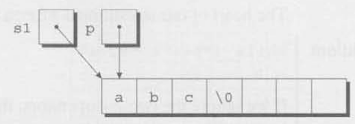

`p` is then incremented as long as it doesn't point to a null character. When the loop terminates, `p` must be pointing to the null character:

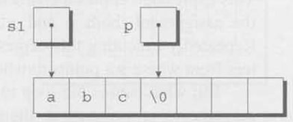

The second `while` statement implements step (2). The loop body copies one character from where `s2` points to where `p` points, then increments both `p` and `s2`. If `s2` originally points to the string `"def"`, here's what the strings will look like after the first loop iteration:

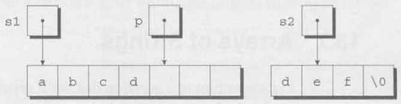

The loop terminates when `s2` points to the null character:

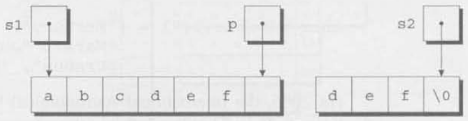

After putting a null character where `p` is pointing, `strcat` returns.

By a process similar to the one we used for `strlen`. we can condense the definition of `strcat`, arriving at the following version:

```C
char *strcat (char *sl, const char *s2)
{
  char *p = s1;

  while(*p)
    p++;
  while(*p++ = *s2++)
    ;
  return s1;
}
```

The heart of our streamlined `strcat` function is the "string copy" idiom:

**idiom**

```C
while(*p++ = *s2++)
  ;
```

If we ignore the two `++` operators, the expression inside the parentheses simplifies to an ordinary assignment:

```C
*p = *s2
```

This expression copies a character from where `s2` points to where `p` points. After the assignment, both `p` and `s2` are incremented, thanks to the `++` operators. Repeatedly executing this expression has the effect of copying a series of characters from where `s2` points to where `p` points.

But what causes the loop to terminate? Since the primary operator inside the parentheses is assignment, the `while` statement tests the value of the assignment --- the character that was copied. All characters except the null character test true, so the loop won't terminate until the null character has been copied. And since the loop terminates *affer* the assignment, we don't need a separate statement to put a null character at the end of the new string.

## 13.7 Arrays of Strings

Let's now turn to a question that we'll often encounter: what's the best way to store an array of strings? The obvious solution is to create a two-dimensional array of characters, then store the strings in the array, one per row. Consider the following example:

```C
char planets[][8] = {"Mercury", "Venus", "Earth", "Mars", "Jupiter", "Saturn", "Uranus", "Neptune", "Pluto"};
```

(In 2006, the International Astronomical Union demoted Pluto from "planet" to "dwarf planet", but I've left it in the planets array for old times' sake.) Note that we're allowed to omit the number of rows in the planets array --- since that's obvious from the number of elements in the initializer --- but C requires that we specify the number of columns.

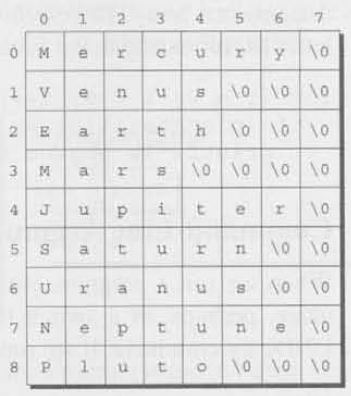

The figure above shows what the planets array will look like. Not all our strings were long enough to fill an entire row of the array, so C padded them with null characters. There's a bit of wasted space in this array, since only three planets have names long enough to require eight characters (including the terminating null character). The `remind.c` program (Section 13.5) is a glaring example of this kind of waste. It stores reminders in rows of a two- dimensional character array, with 60 characters set aside for each reminder. In our example, the reminders ranged from 18 to 37 characters in length, so the amount of wasted space was considerable.

The inefficiency that's apparent in these examples is common when working with strings, since most collections of strings will have a mixture of long strings and short strings. What we need is a ***ragged array***: a two-dimensional array whose rows can have different lengths, C doesn't provide a "ragged array type," but it does give us the tools to simulate one. The secret is to create an array whose elements are *pointers* to strings.

Here's the `planets` array again, this time as an array of pointers to strings:

```C
char *planets[] = {"Mercury", "Venus", "Earth", "Mars", "Jupiter", "Saturn", "Uranus", "Neptune", "Pluto"};
```

Not much of a change, eh? We simply removed one pair of brackets and put an asterisk in front of `planets`. The effect on how planets is stored is dramatic, though:

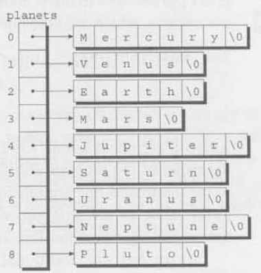

Each element of planets is a pointer to a null-terminated string. There are no longer any wasted characters in the strings, although we've had to allocate space for the pointers in the `planets` array.

To access one of the planet names, all we need do is subscript the `planets` array. Because of the relationship between pointers and arrays, accessing a character in a planet name is done in the same way as accessing an element of a two-dimensional array. To search the `planets` array for strings beginning with the letter `M`, for example, we could use the following loop:

```C
for (i = 0; i < 9; i++)
  if(planets[i][0] == 'M')
    printf("%s begins with M\n", planets[i]);
```

### 13.7.1 Command-Line Arguments

When we run a program, we'll often need to supply it with information --- a file name, perhaps, or a switch that modifies the program's behavior. Consider the UNIX `ls` command. If we run `ls` by typing

```shell
ls
```

at the command line, it will display the names of the files in the current directory. But if we instead type

```shell
ls -l
```

then `ls` will display a "long" (detailed) listing of files, showing the size of each file, the file's owner, the date and time the file was last modified, and so forth. To modify the behavior of `ls` further, we can specify that it show details for just one file:

```shell
ls -l remind.c
```

`ls` will display detailed information about the file named `remind.c`.

<span class="QandA"></span>

Command-line information is available to all programs, not just operating system commands. To obtain access to these command-line arguments (called program parameters in the C standard), we must define `main` as a function with two parameters, which are customarily named `argc` and `argv`:

```C
int main(int argc, char *argv[])
{
  ...
}
```

`argc` ("argument count") is the number of command-line arguments (including the name of the program itself). `argv` ("argument vector") is an array of pointers to the command-line arguments, which are stored in string form. `argv[0]` points to the name of the program, while `argv[1]` through `argv[argc-1]` point to the remaining command-line arguments.

`argv` has one additional element, `argv[argc]`, which is always a null pointer --- a special pointer that points to nothing. We'll discuss null pointers in a later chapter; for now, all we need to know is that the macro `NULL` represents a null pointer.

If the user enters the command line

```shell
ls -l remind.c
```

then `argc` will be 3, `argv[0]` will point to a string containing the program name, `argv[1]` will point to the string `"-1"`, `argv[2]` will point to the string `"remind.c"`, and `argv[3]` will be a null pointer:

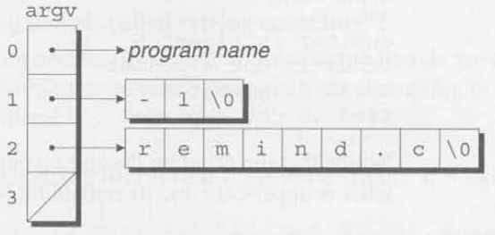

This figure doesn't show the program name in detail, since it may include a path or other information that depends on the operating system. If the program name isn't available, `argv[0]` points to an empty string.

Since `argv` is an array of pointers, accessing command-line arguments is easy. Typically, a program that expects command-line arguments will set up a loop that examines each argument in turn. One way to write such a loop is to use an integer variable as an index into the `argv` array. For example, the following loop prints the command-line arguments, one per line:

```C
int i;

for(i = 1; i < argc; i++)
{
  printf("%s\n", argv[i]);
}	// for statement: 
```

Another technique is to set up a pointer to `argv[1]`, then increment the pointer repeatedly to step through the rest of the array. Since the last element of `argv` is always a null pointer, the loop can terminate when it finds a null pointer in the array:

```C
char **p;

for (p = &argv[1]; *p != NULL; p++)
  printf("%s\n", *p);
```

Since `p` is a pointer to a pointer to a character, we've got to use it carefully. Setting `p` equal to `&argv[1]` makes sense; `argv[1]` is a pointer to a character, so `&argv[1]` will be a pointer to a pointer. The test `*p ! = NULL` is OK, since `*p` and `NULL` are both pointers. Incrementing `p` looks good; `p` points to an array element, so incrementing it will advance it to the next element. Printing `*p` is fine, since `*p` points to the first character in a string.

### 13.7.2 (PROGRAM) Checking Planet Names

Our next program, `planet.c`, illustrates how to access command-line arguments. The program is designed to check a series of strings to see which ones are names of planets. When the program is run, the user will put the strings to be tested on the command line:

```
planet Jupiter venus Earth fred
```

The program will indicate whether or not each string is a planet name; if it is, the program will also display the planet's number (with planet 1 being the one closest to the Sun):

```
Jupiter is planet 5
venus is not a planet
Earth is planet 3
fred is not a plamet
```

Notice that the program doesn't recognize a string as a planet name unless its first letter is upper-case and its remaining letters are lower-case.

```C
/********************************************************************************
 * File: planet.c
 * Author: K. N. King
 * Purpose: Checks planet names. Command line arguments
 ********************************************************************************/
/* START: Header inclusions*/
#include <stdio.h>
#include <string.h>
/* END: Header inclusions*/

/* START: MACRO definitions*/
#define NUM_PLANETS 9 
/* END: MACRO definitions*/

/* START: type definitions*/

/* END: type definitions*/

/* START: Variable declarations*/

/* END: Variable declarations*/

/* START: Function prototypes*/

/* END: Function prototypes*/

/**
 * Function name: main
 * Return type: int
 * Return value description: 
 * Parameters: int argc, char *argv[]
 * Param1 descr.: 
 * Param2 descr.: 
 * Param3 descr.: 
 * Function description: 
 */
int main(int argc, char *argv[])
{
    char *planets[] = {
        "Mercury", "Venus", "Earth",
        "Mars", "Jupiter", "Saturn",
        "Uranus", "Neptune", "Pluto"
    };

    int i, j;

    for(i = 1; i < argc; i++)
    {
        for(j = 0; j < NUM_PLANETS; j++)
        {
            if(strcmp(argv[i], planets[j]) == 0)
            {
                printf("%s is planet %d\n", argv[i], j + 1);
                break;
            }	// if condition: command line argument is a planet
        }	// for statement: go through each elements in planets array
        if(j == NUM_PLANETS)
        {
            printf("%s is not a planet\n", argv[i]);
        }	// if condition: command line argument is not among planets' elements
    }	// for statement: go through each command line argument.
    
    printf("\n");
    return 0;
}	//FUNCTION END: main
```

The program visits each command-line argument in turn, comparing it with the strings in the planets array until it finds a match or reaches the end of the array. The most interesting part of the program is the call of `strcmp`, in which the arguments are `argv[1]` (a pointer to a command-line argument) and `planets[j]` (a pointer to a planet name).

## Q&A

<!-- START: div: QandA_question -->
<div class="QandA_question">
<span class="ques"></span>

How long can a string literal be?

</div>
<!-- END: div: QandA_question -->
<!-- START: div: QandA_answer -->
<div class="QandA_answer">
<span class="ans"></span>

<span class="C99Symbol"></span>

According to the C89 standard, compilers must allow string literals to be at least 509 characters long. (Yes, you read that right --- 509. Don't ask.) C99 increases the minimum to 4095 characters.

</div>
<!-- END: div: QandA_answer -->

---

<!-- START: div: QandA_question -->
<div class="QandA_question">
<span class="ques"></span>

Why aren't string literals called "string constants"?

</div>
<!-- END: div: QandA_question -->
<!-- START: div: QandA_answer -->
<div class="QandA_answer">
<span class="ans"></span>

Because they're not necessarily constant. Since string literals are accessed through pointers, there's nothing to prevent a program from attempting to modify the characters in a string literal.

</div>
<!-- END: div: QandA_answer -->

---

<!-- START: div: QandA_question -->
<div class="QandA_question">
<span class="ques"></span>

How do we write a string literal that represents "über" if `"\xfcber"` doesn't work?

</div>
<!-- END: div: QandA_question -->
<!-- START: div: QandA_answer -->
<div class="QandA_answer">
<span class="ans"></span>

The secret is to write two adjacent string literals and let the compiler join them into one. In this example, writing `"\xfc""ber"` will give us a string literal that represents the word "über."

</div>
<!-- END: div: QandA_answer -->

---

<!-- START: div: QandA_question -->
<div class="QandA_question">
<span class="ques"></span>

Modifying a string literal seems harmless enough. Why does it cause undefined behavior?

</div>
<!-- END: div: QandA_question -->
<!-- START: div: QandA_answer -->
<div class="QandA_answer">
<span class="ans"></span>

Some compilers try to reduce memory requirements by storing single copies of identical string literals. Consider the following example:

```C
char *p = "abc", *q = "abc";
```

A compiler might choose to store `"abc"` just once, making both `p` and `q` point to it. If we were to change `"abc"` through the pointer `p`, the string that `q` points to would also be affected. Needless to say, this could lead to some annoying bugs. Another potential problem is that string literals might be stored in a "read-only" area of memory: a program that attempts to modify such a literal will simply crash.

</div>
<!-- END: div: QandA_answer -->

---

<!-- START: div: QandA_question -->
<div class="QandA_question">
<span class="ques"></span>

Should every array of characters include room for a null character?

</div>
<!-- END: div: QandA_question -->
<!-- START: div: QandA_answer -->
<div class="QandA_answer">
<span class="ans"></span>

Not necessarily, since not every array of characters is used as a string. Including room for the null character (and actually putting one into the array) is necessary only if you're planning to pass it to a function that requires a null-terminated string.

You do not need a null character if you'll only be performing operations on individual characters. For example, a program might have an array of characters that it will use to translate from one character set to another:

```C
char translation_table[128];
```

The only operation that the program will perform on this array is subscripting. (The value of `translation_table[ch]` will be the translated version of the character `ch`.) We would not consider `translation_table` to be a string: it need not contain a null character, and no string operations will be performed on it.

</div>
<!-- END: div: QandA_answer -->

---

<!-- START: div: QandA_question -->
<div class="QandA_question">
<span class="ques"></span>

If `printf` and `scanf` expect their first argument to have type `char *`, does that mean that the argument can be a string *variable* instead of a string *literal*?

</div>
<!-- END: div: QandA_question -->
<!-- START: div: QandA_answer -->
<div class="QandA_answer">
<span class="ans"></span>

Yes, as the following example shows:

```C
char fmt[] = "%d\n";
int i;
...
printf(fmt, i);
```

This ability opens the door to some intriguing possibilities --- reading a format string as input, for example.

</div>
<!-- END: div: QandA_answer -->

---

<!-- START: div: QandA_question -->
<div class="QandA_question">
<span class="ques"></span>

If I want `printf` to write a string `str`, can't I just supply `str` as the format string, as in the following example?

```C
printf(str);
```

</div>
<!-- END: div: QandA_question -->
<!-- START: div: QandA_answer -->
<div class="QandA_answer">
<span class="ans"></span>

Yes, but it's risky. If `str` contains the `%` character, you won't get the desired result, since `printf` will assume it's the beginning of a conversion specification.

</div>
<!-- END: div: QandA_answer -->

---

<!-- START: div: QandA_question -->
<div class="QandA_question">
<span class="ques"></span>

How can `read_line` detect whether `getchar` has failed to read a character?

</div>
<!-- END: div: QandA_question -->
<!-- START: div: QandA_answer -->
<div class="QandA_answer">
<span class="ans"></span>

If it can't read a character, either because of an error or because of end-of-file, `getchar` returns the value `EOF`, which has type `int`. Here's a revised version of `read_line` that tests whether the return value of `getchar` is `EOF`.

```C
int read_line(char str[], int n)
{
  int ch, i = 0;
  while ((ch = getchar()) != '\n' && ch != EOF)
    if(i < n)
      str[i++] = ch;
  str[i] = '\0'
  return i;
}
```

</div>
<!-- END: div: QandA_answer -->

---

<!-- START: div: QandA_question -->
<div class="QandA_question">
<span class="ques"></span>

Why does `strcmp` return a number that's less than, equal to, or greater than zero? Also, does the exact return value have any significance?

</div>
<!-- END: div: QandA_question -->
<!-- START: div: QandA_answer -->
<div class="QandA_answer">
<span class="ans"></span>

`strcmp`'s return value probably stems from the way the function is traditionally written. Consider the version in Kernighan and Ritchie's *The C Programming Language*:

```C
int strcmp(char *s, char *t)
{
  int i;

  for (i = 0; s[i] == t[i]; i++)
    if (s[i] == '\0')
      return 0;
  return s[i] - t[i];
}
```

The return value is the difference between the first "mismatched" characters in the `s` and `t` strings, which will be negative if `s` points to a "smaller" string than `t` and positive if `s` points to a "larger" string, There's no guarantee that `strcmp` is actually written this way, though, so it's best not to assume that the magnitude of its return value has any particular meaning.

</div>
<!-- END: div: QandA_answer -->

---

<!-- START: div: QandA_question -->
<div class="QandA_question">
<span class="ques"></span>

My compiler issues a warning when I try to compile the `while` statement in the `strcat` function:

```C
while(*p++ = *s2++)
```

What am I doing wrong?

</div>
<!-- END: div: QandA_question -->
<!-- START: div: QandA_answer -->
<div class="QandA_answer">
<span class="ans"></span>

Nothing. Many compilers --- but not all. by any means --- issue a warning if you use `=` where `==` is normally expected. This warning is valid at least 95% of the time, and it will save you a lot of debugging if you heed it. Unfortunately, the warning isn't relevant in this particular example: we actually do mean to use `=`, not `==`. To get rid of the warning, rewrite the `while` loop as follows:

```C
while((*p++ = *s2++) != 0)
  ;
```

Since the `while` statement normally tests whether `*p++ = *s2++` is not 0, we haven't changed the meaning of the statement. The warning goes away, however, because the statement now tests a condition, not an assignment. With the GCC compiler, putting a pair of parentheses around the assignment is another way to avoid a warning:

```C
while((*p++ = *s2++))
  ;
```

</div>
<!-- END: div: QandA_answer -->

---

<!-- START: div: QandA_question -->
<div class="QandA_question">
<span class="ques"></span>

Are the `strlen` and `strcat` functions actually written as shown in Section 13.6?

</div>
<!-- END: div: QandA_question -->
<!-- START: div: QandA_answer -->
<div class="QandA_answer">
<span class="ans"></span>

Possibly, although it's common practice for compiler vendors to write these functions --- and many other string functions --- in assembly language instead of C. The string functions need to be as fast as possible, since they're used often and have to deal with strings of arbitrary length. Writing these functions in assembly language makes it possible to achieve great efficiency by taking advantage of any special string-handling instructions that the CPU may provide.

</div>
<!-- END: div: QandA_answer -->

---

<!-- START: div: QandA_question -->
<div class="QandA_question">
<span class="ques"></span>

Why does the C standard use the term "program parameters" instead of "command-line arguments"?

</div>
<!-- END: div: QandA_question -->
<!-- START: div: QandA_answer -->
<div class="QandA_answer">
<span class="ans"></span>

Programs aren't always run from a command line. In a typical graphical user interface, for example, programs are launched with a mouse click. In such an environment, there's no traditional command line, although there may be other ways of passing information to a program; the term "program parameters" leaves the door open for these alternatives.

</div>
<!-- END: div: QandA_answer -->

---

<!-- START: div: QandA_question -->
<div class="QandA_question">
<span class="ques"></span>

Do I have to use the names `argc` and `argv` for main's parameters?

</div>
<!-- END: div: QandA_question -->
<!-- START: div: QandA_answer -->
<div class="QandA_answer">
<span class="ans"></span>

No. Using the names `argc` and `argv` is merely a convention. not a language requirement.

</div>
<!-- END: div: QandA_answer -->

---

<!-- START: div: QandA_question -->
<div class="QandA_question">
<span class="ques"></span>

I've seen `argv` declared as `**argv` instead of `*argv[]`. Is this legal?

</div>
<!-- END: div: QandA_question -->
<!-- START: div: QandA_answer -->
<div class="QandA_answer">
<span class="ans"></span>

Certainly. When declaring a parameter, writing `*a` is always the same as writing `a[]`, regardless of the type of `a`'s elements.

</div>
<!-- END: div: QandA_answer -->

---

<!-- START: div: QandA_question -->
<div class="QandA_question">
<span class="ques"></span>

We've seen how to set up an array whose elements are pointers to string literals. Are there any other applications for arrays of pointers?

</div>
<!-- END: div: QandA_question -->
<!-- START: div: QandA_answer -->
<div class="QandA_answer">
<span class="ans"></span>

Yes. Although we've focused on arrays of pointers to character strings, that's not the only application of arrays of pointers. We could just as easily have an array whose elements point to any type of data, whether in array form or not. Arrays of pointers are particularly useful in conjunction with dynamic storage allocation.

</div>
<!-- END: div: QandA_answer -->

---

## Examples

- Programs: <span class="unicode_LINK_SYMBOL"></span>[./cknkCh13/cknkCh13Exmp/](./cknkCh13/cknkCh13Exmp/)

## Exercises

- Readme: <span class="unicode_LINK_SYMBOL"></span>[./cknkCh13/cknkCh13Exrc/README.md](./cknkCh13/cknkCh13Exrc/README.md)  
- Readme (html): <span class="unicode_LINK_SYMBOL"></span>[./cknkCh13/cknkCh13Exrc/cknkCh13ExrcReadme.html](./cknkCh13/cknkCh13Exrc/cknkCh13ExrcReadme.html)  
- Programs: <span class="unicode_LINK_SYMBOL"></span>[./cknkCh13/cknkCh13Exrc/](./cknkCh13/cknkCh13Exrc/)  

## Programming Projects

- Readme: <span class="unicode_LINK_SYMBOL"></span>[./cknkCh13/cknkCh13Prj/README.md](./cknkCh13/cknkCh13Prj/README.md)  
- Readme: <span class="unicode_LINK_SYMBOL"></span>[./cknkCh13/cknkCh13Prj/cknkCh13PrjReadme.html](./cknkCh13/cknkCh13Prj/cknkCh13PrjReadme.html)  
- Programs: <span class="unicode_LINK_SYMBOL"></span>[./cknkCh13/cknkCh13Prj/](./cknkCh13/cknkCh13Prj/)  

<hr class="chapterDivider"/>

</body>
</html>